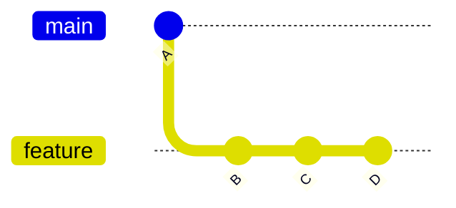
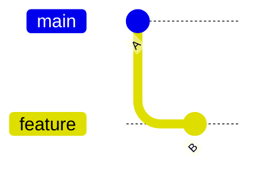
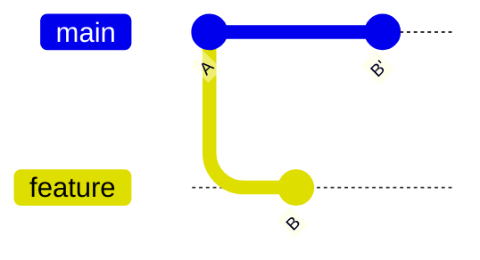
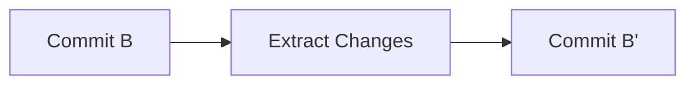
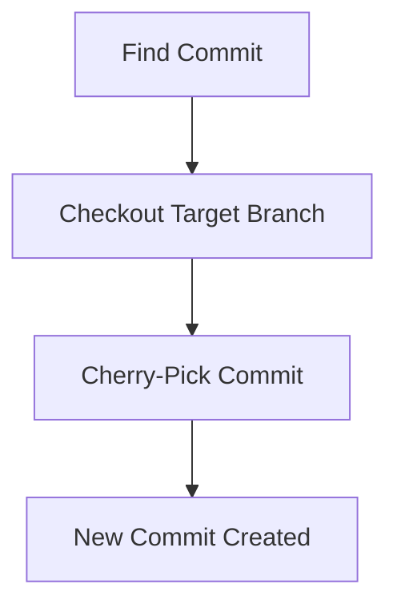
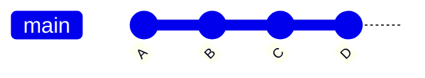
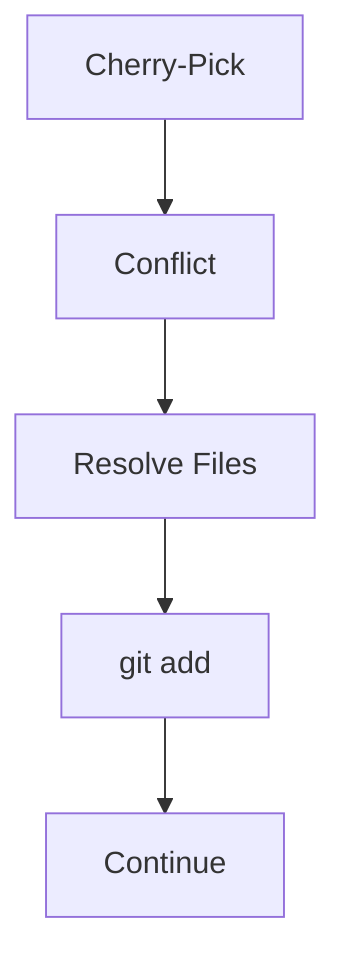
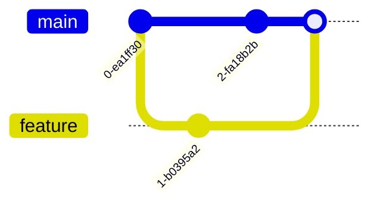
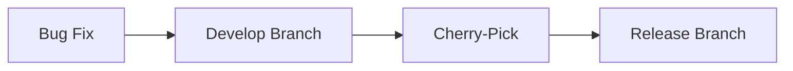

# Git Cherry-Pick

---

# Learning Objectives

By the end of this chapter, you will understand:

* What Git Cherry-Pick is
* Why Cherry-Pick exists
* How Cherry-Pick works internally
* Selecting individual commits
* Applying commits across branches
* Cherry-picking multiple commits
* Cherry-picking merge commits
* Conflict resolution during Cherry-Pick
* Practical real-world use cases
* Best practices and common pitfalls
* Troubleshooting Cherry-Pick issues
* Common interview questions

---

# Introduction

Most Git operations work with:

* Entire branches
* Entire histories
* Entire feature sets

However, there are situations where you need:

> One specific commit and nothing else.

For example:

```text
Feature Branch
├── Commit A
├── Commit B
├── Commit C
└── Commit D
```

Suppose only:

```text
Commit B
```

contains a critical bug fix.

Instead of merging the entire branch, Git allows you to copy only that commit.

This operation is called:

> **Cherry-Pick**

---

# What Is Cherry-Pick?

Cherry-Pick applies the changes introduced by an existing commit onto the current branch.

Think of it as:

```text
Copy Commit
      ↓
Apply Changes
      ↓
Create New Commit
```

---

## Simple Definition

> Cherry-Pick copies the changes from a specific commit and applies them to another branch.

---

# Why Cherry-Pick Exists

Cherry-Pick solves situations where:

* Only one commit is needed
* Merging an entire branch is undesirable
* A hotfix must be applied quickly
* A release branch needs a specific fix
* A bug fix must be backported

---

# Real-World Example

---

## Branch Structure



---

Suppose:

```text
B = Important Security Fix
C = Experimental Feature
D = Incomplete Feature
```

You only want:

```text
B
```

on:

```text
main
```

Cherry-Pick is ideal.

---

# How Cherry-Pick Works

---

## Initial State



---

Current state:

```text
main    → A
feature → B
```

---

## Cherry-Pick

```bash
git checkout main
git cherry-pick <commit-sha>
```

---

## Result



---

Notice:

```text
B'
```

is a new commit.

---

# Important Concept

Cherry-Pick does NOT move commits.

Instead:

```text
Original Commit
       ↓
Reapply Changes
       ↓
New Commit
```

---

## Visualization



---

# Finding Commit SHAs

Cherry-Pick requires commit identifiers.

---

## View History

```bash
git log --oneline
```

Example:

```text
a1b2c3 Fix login validation
d4e5f6 Add login page
g7h8i9 Initial commit
```

---

Use:

```text
a1b2c3
```

for Cherry-Pick.

---

# Basic Cherry-Pick

---

## Syntax

```bash
git cherry-pick <commit>
```

---

## Example

```bash
git cherry-pick a1b2c3
```

Git:

1. Reads commit
2. Extracts changes
3. Applies changes
4. Creates new commit

---

# Cherry-Pick Workflow



---

# Practical Example

---

## Feature Branch

```text
feature-auth

Commit 1:
Add login page

Commit 2:
Fix login validation

Commit 3:
Refactor authentication
```

---

## Need Only Validation Fix

Switch:

```bash
git checkout main
```

Apply:

```bash
git cherry-pick <fix-commit-sha>
```

Result:

```text
Only validation fix appears on main
```

---

# Cherry-Picking Multiple Commits

---

# Method 1: Individual Commits

```bash
git cherry-pick commit1
git cherry-pick commit2
git cherry-pick commit3
```

---

# Method 2: Multiple SHAs

```bash
git cherry-pick commit1 commit2 commit3
```

---

## Example

```bash
git cherry-pick a1b2c3 d4e5f6 g7h8i9
```

---

# Method 3: Commit Range

---

## Syntax

```bash
git cherry-pick start^..end
```

---

## Example

```bash
git cherry-pick A^..D
```

Includes:

```text
A
B
C
D
```

---

## Visualization



All commits are copied.

---

# Cherry-Pick Without Committing

Sometimes you want to inspect changes first.

---

## Command

```bash
git cherry-pick --no-commit <sha>
```

---

## Example

```bash
git cherry-pick --no-commit a1b2c3
```

Git:

```text
Applies changes
Does not create commit
```

---

## Then Commit Manually

```bash
git commit -m "Apply login validation fix"
```

---

# Conflict Resolution

---

# Why Conflicts Occur

Cherry-Pick replays changes.

If files differ significantly:

```text
Conflict
```

may occur.

---

# Example

Current branch:

```python
username = "admin"
```

Cherry-picked commit:

```python
username = "root"
```

Git cannot determine correct result.

---

# Conflict Workflow



---

# Conflict Example

Git inserts:

```python
<<<<<<< HEAD
username = "admin"
=======
username = "root"
>>>>>>> a1b2c3
```

---

# Resolution Process

---

## Step 1

Edit file.

Example:

```python
username = "root"
```

---

## Step 2

Stage file.

```bash
git add file.py
```

---

## Step 3

Continue Cherry-Pick.

```bash
git cherry-pick --continue
```

---

# Continue Cherry-Pick

```bash
git cherry-pick --continue
```

Tells Git:

```text
Conflict resolved
Continue operation
```

---

# Abort Cherry-Pick

Cancel operation:

```bash
git cherry-pick --abort
```

---

## Result

Repository returns to:

```text
Pre-Cherry-Pick State
```

---

# Skip Problematic Commit

When cherry-picking multiple commits:

```bash
git cherry-pick --skip
```

Skips current commit.

---

# Cherry-Picking Merge Commits

---

# Why Special Handling Exists

Merge commits have:

```text
Multiple Parents
```

Example:



---

Git needs to know:

```text
Which parent is mainline?
```

---

## Syntax

```bash
git cherry-pick -m 1 <merge-commit>
```

---

## Example

```bash
git cherry-pick -m 1 abc123
```

---

# Understanding Duplicate Commits

Cherry-Pick creates:

```text
New Commit SHA
```

even though changes are identical.

---

## Example

Original:

```text
a1b2c3
```

Cherry-Picked:

```text
x9y8z7
```

Different commits.

---

# Practical Use Cases

---

# Hotfixes

---

## Scenario

Production bug:

```text
Critical login issue
```

Fixed in:

```text
develop branch
```

Need fix in:

```text
release branch
```

---

Solution:

```bash
git checkout release
git cherry-pick <fix-sha>
```

---

# Backporting Fixes

---

## Scenario

Bug fixed in:

```text
Version 3.0
```

Need same fix in:

```text
Version 2.0
```

Cherry-Pick:

```bash
git checkout release-2.0
git cherry-pick <sha>
```

---

# Emergency Production Patch

---

## Workflow



---

# Selective Feature Transfer

---

## Scenario

Feature branch contains:

```text
Commit A
Commit B
Commit C
Commit D
```

Only:

```text
Commit B
```

is ready.

Use Cherry-Pick.

---

# Team Collaboration Example

Suppose:

Developer A:

```text
feature/auth
```

contains:

```text
Add login
Fix validation
Refactor auth
```

Developer B needs:

```text
Fix validation
```

before full feature release.

Cherry-Pick:

```bash
git cherry-pick <validation-fix-sha>
```

---

# Cherry-Pick vs Merge

| Feature                  | Cherry-Pick | Merge     |
| ------------------------ | ----------- | --------- |
| Copies selected commit   | Yes         | No        |
| Copies entire branch     | No          | Yes       |
| Creates new commit       | Yes         | Usually   |
| Preserves branch history | No          | Yes       |
| Selective changes        | Excellent   | Poor      |
| Best for hotfixes        | Yes         | Sometimes |

---

# Cherry-Pick vs Rebase

| Feature                | Cherry-Pick | Rebase    |
| ---------------------- | ----------- | --------- |
| Single commit transfer | Excellent   | No        |
| Branch integration     | Limited     | Excellent |
| History rewriting      | Minimal     | Extensive |
| Selective adoption     | Excellent   | Poor      |

---

# Common Mistakes

| Mistake                                  | Consequence          |
| ---------------------------------------- | -------------------- |
| Cherry-picking large feature chains      | Complex history      |
| Cherry-picking merge commits incorrectly | Unexpected results   |
| Forgetting original branch context       | Missing dependencies |
| Repeated cherry-picking                  | Duplicate changes    |
| Ignoring conflicts                       | Broken code          |

---

# Best Practices

---

## Cherry-Pick Small Logical Commits

Good:

```text
Fix login validation
```

Bad:

```text
Entire authentication rewrite
```

---

## Verify Dependencies

Before Cherry-Picking:

```text
Does this commit depend on others?
```

---

## Use Meaningful Commit Messages

Git preserves original message by default.

Verify message remains meaningful.

---

## Prefer Merge for Large Features

Cherry-Pick is best for:

```text
Specific Commits
```

not:

```text
Entire Branches
```

---

## Test After Cherry-Picking

Always verify:

```text
Build passes
Tests pass
Application works
```

---

# Troubleshooting

---

# Problem: Cherry-Pick Conflict

Error:

```text
CONFLICT (content)
```

---

## Fix

Resolve file.

Then:

```bash
git add .
git cherry-pick --continue
```

---

# Problem: Wrong Commit Cherry-Picked

Undo:

```bash
git reset --hard HEAD~1
```

if not pushed.

---

# Problem: Duplicate Changes

Cause:

```text
Commit already applied
```

Verify history before Cherry-Picking.

---

# Problem: Missing Dependency

Cherry-picked commit relied on:

```text
Earlier commit
```

Cherry-Pick dependency as well.

---

# Problem: Cherry-Pick Interrupted

Check status:

```bash
git status
```

Continue:

```bash
git cherry-pick --continue
```

or abort:

```bash
git cherry-pick --abort
```

---

# Common Cherry-Pick Commands

| Command                       | Purpose                  |
| ----------------------------- | ------------------------ |
| `git cherry-pick <sha>`       | Cherry-pick commit       |
| `git cherry-pick A B C`       | Multiple commits         |
| `git cherry-pick A^..D`       | Commit range             |
| `git cherry-pick --no-commit` | Apply without commit     |
| `git cherry-pick --continue`  | Continue after conflict  |
| `git cherry-pick --abort`     | Cancel operation         |
| `git cherry-pick --skip`      | Skip commit              |
| `git cherry-pick -m 1`        | Cherry-pick merge commit |

---

# Interview Questions and Answers

---

## Q1: What is Git Cherry-Pick?

### Answer

Cherry-Pick copies the changes introduced by a commit and applies them to the current branch as a new commit.

---

## Q2: Does Cherry-Pick move commits?

### Answer

No. It creates new commits containing the same changes.

---

## Q3: When should Cherry-Pick be used?

### Answer

For selective changes, hotfixes, backports, and applying specific commits across branches.

---

## Q4: What happens to commit SHA values during Cherry-Pick?

### Answer

New commits are created, so new SHA identifiers are generated.

---

## Q5: How do you Cherry-Pick multiple commits?

### Answer

```bash
git cherry-pick commit1 commit2 commit3
```

or by using a commit range.

---

## Q6: How do you continue after resolving a Cherry-Pick conflict?

### Answer

```bash
git add .
git cherry-pick --continue
```

---

## Q7: How do you abort a Cherry-Pick?

### Answer

```bash
git cherry-pick --abort
```

---

## Q8: What is the difference between Cherry-Pick and Merge?

### Answer

Cherry-Pick copies selected commits, while Merge integrates entire branch histories.

---

## Q9: What is a common risk of Cherry-Picking?

### Answer

Duplicating changes or missing dependent commits.

---

## Q10: Why is Cherry-Pick commonly used for hotfixes?

### Answer

Because it allows a specific fix to be applied without merging unrelated work.

---

# Chapter Summary

In this chapter, you learned:

* Cherry-Pick applies the changes from an existing commit onto the current branch.
* It is useful for selectively transferring commits between branches.
* Cherry-Picking creates new commits with new SHA identifiers.
* Multiple commits and commit ranges can be Cherry-Picked.
* Conflicts may occur and are resolved similarly to merge conflicts.
* Cherry-Pick supports continuation, skipping, and aborting operations.
* Common use cases include hotfixes, backports, emergency patches, and selective feature adoption.
* Cherry-Pick differs from Merge because it copies commits rather than integrating entire branch histories.
* Small, independent commits are ideal candidates for Cherry-Picking.
* Careful testing and dependency verification are essential after applying Cherry-Picked changes.

Mastering Cherry-Pick gives developers precise control over code movement between branches, making it an invaluable tool for maintenance releases, hotfixes, selective deployments, and advanced Git workflows.
