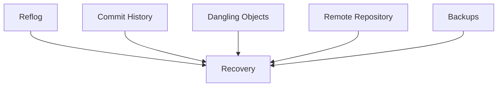

# Git Disaster Recovery

---

# Learning Objectives

By the end of this chapter, you will understand:

* Common Git disasters and how they occur
* Recovery principles and safety practices
* Recovering from accidental resets
* Recovering deleted branches
* Recovering deleted commits
* Recovering from bad merges
* Recovering from bad rebases
* Recovering from accidental force pushes
* Recovering lost work after a detached HEAD
* Using Reflog effectively
* Using Git FSCK for repository recovery
* Building recovery playbooks
* Troubleshooting difficult recovery scenarios

---

# Introduction

Every Git developer eventually experiences a moment like this:

```text
I accidentally ran git reset --hard.

I deleted the wrong branch.

I force-pushed over important commits.

I merged the wrong branch.

I rebased and lost work.
```

Fortunately:

> Most Git disasters are recoverable.

Git rarely destroys data immediately.

In many cases:

* Commits still exist
* Reflog remembers history
* Objects remain in the database
* Recovery is possible

The key is understanding:

1. What happened
2. What Git still remembers
3. Which recovery tools to use

---

# The Golden Rules of Git Recovery

Before attempting any recovery:

---

## Rule 1: Stop Making Changes

Avoid:

```bash
git commit
git push
git gc
```

until you understand the situation.

---

## Rule 2: Create a Backup

Before experimenting:

```bash
cp -r project project-backup
```

or:

```bash
git branch recovery-backup
```

---

## Rule 3: Use Reflog First

Most recoveries begin with:

```bash
git reflog
```

---

## Rule 4: Never Panic

In Git:

```text
Lost
```

often means:

```text
Not Currently Referenced
```

rather than:

```text
Permanently Deleted
```

---

# Recovery Toolkit

---

## Essential Commands

| Command        | Purpose                |
| -------------- | ---------------------- |
| `git reflog`   | View reference history |
| `git reset`    | Restore previous state |
| `git checkout` | Access commits         |
| `git branch`   | Recreate branches      |
| `git fsck`     | Find dangling objects  |
| `git log`      | Inspect history        |
| `git show`     | Inspect commits        |
| `git stash`    | Recover temporary work |

---

# Understanding Recovery Sources

Git recovery typically relies on:



---

# Disaster 1: Accidental Reset

---

# Scenario

History:


Current branch:

```text
main → D
```

---

## Mistake

```bash
git reset --hard HEAD~3
```

Result:

```text
main → A
```

Commits:

```text
B
C
D
```

appear lost.

---

# Recovery Playbook

---

## Step 1

Inspect Reflog:

```bash
git reflog
```

Output:

```text
abc123 HEAD@{0}: reset: moving to HEAD~3

def456 HEAD@{1}: commit: D

ghi789 HEAD
```


## Interview Questions

- **Q: How does this chapter's concept integrate into a standard CI/CD workflow?**
  - **A:** It forms the foundational version control step, ensuring code is safely tracked before automated builds and tests are triggered.


## Summary

Mastering the commands and concepts in this chapter is a step forward in becoming a Git professional. Practice these workflows frequently to build confidence.
