# Git Internals

---

# Learning Objectives

By the end of this chapter, you will understand:

* How Git stores data internally
* Git's object database
* Blob objects
* Tree objects
* Commit objects
* Tag objects
* SHA hashing
* Object relationships
* References (Refs)
* HEAD
* Branch references
* Tag references
* Packfiles
* Garbage collection
* How Git reconstructs repository history
* Why Git is fast and efficient

---

# Introduction

Most developers use Git daily without understanding what happens behind the scenes.

Commands such as:

```bash
git add
git commit
git checkout
git merge
```

appear simple.

Internally, Git performs sophisticated operations involving:

* Object creation
* Hash generation
* Reference updates
* Database storage

Understanding Git internals helps developers:

* Debug advanced issues
* Understand branching deeply
* Recover lost work
* Perform repository maintenance
* Excel in technical interviews

---

# Git's Core Philosophy

Git is fundamentally:

> A content-addressable filesystem with a version control system built on top.

This means Git stores data based on content rather than filenames.

---

# High-Level Architecture

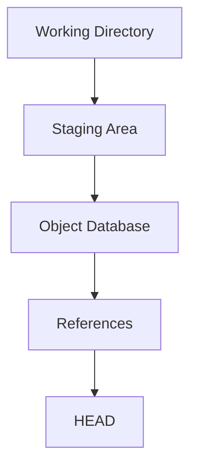

---

# The `.git` Directory

Everything Git needs is stored inside:

```text
.git/
```

---

## Example Structure

```text
.git/
│
├── HEAD
├── config
├── index
├── objects/
├── refs/
├── logs/
├── hooks/
└── packed-refs
```

---

## Important Components

| Component | Purpose                   |
| --------- | ------------------------- |
| HEAD      | Current branch pointer    |
| objects   | Object database           |
| refs      | Branch and tag references |
| index     | Staging area              |
| config    | Repository settings       |
| logs      | Reference history         |
| hooks     | Automation scripts        |

---

# Git Object Database

---

# What Is the Object Database?

Git stores nearly everything as objects.

Examples:

* Files
* Directories
* Commits
* Tags

All objects live inside:

```text
.git/objects/
```

---

# Object Types

Git has four primary object types:

| Type   | Purpose                |
| ------ | ---------------------- |
| Blob   | File contents          |
| Tree   | Directory structure    |
| Commit | Snapshot metadata      |
| Tag    | Named commit reference |

---

## Relationship Diagram

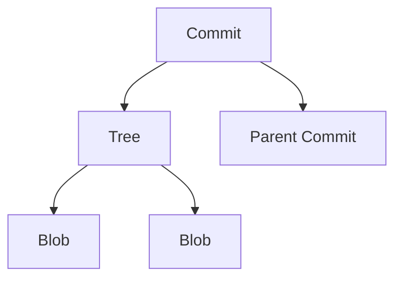

---

# SHA Hashing

---

# Why Hashing Exists

Git identifies objects using:

```text
SHA Hashes
```

Historically:

```text
SHA-1
```

Newer Git versions may support:

```text
SHA-256
```

---

## Example SHA

```text
9fceb02c1f7f5f4f4d0c8b6d5d6a2b3e4f5a6b7c
```

---

## Purpose

Hashes provide:

* Unique identification
* Data integrity
* Fast lookup

---

# Content-Based Storage

Git hashes content.

Example:

File:

```text
Hello World
```

Hash:

```text
abc123...
```

---

If content changes:

```text
Hello Git
```

Hash becomes:

```text
xyz789...
```

Completely different.

---

## Diagram

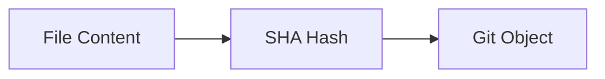

---

# Blob Objects

---

# What Is a Blob?

Blob stands for:

```text
Binary Large Object
```

A blob stores:

> File contents only

---

## Important

Blobs do NOT store:

* Filename
* Directory name
* Permissions

Only content.

---

## Example

File:

```text
README.md
```

Contents:

```markdown
# My Project
```

Git creates:

```text
Blob Object
```

containing:

```markdown
# My Project
```

---

# Blob Visualization

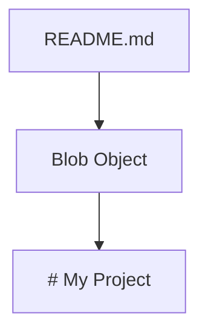

---

# Multiple Files

Example:

```text
README.md
main.py
```

Git creates:

```text
Blob A
Blob B
```

One blob per file content.

---

# Inspecting Blobs

Create a blob:

```bash
echo "Hello Git" | git hash-object -w --stdin
```

Output:

```text
e965047...
```

View:

```bash
git cat-file -p e965047
```

Output:

```text
Hello Git
```

---

# Tree Objects

---

# What Is a Tree?

A tree represents:

> A directory structure

---

## Tree Stores

* Filenames
* Blob references
* Subdirectory references
* Permissions

---

## Example Project

```text
project/
│
├── README.md
└── src/
    └── main.py
```

---

## Tree Structure

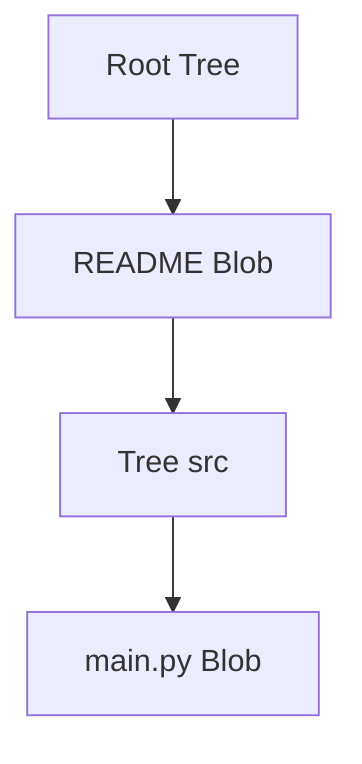

---

# Tree Example

Tree object:

```text
README.md → Blob A

src → Tree B
```

Tree B:

```text
main.py → Blob C
```

---

# Why Trees Exist

Blobs store content.

Trees organize blobs into directories.

---

# Commit Objects

---

# What Is a Commit?

A commit is a snapshot of the repository.

---

## Commit Stores

* Tree reference
* Parent commit(s)
* Author
* Committer
* Timestamp
* Commit message

---

## Commit Structure

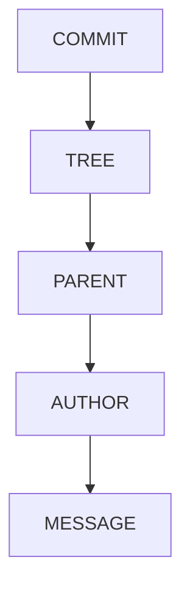

---

# Example Commit

```text
Commit:
4f5d6e7
```

Contains:

```text
Tree: a1b2c3

Parent: d4e5f6

Author: Alice

Message:
Add login feature
```

---

# Commit Relationships

Git history forms a chain.

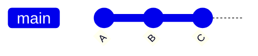

---

## Parent References

```text
C → Parent B

B → Parent A
```

This creates history.

---

# Merge Commits

Normal commit:

```text
One Parent
```

Merge commit:

```text
Two Parents
```

---

## Visualization

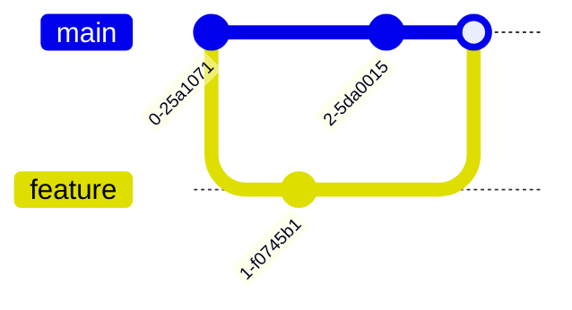

---

# DAG (Directed Acyclic Graph)

---

# What Is a DAG?

Git history forms a:

```text
Directed Acyclic Graph
```

---

## Meaning

### Directed

Commits point to parents.

---

### Acyclic

History cannot loop.

---

### Graph

Commits form a connected structure.

---

## Visualization

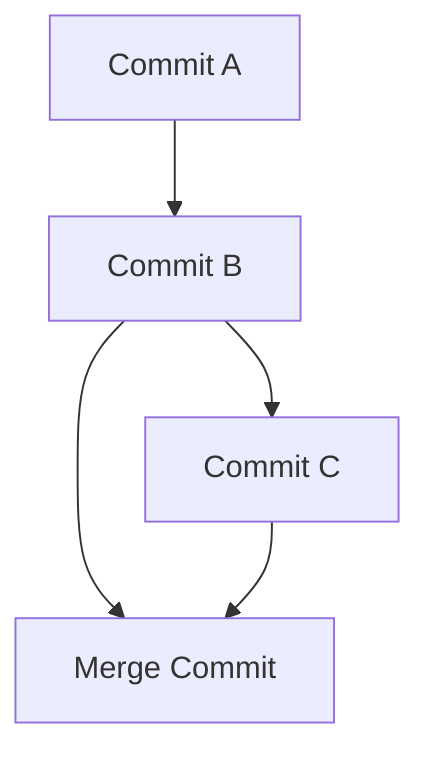

---

# Why DAG Matters

Git can:

* Track history
* Merge branches
* Find ancestors
* Detect changes

efficiently.

---

# Tag Objects

---

# What Is a Tag?

A tag provides a permanent name for a commit.

---

## Example

```text
v1.0
v2.0
v3.0
```

---

# Why Use Tags?

Tags identify:

* Releases
* Milestones
* Stable versions

---

# Lightweight Tags

Simple reference.

```bash
git tag v1.0
```

---

# Annotated Tags

Contain metadata.

```bash
git tag -a v1.0 -m "Version 1.0 Release"
```

---

## Tag Structure

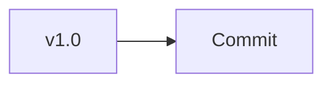

---

# Inspecting Tags

```bash
git show v1.0
```

Displays:

* Tag metadata
* Commit
* Changes

---

# References (Refs)

---

# What Are References?

A reference is a named pointer to an object.

---

## Examples

```text
main
develop
feature/login
v1.0
```

---

## Why Refs Exist

Instead of remembering:

```text
8c7f5d4e9a1...
```

developers use:

```text
main
```

---

# Reference Diagram

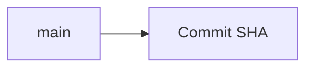

---

# Branch References

---

## Example

```text
main → Commit C
```

---

## Internal Storage

```text
.git/refs/heads/main
```

Contains:

```text
commit-sha
```

---

# Tag References

---

## Location

```text
.git/refs/tags/
```

---

## Example

```text
v1.0 → Commit SHA
```

---

# HEAD

---

# What Is HEAD?

HEAD is a special reference.

It points to:

> Your current location in Git history.

---

## Example

```text
HEAD → main
```

---

## Visualization

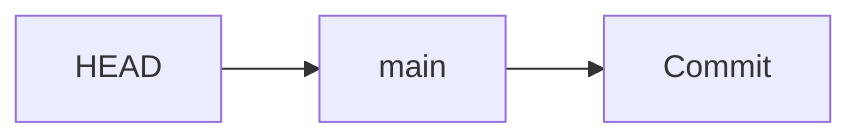

---

# Viewing HEAD

```bash
cat .git/HEAD
```

Output:

```text
ref: refs/heads/main
```

---

# Detached HEAD

Sometimes HEAD points directly to a commit.

Example:

```bash
git checkout a1b2c3
```

Result:

```text
HEAD → Commit
```

instead of:

```text
HEAD → Branch
```

---

## Visualization


---

# Why Detached HEAD Matters

Commits created here may become difficult to find later.

---

# Packfiles

---

# The Problem

Large repositories may contain:

```text
Millions of objects
```

Storing every object separately is inefficient.

---

# Solution

Git compresses objects into:

```text
Packfiles
```

---

## Location

```text
.git/objects/pack/
```

---

# Packfile Benefits

| Benefit              | Description        |
| -------------------- | ------------------ |
| Compression          | Smaller storage    |
| Faster cloning       | Less data transfer |
| Better performance   | Faster operations  |
| Efficient networking | Reduced bandwidth  |

---

# Packfile Concept

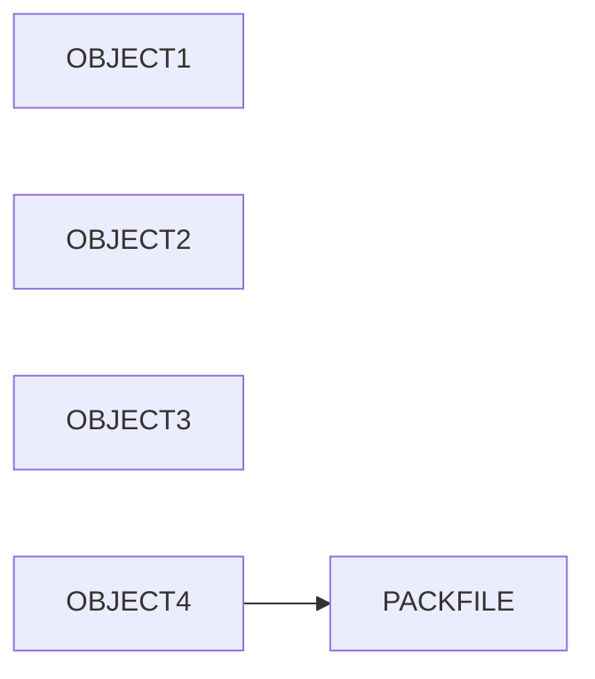

---

# Delta Compression

Git stores differences.

Example:

Version 1:

```text
Hello World
```

Version 2:

```text
Hello Git
```

Instead of storing both completely:

```text
Store Difference
```

---

# Garbage Collection

---

# Purpose

Remove unnecessary objects.

---

## Command

```bash
git gc
```

---

# What Happens?

Git:

* Compresses objects
* Creates packfiles
* Removes unreachable objects
* Optimizes repository

---

## Workflow

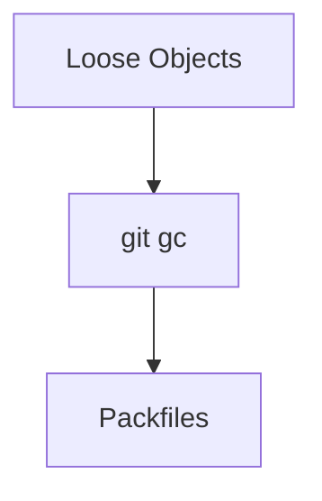

---

# Inspecting Objects

---

# View Object Type

```bash
git cat-file -t <sha>
```

Example:

```bash
git cat-file -t e965047
```

Output:

```text
blob
```

---

# View Object Contents

```bash
git cat-file -p <sha>
```

---

# View Commit

```bash
git cat-file -p HEAD
```

---

# Internal Commit Workflow

When running:

```bash
git commit -m "Add login feature"
```

Git performs:

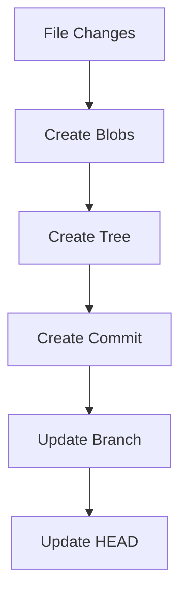

---

# Git Object Model Summary

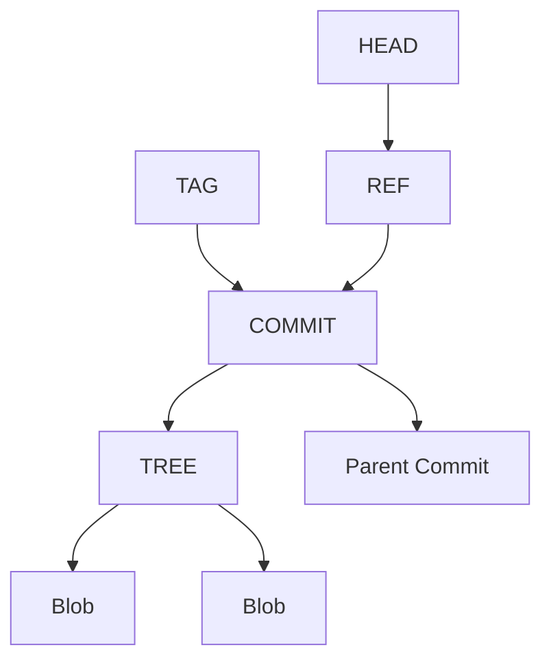

---

# Common Interview Questions and Answers

---

## Q1: What is Git's object database?

### Answer

Git's object database stores all repository data as objects, including blobs, trees, commits, and tags.

---

## Q2: What is a blob?

### Answer

A blob stores file contents only. It does not store filenames or directory information.

---

## Q3: What is a tree object?

### Answer

A tree represents a directory and contains references to blobs and other trees.

---

## Q4: What is stored in a commit object?

### Answer

A commit stores a tree reference, parent references, author information, timestamps, and a commit message.

---

## Q5: What is a tag?

### Answer

A tag is a named reference used to mark important commits, usually releases.

---

## Q6: What is HEAD?

### Answer

HEAD is a special reference pointing to the currently checked-out branch or commit.

---

## Q7: What is a detached HEAD?

### Answer

A state where HEAD points directly to a commit instead of a branch.

---

## Q8: What is a packfile?

### Answer

A compressed file that stores multiple Git objects efficiently.

---

## Q9: Why does Git use SHA hashes?

### Answer

To uniquely identify objects and verify data integrity.

---

## Q10: What is a DAG?

### Answer

A Directed Acyclic Graph representing commit relationships and repository history.

---

## Q11: What is stored inside `.git/refs/heads/`?

### Answer

Branch references that point to commit SHAs.

---

## Q12: What happens internally during a commit?

### Answer

Git creates blob objects, tree objects, a commit object, updates references, and moves the branch pointer.

---

# Chapter Summary

In this chapter, you learned:

* Git stores data in a content-addressable object database.
* The four primary Git object types are Blob, Tree, Commit, and Tag.
* Blobs store file contents.
* Trees organize blobs into directories.
* Commits create repository snapshots and link history together.
* Tags provide stable names for important commits.
* Git identifies objects using SHA hashes.
* References provide human-readable names for commits.
* HEAD tracks the current position in repository history.
* Git history forms a Directed Acyclic Graph (DAG).
* Packfiles optimize storage and network performance.
* Commands such as `git cat-file`, `git gc`, and `git hash-object` allow inspection of Git's internal structures.

Understanding Git internals transforms Git from a collection of commands into a powerful, predictable system. This knowledge is invaluable for debugging complex issues, recovering lost data, optimizing repositories, and succeeding in advanced software engineering interviews.
