# Git Hooks

---

# Learning Objectives

By the end of this chapter, you will understand:

* What Git Hooks are
* Why Git Hooks exist
* How Git Hooks work internally
* Client-side hooks
* Server-side hooks
* Pre-commit hooks
* Commit-msg hooks
* Pre-push hooks
* Common automation use cases
* Hook scripting basics
* Real-world workflows
* Best practices and common mistakes
* Troubleshooting Git Hooks

---

# Introduction

Modern software development requires more than version control.

Teams often want to automatically:

* Run tests
* Check code formatting
* Enforce commit message standards
* Prevent secrets from being committed
* Validate branch names
* Run security scans
* Enforce deployment policies

Instead of relying on developers to remember these tasks manually, Git provides:

> **Git Hooks**

Git Hooks are scripts that run automatically when specific Git events occur.

---

# What Are Git Hooks?

Git Hooks are executable scripts that Git runs automatically before or after certain operations.

Examples:

```text
git commit
git push
git merge
git receive-pack
```

Git can trigger custom scripts at these stages.

---

# Why Git Hooks Exist

Without Hooks:

```text
Developer
    ↓
Remember Tests
Remember Formatting
Remember Validation
```

Human error is common.

---

## With Hooks

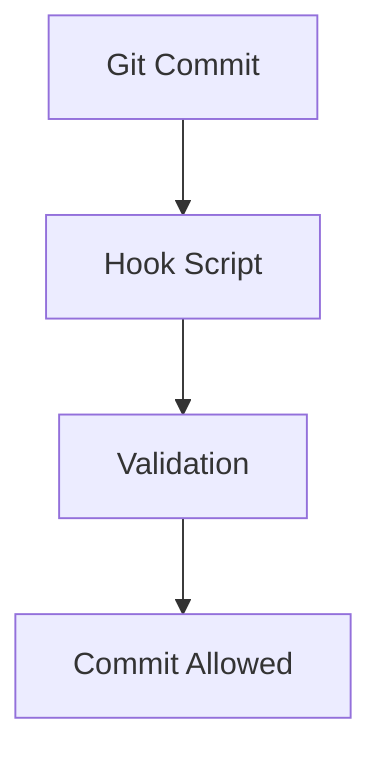

Automation improves consistency and quality.

---

# Where Hooks Are Stored

Git stores hooks inside:

```text
.git/hooks/
```

---

## Example Directory

```text
.git/hooks/

├── applypatch-msg.sample
├── commit-msg.sample
├── pre-commit.sample
├── pre-push.sample
├── post-commit.sample
├── pre-rebase.sample
└── pre-receive.sample
```

---

# How Hooks Work

Git executes hook scripts when a matching event occurs.

Example:

```bash
git commit
```

Git checks:

```text
.git/hooks/pre-commit
```

If present and executable:

```text
Run Hook
```

If hook fails:

```text
Commit Aborted
```

---

# Hook Workflow

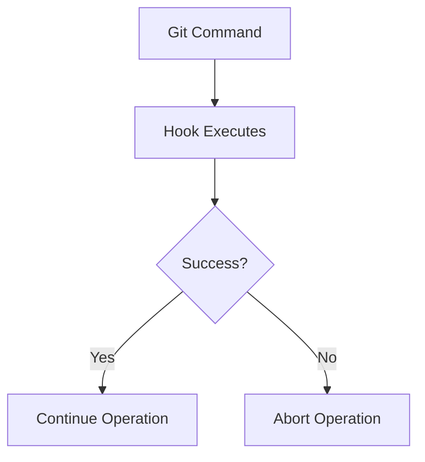

---

# Types of Git Hooks

Git Hooks are divided into two major categories.

| Category     | Location          |
| ------------ | ----------------- |
| Client Hooks | Developer Machine |
| Server Hooks | Git Server        |

---

# Client-Side Hooks

Client hooks run on the developer's machine.

Examples:

```text
pre-commit
commit-msg
pre-push
post-checkout
post-merge
```

---

## Workflow

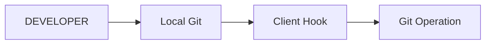

---

# Server-Side Hooks

Server hooks run on the Git server.

Examples:

```text
pre-receive
update
post-receive
```

---

## Workflow

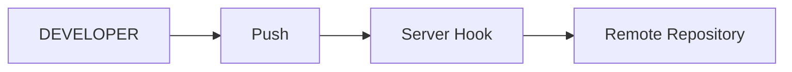

---

# Understanding Hook Scripts

Hooks can be written in:

* Bash
* Shell Script
* Python
* Ruby
* Perl
* Node.js
* Any executable language

---

## Example Hook

```bash
#!/bin/bash

echo "Running Hook..."
```

---

# Making Hooks Executable

Linux/macOS:

```bash
chmod +x .git/hooks/pre-commit
```

Without executable permissions:

```text
Hook Will Not Run
```

---

# Pre-Commit Hook

---

# What Is Pre-Commit?

Runs before a commit is created.

---

## Timing

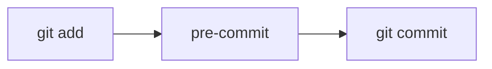

---

# Purpose

Common uses:

* Linting
* Formatting
* Testing
* Secret detection
* Validation

---

# Example Pre-Commit Hook

```bash
#!/bin/bash

echo "Running tests..."

npm test

if [ $? -ne 0 ]; then
    echo "Tests failed"
    exit 1
fi
```

---

# Workflow

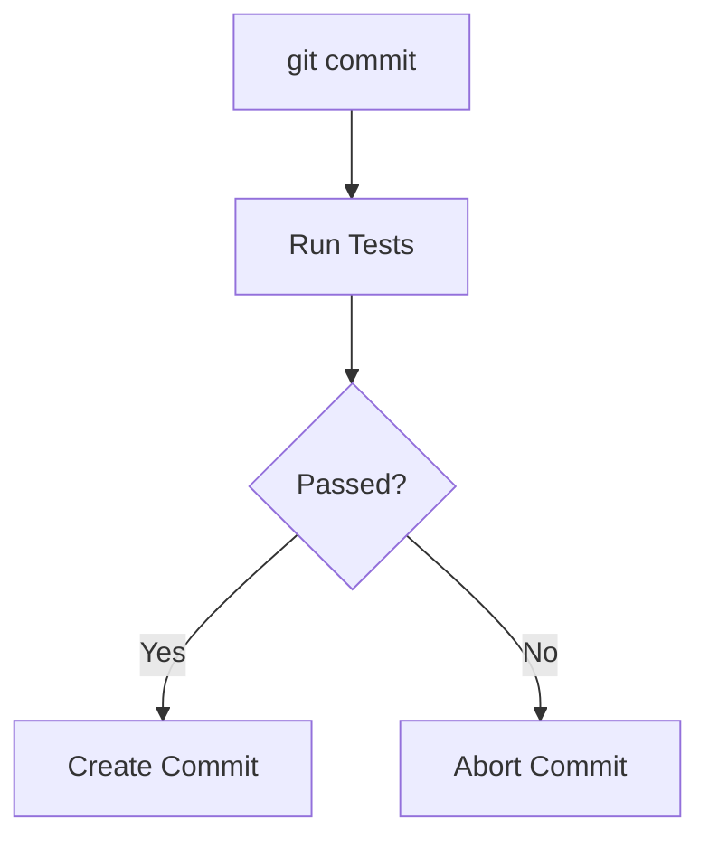

---

# Python Example

```bash
#!/bin/bash

python -m pytest

if [ $? -ne 0 ]; then
    echo "Tests failed"
    exit 1
fi
```

---

# Formatting Example

```bash
#!/bin/bash

black .

if [ $? -ne 0 ]; then
    exit 1
fi
```

---

# Secret Detection Example

Prevent:

```text
AWS Keys
Passwords
API Tokens
```

---

## Example Hook

```bash
#!/bin/bash

if grep -R "API_KEY=" .; then
    echo "Secret detected"
    exit 1
fi
```

---

# Commit-Msg Hook

---

# What Is Commit-Msg?

Runs after commit message creation but before commit completion.

---

## Timing

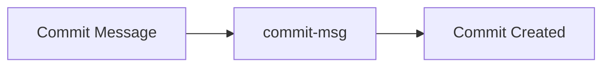

---

# Purpose

Enforce commit message standards.

Examples:

```text
JIRA Ticket Requirement

Conventional Commits

Message Validation
```

---

# Example

Require:

```text
PROJ-123 Add login feature
```

---

## Hook Script

```bash
#!/bin/bash

MESSAGE_FILE=$1

if ! grep -qE "^PROJ-[0-9]+" "$MESSAGE_FILE"; then
    echo "Commit message must contain ticket number"
    exit 1
fi
```

---

# Conventional Commit Example

Allowed:

```text
feat: add login page

fix: resolve validation bug

docs: update README
```

---

## Validation Hook

```bash
#!/bin/bash

MESSAGE=$(cat "$1")

if ! echo "$MESSAGE" | grep -E "^(feat|fix|docs|refactor|test):"; then
    echo "Invalid commit message format"
    exit 1
fi
```

---

# Commit-Msg Workflow

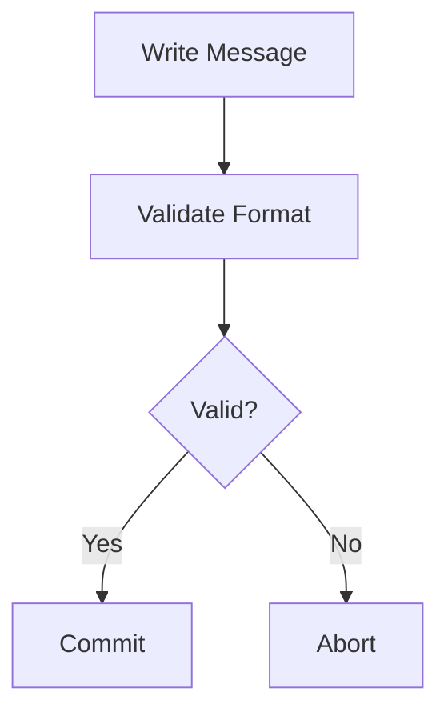

---

# Pre-Push Hook

---

# What Is Pre-Push?

Runs before Git pushes commits to a remote repository.

---

## Timing

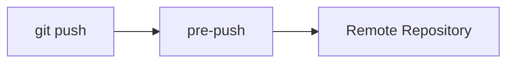

---

# Purpose

Common uses:

* Run tests
* Security checks
* Build verification
* Branch protection

---

# Example Pre-Push Hook

```bash
#!/bin/bash

echo "Running tests..."

npm test

if [ $? -ne 0 ]; then
    echo "Push blocked"
    exit 1
fi
```

---

# Build Verification Example

```bash
#!/bin/bash

npm run build

if [ $? -ne 0 ]; then
    echo "Build failed"
    exit 1
fi
```

---

# Branch Protection Example

Prevent direct pushes to main.

```bash
#!/bin/bash

BRANCH=$(git rev-parse --abbrev-ref HEAD)

if [ "$BRANCH" = "main" ]; then
    echo "Direct pushes to main are prohibited"
    exit 1
fi
```

---

# Pre-Push Workflow

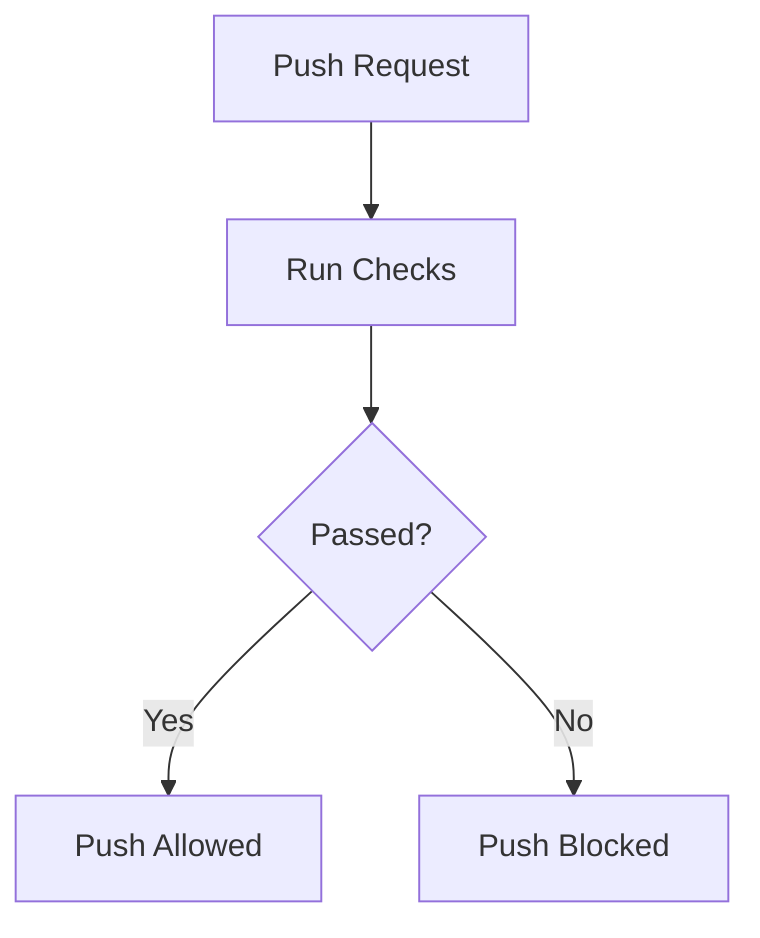

---

# Other Useful Client Hooks

---

# Post-Commit

Runs after commit creation.

Example:

```text
Notify Team
Generate Reports
Update Documentation
```

---

# Post-Merge

Runs after merge.

Example:

```text
Install Dependencies
Refresh Generated Files
```

---

# Post-Checkout

Runs after checkout.

Example:

```text
Update Environment
Generate Configurations
```

---

# Pre-Rebase

Runs before rebase begins.

Can prevent dangerous rebases.

---

# Example

```bash
#!/bin/bash

CURRENT_BRANCH=$(git branch --show-current)

if [ "$CURRENT_BRANCH" = "main" ]; then
    echo "Rebasing main is prohibited"
    exit 1
fi
```

---

# Server-Side Hooks

---

# Why Server Hooks Exist

Client hooks can be bypassed.

Server hooks enforce policies centrally.

---

# Server Hook Workflow

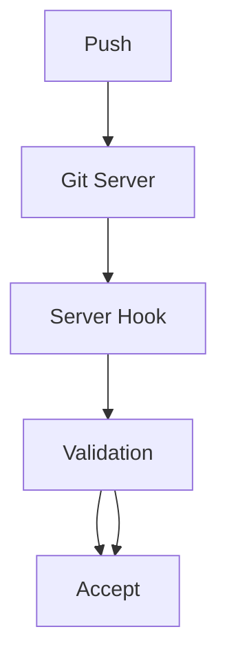

---

# Pre-Receive Hook

Runs before accepting pushed commits.

---

## Uses

* Enforce policies
* Validate commits
* Block unauthorized pushes

---

# Example

```bash
#!/bin/bash

echo "Checking commits..."
```

---

# Update Hook

Runs once for each updated reference.

Example:

```text
main
develop
release
```

---

# Post-Receive Hook

Runs after successful push.

Common uses:

* CI/CD
* Deployment
* Notifications

---

## Workflow

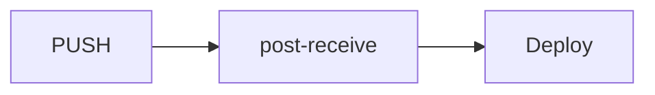

---

# Real-World Hook Examples

---

# Example 1: Prevent Large Files

```bash
#!/bin/bash

FILES=$(git diff --cached --name-only)

for FILE in $FILES
do
    SIZE=$(stat -c%s "$FILE")

    if [ $SIZE -gt 10485760 ]; then
        echo "Large file detected"
        exit 1
    fi
done
```

---

# Example 2: Prevent Debug Statements

Block:

```javascript
console.log()
```

---

## Hook

```bash
#!/bin/bash

if grep -R "console.log" src/; then
    echo "Remove debug statements"
    exit 1
fi
```

---

# Example 3: Run Unit Tests

```bash
#!/bin/bash

pytest

if [ $? -ne 0 ]; then
    exit 1
fi
```

---

# Example 4: Validate Branch Names

Require:

```text
feature/*
bugfix/*
hotfix/*
```

---

## Hook

```bash
#!/bin/bash

BRANCH=$(git branch --show-current)

if ! echo "$BRANCH" | grep -E "^(feature|bugfix|hotfix)/"; then
    echo "Invalid branch name"
    exit 1
fi
```

---

# Sharing Hooks Across Teams

---

# Problem

Hooks are not committed by default.

```text
.git/hooks/
```

is not shared.

---

# Solution 1: Version-Controlled Hooks

```text
project/

├── hooks/

│   ├── pre-commit
│   └── commit-msg
```

---

## Configure

```bash
git config core.hooksPath hooks
```

---

# Solution 2: Hook Frameworks

Popular tools:

| Tool       | Purpose                  |
| ---------- | ------------------------ |
| Husky      | JavaScript Projects      |
| pre-commit | Multi-language Framework |
| Lefthook   | Fast Hook Manager        |
| Overcommit | Ruby-Based Hooks         |

---

# Example: Husky

Install:

```bash
npm install husky --save-dev
```

Initialize:

```bash
npx husky init
```

---

# Example Hook

```bash
npm test
```

before commit.

---

# Best Practices

---

## Keep Hooks Fast

Good:

```text
< 5 seconds
```

Bad:

```text
2 minute pre-commit hook
```

---

## Provide Clear Error Messages

Good:

```text
Tests failed.
Run pytest before committing.
```

Bad:

```text
Error
```

---

## Use Hooks for Automation

Ideal tasks:

* Formatting
* Testing
* Validation

---

## Avoid Heavy Processing

Large builds belong in:

```text
CI/CD Pipelines
```

not local hooks.

---

## Version-Control Team Hooks

Use:

```bash
git config core.hooksPath hooks
```

---

# Common Mistakes

| Mistake                         | Consequence           |
| ------------------------------- | --------------------- |
| Slow hooks                      | Developer frustration |
| Poor error messages             | Confusion             |
| Not making scripts executable   | Hooks don't run       |
| Overly strict validation        | Workflow disruption   |
| Relying only on client hooks    | Easy bypass           |
| Ignoring server-side validation | Weak enforcement      |

---

# Troubleshooting

---

# Problem: Hook Not Running

Check:

```bash
ls -l .git/hooks/
```

Verify:

```text
Executable Permission
```

---

## Fix

```bash
chmod +x .git/hooks/pre-commit
```

---

# Problem: Hook Runs Manually But Not Automatically

Verify filename.

Correct:

```text
pre-commit
```

Incorrect:

```text
pre-commit.sh
```

---

# Problem: Commit Blocked Unexpectedly

Run:

```bash
.git/hooks/pre-commit
```

directly.

Inspect output.

---

# Problem: Need Temporary Bypass

For commits:

```bash
git commit --no-verify
```

For pushes:

```bash
git push --no-verify
```

Use sparingly.

---

# Hook Execution Order

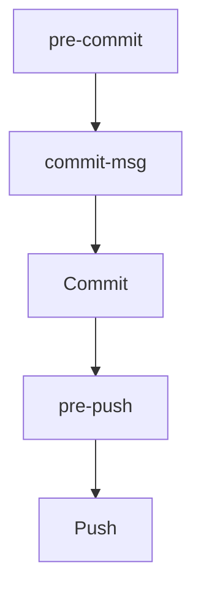

---

# Interview Questions and Answers

---

## Q1: What are Git Hooks?

### Answer

Git Hooks are scripts that run automatically before or after specific Git events.

---

## Q2: Where are Git Hooks stored?

### Answer

Inside the `.git/hooks/` directory.

---

## Q3: What is a pre-commit hook?

### Answer

A script that runs before a commit is created, typically used for validation and testing.

---

## Q4: What is a commit-msg hook?

### Answer

A hook that validates or modifies commit messages before commits are finalized.

---

## Q5: What is a pre-push hook?

### Answer

A hook that executes before code is pushed to a remote repository.

---

## Q6: What is the difference between client and server hooks?

### Answer

Client hooks run on developer machines, while server hooks run on remote Git servers.

---

## Q7: Can Git Hooks prevent commits?

### Answer

Yes. Returning a non-zero exit code aborts the operation.

---

## Q8: How can hooks be shared across a team?

### Answer

Using a version-controlled hooks directory and configuring `core.hooksPath`.

---

## Q9: Why are server hooks important?

### Answer

Because client hooks can be bypassed, while server hooks enforce policies centrally.

---

## Q10: How can a developer bypass hooks temporarily?

### Answer

Using:

```bash
git commit --no-verify
```

or

```bash
git push --no-verify
```

---

# Chapter Summary

In this chapter, you learned:

* Git Hooks automate actions before and after Git operations.
* Hooks are stored in `.git/hooks/`.
* Client-side hooks include `pre-commit`, `commit-msg`, and `pre-push`.
* Server-side hooks include `pre-receive`, `update`, and `post-receive`.
* Pre-commit hooks are commonly used for testing, formatting, and validation.
* Commit-msg hooks enforce commit message standards.
* Pre-push hooks validate code before it reaches remote repositories.
* Hooks can be written in any executable scripting language.
* Team-wide hook management can be achieved using `core.hooksPath` or frameworks such as Husky.
* Effective hooks improve code quality, consistency, security, and development workflows.

Git Hooks transform Git from a version control system into a powerful automation platform, enabling teams to enforce standards, prevent common mistakes, and streamline development processes long before code reaches production.
