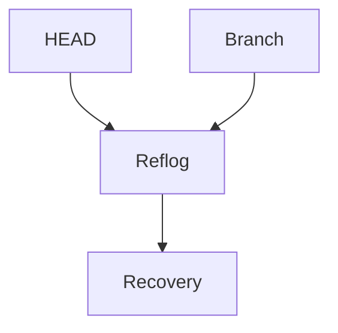
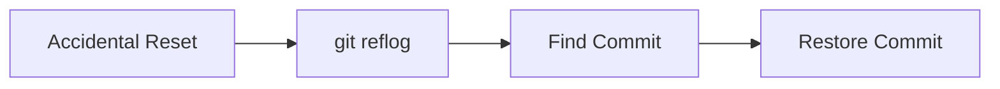
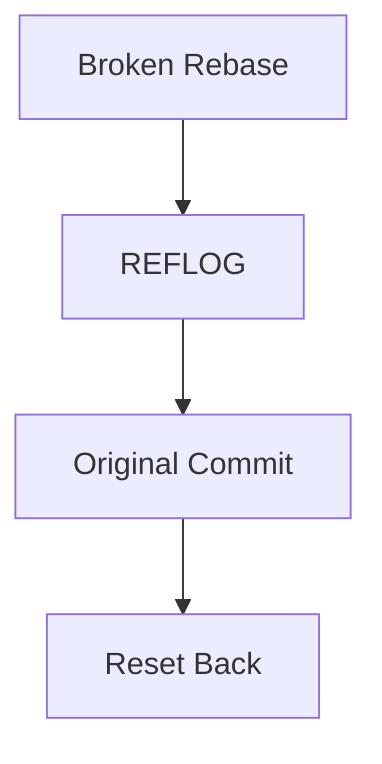
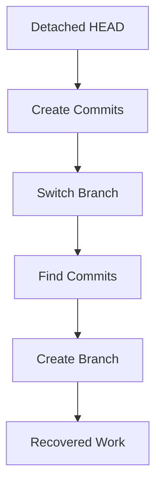
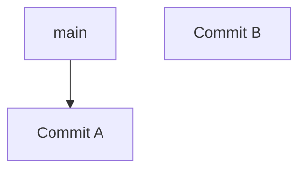

# Git Reflog and Recovery Techniques

---

# Learning Objectives

By the end of this chapter, you will understand:

* What Git Reflog is
* How Reflog differs from Git history
* How Git tracks reference movements
* How to view and interpret Reflog entries
* Recovering lost commits
* Recovering deleted branches
* Recovering commits after a reset
* Recovering commits after a rebase
* Recovering commits after a mistaken checkout
* Understanding unreachable commits
* Practical disaster recovery workflows
* Recovery best practices
* Common recovery mistakes
* Troubleshooting repository recovery issues

---

# Introduction

Every Git developer eventually experiences one of these moments:

```text
"I accidentally deleted a branch."

"I reset my repository and lost commits."

"I rebased and everything disappeared."

"I force-pushed the wrong branch."

"I checked out an old commit and can't find my work."
```

Fortunately, Git is extremely difficult to permanently destroy.

In many situations, Git still remembers where things were.

The secret weapon for recovery is:

> **Git Reflog**

Many developers know `git log`.

Far fewer understand `git reflog`.

Yet Reflog is often the difference between:

```text
Data Loss
```

and

```text
Successful Recovery
```

---

# What Is Reflog?

Reflog stands for:

```text
Reference Log
```

Git maintains a local history of reference updates.

Whenever Git moves:

* HEAD
* Branch references
* Tags (in some situations)

Git records the change.

---

# Important Concept

Git History:

```text
Commit History
```

Reflog:

```text
Reference Movement History
```

These are not the same thing.

---

# Example

Suppose:


Branch:

```text
main → C
```

You reset:

```bash
git reset --hard A
```

History appears to lose:

```text
B
C
```

But Reflog remembers the movement.

---

# Why Reflog Exists

Git needs a way to record:

```text
Where HEAD was

Where branches pointed

What operations occurred
```

This allows recovery after mistakes.

---

# Reflog Architecture



---

# Where Reflog Is Stored

Inside:

```text
.git/logs/
```

---

## Common Locations

```text
.git/logs/HEAD

.git/logs/refs/heads/main

.git/logs/refs/heads/develop
```

---

# Viewing Reflog

---

# Basic Command

```bash
git reflog
```

---

## Example Output

```text
a1b2c3 HEAD@{0}: commit: Add login validation

d4e5f6 HEAD@{1}: commit: Add login page

g7h8i9 HEAD@{2}: checkout: moving from main to feature

j1k2l3 HEAD@{3}: commit: Initial commit
```

---

# Understanding Reflog Entries

Example:

```text
a1b2c3 HEAD@{0}: commit: Add login validation
```

---

## Components

| Component  | Meaning            |
| ---------- | ------------------ |
| `a1b2c3`   | Commit SHA         |
| `HEAD@{0}` | Current position   |
| `commit`   | Operation          |
| Message    | Action description |

---

# Reflog Timeline

```mermaid
flowchart LR

A[HEAD@3]

--> B[HEAD@2]

--> C[HEAD@1]

--> D[HEAD@0]
```

Newest entries appear first.

---

# Viewing Specific Entries

---

## Latest Entry

```bash
git reflog -1
```

---

## Last 5 Entries

```bash
git reflog -5
```

---

## Full History

```bash
git reflog show
```

---

# Reflog vs Log

---

## Git Log

Shows:

```text
Reachable commits
```

---

## Git Reflog

Shows:

```text
Reference movements
```

---

## Comparison

| Feature              | git log | git reflog |
| -------------------- | ------- | ---------- |
| Commit history       | Yes     | Indirectly |
| Branch movements     | No      | Yes        |
| Reset tracking       | No      | Yes        |
| Recovery information | Limited | Excellent  |
| Local only           | No      | Yes        |

---

# Understanding Lost Commits

---

# What Is a Lost Commit?

A commit becomes "lost" when:

```text
No branch points to it
```

---

## Example

Before:


```text
main → C
```

---

## Reset

```bash
git reset --hard A
```

After:

```text
main → A
```

---

## Commit State

```text
B
C
```

appear lost.

---

# Reality

Git still stores them.

Reflog remembers them.

---

# Recovering Reset Commits

---

# Scenario

History:


---

## Mistake

```bash
git reset --hard HEAD~2
```

---

## Result

```text
main → A
```

---

# Recovery Step 1

View Reflog:

```bash
git reflog
```

Output:

```text
abc123 HEAD@{0}: reset: moving to HEAD~2

def456 HEAD@{1}: commit: Add feature C

ghi789 HEAD@{2}: commit: Add feature B
```

---

# Recovery Step 2

Identify lost commit:

```text
def456
```

---

# Recovery Step 3

Restore

Option 1:

```bash
git reset --hard def456
```

---

Option 2:

```bash
git checkout def456
```

---

# Recovery Workflow



---

# Recovering Deleted Branches

---

# Scenario

Branch:

```text
feature-auth
```

contains:

```text
Commit D
Commit E
```

---

## Mistake

```bash
git branch -D feature-auth
```

Branch disappears.

---

# Recovery Step 1

Search Reflog

```bash
git reflog
```

Example:

```text
abc123 commit: Add JWT support

def456 commit: Add login endpoint
```

---

# Recovery Step 2

Create Branch Again

```bash
git checkout -b feature-auth abc123
```

---

## Result

```text
feature-auth restored
```

---

# Branch Recovery Diagram


---

# Recovering After Rebase

---

# Scenario

Interactive rebase:

```bash
git rebase -i HEAD~5
```

Something goes wrong.

Commits disappear.

---

# Step 1

Check Reflog:

```bash
git reflog
```

Example:

```text
abc123 rebase finished

def456 rebase start

ghi789 original commit
```

---

# Step 2

Return to Original State

```bash
git reset --hard ghi789
```

---

# Workflow



---

# Recovering After Force Push

---

# Scenario

Force push overwrites history.

---

## Local Recovery

Check:

```bash
git reflog
```

Locate old commit.

Restore:

```bash
git branch recovery-branch <sha>
```

---

# Important

Reflog is:

```text
Local
```

not shared.

Other developers cannot see your reflog.

---

# Recovering Detached HEAD Work

---

# Scenario

Checkout commit:

```bash
git checkout abc123
```

---

Now:

```text
Detached HEAD
```

---

Create commits:

```text
X
Y
```

---

Switch back:

```bash
git checkout main
```

Commits seem lost.

---

# Recovery

View Reflog:

```bash
git reflog
```

Find:

```text
Commit Y
```

Create branch:

```bash
git checkout -b recovered-work Y
```

---

# Detached HEAD Recovery Diagram



---

# Recovering Stashed Work

While not directly Reflog-related, recovery often involves stashes.

---

## View Stashes

```bash
git stash list
```

---

## Apply Stash

```bash
git stash apply
```

---

## Recover Dropped Stash

Sometimes:

```bash
git fsck --lost-found
```

can locate stash objects.

---

# Recovering Unreachable Commits

---

# What Is an Unreachable Commit?

A commit that:

```text
No branch references
```

but still exists in the object database.

---

## Example



---

# Find Unreachable Objects

```bash
git fsck --full
```

Example:

```text
dangling commit abc123
```

---

# Recover Commit

```bash
git checkout abc123
```

or:

```bash
git branch recovered abc123
```

---

# Using Git FSCK

---

# Purpose

Checks repository integrity.

---

## Command

```bash
git fsck
```

---

## Example Output

```text
dangling commit abc123

dangling blob def456
```

---

# Recovery Workflow


---

# Recovering Deleted Files

---

# Scenario

File deleted accidentally.

---

## Find Commit

```bash
git log -- filename
```

---

## Restore

```bash
git checkout <commit> -- filename
```

---

# Example

```bash
git checkout abc123 -- config.yaml
```

---

# Reflog Expiration

Reflog entries do not exist forever.

---

## Default Retention

Typically:

| Type                | Retention |
| ------------------- | --------- |
| Reachable entries   | 90 days   |
| Unreachable entries | 30 days   |

---

## Garbage Collection

Eventually:

```bash
git gc
```

may permanently remove unreachable objects.

---

# Important Recovery Rule

Recover first.

Clean later.

---

# Recovery Command Cheat Sheet

| Command                      | Purpose               |
| ---------------------------- | --------------------- |
| `git reflog`                 | View reflog           |
| `git reflog -5`              | Last 5 entries        |
| `git reset --hard <sha>`     | Restore state         |
| `git checkout <sha>`         | Checkout commit       |
| `git checkout -b name <sha>` | Recover branch        |
| `git fsck --full`            | Find dangling objects |
| `git branch recovered <sha>` | Save recovered commit |
| `git stash list`             | View stashes          |

---

# Common Recovery Scenarios

---

## Scenario 1

```text
Accidental reset
```

Solution:

```bash
git reflog
git reset --hard <sha>
```

---

## Scenario 2

```text
Deleted branch
```

Solution:

```bash
git reflog
git checkout -b branch-name <sha>
```

---

## Scenario 3

```text
Bad rebase
```

Solution:

```bash
git reflog
git reset --hard <sha>
```

---

## Scenario 4

```text
Detached HEAD work lost
```

Solution:

```bash
git reflog
git checkout -b recovered <sha>
```

---

## Scenario 5

```text
Unknown missing commit
```

Solution:

```bash
git fsck --full
```

---

# Best Practices

---

## Use Reflog Before Panicking

Many "lost" commits are still recoverable.

---

## Create Recovery Branches

Instead of:

```bash
git reset --hard
```

first create:

```bash
git branch recovery <sha>
```

---

## Verify Before Resetting

Inspect:

```bash
git show <sha>
```

before restoring.

---

## Avoid Immediate Garbage Collection

Do not run:

```bash
git gc
```

while attempting recovery.

---

## Learn Reflog Early

It is one of Git's most valuable recovery tools.

---

# Common Mistakes

| Mistake                              | Consequence                     |
| ------------------------------------ | ------------------------------- |
| Panic after reset                    | Unnecessary stress              |
| Running garbage collection too early | Permanent loss                  |
| Force pushing without backup         | Harder recovery                 |
| Ignoring reflog                      | Missed recovery opportunity     |
| Not creating recovery branch         | Risk of losing recovered commit |
| Confusing log with reflog            | Incomplete recovery information |

---

# Troubleshooting

---

# Problem: Reflog Does Not Show Commit

Possible causes:

* Reflog expired
* Commit garbage collected
* Repository recreated

Try:

```bash
git fsck --full
```

---

# Problem: Branch Deleted Long Ago

Check:

```bash
git reflog
```

and:

```bash
git fsck --full
```

for dangling commits.

---

# Problem: Wrong Commit Restored

Inspect first:

```bash
git show <sha>
```

Then choose the correct commit.

---

# Problem: Recovery Branch Missing Changes

Check earlier reflog entries:

```bash
git reflog
```

You may have restored the wrong SHA.

---

# Problem: Repository Corruption

Run:

```bash
git fsck
```

and inspect reported issues.

---

# Interview Questions and Answers

---

## Q1: What is Git Reflog?

### Answer

Reflog is a local log of reference movements, including HEAD and branch updates.

---

## Q2: How is Reflog different from Git Log?

### Answer

Git Log shows commit history, while Reflog records reference changes and movements.

---

## Q3: Can deleted branches be recovered?

### Answer

Yes, if their commits still exist and can be located through Reflog or `git fsck`.

---

## Q4: How do you recover an accidental hard reset?

### Answer

Find the previous commit in Reflog and reset back to it.

---

## Q5: What command displays Reflog?

### Answer

```bash
git reflog
```

---

## Q6: What is a dangling commit?

### Answer

A commit that exists in the object database but is not referenced by any branch.

---

## Q7: What command finds dangling commits?

### Answer

```bash
git fsck --full
```

---

## Q8: Is Reflog shared with remote repositories?

### Answer

No. Reflog is local to each repository.

---

## Q9: What happens when Reflog entries expire?

### Answer

Expired entries may eventually be removed and unreachable commits can be garbage collected.

---

## Q10: What is the safest way to recover a commit?

### Answer

Create a recovery branch pointing to the commit before performing additional operations.

---

# Chapter Summary

In this chapter, you learned:

* Reflog records reference movements and is one of Git's most powerful recovery tools.
* Reflog differs from normal commit history because it tracks branch and HEAD changes.
* Lost commits are often still recoverable through Reflog.
* Deleted branches can frequently be restored by recreating them from recovered commit SHAs.
* Rebase mistakes, reset mistakes, detached HEAD work, and force-push issues can often be reversed.
* `git fsck` helps locate dangling and unreachable commits.
* Reflog is local and not shared with remote repositories.
* Reflog entries eventually expire, making timely recovery important.
* Creating recovery branches is safer than immediately resetting history.
* Understanding Git recovery techniques can save hours or days of work after accidental mistakes.

Mastering Reflog and recovery workflows transforms Git from a potentially intimidating tool into a resilient safety net, allowing developers to confidently experiment, recover from mistakes, and protect valuable work.
