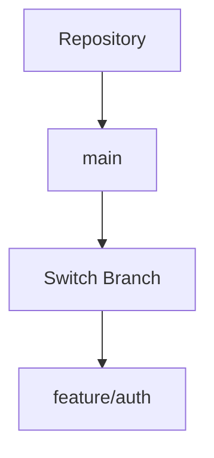
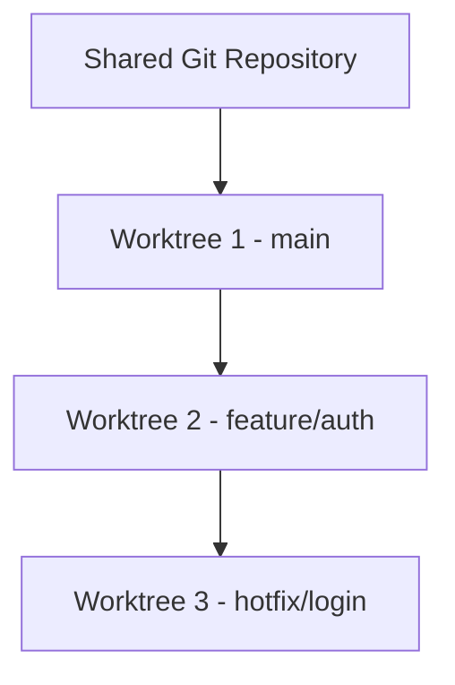
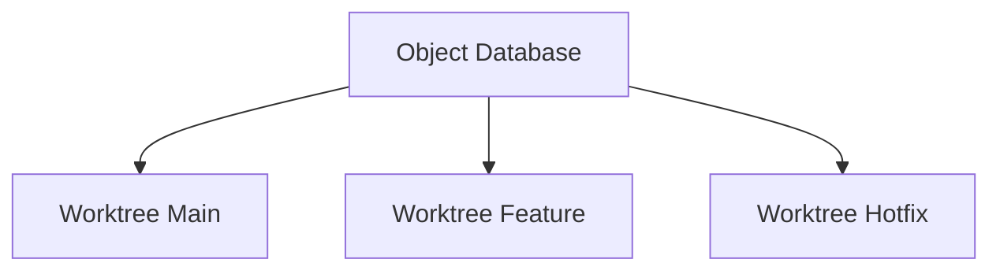
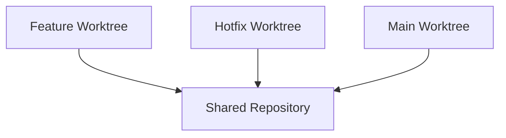

# Git Worktrees

---

# Learning Objectives

By the end of this chapter, you will understand:

* What Git Worktrees are
* Why Worktrees were introduced
* How Worktrees differ from cloning repositories
* How Git manages multiple working directories
* Creating and removing Worktrees
* Working on multiple branches simultaneously
* Feature development workflows using Worktrees
* Practical real-world use cases
* Best practices and common mistakes
* Troubleshooting Worktree-related issues
* Advanced Worktree workflows used in professional teams

---

# Introduction

One of the most common frustrations in Git is switching between branches.

Imagine you are working on:

```text
feature/authentication
```

and suddenly receive an urgent request to fix a production bug.

Normally, you would:

```bash
git stash
git checkout main
git checkout -b hotfix/login
```

Fix the issue, then switch back.

This process works, but it becomes cumbersome when switching contexts frequently.

Git Worktrees solve this problem.

Instead of repeatedly switching branches inside one working directory, Git allows:

> Multiple working directories connected to the same repository.

This enables simultaneous work on multiple branches.

---

# What Is a Git Worktree?

A Git Worktree is an additional working directory attached to an existing Git repository.

Each Worktree can:

* Check out a different branch
* Have its own working files
* Have its own build artifacts
* Be used independently

All Worktrees share:

* The same Git object database
* The same repository history
* The same commits
* The same references

---

# Traditional Git Workflow

Without Worktrees:



Only one branch can be actively checked out at a time.

---

# Worktree Workflow

With Worktrees:



Multiple branches are active simultaneously.

---

# Why Git Worktrees Exist

Worktrees solve several common development problems.

---

## Problem 1: Constant Branch Switching

Without Worktrees:

```bash
git checkout main

git checkout feature-auth

git checkout release

git checkout main
```

Frequent switching interrupts workflow.

---

## Problem 2: Stashing Changes

Developers often need:

```bash
git stash
git checkout another-branch
```

This can become messy.

---

## Problem 3: Multiple Active Tasks

Example:

```text
Feature Development
Production Hotfix
Release Validation
Code Review
```

all at the same time.

---

## Solution

Create separate Worktrees.

Each task gets its own directory.

---

# Worktree Architecture

---

## Standard Repository

```text
project/
│
├── .git/
├── src/
├── tests/
└── README.md
```

---

## Repository With Worktrees

```text
project/
│
├── .git/
│
├── src/
│
project-auth/
│
├── src/
│
project-hotfix/
│
├── src/
```

All directories share the same repository history.

---

# Internal Structure



The object database is shared.

Working directories are separate.

---

# Viewing Existing Worktrees

---

## Command

```bash
git worktree list
```

---

## Example Output

```text
/home/user/project          a1b2c3 [main]

/home/user/project-auth     d4e5f6 [feature/auth]

/home/user/project-hotfix   g7h8i9 [hotfix/login]
```

---

# Creating a Worktree

---

# Basic Syntax

```bash
git worktree add <directory> <branch>
```

---

## Example

```bash
git worktree add ../project-auth feature/auth
```

---

## Result

```text
project/
project-auth/
```

Two directories now exist.

---

# Visualization


Both are connected to the same repository.

---

# Creating a New Branch With Worktree

---

## Syntax

```bash
git worktree add -b <branch> <directory>
```

---

## Example

```bash
git worktree add -b feature/payment ../project-payment
```

Git:

1. Creates branch
2. Creates Worktree
3. Checks out branch

---

# Result

```text
feature/payment
```

is immediately available.

---

# Practical Example

---

# Current Repository

```text
project/
```

Branch:

```text
main
```

---

## Create Authentication Feature Worktree

```bash
git worktree add -b feature/auth ../auth-work
```

---

## Create Hotfix Worktree

```bash
git worktree add -b hotfix/login ../hotfix-work
```

---

## Final Structure

```text
project/
auth-work/
hotfix-work/
```

---

## Branches

```text
project      → main

auth-work    → feature/auth

hotfix-work  → hotfix/login
```

---

# Working in Multiple Directories

---

## Main Worktree

```text
project/
```

Current branch:

```text
main
```

---

## Feature Worktree

```text
auth-work/
```

Current branch:

```text
feature/auth
```

---

## Hotfix Worktree

```text
hotfix-work/
```

Current branch:

```text
hotfix/login
```

---

All can remain open simultaneously.

---

# Real-World Development Workflow

---

# Scenario

You are developing:

```text
Feature Authentication
```

---

## Suddenly

Production issue reported:

```text
Login failure bug
```

---

## Traditional Workflow

```bash
git stash

git checkout main

git checkout -b hotfix
```

Later:

```bash
git checkout feature-auth

git stash pop
```

---

## Worktree Workflow

Simply open:

```text
hotfix-work/
```

No stashing required.

---

# Workflow Diagram



---

# Feature Development With Worktrees

---

## Create Worktree

```bash
git worktree add -b feature/api ../api-work
```

---

## Enter Directory

```bash
cd ../api-work
```

---

## Develop Feature

```bash
git add .
git commit -m "Add API endpoint"
```

---

## Push Branch

```bash
git push origin feature/api
```

---

No effect on other Worktrees.

---

# Reviewing Pull Requests Using Worktrees

One of the most powerful use cases.

---

## Create Review Worktree

```bash
git worktree add ../review feature/pr-123
```

---

## Open in IDE

```text
review/
```

---

Review code without disturbing current work.

---

# Release Testing Workflow

---

## Main Development

```text
feature/new-dashboard
```

---

## Release Candidate

```text
release/v2.0
```

---

## Create Release Worktree

```bash
git worktree add ../release-test release/v2.0
```

---

Run:

```text
Builds
Tests
QA Validation
```

without affecting development.

---

# Removing Worktrees

---

# Basic Syntax

```bash
git worktree remove <directory>
```

---

## Example

```bash
git worktree remove ../project-auth
```

---

## Result

```text
Worktree removed
Branch remains
```

unless explicitly deleted.

---

# Cleaning Stale Worktrees

Sometimes Worktrees are deleted manually.

Git may still track them.

---

## Cleanup

```bash
git worktree prune
```

---

Removes stale references.

---

# Locking Worktrees

---

# Purpose

Prevent accidental removal.

---

## Command

```bash
git worktree lock
```

---

## Example

```bash
git worktree lock --reason "Release Testing"
```

---

# Unlocking

```bash
git worktree unlock
```

---

# Worktree Restrictions

---

# Same Branch Cannot Be Checked Out Twice

Suppose:

```text
main
```

already exists in:

```text
project/
```

Git prevents:

```bash
git worktree add ../another-main main
```

---

## Error

```text
fatal:
branch already checked out
```

---

# Why?

To prevent branch corruption.

---

# Viewing Worktree Details

---

## Command

```bash
git worktree list --verbose
```

---

Example:

```text
project/

HEAD abc123

branch refs/heads/main
```

---

# Common Commands

| Command               | Purpose               |
| --------------------- | --------------------- |
| `git worktree list`   | List worktrees        |
| `git worktree add`    | Create worktree       |
| `git worktree remove` | Remove worktree       |
| `git worktree prune`  | Clean stale worktrees |
| `git worktree lock`   | Lock worktree         |
| `git worktree unlock` | Unlock worktree       |

---

# Worktree vs Clone

| Feature                    | Worktree | Clone |
| -------------------------- | -------- | ----- |
| Shared object database     | Yes      | No    |
| Shared repository history  | Yes      | No    |
| Disk usage                 | Low      | High  |
| Faster creation            | Yes      | No    |
| Separate working directory | Yes      | Yes   |
| Independent repository     | No       | Yes   |

---

# Worktree vs Branch Switching

| Feature                  | Branch Switching | Worktree  |
| ------------------------ | ---------------- | --------- |
| Multiple active branches | No               | Yes       |
| Requires stash           | Often            | Rarely    |
| Context switching        | Frequent         | Minimal   |
| Multiple IDE windows     | Difficult        | Easy      |
| Release testing          | Limited          | Excellent |

---

# Best Practices

---

## Use One Worktree Per Task

Good:

```text
feature/auth

feature/payment

hotfix/login
```

Separate Worktrees.

---

## Name Worktrees Clearly

Good:

```text
auth-work

release-test

hotfix-login
```

Bad:

```text
temp1

folder2

new-work
```

---

## Remove Finished Worktrees

After merge:

```bash
git worktree remove ../auth-work
```

Keep environment clean.

---

## Use Worktrees for Code Reviews

Avoid disturbing active development.

---

## Use Worktrees for Releases

Maintain isolated testing environments.

---

# Common Mistakes

| Mistake                           | Consequence           |
| --------------------------------- | --------------------- |
| Creating too many worktrees       | Management complexity |
| Manual directory deletion         | Stale references      |
| Forgetting prune                  | Repository clutter    |
| Confusing worktree branch context | Wrong commits         |
| Keeping obsolete worktrees        | Disk waste            |

---

# Troubleshooting

---

# Problem: Branch Already Checked Out

Error:

```text
fatal:
branch is already checked out
```

---

## Cause

Branch already used by another Worktree.

---

## Solution

Use:

```bash
git worktree list
```

Find existing Worktree.

---

# Problem: Stale Worktree

Error:

```text
worktree already registered
```

---

## Fix

```bash
git worktree prune
```

---

# Problem: Deleted Directory Manually

Example:

```bash
rm -rf auth-work
```

Git still tracks it.

---

## Fix

```bash
git worktree prune
```

---

# Problem: Unsure Which Branch a Worktree Uses

Run:

```bash
git branch --show-current
```

or:

```bash
git worktree list
```

---

# Interview Questions and Answers

---

## Q1: What is a Git Worktree?

### Answer

A Git Worktree is an additional working directory attached to an existing repository, allowing multiple branches to be checked out simultaneously.

---

## Q2: Why were Worktrees introduced?

### Answer

To enable parallel work on multiple branches without repeatedly switching branches or stashing changes.

---

## Q3: Do Worktrees share the same repository history?

### Answer

Yes. All Worktrees share the same Git object database and repository history.

---

## Q4: How do you create a Worktree?

### Answer

```bash
git worktree add <directory> <branch>
```

---

## Q5: Can the same branch be checked out in multiple Worktrees?

### Answer

No. Git prevents the same branch from being checked out in multiple Worktrees simultaneously.

---

## Q6: What command lists all Worktrees?

### Answer

```bash
git worktree list
```

---

## Q7: How do you remove a Worktree?

### Answer

```bash
git worktree remove <directory>
```

---

## Q8: What is the difference between a Worktree and a Clone?

### Answer

Worktrees share the same repository database, while clones create completely separate repositories.

---

## Q9: Why are Worktrees useful for code reviews?

### Answer

They allow reviewers to check out Pull Request branches without interrupting ongoing development work.

---

## Q10: What command cleans stale Worktree references?

### Answer

```bash
git worktree prune
```

---

# Chapter Summary

In this chapter, you learned:

* Git Worktrees allow multiple working directories to share a single repository.
* Worktrees eliminate the need for constant branch switching and excessive stashing.
* Each Worktree can check out a different branch simultaneously.
* Worktrees share the same object database, commits, and references.
* They are ideal for feature development, hotfixes, release testing, and code reviews.
* Worktrees are more efficient than cloning repositories because they reuse repository data.
* Git provides commands for creating, listing, locking, unlocking, pruning, and removing Worktrees.
* Worktrees improve productivity by enabling parallel development workflows.
* Proper naming, cleanup, and organization are important for maintaining Worktree environments.
* Worktrees are widely used by experienced developers working on large projects with multiple active branches.

Git Worktrees are one of the most powerful yet underutilized Git features. Once mastered, they dramatically improve productivity by allowing developers to work on multiple tasks simultaneously without sacrificing repository consistency or development flow.
