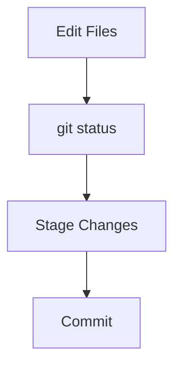
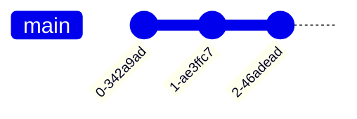
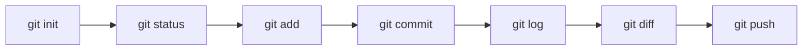

# Essential Git Commands

---

# Learning Objectives

By the end of this chapter, you will be able to:

* Initialize Git repositories
* Clone existing repositories
* Inspect repository status
* Stage files for commits
* Create commits
* View commit history
* Compare changes between versions
* Inspect commit details
* Remove and rename files safely
* Restore files to previous states
* Reset staged or committed changes
* Use Git's core commands confidently in daily development

---

# Introduction

Git provides hundreds of commands, but most day-to-day work relies on a relatively small set of essential commands.

These commands form the foundation of nearly every Git workflow.

Understanding them thoroughly is critical before learning advanced topics such as branching, merging, rebasing, and collaboration.

---

# The Basic Git Workflow

Most Git activity follows this pattern:


Before learning each command individually, it helps to understand where they fit within the workflow.

---

# Essential Command Overview

| Command       | Purpose                     |
| ------------- | --------------------------- |
| `git init`    | Create a new repository     |
| `git clone`   | Copy an existing repository |
| `git status`  | Check repository state      |
| `git add`     | Stage changes               |
| `git commit`  | Save a snapshot             |
| `git log`     | View commit history         |
| `git diff`    | Compare changes             |
| `git show`    | Display object details      |
| `git rm`      | Remove tracked files        |
| `git mv`      | Rename or move files        |
| `git restore` | Restore file contents       |
| `git reset`   | Unstage or move references  |

---

# `git init`

---

## Purpose

Creates a new Git repository in the current directory.

This command transforms a regular folder into a Git-managed project.

---

## What Happens Internally?

Git creates a hidden directory:

```text
.git/
```

which stores:

* Commit history
* Branch references
* Configuration
* Objects
* Metadata

---

## Syntax

```bash
git init
```

---

## Example

Create a project directory:

```bash
mkdir my-project
cd my-project
```

Initialize Git:

```bash
git init
```

Output:

```text
Initialized empty Git repository
```

---

## Repository Structure

Before:

```text
my-project/
```

After:

```text
my-project/
└── .git/
```

---

## Common Use Cases

### Starting a New Project

```bash
mkdir portfolio
cd portfolio
git init
```

---

### Adding Git to an Existing Project

```bash
cd existing-project
git init
```

---

## Best Practices

* Run `git init` once per project.
* Create a `.gitignore` file early.
* Verify initialization with `git status`.

---

## Common Mistakes

### Initializing the Wrong Directory

Bad:

```bash
cd ~
git init
```

This accidentally tracks your home directory.

---

### Nested Repositories

Avoid:

```text
project/
└── another-project/
    └── .git/
```

unless intentionally using submodules.

---

# `git clone`

---

## Purpose

Creates a complete copy of an existing repository.

---

## What Gets Cloned?

Git downloads:

* Files
* Branches
* Tags
* Commit history
* Repository metadata

---

## Syntax

```bash
git clone <repository-url>
```

---

## Example

```bash
git clone https://github.com/user/project.git
```

---

## Clone into Custom Directory

```bash
git clone https://github.com/user/project.git my-project
```

---

## Workflow


---

## Common Use Cases

### Open Source Contribution

```bash
git clone repository-url
```

---

### Joining a Team Project

Clone once and begin working.

---

## Best Practices

* Clone using official repository URLs.
* Verify remote configuration:

```bash
git remote -v
```

---

## Common Mistakes

### Downloading ZIP Instead of Cloning

ZIP downloads do not contain:

* History
* Branches
* Commit metadata

---

### Cloning Repeatedly

Clone once.

Use:

```bash
git pull
```

to update later.

---

# `git status`

---

## Purpose

Shows the current state of the repository.

---

## Syntax

```bash
git status
```

---

## Example

```bash
git status
```

Output:

```text
modified: app.py
```

---

## Information Displayed

* Current branch
* Modified files
* Staged files
* Untracked files
* Merge conflicts

---

## Workflow Position



---

## Common Use Cases

### Before Committing

```bash
git status
```

---

### After Merging

```bash
git status
```

to check conflicts.

---

## Best Practices

Run frequently:

```bash
git status
```

before:

* add
* commit
* merge
* push

---

## Common Mistakes

Ignoring status output can lead to:

* Missing files
* Unintended commits
* Merge confusion

---

# `git add`

---

## Purpose

Stages changes for the next commit.

---

## Syntax

### Single File

```bash
git add file.txt
```

### Multiple Files

```bash
git add file1.txt file2.txt
```

### Entire Directory

```bash
git add .
```

---

## Workflow


---

## Example

Modify:

```text
app.py
```

Stage:

```bash
git add app.py
```

---

## Common Use Cases

### Stage Everything

```bash
git add .
```

---

### Stage Specific Files

```bash
git add README.md
```

---

## Best Practices

Prefer:

```bash
git add file-name
```

for precise commits.

---

## Common Mistakes

### Blindly Using

```bash
git add .
```

May accidentally stage:

* Secrets
* Temporary files
* Debug code

---

# `git commit`

---

## Purpose

Creates a permanent snapshot of staged changes.

---

## Syntax

```bash
git commit -m "message"
```

---

## Example

```bash
git commit -m "Add user authentication"
```

---

## Workflow


---

## Commit Anatomy

```text
Commit ID
Author
Date
Message
Snapshot
```

---

## Common Use Cases

### Feature Development

```bash
git commit -m "Add login page"
```

---

### Bug Fix

```bash
git commit -m "Fix validation issue"
```

---

## Best Practices

Write meaningful messages.

Good:

```text
Fix password validation bug
```

Bad:

```text
update
```

---

## Common Mistakes

### Huge Commits

Bad:

```text
Three weeks of changes
```

---

### Vague Messages

Bad:

```text
stuff
```

---

# `git log`

---

## Purpose

Displays commit history.

---

## Syntax

```bash
git log
```

---

## Example

```bash
git log
```

Output:

```text
commit abc123
Author: John
Date: ...

Add login page
```

---

## Useful Variants

### One-Line Format

```bash
git log --oneline
```

Example:

```text
a12b34 Add login
c56d78 Fix bug
```

---

### Graph View

```bash
git log --graph --oneline
```

---

## Visual Example



---

## Best Practices

Use:

```bash
git log --oneline
```

for daily work.

---

## Common Mistakes

Using plain:

```bash
git log
```

on large repositories can be overwhelming.

---

# `git diff`

---

## Purpose

Shows differences between versions.

---

## Syntax

```bash
git diff
```

---

## Example

Before:

```python
print("Hello")
```

After:

```python
print("Hello World")
```

Git shows:

```diff
- print("Hello")
+ print("Hello World")
```

---

## Common Variants

### Unstaged Changes

```bash
git diff
```

---

### Staged Changes

```bash
git diff --staged
```

---

### Between Commits

```bash
git diff commit1 commit2
```

---

## Best Practices

Always review changes before committing.

---

## Common Mistakes

Committing without checking diffs.

---

# `git show`

---

## Purpose

Displays detailed information about an object.

Usually used with commits.

---

## Syntax

```bash
git show
```

or

```bash
git show <commit-id>
```

---

## Example

```bash
git show HEAD
```

---

## Displays

* Commit metadata
* Author
* Date
* Message
* Diff

---

## Common Use Cases

Inspecting recent commits.

---

## Best Practices

Use before reverting or cherry-picking commits.

---

## Common Mistakes

Using the wrong commit ID.

---

# `git rm`

---

## Purpose

Removes files from:

* Working directory
* Git tracking

---

## Syntax

```bash
git rm file.txt
```

---

## Example

```bash
git rm old-config.txt
```

Commit afterward:

```bash
git commit -m "Remove old config"
```

---

## Workflow


---

## Best Practices

Verify before removal.

---

## Common Mistakes

Deleting files manually instead of:

```bash
git rm
```

which may leave unexpected states.

---

# `git mv`

---

## Purpose

Moves or renames files.

---

## Syntax

```bash
git mv old-name new-name
```

---

## Example

```bash
git mv app.py main.py
```

---

## Equivalent To

```bash
mv app.py main.py
git rm app.py
git add main.py
```

---

## Common Use Cases

### Rename Files

```bash
git mv README.txt README.md
```

---

## Best Practices

Prefer `git mv` for clarity.

---

## Common Mistakes

Forgetting to commit after renaming.

---

# `git restore`

---

## Purpose

Restores files to a previous state.

Introduced to simplify undo operations.

---

## Syntax

```bash
git restore file.txt
```

---

## Example

Modified:

```text
app.py
```

Discard changes:

```bash
git restore app.py
```

---

## Restore Staged Files

```bash
git restore --staged app.py
```

---

## Workflow


---

## Best Practices

Review changes with:

```bash
git diff
```

before restoring.

---

## Common Mistakes

Accidentally discarding important work.

---

# `git reset`

---

## Purpose

Moves references and unstages changes.

One of Git's most powerful commands.

---

## Syntax

```bash
git reset
```

---

## Common Usage

### Unstage Files

```bash
git reset file.txt
```

---

### Reset Entire Staging Area

```bash
git reset
```

---

## Workflow


---

## Example

Stage file:

```bash
git add app.py
```

Undo staging:

```bash
git reset app.py
```

---

## Important Types

### Soft Reset

```bash
git reset --soft HEAD~1
```

Moves commit pointer only.

---

### Mixed Reset (Default)

```bash
git reset HEAD~1
```

Uncommits and unstages.

---

### Hard Reset

```bash
git reset --hard HEAD~1
```

Removes changes permanently.

---

## Best Practices

Use:

```bash
git reset --hard
```

with extreme caution.

---

## Common Mistakes

### Using Hard Reset Carelessly

Danger:

```bash
git reset --hard
```

can permanently delete work.

---

# Command Workflow Summary



---

# Command Reference Table

| Command       | Purpose                    |
| ------------- | -------------------------- |
| `git init`    | Initialize repository      |
| `git clone`   | Clone repository           |
| `git status`  | View repository state      |
| `git add`     | Stage changes              |
| `git commit`  | Save snapshot              |
| `git log`     | View history               |
| `git diff`    | Compare changes            |
| `git show`    | Inspect commits            |
| `git rm`      | Remove tracked files       |
| `git mv`      | Rename files               |
| `git restore` | Restore file contents      |
| `git reset`   | Unstage or move references |

---

# Practical Exercises

---

## Exercise 1: Create a Repository

Create a folder:

```bash
mkdir git-practice
cd git-practice
git init
```

Verify:

```bash
git status
```

---

## Exercise 2: Make Your First Commit

Create:

```text
README.md
```

Stage:

```bash
git add README.md
```

Commit:

```bash
git commit -m "Initial commit"
```

---

## Exercise 3: View History

Run:

```bash
git log
```

and:

```bash
git log --oneline
```

Compare outputs.

---

## Exercise 4: Practice Restore

Modify a file.

View changes:

```bash
git diff
```

Discard them:

```bash
git restore filename
```

---

## Exercise 5: Practice Reset

Stage a file:

```bash
git add file.txt
```

Unstage:

```bash
git reset file.txt
```

Check status afterward.

---

# Common Beginner Mistakes

| Mistake                             | Consequence           |
| ----------------------------------- | --------------------- |
| Forgetting `git add`                | Changes not committed |
| Skipping `git status`               | Unexpected commits    |
| Using `git add .` blindly           | Accidental staging    |
| Writing poor commit messages        | Difficult history     |
| Using `git reset --hard` carelessly | Data loss             |
| Ignoring `git diff`                 | Hidden mistakes       |

---

# Interview Questions and Answers

---

## Q1: What does `git init` do?

### Answer

Creates a new Git repository by initializing a `.git` directory.

---

## Q2: What is the difference between `git init` and `git clone`?

### Answer

`git init` creates a new repository, while `git clone` copies an existing repository and its history.

---

## Q3: Why is `git status` important?

### Answer

It shows the current state of the repository, including staged, modified, and untracked files.

---

## Q4: What does `git add` do?

### Answer

Moves changes from the working directory to the staging area.

---

## Q5: What is a commit?

### Answer

A snapshot of staged changes stored in the repository history.

---

## Q6: What is the purpose of `git log`?

### Answer

To view commit history and project evolution.

---

## Q7: What does `git diff` show?

### Answer

Differences between file versions, commits, or staged and unstaged changes.

---

## Q8: When would you use `git show`?

### Answer

To inspect detailed information about a commit, tag, or other Git object.

---

## Q9: What is the difference between `git restore` and `git reset`?

### Answer

`git restore` restores file contents, while `git reset` primarily moves references and unstages changes.

---

## Q10: Why is `git reset --hard` dangerous?

### Answer

Because it permanently discards changes that may not be recoverable.

---

# Chapter Summary

In this chapter, you learned Git's most essential commands:

* `git init` creates repositories.
* `git clone` copies repositories.
* `git status` shows repository state.
* `git add` stages changes.
* `git commit` creates snapshots.
* `git log` displays history.
* `git diff` compares changes.
* `git show` inspects commits and objects.
* `git rm` removes tracked files.
* `git mv` renames and moves files.
* `git restore` restores file contents.
* `git reset` unstages changes and moves references.

These commands form the core of everyday Git usage and provide the foundation for advanced topics such as branching, merging, collaboration, rebasing, and release management.
