# Daily Git Workflow

---

# Learning Objectives

By the end of this chapter, you will understand:

* The Git file lifecycle
* The Working Tree and Staging Area
* How commits fit into the development process
* A professional day-to-day Git workflow
* Team collaboration workflows
* Feature branch development
* Pull Requests (PRs)
* Common workflow mistakes
* Troubleshooting techniques
* Industry best practices

---

# Introduction

Most developers do not spend their day creating repositories or configuring Git.

Instead, they repeatedly follow a predictable workflow:

1. Get the latest changes
2. Create a branch
3. Write code
4. Stage changes
5. Commit changes
6. Push changes
7. Open a Pull Request
8. Merge after review

This process is known as the **Daily Git Workflow**.

Understanding this workflow is essential because it is used in:

* Startups
* Enterprises
* Open-source projects
* Freelance projects
* DevOps teams
* Data science teams

---

# Understanding the Git File Lifecycle

Every file in Git moves through a series of states.

---

## Git File States

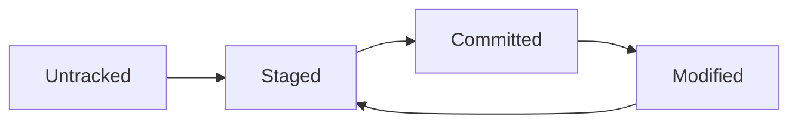

---

## Overview

| State     | Description                      |
| --------- | -------------------------------- |
| Untracked | Git does not know about the file |
| Staged    | Ready to be committed            |
| Committed | Stored in Git history            |
| Modified  | Changed after the last commit    |

---

# File Lifecycle Example

---

## Step 1: Create File

```text
app.py
```

Git status:

```bash
git status
```

Output:

```text
Untracked files:
  app.py
```

State:

```text
Untracked
```

---

## Step 2: Stage File

```bash
git add app.py
```

State:

```text
Staged
```

---

## Step 3: Commit File

```bash
git commit -m "Add application entry point"
```

State:

```text
Committed
```

---

## Step 4: Modify File

```python
print("Hello World")
```

State:

```text
Modified
```

---

## Step 5: Stage Again

```bash
git add app.py
```

State:

```text
Staged
```

---

## Step 6: Commit Again

```bash
git commit -m "Add greeting message"
```

State:

```text
Committed
```

---

# Understanding the Working Tree

---

## Definition

The Working Tree (or Working Directory) is where you actively edit files.

It contains:

* Source code
* Documentation
* Configuration files
* Assets

---

## Architecture

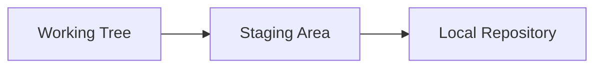

---

## Example

Project:

```text
project/
│
├── app.py
├── README.md
└── config.yaml
```

When editing:

```python
app.py
```

you are working inside the Working Tree.

---

# Understanding the Staging Area

---

## Definition

The Staging Area is a preparation area between your working directory and repository.

---

## Why It Exists

Git allows selective commits.

Without staging:

```text
All changes
↓
Commit
```

With staging:

```text
Selected changes
↓
Commit
```

---

## Workflow

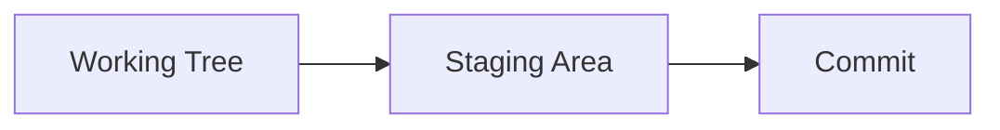

---

## Example

Modified files:

```text
app.py
README.md
debug.txt
```

Stage only:

```bash
git add app.py README.md
```

Now:

```text
app.py
README.md
```

are ready for commit.

---

# Understanding Commits

---

## Definition

A commit is a permanent snapshot of staged changes.

Think of a commit as:

```text
Save Point
```

for your project.

---

## Commit Structure

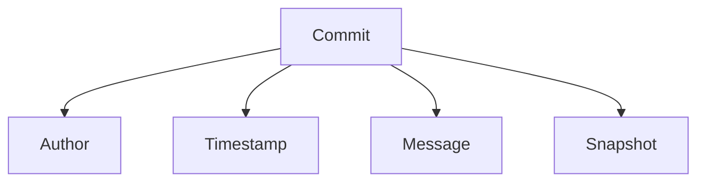

---

## Example

```bash
git commit -m "Add user authentication"
```

Creates a permanent checkpoint.

---

# The Daily Professional Workflow

---

# Step 1: Pull Latest Changes

Before writing code:

```bash
git pull
```

Purpose:

* Synchronize with team changes
* Reduce merge conflicts
* Start from the latest version

---

## Workflow

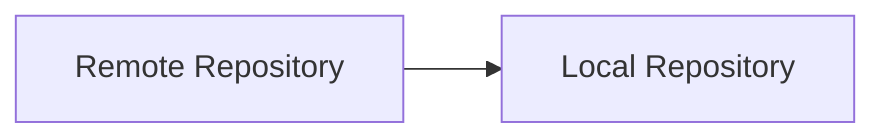

---

## Why This Matters

Suppose:

Developer A:

```text
Updated login service
```

Developer B:

```text
Updated payment service
```

Pulling ensures everyone starts from the latest state.

---

# Step 2: Create a Feature Branch

Never work directly on:

```text
main
```

Create a branch:

```bash
git checkout -b feature/user-authentication
```

---

## Why Use Branches?

Branches provide:

* Isolation
* Safety
* Easier reviews
* Better collaboration

---

## Example

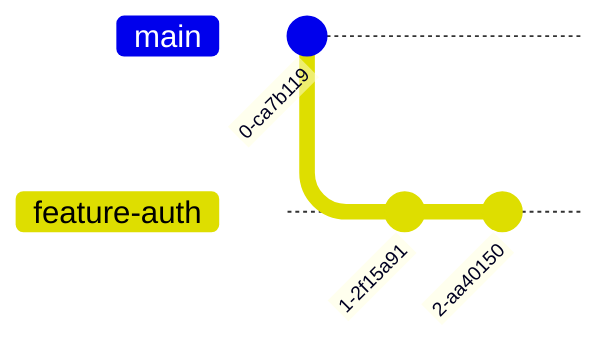

---

# Branch Naming Conventions

Examples:

```text
feature/login-page
feature/user-authentication
feature/payment-integration

bugfix/login-validation
bugfix/api-timeout

hotfix/security-patch
```

---

# Step 3: Make Changes

Work normally.

Examples:

```text
Write code
Fix bugs
Update tests
Improve documentation
```

---

## Example

Modified files:

```text
src/auth.py
tests/test_auth.py
README.md
```

---

# Step 4: Check Status

Before staging:

```bash
git status
```

Example:

```text
modified: auth.py
modified: README.md
```

---

## Why Check Status?

Prevents:

* Missing files
* Accidental commits
* Confusion

---

# Step 5: Review Changes

Inspect modifications:

```bash
git diff
```

Example:

```diff
+ Add password validation
- Remove deprecated code
```

---

## Best Practice

Always review:

```bash
git diff
```

before staging.

---

# Step 6: Stage Changes

Stage only relevant files.

Example:

```bash
git add src/auth.py
git add tests/test_auth.py
```

Or:

```bash
git add .
```

when appropriate.

---

## Workflow

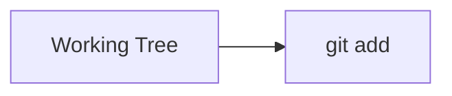

---

# Step 7: Commit Changes

Create a meaningful commit.

Example:

```bash
git commit -m "Add password validation to login service"
```

---

## Good Commit Messages

```text
Add JWT authentication support

Fix login validation bug

Improve API response handling
```

---

## Bad Commit Messages

```text
update

changes

stuff
```

---

# Step 8: Push Changes

Upload commits:

```bash
git push origin feature/user-authentication
```

---

## Workflow

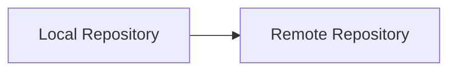

---

# Step 9: Open a Pull Request

Create a Pull Request (PR).

Purpose:

* Code review
* Automated testing
* Discussion
* Quality assurance

---

## PR Workflow

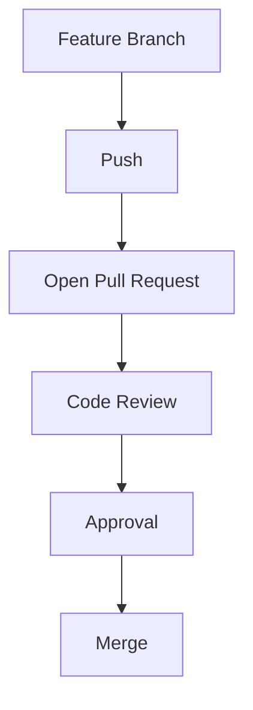

---

# Example Pull Request

Title:

```text
Add User Authentication
```

Description:

```text
Implemented JWT authentication.

Added:
- Login endpoint
- Token validation
- Unit tests

Fixes #25
```

---

# Complete Daily Workflow Diagram

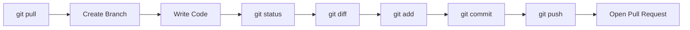

---

# Professional Team Workflow

---

## Scenario

A team of four developers.

---

### Developer A

```text
Authentication
```

---

### Developer B

```text
Payments
```

---

### Developer C

```text
Notifications
```

---

### Developer D

```text
Frontend
```

---

## Workflow

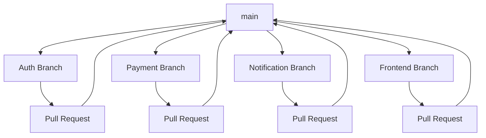

---

# Example: Professional Feature Development

---

## Morning

Update repository:

```bash
git pull origin main
```

---

## Create Branch

```bash
git checkout -b feature/email-verification
```

---

## Work

Modify:

```text
auth.py
email.py
tests/
```

---

## Review

```bash
git diff
```

---

## Stage

```bash
git add .
```

---

## Commit

```bash
git commit -m "Add email verification workflow"
```

---

## Push

```bash
git push origin feature/email-verification
```

---

## Open PR

Request review from teammates.

---

# Common Team Workflow Models

---

## Feature Branch Workflow

Most common.

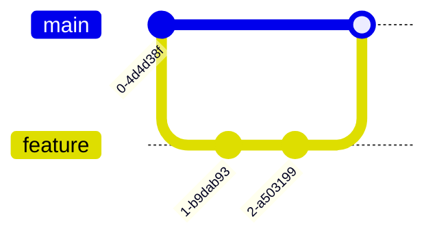

Advantages:

* Clean history
* Safe development
* Easy reviews

---

## GitHub Flow

Simple workflow.

```text
main
↓
Feature Branch
↓
Pull Request
↓
Merge
```

Suitable for:

* Startups
* Small teams
* Continuous deployment

---

## Trunk-Based Development

Short-lived branches.

```text
main
↑
Small frequent merges
```

Suitable for:

* High-performing teams
* Continuous integration environments

---

# Best Practices

---

## Pull Before Starting Work

Always begin with:

```bash
git pull
```

---

## Create Feature Branches

Avoid direct development on:

```text
main
```

---

## Commit Frequently

Good:

```text
Add login endpoint

Add validation

Add tests
```

Bad:

```text
One giant monthly commit
```

---

## Write Meaningful Commit Messages

Use:

```text
Verb + Description
```

Examples:

```text
Add payment validation

Fix API timeout issue

Refactor authentication service
```

---

## Review Changes Before Commit

Use:

```bash
git diff
```

---

## Push Regularly

Do not keep important work only locally.

---

## Keep Pull Requests Small

Smaller PRs:

* Easier reviews
* Faster feedback
* Fewer conflicts

---

# Common Mistakes

| Mistake                    | Consequence        |
| -------------------------- | ------------------ |
| Working directly on main   | Risky changes      |
| Not pulling latest changes | Merge conflicts    |
| Huge commits               | Difficult reviews  |
| Vague commit messages      | Poor history       |
| Large pull requests        | Slow reviews       |
| Skipping code review       | More bugs          |
| Ignoring git status        | Unexpected commits |

---

# Troubleshooting

---

# Problem: Push Rejected

Error:

```text
non-fast-forward
```

---

## Cause

Remote contains newer commits.

---

## Fix

```bash
git pull
git push
```

---

# Problem: Merge Conflict

Example:

```text
Both developers edited same lines.
```

---

## Fix

```bash
git status
```

Resolve conflicts manually.

Then:

```bash
git add .
git commit
```

---

# Problem: Wrong Branch

Check:

```bash
git branch
```

Switch:

```bash
git checkout correct-branch
```

---

# Problem: Forgot to Stage Files

Check:

```bash
git status
```

Stage:

```bash
git add filename
```

Commit again.

---

# Problem: Accidentally Committed Debug Code

Fix before pushing:

```bash
git restore file
```

or amend commit:

```bash
git commit --amend
```

---

# Daily Workflow Checklist

Before Starting:

```text
☐ Pull latest changes
☐ Create feature branch
```

During Development:

```text
☐ Check status
☐ Review diff
☐ Stage carefully
☐ Commit frequently
```

Before Submission:

```text
☐ Push branch
☐ Open PR
☐ Request review
☐ Verify CI passes
```

---

# Interview Questions and Answers

---

## Q1: What is the Git file lifecycle?

### Answer

Files move through states:

```text
Untracked
→ Staged
→ Committed
→ Modified
```

---

## Q2: What is the Working Tree?

### Answer

The Working Tree is the directory containing the files currently being edited.

---

## Q3: What is the purpose of the Staging Area?

### Answer

It allows developers to select specific changes before creating a commit.

---

## Q4: Why should developers use feature branches?

### Answer

Feature branches isolate work, reduce risk, and simplify reviews.

---

## Q5: What should you do before starting new work?

### Answer

Pull the latest changes from the remote repository.

```bash
git pull
```

---

## Q6: Why is `git diff` important?

### Answer

It allows developers to review changes before committing.

---

## Q7: What is a Pull Request?

### Answer

A Pull Request is a request to merge changes into another branch after review and validation.

---

## Q8: Why are small commits preferred?

### Answer

They are easier to understand, review, test, and revert if necessary.

---

## Q9: What is the recommended workflow for teams?

### Answer

Feature Branch Workflow:

```text
Create Branch
→ Develop
→ Commit
→ Push
→ Pull Request
→ Merge
```

---

## Q10: Why should developers avoid working directly on `main`?

### Answer

Direct changes to `main` increase the risk of introducing bugs and breaking production code.

---

# Chapter Summary

In this chapter, you learned the complete Daily Git Workflow used by professional software teams.

Key takeaways:

* Files move through a lifecycle of Untracked, Staged, Committed, and Modified states.
* The Working Tree contains active development files.
* The Staging Area prepares changes for commits.
* Commits create permanent project snapshots.
* A professional workflow begins by pulling the latest changes.
* Development should occur on feature branches rather than directly on `main`.
* Changes should be reviewed using `git status` and `git diff`.
* Commits should be small, focused, and meaningful.
* Changes are shared by pushing branches and opening Pull Requests.
* Code reviews and CI validation are essential parts of modern team workflows.

Mastering this workflow provides the foundation for effective collaboration and prepares you for advanced Git topics such as branching strategies, merging, rebasing, conflict resolution, and release management.
