# Git Architecture and Internal Concepts

---

# Learning Objectives

By the end of this chapter, you will understand:

* How Git is structured internally
* What a repository really contains
* The roles of the Working Directory, Staging Area, and Repository
* The complete Git workflow
* How Git stores data internally
* Git's object model
* Blob, Tree, Commit, and Tag objects
* SHA hashing and object identification
* Directed Acyclic Graphs (DAGs)
* Commit relationships and history traversal
* Best practices for working with Git efficiently
* Common mistakes and troubleshooting techniques

---

# Introduction

Many beginners think Git simply stores file versions.

In reality, Git is a sophisticated content-addressable database that tracks snapshots of a project through a graph of interconnected objects.

Understanding Git's internal architecture helps you:

* Use Git confidently
* Resolve complex issues
* Understand branching and merging
* Perform advanced Git operations
* Succeed in technical interviews

---

# High-Level Git Architecture

Git consists of several major components:

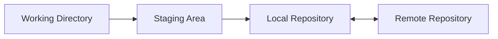

Each component has a specific purpose.

---

# Repository

---

## What Is a Repository?

A repository (repo) is a Git-managed project that contains:

* Files
* Directories
* Commit history
* Branches
* Tags
* Configuration

A repository is the complete history of a project.

---

## Example

```text
my-project/
│
├── src/
├── docs/
├── README.md
│
└── .git/
```

The `.git` directory is where Git stores all repository information.

---

## Inside the `.git` Directory

```text
.git/
│
├── objects/
├── refs/
├── logs/
├── hooks/
├── config
├── HEAD
└── index
```

---

## Purpose of a Repository

A repository allows Git to:

* Track changes
* Store history
* Create branches
* Merge work
* Recover previous versions

---

# Working Directory

---

## Definition

The Working Directory is the folder where you actively edit files.

Think of it as:

> Your current workspace.

---

## Example

```text
project/
│
├── app.py
├── README.md
└── requirements.txt
```

You edit these files directly.

---

## Characteristics

| Property                     | Description |
| ---------------------------- | ----------- |
| Editable                     | Yes         |
| Visible                      | Yes         |
| Stores current changes       | Yes         |
| Tracked by Git automatically | No          |

Git only notices changes.

You must explicitly tell Git what to save.

---

## Visual Representation

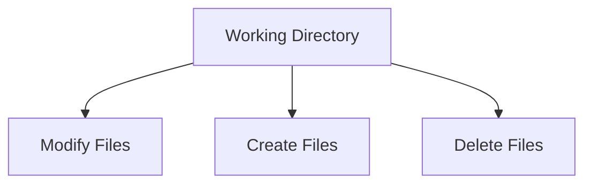

---

# Staging Area

---

## Definition

The Staging Area is an intermediate layer between your working directory and repository.

Also called:

```text
Index
```

---

## Why It Exists

Git allows you to choose exactly which changes belong in the next commit.

Without staging:

```text
All changes
↓
Commit
```

With staging:

```text
Selected changes
↓
Commit
```

---

## Example

You modified:

```text
app.py
README.md
config.json
```

You only want:

```text
app.py
README.md
```

in the next commit.

Stage them:

```bash
git add app.py README.md
```

Now only those files are committed.

---

## Workflow

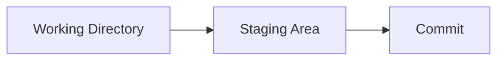

---

## Benefits

| Benefit              | Description                |
| -------------------- | -------------------------- |
| Selective commits    | Choose specific files      |
| Cleaner history      | Better commit organization |
| Easier reviews       | Smaller commits            |
| Better collaboration | Focused changes            |

---

# Local Repository

---

## Definition

The Local Repository stores commit history on your machine.

Located inside:

```text
.git/
```

---

## Contains

* Commits
* Trees
* Blobs
* Tags
* Branches
* References

---

## Example

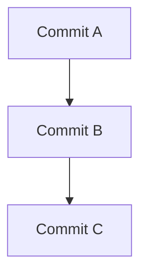

All commits are stored locally.

---

## Key Advantage

You can work without internet.

```bash
git commit
git branch
git log
```

All work offline.

---

# Remote Repository

---

## Definition

A Remote Repository is a repository hosted elsewhere.

Examples:

* GitHub
* GitLab
* Bitbucket
* Self-hosted Git server

---

## Purpose

Used for:

* Collaboration
* Backup
* Code sharing
* CI/CD integration

---

## Example

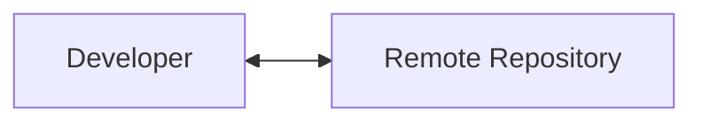

---

## Common Operations

### Upload

```bash
git push
```

### Download

```bash
git pull
```

### Fetch

```bash
git fetch
```

---

# Complete Git Workflow

---

## Overview

Git workflow follows a three-stage model.


---

# Step 1: Modify Files

You edit files.

```text
app.py modified
```

State:

```text
Untracked or Modified
```

---

# Step 2: Stage Files

```bash
git add app.py
```

State:

```text
Staged
```

---

# Step 3: Commit

```bash
git commit -m "Add login validation"
```

State:

```text
Saved in repository
```

---

# Step 4: Push

```bash
git push
```

State:

```text
Uploaded to remote
```

---

## Complete Workflow Diagram

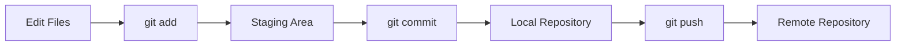

---

# Git Object Model

---

# Introduction

Git stores everything as objects.

Git's database consists of four object types:

| Object | Purpose             |
| ------ | ------------------- |
| Blob   | File contents       |
| Tree   | Directory structure |
| Commit | Snapshot metadata   |
| Tag    | Named reference     |

---

## Object Relationships

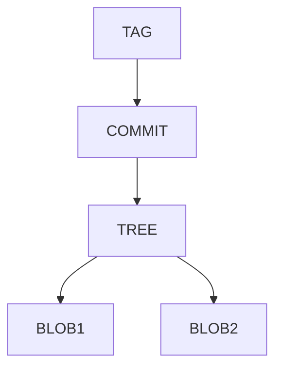

---

# Blob Object

---

## Definition

Blob means:

```text
Binary Large Object
```

A blob stores file contents.

---

## Example

File:

```python
print("Hello")
```

Git stores:

```text
Blob Object
```

containing:

```python
print("Hello")
```

---

## Important

A blob contains:

* File content

A blob does NOT contain:

* Filename
* Directory name
* Permissions

---

## Example

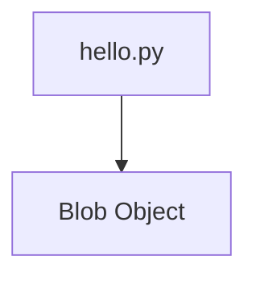

---

# Tree Object

---

## Definition

A tree represents a directory.

---

## Stores

* Filenames
* Directory names
* References to blobs
* References to other trees

---

## Example Directory

```text
project/
│
├── app.py
└── docs/
    └── guide.md
```

---

## Tree Structure

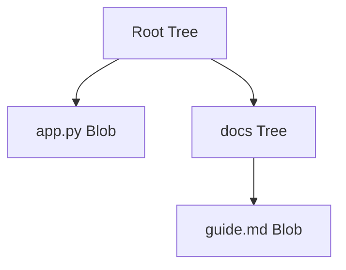

---

# Commit Object

---

## Definition

A commit is a snapshot of the repository at a specific point in time.

---

## Stores

| Item           | Stored? |
| -------------- | ------- |
| Tree reference | Yes     |
| Author         | Yes     |
| Committer      | Yes     |
| Timestamp      | Yes     |
| Message        | Yes     |
| Parent commit  | Yes     |

---

## Commit Structure

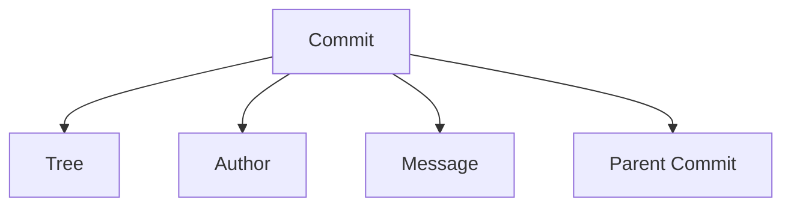

---

## Example

```text
Commit:
"Add authentication"

Author:
Alice

Date:
2026-06-10
```

---

# Tag Object

---

## Definition

A tag is a named reference to a commit.

---

## Example

```text
v1.0
v2.0
v3.0
```

---

## Visual Representation

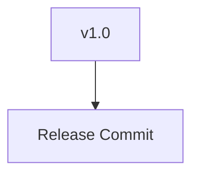

---

## Use Cases

* Releases
* Milestones
* Stable versions

---

# SHA Hashing

---

# What Is SHA?

SHA stands for:

```text
Secure Hash Algorithm
```

Git identifies every object using a hash.

---

## Example

```text
f7b3c91a8d24f7f8f8c8c1f7d1b9e2c3d4e5f6a7
```

---

## Why Hashes Matter

Git uses hashes to:

* Identify objects
* Detect corruption
* Ensure integrity

---

## Properties

| Property      | Description                     |
| ------------- | ------------------------------- |
| Unique        | Extremely unlikely to duplicate |
| Deterministic | Same input = same hash          |
| Fast          | Efficient lookup                |
| Secure        | Detects modifications           |

---

## Example

Content:

```text
Hello
```

Hash:

```text
abc123...
```

Change content:

```text
Hello!
```

Hash:

```text
xyz789...
```

Completely different.

---

# Content Addressable Storage

Git stores objects by content.

Not by filename.

```text
Content
↓
SHA Hash
↓
Object Storage
```

---

## Architecture

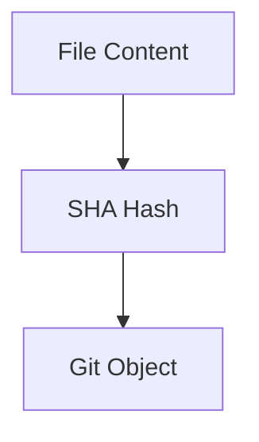

---

# Directed Acyclic Graph (DAG)

---

# What Is a DAG?

Git history is stored as a:

```text
Directed Acyclic Graph
```

---

## Directed

Each commit points to parent commits.

```text
Commit C → Commit B → Commit A
```

---

## Acyclic

History cannot loop back.

Invalid:

```text
A → B → C → A
```

Git prevents this.

---

## Graph

Commits form a graph structure.

---

## Example

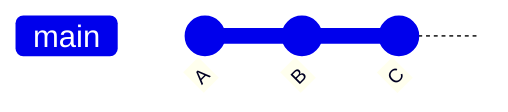

---

# Commit Relationships

---

## Parent Commit

Every commit points to its parent.


Relationships:

```text
C parent = B
B parent = A
```

---

# Merge Commits

A merge commit has multiple parents.

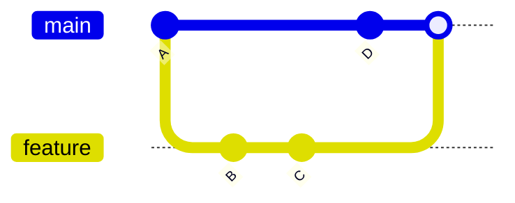

---

## Merge Structure

```text
Merge Commit
├── Parent 1
└── Parent 2
```

---

# Commit Graph Example

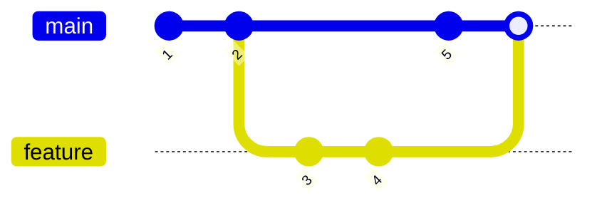

Git traverses this graph to:

* Build history
* Compare branches
* Merge changes

---

# Internal Git Architecture

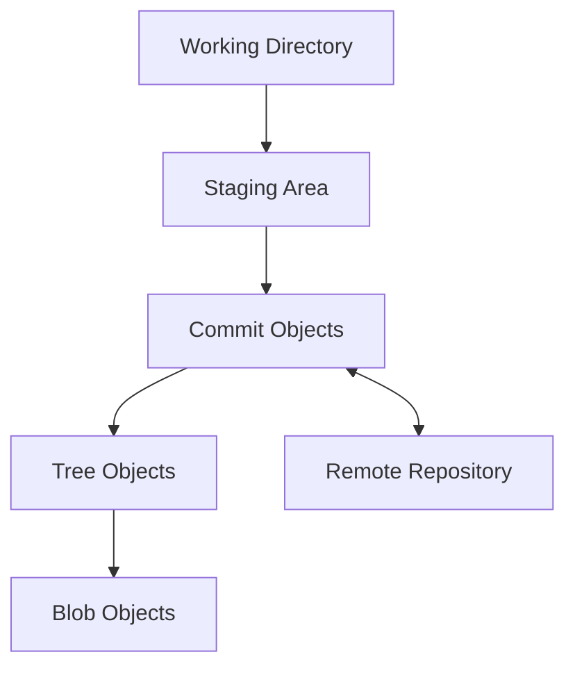

---

# Practical Example

Suppose:

```text
README.md
```

contains:

```text
Git Notes
```

---

## Git Stores

### Blob

```text
Git Notes
```

### Tree

```text
README.md → Blob
```

### Commit

```text
Author
Message
Timestamp
Tree Reference
```

### Branch

```text
main → Commit
```

---

# Best Practices

---

## Create Small Commits

Good:

```text
Add login validation
```

Bad:

```text
Everything from last month
```

---

## Stage Carefully

Use:

```bash
git status
```

before committing.

---

## Write Meaningful Messages

Good:

```text
Fix null pointer exception in login service
```

Bad:

```text
update
```

---

## Tag Releases

Use tags for:

```text
v1.0
v2.0
v3.0
```

---

## Push Frequently

Avoid keeping important commits only locally.

---

# Common Mistakes

| Mistake                    | Problem               |
| -------------------------- | --------------------- |
| Forgetting git add         | Changes not committed |
| Huge commits               | Hard to review        |
| Committing generated files | Repository bloat      |
| Force pushing carelessly   | Lost history          |
| Working directly on main   | Increased risk        |
| Ignoring git status        | Unexpected commits    |

---

# Troubleshooting

---

## Problem: Commit Missing Changes

### Cause

File not staged.

### Check

```bash
git status
```

### Fix

```bash
git add .
git commit
```

---

## Problem: Cannot Push

### Cause

Remote has newer commits.

### Fix

```bash
git pull
git push
```

---

## Problem: Wrong File Committed

### Fix

```bash
git restore --staged filename
```

before committing.

---

## Problem: Large Repository

### Causes

* Binary files
* Build artifacts
* Logs

### Fix

Use:

```text
.gitignore
```

---

# Interview Questions and Answers

---

## Q1: What is the Staging Area?

### Answer

The staging area is an intermediate layer where selected changes are prepared before being committed.

---

## Q2: What is the difference between Working Directory and Repository?

### Answer

The working directory contains editable files, while the repository stores committed snapshots and history.

---

## Q3: What are Git objects?

### Answer

Git stores data as Blob, Tree, Commit, and Tag objects.

---

## Q4: What is a Blob?

### Answer

A blob stores file content only and does not store filenames.

---

## Q5: What is a Tree?

### Answer

A tree represents directory structure and references blobs and other trees.

---

## Q6: What is a Commit Object?

### Answer

A commit object stores metadata, parent references, and a tree snapshot.

---

## Q7: Why does Git use SHA hashes?

### Answer

To uniquely identify objects and ensure data integrity.

---

## Q8: What is a DAG?

### Answer

A Directed Acyclic Graph representing commit history where commits point to parents and cycles are impossible.

---

## Q9: What is Content Addressable Storage?

### Answer

Git stores objects based on the hash of their content rather than filenames.

---

## Q10: What is the difference between Local and Remote Repository?

### Answer

The local repository exists on a developer's machine, while the remote repository is hosted on a server for collaboration and backup.

---

# Chapter Summary

Git is a distributed version control system built around a content-addressable object database.

Key concepts covered:

* Repository stores project history and metadata.
* Working Directory contains actively edited files.
* Staging Area prepares selected changes for commits.
* Local Repository stores complete project history.
* Remote Repository enables collaboration and backup.
* Git stores data as Blob, Tree, Commit, and Tag objects.
* SHA hashes uniquely identify every object.
* Git history is represented as a Directed Acyclic Graph (DAG).
* Commits reference parents, creating a navigable history graph.
* Understanding Git internals makes branching, merging, debugging, and advanced Git operations significantly easier.

The next chapter will explore Git installation, configuration, repository initialization, and the essential commands every developer uses daily.
