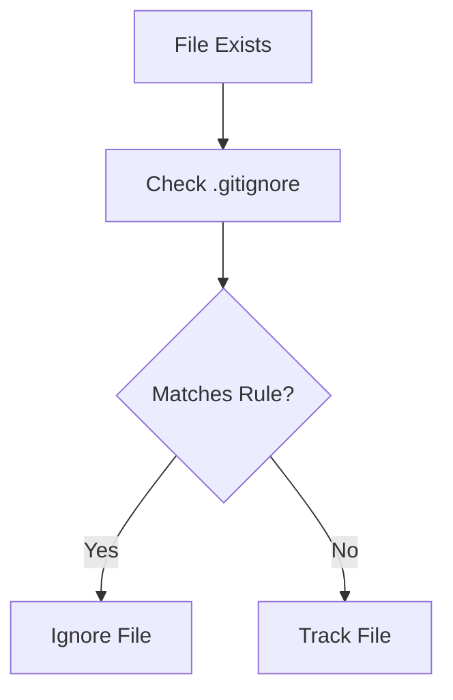

# Understanding `.gitignore`

---

# Learning Objectives

By the end of this chapter, you will understand:

* What a `.gitignore` file is
* Why `.gitignore` exists
* How Git processes ignore rules
* Pattern matching syntax
* Wildcards and special characters
* Negation rules
* Directory-specific ignore behavior
* Global Git ignore files
* Language-specific `.gitignore` examples
* Best practices for maintaining clean repositories
* Common mistakes and troubleshooting techniques

---

# Introduction

One of the most common beginner mistakes in Git is accidentally committing files that should never be stored in a repository.

Examples include:

* Temporary files
* Build artifacts
* Dependency directories
* IDE settings
* Logs
* Cache files
* Secrets and credentials

Git provides the `.gitignore` file to prevent such files from being tracked.

---

# What Is `.gitignore`?

A `.gitignore` file tells Git which files and directories should be ignored when looking for changes.

In simple terms:

> `.gitignore` is a list of files and folders that Git should not track.

---

## Example

Project structure:

```text
my-project/
│
├── app.py
├── README.md
├── logs/
│   └── app.log
│
└── .gitignore
```

`.gitignore`

```gitignore
logs/
```

Git ignores:

```text
logs/app.log
```

while still tracking:

```text
app.py
README.md
```

---

# Why Does `.gitignore` Exist?

Without `.gitignore`, repositories quickly become cluttered.

---

## Problem 1: Build Files

Compilers generate files automatically.

Example:

```text
target/
dist/
build/
```

These files can be recreated.

They do not belong in source control.

---

## Problem 2: Dependencies

Example:

```text
node_modules/
```

A project may contain:

```text
500,000+ files
```

Tracking them would dramatically increase repository size.

---

## Problem 3: Logs

Example:

```text
application.log
```

Logs change constantly and are usually machine-specific.

---

## Problem 4: IDE Settings

Example:

```text
.vscode/
.idea/
```

These are personal development preferences.

---

## Problem 5: Secrets

Examples:

```text
.env
secrets.json
credentials.txt
```

Accidentally committing these can create severe security issues.

---

# Where Does `.gitignore` Live?

Typically in the repository root:

```text
project/
│
├── .gitignore
├── README.md
├── src/
└── docs/
```

---

## Example

```text
project/
│
├── .gitignore
│
├── src/
│   └── app.py
│
└── logs/
    └── app.log
```

---

# How Git Uses `.gitignore`

Git checks ignore rules whenever it scans files.

Workflow:



---

# Important Rule

`.gitignore` only affects untracked files.

If a file is already tracked:

```text
Git continues tracking it.
```

Even if you later add it to `.gitignore`.

---

## Example

Tracked file:

```text
config.json
```

Later:

```gitignore
config.json
```

Git still tracks it.

---

## Solution

Remove from tracking:

```bash
git rm --cached config.json
```

Commit:

```bash
git commit -m "Stop tracking config.json"
```

---

# Basic `.gitignore` Syntax

---

# Ignore a Single File

```gitignore
secret.txt
```

Ignores:

```text
secret.txt
```

---

# Ignore Multiple Files

```gitignore
secret.txt
password.txt
config.json
```

---

# Ignore a Directory

```gitignore
logs/
```

Ignores:

```text
logs/
logs/error.log
logs/debug.log
```

---

# Ignore a File Extension

```gitignore
*.log
```

Ignores:

```text
app.log
error.log
server.log
```

---

# Pattern Matching Rules

Git uses pattern matching to determine what should be ignored.

---

# Rule 1: Exact Match

```gitignore
file.txt
```

Matches:

```text
file.txt
```

---

# Rule 2: Directory Match

```gitignore
temp/
```

Matches:

```text
temp/
temp/file.txt
```

---

# Rule 3: Extension Match

```gitignore
*.log
```

Matches:

```text
server.log
debug.log
```

---

# Rule 4: Prefix Match

```gitignore
temp*
```

Matches:

```text
temp
temp1
temp_backup
```

---

# Rule 5: Suffix Match

```gitignore
*backup
```

Matches:

```text
backup
dbbackup
dailybackup
```

---

# Wildcards

Wildcards make ignore rules more flexible.

---

# Asterisk (`*`)

Matches zero or more characters.

Rule:

```gitignore
*.tmp
```

Matches:

```text
a.tmp
b.tmp
cache.tmp
```

---

# Question Mark (`?`)

Matches exactly one character.

Rule:

```gitignore
file?.txt
```

Matches:

```text
file1.txt
file2.txt
```

Does not match:

```text
file10.txt
```

---

# Double Asterisk (`**`)

Matches directories recursively.

Rule:

```gitignore
**/logs
```

Matches:

```text
logs/
app/logs/
src/main/logs/
```

---

# Character Ranges

Rule:

```gitignore
file[0-9].txt
```

Matches:

```text
file1.txt
file5.txt
file9.txt
```

---

# Anchoring Rules

---

## Root-Level Match

Rule:

```gitignore
/config.json
```

Matches:

```text
project/config.json
```

Does not match:

```text
project/src/config.json
```

---

## Recursive Match

Rule:

```gitignore
config.json
```

Matches:

```text
config.json
src/config.json
nested/config.json
```

---

# Negation Rules

Negation allows exceptions.

Syntax:

```gitignore
!
```

---

## Example

Ignore all logs:

```gitignore
*.log
```

Except:

```gitignore
!important.log
```

---

Result:

Ignored:

```text
debug.log
error.log
```

Tracked:

```text
important.log
```

---

## Example with Directories

Ignore everything:

```gitignore
*
```

Allow README:

```gitignore
!README.md
```

Only:

```text
README.md
```

remains visible to Git.

---

# Processing Order

Git processes rules from top to bottom.

Later rules override earlier rules.

Example:

```gitignore
*.log
!important.log
```

Result:

| File          | Result  |
| ------------- | ------- |
| error.log     | Ignored |
| debug.log     | Ignored |
| important.log | Tracked |

---

# Real-World Examples

---

# Python Projects

Common Python `.gitignore`

```gitignore
__pycache__/
*.pyc
*.pyo
*.pyd

venv/
env/
.venv/

.pytest_cache/

coverage.xml
htmlcov/

.env

.idea/
.vscode/
```

---

## Why?

| Pattern          | Reason              |
| ---------------- | ------------------- |
| `__pycache__/`   | Python cache        |
| `*.pyc`          | Compiled bytecode   |
| `venv/`          | Virtual environment |
| `.env`           | Secrets             |
| `.pytest_cache/` | Test cache          |

---

# Java Projects

```gitignore
*.class

target/

build/

*.jar
*.war
*.ear

.idea/
.vscode/
```

---

# Node.js Projects

```gitignore
node_modules/

npm-debug.log

yarn-error.log

dist/

coverage/

.env
```

---

## Why Ignore `node_modules`?

Dependencies can be recreated using:

```bash
npm install
```

Tracking them wastes space.

---

# React Projects

```gitignore
node_modules/

build/

coverage/

.env

.env.local

.cache/
```

---

# Angular Projects

```gitignore
node_modules/

dist/

.angular/

coverage/

.env
```

---

# Spring Boot Projects

```gitignore
target/

*.class

*.jar

*.war

logs/

application-local.properties

.idea/
```

---

# Docker Projects

```gitignore
.env

logs/

tmp/

cache/

docker-data/
```

---

## Example

Avoid committing:

```text
docker-data/
```

because it may contain:

* Database files
* Volumes
* Temporary containers

---

# Combining Rules

Example:

```gitignore
logs/

*.log

*.tmp

!important.log

node_modules/

.env
```

Result:

| File          | Outcome |
| ------------- | ------- |
| error.log     | Ignored |
| debug.log     | Ignored |
| important.log | Tracked |
| app.tmp       | Ignored |
| .env          | Ignored |
| node_modules/ | Ignored |

---

# Global Git Ignore

Sometimes files should be ignored across all repositories.

Examples:

```text
.DS_Store
Thumbs.db
*.swp
```

---

# Why Use a Global Ignore?

These files are machine-specific.

You never want them committed.

---

# Create Global Ignore File

Linux/macOS:

```bash
touch ~/.gitignore_global
```

Windows:

```powershell
New-Item ~/.gitignore_global
```

---

# Configure Git

```bash
git config --global core.excludesfile ~/.gitignore_global
```

---

# Example Global Ignore

```gitignore
.DS_Store

Thumbs.db

*.swp

*.tmp

.vscode/
```

---

# Verify Configuration

```bash
git config --global core.excludesfile
```

Output:

```text
~/.gitignore_global
```

---

# Common Mistakes

---

## Committing Secrets

Bad:

```text
.env
```

contains:

```text
DATABASE_PASSWORD=secret
```

Always ignore secret files.

---

## Ignoring Tracked Files

Adding:

```gitignore
config.json
```

does not stop tracking.

Must use:

```bash
git rm --cached config.json
```

---

## Ignoring Too Much

Bad:

```gitignore
*
```

May hide important files.

---

## Committing Dependencies

Bad:

```text
node_modules/
```

committed to repository.

Creates:

* Huge repositories
* Slow clones
* Large pull requests

---

## Ignoring Build Artifacts Too Late

Generated files may already exist in history.

---

# Troubleshooting

---

# Problem: File Still Appears in Git

Check:

```bash
git status
```

If already tracked:

```bash
git rm --cached filename
```

---

# Problem: Rule Not Working

Verify matching:

```bash
git check-ignore -v filename
```

Example:

```bash
git check-ignore -v app.log
```

Output:

```text
.gitignore:5:*.log
```

Shows which rule matched.

---

# Problem: Directory Not Ignored

Wrong:

```gitignore
logs
```

Preferred:

```gitignore
logs/
```

---

# Problem: Negation Not Working

Example:

```gitignore
logs/
!important.log
```

Git cannot re-include a file inside a fully ignored directory.

Need:

```gitignore
logs/*
!logs/important.log
```

---

# Best Practices

---

## Ignore Early

Create `.gitignore` before the first commit.

---

## Never Commit Secrets

Ignore:

```gitignore
.env
*.pem
*.key
credentials.json
```

---

## Use Language-Specific Templates

Each language has common patterns.

Use proven templates as a starting point.

---

## Keep Rules Organized

Example:

```gitignore
# Dependencies
node_modules/

# Logs
*.log

# Environment
.env

# Build
dist/
```

---

## Use a Global Ignore

Store machine-specific files globally.

---

## Review Before Committing

Always check:

```bash
git status
```

before:

```bash
git add .
```

---

# `.gitignore` Cheat Sheet

| Pattern          | Meaning                   |
| ---------------- | ------------------------- |
| `file.txt`       | Ignore file               |
| `*.log`          | Ignore log files          |
| `logs/`          | Ignore directory          |
| `temp*`          | Ignore prefix             |
| `*backup`        | Ignore suffix             |
| `file?.txt`      | Single-character match    |
| `**/logs`        | Recursive directory match |
| `!important.log` | Negation rule             |
| `/config.json`   | Root-only file            |

---

# Interview Questions and Answers

---

## Q1: What is `.gitignore`?

### Answer

A file that defines which files and directories Git should ignore when scanning for changes.

---

## Q2: Does `.gitignore` affect tracked files?

### Answer

No. It only affects untracked files.

---

## Q3: How do you stop tracking a file already committed?

### Answer

```bash
git rm --cached filename
```

Then commit the change.

---

## Q4: What does `*.log` mean?

### Answer

Ignore all files ending in `.log`.

---

## Q5: What does `logs/` mean?

### Answer

Ignore the entire `logs` directory and its contents.

---

## Q6: What does `!important.log` do?

### Answer

It re-includes `important.log` after a previous ignore rule.

---

## Q7: What is a global gitignore?

### Answer

A Git ignore file that applies to all repositories on a machine.

---

## Q8: How do you configure a global gitignore?

### Answer

```bash
git config --global core.excludesfile ~/.gitignore_global
```

---

## Q9: What command helps debug ignore rules?

### Answer

```bash
git check-ignore -v filename
```

---

## Q10: Why should `node_modules/` be ignored?

### Answer

Because dependencies can be regenerated and tracking them makes repositories unnecessarily large.

---

# Chapter Summary

In this chapter, you learned:

* `.gitignore` controls which files Git should ignore.
* It prevents unnecessary, generated, temporary, and sensitive files from being tracked.
* Git uses pattern matching rules including wildcards, ranges, and recursive matching.
* Negation rules (`!`) allow exceptions to ignore patterns.
* `.gitignore` affects only untracked files.
* Global ignore files provide machine-wide ignore behavior.
* Different ecosystems such as Python, Java, Node.js, React, Angular, Spring Boot, and Docker have common ignore patterns.
* Tools such as `git check-ignore -v` help troubleshoot ignore issues.
* A well-maintained `.gitignore` keeps repositories clean, secure, and efficient.

A properly configured `.gitignore` is one of the simplest yet most important practices for maintaining professional Git repositories.
