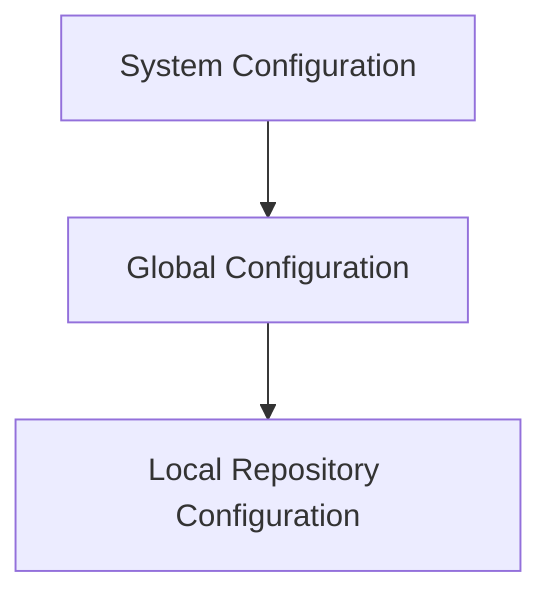
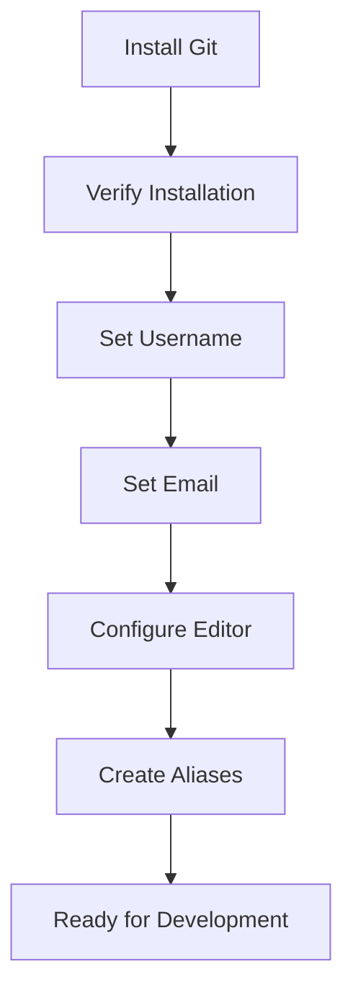

# Installing and Configuring Git

---

# Learning Objectives

By the end of this chapter, you will be able to:

* Install Git on Linux, macOS, and Windows
* Verify Git installation
* Understand Git configuration levels
* Configure Git for first-time use
* Set username and email
* Configure editors
* Create Git aliases
* Inspect and manage configuration settings
* Troubleshoot common installation and configuration issues
* Follow Git configuration best practices

---

# Introduction

Installing Git is the first step toward using version control effectively.

A proper Git setup includes:

1. Installing Git
2. Verifying the installation
3. Configuring your identity
4. Choosing a text editor
5. Setting useful defaults
6. Creating productivity-enhancing aliases

A well-configured Git environment improves productivity and prevents common collaboration issues.

---

# Installing Git

---

# Installing Git on Linux

Most Linux distributions provide Git through their package managers.

---

## Verify Whether Git Is Already Installed

Before installing Git, check whether it already exists:

```bash
git --version
```

Example output:

```text
git version 2.49.0
```

If Git is installed, you can proceed to configuration.

If not, install it using your distribution's package manager.

---

# Installing Git on Ubuntu

Ubuntu uses the APT package manager.

---

## Update Package Lists

```bash
sudo apt update
```

---

## Install Git

```bash
sudo apt install git
```

---

## Verify Installation

```bash
git --version
```

Example:

```text
git version 2.49.0
```

---

## Complete Example

```bash
sudo apt update
sudo apt install git
git --version
```

---

# Installing Git on Debian

Debian installation is similar to Ubuntu.

---

## Update Package Index

```bash
sudo apt update
```

---

## Install Git

```bash
sudo apt install git
```

---

## Verify

```bash
git --version
```

---

# Installing Git on Fedora

Fedora uses the DNF package manager.

---

## Install Git

```bash
sudo dnf install git
```

---

## Verify

```bash
git --version
```

---

## Example

```bash
sudo dnf install git
git --version
```

---

# Installing Git on Arch Linux

Arch Linux uses Pacman.

---

## Install Git

```bash
sudo pacman -S git
```

---

## Verify

```bash
git --version
```

---

## Example

```bash
sudo pacman -S git
git --version
```

---

# Linux Installation Summary

| Distribution | Command                |
| ------------ | ---------------------- |
| Ubuntu       | `sudo apt install git` |
| Debian       | `sudo apt install git` |
| Fedora       | `sudo dnf install git` |
| Arch Linux   | `sudo pacman -S git`   |

---

# Installing Git on macOS

There are multiple ways to install Git on macOS.

---

## Method 1: Using Homebrew

Recommended for developers.

### Install Git

```bash
brew install git
```

---

### Verify

```bash
git --version
```

---

## Method 2: Xcode Command Line Tools

Install Apple's development tools:

```bash
xcode-select --install
```

Git is included.

---

## Verify

```bash
git --version
```

---

# Installing Git on Windows

Git for Windows provides:

* Git CLI
* Git Bash
* SSH tools
* Unix-like utilities

---

## Download Installer

Download Git for Windows from the official Git website.

---

## Run Installer

Accept default options if you are a beginner.

Recommended settings:

| Option           | Recommendation       |
| ---------------- | -------------------- |
| Editor           | VS Code or Vim       |
| PATH Integration | Recommended          |
| HTTPS Transport  | OpenSSL              |
| Line Endings     | Recommended defaults |

---

## Verify Installation

Open:

```text
Git Bash
```

or

```text
Command Prompt
```

Run:

```bash
git --version
```

Example:

```text
git version 2.49.0.windows.1
```

---

# Verifying Installation

Regardless of platform:

```bash
git --version
```

Expected:

```text
git version X.Y.Z
```

---

## Additional Verification

Check executable path:

Linux/macOS:

```bash
which git
```

Windows:

```powershell
where git
```

Example:

```text
/usr/bin/git
```

---

# First-Time Git Setup

After installation, Git must know who you are.

Every commit records:

* Author name
* Email address

---

## Why This Matters

Commit metadata contains:

```text
Author Name
Author Email
Timestamp
Commit Message
```

Example:

```text
Author: John Doe
Email: john@example.com
```

---

# Understanding Git Configuration

Git uses a hierarchical configuration system.

There are three configuration levels.

---

## Configuration Hierarchy



Priority:

```text
Local > Global > System
```

The most specific configuration wins.

---

# System Configuration

---

## Scope

Applies to:

```text
Entire Machine
All Users
```

---

## Location

Linux/macOS:

```text
/etc/gitconfig
```

Windows:

```text
Git installation directory
```

---

## Example

```bash
git config --system core.editor vim
```

Administrator permissions are usually required.

---

# Global Configuration

---

## Scope

Applies to:

```text
Current User
All Repositories
```

---

## Location

Linux/macOS:

```text
~/.gitconfig
```

Windows:

```text
C:\Users\<user>\.gitconfig
```

---

## Example

```bash
git config --global user.name "John Doe"
```

---

# Local Configuration

---

## Scope

Applies only to:

```text
Current Repository
```

---

## Location

```text
.git/config
```

---

## Example

```bash
git config user.name "Project Bot"
```

No `--global` flag means local.

---

# Configuration Levels Comparison

| Level  | Scope              | Location         |
| ------ | ------------------ | ---------------- |
| System | Entire machine     | `/etc/gitconfig` |
| Global | Current user       | `~/.gitconfig`   |
| Local  | Current repository | `.git/config`    |

---

# Setting Username

Git records your name in commits.

---

## Global Username

```bash
git config --global user.name "John Doe"
```

---

## Verify

```bash
git config --global user.name
```

Output:

```text
John Doe
```

---

# Setting Email

Git records your email address in commits.

---

## Global Email

```bash
git config --global user.email "john@example.com"
```

---

## Verify

```bash
git config --global user.email
```

---

# Example Complete Setup

```bash
git config --global user.name "John Doe"
git config --global user.email "john@example.com"
```

---

# Viewing Configuration

---

## Show All Settings

```bash
git config --list
```

Example:

```text
user.name=John Doe
user.email=john@example.com
core.editor=code --wait
```

---

## Show Source Locations

```bash
git config --list --show-origin
```

Example:

```text
file:/home/user/.gitconfig
user.name=John Doe
```

---

# Configuring the Default Editor

Git opens an editor for:

* Commit messages
* Interactive rebases
* Merge messages

---

# Visual Studio Code

Recommended for most users.

```bash
git config --global core.editor "code --wait"
```

---

# Vim

```bash
git config --global core.editor "vim"
```

---

# Nano

```bash
git config --global core.editor "nano"
```

---

# Notepad++ (Windows)

```bash
git config --global core.editor "'C:/Program Files/Notepad++/notepad++.exe' -multiInst -notabbar -nosession -noPlugin"
```

---

# Verify Editor

```bash
git config --global core.editor
```

---

# Understanding Git Aliases

Aliases create shortcuts for frequently used commands.

---

## Without Alias

```bash
git status
```

---

## With Alias

```bash
git st
```

Much faster.

---

# Creating Aliases

---

## Status Alias

```bash
git config --global alias.st status
```

Usage:

```bash
git st
```

---

## Log Alias

```bash
git config --global alias.lg log
```

Usage:

```bash
git lg
```

---

## Checkout Alias

```bash
git config --global alias.co checkout
```

Usage:

```bash
git co main
```

---

## Branch Alias

```bash
git config --global alias.br branch
```

Usage:

```bash
git br
```

---

## Commit Alias

```bash
git config --global alias.cm commit
```

Usage:

```bash
git cm -m "message"
```

---

# Useful Alias Collection

```bash
git config --global alias.st status
git config --global alias.co checkout
git config --global alias.br branch
git config --global alias.cm commit
git config --global alias.lg log
```

---

# Viewing a Specific Setting

---

## View Username

```bash
git config user.name
```

---

## View Email

```bash
git config user.email
```

---

## View Editor

```bash
git config core.editor
```

---

# Removing a Configuration

---

## Remove Global Setting

```bash
git config --global --unset user.email
```

---

## Remove Alias

```bash
git config --global --unset alias.st
```

---

# Practical First-Time Setup

A typical setup for a new developer:

```bash
git config --global user.name "Jane Developer"
git config --global user.email "jane@example.com"

git config --global core.editor "code --wait"

git config --global alias.st status
git config --global alias.co checkout
git config --global alias.br branch
git config --global alias.cm commit
git config --global alias.lg log
```

---

# Visual Configuration Flow



---

# Best Practices

---

## Use Your Real Identity

Good:

```text
John Doe
john@example.com
```

Avoid:

```text
test
test@test.com
```

---

## Configure Git Immediately

Set:

* Name
* Email
* Editor

before creating repositories.

---

## Use Global Settings

For most users:

```bash
git config --global
```

is sufficient.

---

## Keep Aliases Simple

Good:

```bash
git st
```

Avoid creating dozens of obscure aliases.

---

## Use a Modern Editor

Recommended:

* VS Code
* Vim
* Nano

Choose one you know well.

---

# Common Mistakes

| Mistake                       | Result                       |
| ----------------------------- | ---------------------------- |
| Forgetting username           | Incorrect commit metadata    |
| Forgetting email              | Commits linked incorrectly   |
| Wrong email address           | Git hosting profile mismatch |
| Misconfigured editor          | Commit message failures      |
| Using fake identities         | Poor collaboration           |
| Confusing local/global config | Unexpected settings          |

---

# Troubleshooting

---

# Problem: Git Command Not Found

Linux/macOS:

```text
git: command not found
```

### Solution

Install Git:

```bash
sudo apt install git
```

or equivalent package manager command.

---

# Problem: Wrong Username Appears

Check:

```bash
git config user.name
```

Check all sources:

```bash
git config --list --show-origin
```

---

# Problem: Wrong Email in Commits

Verify:

```bash
git config user.email
```

Correct:

```bash
git config --global user.email "new@example.com"
```

---

# Problem: Editor Does Not Open

Verify:

```bash
git config core.editor
```

Test the editor separately.

---

# Problem: Configuration Not Applying

Check precedence:

```text
Local
Global
System
```

Use:

```bash
git config --list --show-origin
```

to identify the source.

---

# Problem: Alias Not Working

Check:

```bash
git config --get alias.st
```

Expected:

```text
status
```

---

# Interview Questions and Answers

---

## Q1: How do you verify Git installation?

### Answer

```bash
git --version
```

---

## Q2: What are the three Git configuration levels?

### Answer

* System
* Global
* Local

Priority:

```text
Local > Global > System
```

---

## Q3: Where is global Git configuration stored?

### Answer

Linux/macOS:

```text
~/.gitconfig
```

Windows:

```text
C:\Users\<user>\.gitconfig
```

---

## Q4: How do you configure a username globally?

### Answer

```bash
git config --global user.name "John Doe"
```

---

## Q5: How do you configure an email globally?

### Answer

```bash
git config --global user.email "john@example.com"
```

---

## Q6: What command shows all Git configuration values?

### Answer

```bash
git config --list
```

---

## Q7: What command shows where configuration values come from?

### Answer

```bash
git config --list --show-origin
```

---

## Q8: What is the purpose of `core.editor`?

### Answer

It defines the text editor Git uses for commit messages, rebases, merges, and other editing operations.

---

## Q9: What is a Git alias?

### Answer

A shortcut that maps a custom command to an existing Git command.

Example:

```bash
git st
```

for:

```bash
git status
```

---

## Q10: Which configuration level has the highest priority?

### Answer

Local repository configuration has the highest priority.

```text
Local > Global > System
```

---

# Chapter Summary

In this chapter, you learned how to install and configure Git across major operating systems.

Key takeaways:

* Git can be installed through package managers on Linux and macOS or via Git for Windows.
* Installation should always be verified using `git --version`.
* Git uses three configuration levels: System, Global, and Local.
* The precedence order is Local > Global > System.
* Every developer should configure a username and email before creating commits.
* The default editor can be customized using `core.editor`.
* Aliases improve productivity by shortening frequently used commands.
* Configuration values can be inspected using `git config --list`.
* Understanding Git configuration is essential for proper collaboration and professional development.

The next chapter will cover repository creation, cloning, and the fundamental Git workflow used in daily software development.
