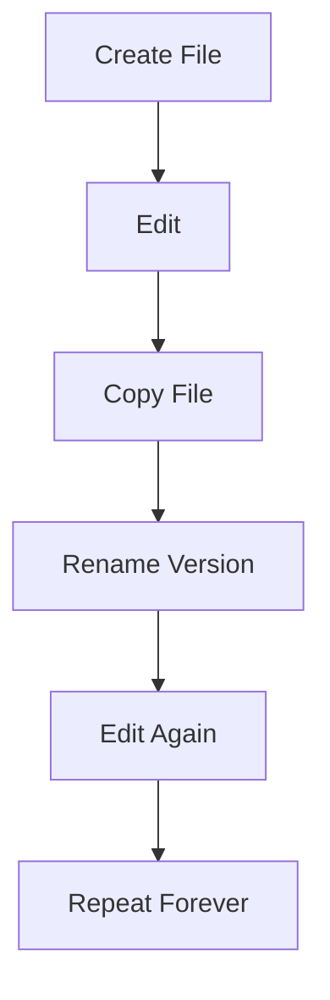
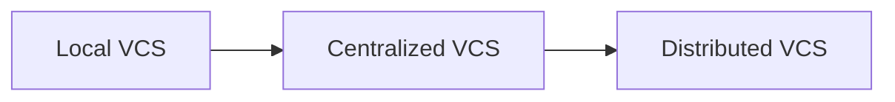
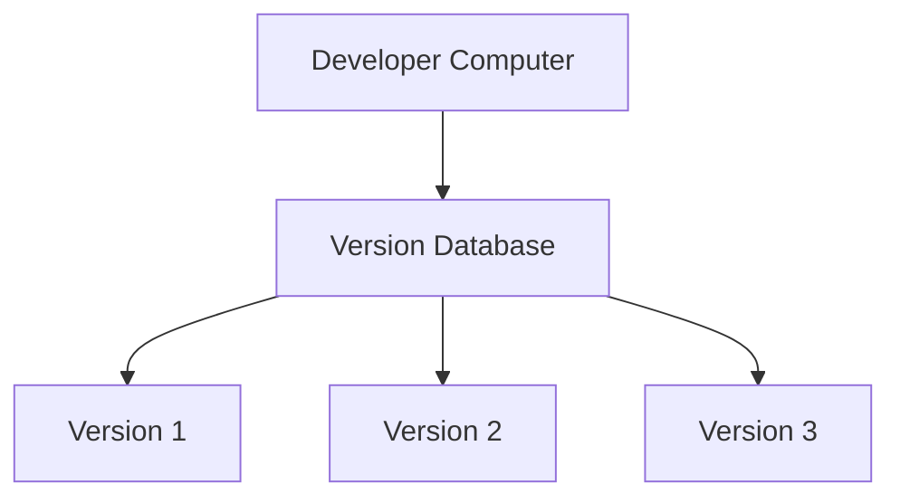
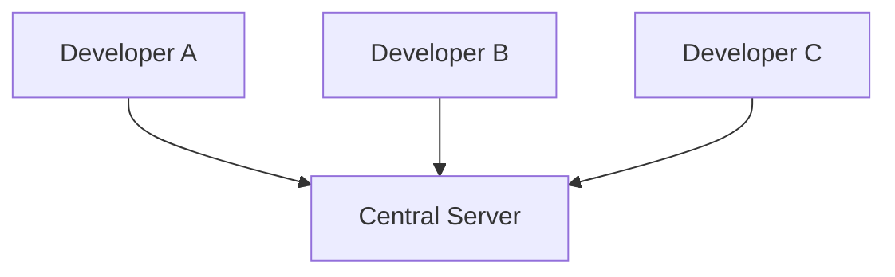
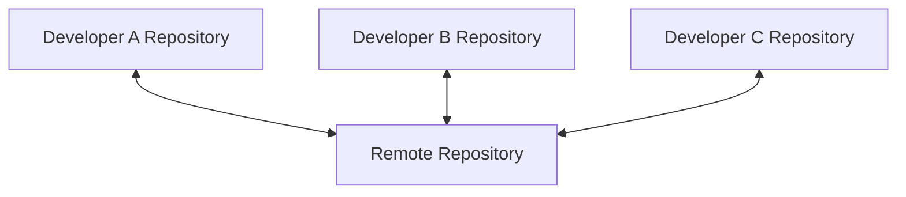
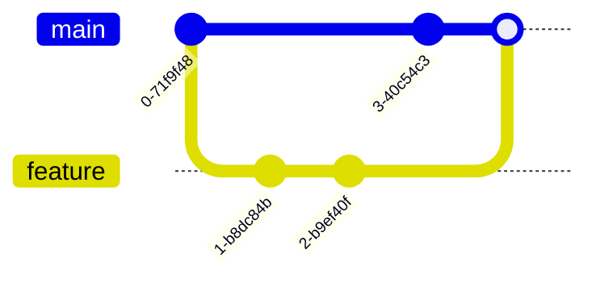
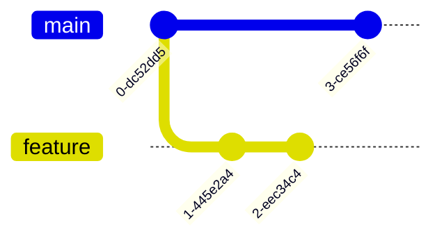
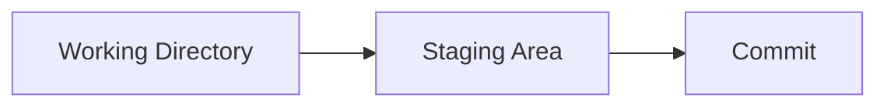
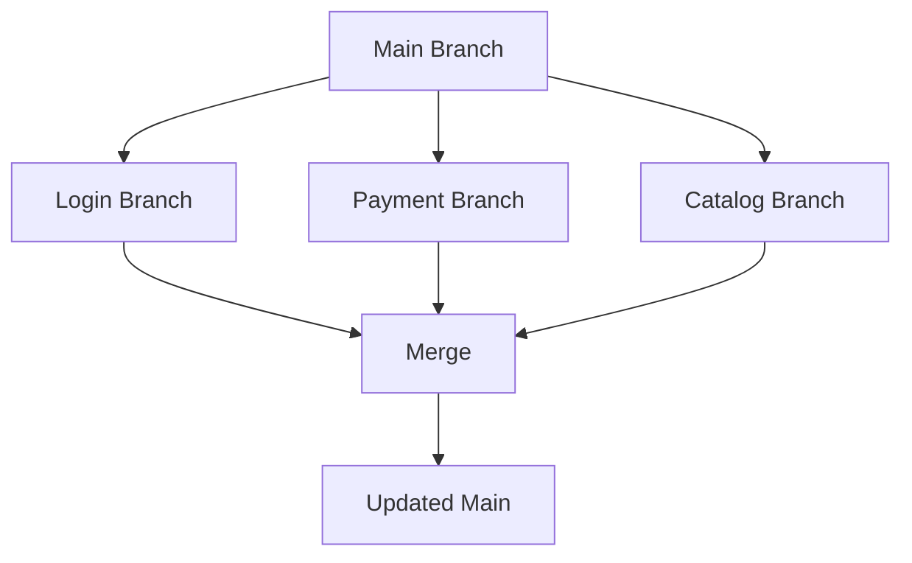

# Introduction to Git and Version Control

---

# Learning Objectives

By the end of this chapter, you will understand:

* What version control is
* Why version control systems exist
* Problems developers faced before version control
* Local Version Control Systems (LVCS)
* Centralized Version Control Systems (CVCS)
* Distributed Version Control Systems (DVCS)
* Why Git became the industry standard
* Differences between Git, SVN, and Mercurial
* Common Git terminology
* Real-world usage of Git in software development

---

# What Is Version Control?

Version Control is a system that records changes made to files over time so that specific versions can be recalled later.

Think of it as a **time machine for your files**.

Instead of manually creating copies such as:

```text
project-final.doc
project-final-v2.doc
project-final-v3.doc
project-final-v3-latest.doc
project-final-v3-latest-final.doc
```

a Version Control System (VCS) tracks every change automatically.

---

## Simple Definition

> Version Control is a tool that helps track, manage, and organize changes to files over time.

---

## Real-World Example

Imagine writing a college project report.

Day 1:

```text
report.docx
```

Day 5:

```text
report_final.docx
```

Day 10:

```text
report_final_v2.docx
```

Day 15:

```text
report_final_v2_revised.docx
```

Soon:

```text
report_final_v2_revised_latest_final_REAL.docx
```

This becomes difficult to manage.

Version control solves this problem by storing every change in an organized history.

---

# Why Version Control Exists

Version control was created to solve several critical problems.

---

## Problem 1: Losing Work

Without version control:

```text
Edit file
↓
Make mistake
↓
Save file
↓
Original version lost
```

You cannot easily return to a previous state.

---

## Problem 2: Multiple Developers Editing the Same File

Imagine two developers working on:

```python
app.py
```

Developer A changes:

```python
login()
```

Developer B changes:

```python
logout()
```

Who saves first?

Which version is correct?

How are changes combined?

Version control solves these conflicts.

---

## Problem 3: No Change History

Without version control:

```text
Who changed this code?
Why was it changed?
When was it changed?
```

Nobody knows.

---

## Problem 4: No Backup

A laptop crashes.

The code is gone.

Months of work disappear.

Version control provides recovery mechanisms.

---

## Problem 5: Team Collaboration

Modern software projects may involve:

| Project Type     | Team Size |
| ---------------- | --------- |
| Small Startup    | 5-20      |
| Mid-size Company | 50-500    |
| Enterprise       | 1000+     |
| Open Source      | Thousands |

Without version control, collaboration becomes nearly impossible.

---

# Life Before Version Control

Before VCS tools existed, developers managed versions manually.

Example:

```text
calculator.c
calculator_old.c
calculator_old2.c
calculator_final.c
calculator_final2.c
calculator_final_REAL.c
```

Problems:

* Confusing filenames
* Lost changes
* No history
* No collaboration support
* No rollback

---

## Manual Versioning Workflow



This process was inefficient and error-prone.

---

# Evolution of Version Control Systems

Version control evolved through three major generations:



---

# Local Version Control Systems (LVCS)

The first generation of version control systems.

---

## What Is a Local VCS?

A Local VCS stores version history on a single computer.



Everything exists on one machine.

---

## Advantages

| Advantage   | Description        |
| ----------- | ------------------ |
| Simple      | Easy to understand |
| Fast        | No network needed  |
| Lightweight | Minimal setup      |

---

## Disadvantages

| Disadvantage        | Description                 |
| ------------------- | --------------------------- |
| No collaboration    | Single user only            |
| No backup           | Machine failure = data loss |
| Limited scalability | Not suitable for teams      |

---

## Example Scenario

A developer tracks source code history locally.

If the computer crashes:

```text
All history lost.
```

This became a major limitation.

---

# Centralized Version Control Systems (CVCS)

The next evolution.

Examples:

* CVS
* Subversion (SVN)
* Perforce

---

## What Is a Centralized VCS?

A single central server stores all project history.

Developers connect to it.



---

## How It Works

1. Central server stores repository
2. Developers download files
3. Developers make changes
4. Developers upload changes back

---

## Advantages

| Advantage             | Description         |
| --------------------- | ------------------- |
| Team collaboration    | Multiple developers |
| Central management    | One source of truth |
| Easier administration | Central control     |

---

## Disadvantages

| Disadvantage            | Description               |
| ----------------------- | ------------------------- |
| Server failure risk     | Entire team affected      |
| Requires network        | Cannot work fully offline |
| Single point of failure | Major reliability issue   |

---

## Example

Company Server:

```text
repository.company.com
```

All developers connect to:

```text
repository.company.com
```

If the server crashes:

```text
Entire team blocked.
```

---

# Distributed Version Control Systems (DVCS)

The modern approach.

Examples:

* Git
* Mercurial
* Bazaar

---

## What Is a DVCS?

Every developer gets a complete copy of the repository.

Including:

* Source code
* Commit history
* Branches
* Tags

---

## Architecture



Each developer owns a full repository.

---

## Key Difference

In SVN:

```text
Server has history.
Developer has files.
```

In Git:

```text
Server has history.
Developer also has history.
```

---

## Benefits

| Benefit           | Description              |
| ----------------- | ------------------------ |
| Offline work      | Full functionality       |
| Faster operations | Local history            |
| Better branching  | Lightweight branches     |
| Reliability       | Every clone is a backup  |
| Scalability       | Ideal for large projects |

---

# Why Git Was Created

Git was created in 2005 by
Linus Torvalds.

---

## Background

The Linux kernel project needed a new version control system.

Requirements:

* Extremely fast
* Distributed
* Reliable
* Secure
* Scalable

Existing solutions did not meet all requirements.

Git was built to solve these problems.

---

# Why Git Became Popular

---

## 1. Speed

Git operations are very fast.

Examples:

```bash
git commit
git log
git diff
```

Most operations happen locally.

---

## 2. Distributed Design

Every clone contains:

```text
Complete history
Complete branches
Complete tags
```

No dependency on constant internet access.

---

## 3. Powerful Branching

Git branching is lightweight.

Developers can create branches frequently.



---

## 4. Open Source

Git is free.

Anyone can use it.

---

## 5. Massive Community

Millions of developers use Git.

Huge ecosystem:

* Documentation
* Tutorials
* Tools
* Integrations

---

## 6. GitHub Revolution

The rise of
GitHub
made Git easier to adopt globally.

Open-source collaboration exploded.

---

# Git vs SVN vs Mercurial

## Feature Comparison

| Feature      | Git         | SVN         | Mercurial   |
| ------------ | ----------- | ----------- | ----------- |
| Type         | Distributed | Centralized | Distributed |
| Offline Work | Yes         | Limited     | Yes         |
| Speed        | Very Fast   | Moderate    | Fast        |
| Branching    | Excellent   | Weak        | Good        |
| Popularity   | Very High   | Medium      | Low         |
| Community    | Massive     | Large       | Smaller     |
| Open Source  | Yes         | Yes         | Yes         |

---

## Git vs SVN

### SVN

```text
Central Server
      ↓
Developers
```

### Git

```text
Full Repository
      ↓
Every Developer
```

Git provides:

* Better branching
* Better offline support
* Better scalability

---

## Git vs Mercurial

Both are distributed systems.

Git became more popular because:

* Larger community
* Linux kernel adoption
* GitHub ecosystem
* Enterprise support

Mercurial remains simpler for some workflows.

---

# Where Git Is Used in Industry

Git is used almost everywhere.

---

## Software Companies

Examples:

* Google
* Microsoft
* Meta
* Netflix
* Amazon

---

## Open Source Projects

Examples:

* Linux Foundation Linux projects
* Apache Software Foundation projects

---

## DevOps

Git manages:

* Infrastructure code
* Deployment scripts
* Configuration files

---

## Data Science

Git tracks:

* Python notebooks
* ML pipelines
* Experiments

---

## Documentation

Git manages:

* Technical documentation
* Markdown files
* Wikis

---

# Core Git Terminology

---

## Repository (Repo)

A repository is a project tracked by Git.

```text
Project Folder + Git History
```

---

## Commit

A commit is a snapshot of changes.

Think:

```text
Save Point
```

Example:

```text
Commit #1
Initial project

Commit #2
Added login page

Commit #3
Fixed login bug
```

---

## Branch

An independent line of development.



---

## Merge

Combining branches together.

```text
Feature Branch
      ↓
Main Branch
```

---

## Clone

Copying a repository.

```bash
git clone repository-url
```

---

## Push

Uploading commits.

```text
Local → Remote
```

---

## Pull

Downloading changes.

```text
Remote → Local
```

---

## Remote

A repository hosted elsewhere.

Examples:

* GitHub
* GitLab
* Bitbucket

---

## HEAD

Pointer to the current commit.

```text
Current Position
```

---

## Working Directory

Files currently being edited.

---

## Staging Area

Temporary area before committing.



---

# Practical Scenario

Imagine a team building an e-commerce website.

---

## Developer A

Works on:

```text
Login System
```

---

## Developer B

Works on:

```text
Payment System
```

---

## Developer C

Works on:

```text
Product Catalog
```

---

Workflow:



Git allows all developers to work simultaneously.

---

# Best Practices

---

## Commit Frequently

Good:

```text
Add login validation
```

Bad:

```text
Three months of changes
```

---

## Write Meaningful Commit Messages

Good:

```text
Fix password validation bug
```

Bad:

```text
update
```

---

## Pull Before Pushing

Always sync with the latest changes.

```bash
git pull
git push
```

---

## Use Branches

Avoid developing directly on:

```text
main
```

Create feature branches.

---

## Keep Repositories Clean

Remove:

* Temporary files
* Build artifacts
* Logs

Use:

```text
.gitignore
```

---

# Common Beginner Mistakes

| Mistake                 | Consequence          |
| ----------------------- | -------------------- |
| Working on main branch  | Risky changes        |
| Huge commits            | Difficult debugging  |
| Bad commit messages     | Poor history         |
| Forgetting to pull      | Merge conflicts      |
| Ignoring branches       | Reduced productivity |
| Not backing up remotely | Possible data loss   |

---

# Interview Questions and Answers

---

## Q1: What is Version Control?

### Answer

A system that tracks changes to files over time and allows collaboration, history tracking, and rollback.

---

## Q2: What Problem Does Git Solve?

### Answer

Git solves source code management, collaboration, change tracking, backup, and version history problems.

---

## Q3: What Is the Difference Between SVN and Git?

### Answer

SVN is centralized, while Git is distributed and gives every developer a full repository copy.

---

## Q4: What Is a Commit?

### Answer

A commit is a snapshot of project changes stored in repository history.

---

## Q5: What Is a Branch?

### Answer

A branch is an independent line of development used to isolate work.

---

## Q6: Why Is Git Fast?

### Answer

Most Git operations occur locally because the entire repository history exists on the developer's machine.

---

## Q7: What Is a Repository?

### Answer

A repository is a project directory managed by Git, containing files and version history.

---

## Q8: What Is a Distributed Version Control System?

### Answer

A system where every developer has a complete copy of the repository and its history.

---

# Chapter Summary

Version control is a system for tracking changes to files over time.

Key takeaways:

* Version control prevents loss of work.
* It enables collaboration among developers.
* Early systems used local storage.
* Centralized systems introduced team collaboration.
* Distributed systems solved scalability and reliability issues.
* Git is a distributed version control system.
* Git became popular because it is fast, reliable, flexible, and supports powerful branching.
* Git is widely used in software engineering, DevOps, open source, data science, and documentation projects.
* Understanding Git terminology such as repositories, commits, branches, merges, clones, pushes, and pulls is essential before learning Git commands.

In the next chapter, you will learn how Git is installed, configured, and initialized for real-world projects.
