# Git Branching and Branch Management

---

# Learning Objectives

By the end of this chapter, you will understand:

* What Git branches are
* Why branches exist
* How branches work internally
* How Git stores branch references
* Creating branches
* Switching branches
* Renaming branches
* Deleting branches
* Branch naming conventions
* Long-lived and short-lived branches
* Feature branch workflows
* Professional branching strategies
* Best practices for branch management
* Common mistakes and troubleshooting techniques

---

# Introduction

Branching is one of Git's most powerful features.

It allows developers to:

* Work on multiple features simultaneously
* Fix bugs without affecting stable code
* Experiment safely
* Collaborate efficiently
* Manage releases professionally

Before Git, branching in many version control systems was expensive and slow.

Git made branching lightweight and fast, which fundamentally changed modern software development.

---

# What Is a Branch?

A branch is an independent line of development.

Think of a branch as:

> A movable pointer to a commit.

---

## Simple Analogy

Imagine writing a book.

You have:

```text
Main Book
```

Now you want to experiment with a new chapter.

Instead of modifying the original:

```text
Main Book
```

you create:

```text
Experimental Copy
```

If the experiment succeeds, you merge it back.

If it fails, you delete it.

Git branches work similarly.

---

# Why Branches Exist

Without branches:

```text
Everyone edits the same code directly.
```

Problems:

* Broken code
* Merge conflicts
* Difficult collaboration
* Risky deployments

Branches provide isolation.

---

## Example

Developer A:

```text
Login System
```

Developer B:

```text
Payment System
```

Developer C:

```text
Notifications
```

Each works independently.

---

# Branching Visualization

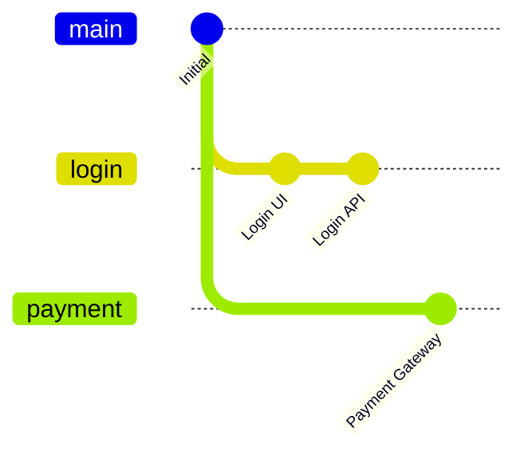

Each branch evolves independently.

---

# How Branches Work Internally

Many beginners think a branch is a copy of a repository.

It is not.

---

## Reality

A branch is simply a reference (pointer) to a commit.

Example:

```text
main → Commit C
```

---

## Commit Chain

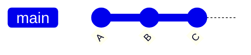

Reference:

```text
main → C
```

---

## Creating a Branch

When creating:

```bash
git branch feature-login
```

Git does NOT copy files.

Instead:

```text
main → C
feature-login → C
```

Both point to the same commit.

---

## Internal Representation

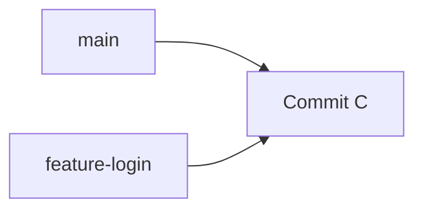

No duplication occurs.

---

# How Branches Advance

Suppose:

```text
main → C
feature → C
```

You switch:

```bash
git checkout feature
```

and create a commit.

New state:

```text
main → C
feature → D
```

---

## Visualization

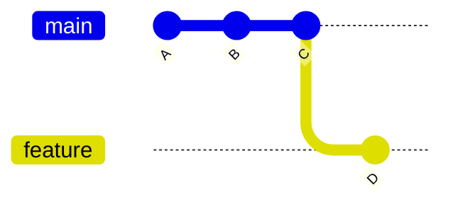

Only the current branch moves.

---

# HEAD and Branches

Git uses a special pointer:

```text
HEAD
```

HEAD indicates:

> Your current position in the repository.

---

## Example

```text
HEAD → main
```

Meaning:

```text
Currently on main branch
```

---

## Visualization

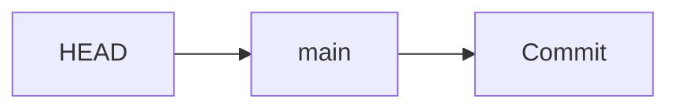

---

# Viewing Branches

---

## List Local Branches

```bash
git branch
```

Example:

```text
* main
  feature-login
  feature-payment
```

The asterisk indicates the current branch.

---

## List All Branches

```bash
git branch -a
```

Example:

```text
* main
  feature-login
  remotes/origin/main
```

---

# Creating Branches

---

# Create a Branch

Syntax:

```bash
git branch <branch-name>
```

Example:

```bash
git branch feature-authentication
```

---

## Result

Before:

```text
main
```

After:

```text
main
feature-authentication
```

---

## Important

Creating a branch does NOT switch to it.

---

# Creating and Switching Simultaneously

Most common workflow:

```bash
git checkout -b feature-authentication
```

Modern equivalent:

```bash
git switch -c feature-authentication
```

---

## Workflow

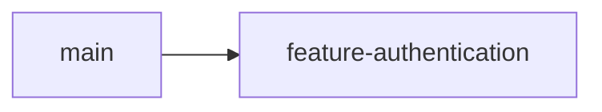

---

# Switching Branches

---

## Traditional Command

```bash
git checkout branch-name
```

Example:

```bash
git checkout feature-authentication
```

---

## Modern Command

```bash
git switch feature-authentication
```

---

## Example

Current branch:

```text
main
```

Switch:

```bash
git switch feature-authentication
```

Now:

```text
feature-authentication
```

is active.

---

# Verifying Current Branch

---

## Method 1

```bash
git branch
```

Output:

```text
* feature-authentication
```

---

## Method 2

```bash
git status
```

Output:

```text
On branch feature-authentication
```

---

# Branch Creation Workflow

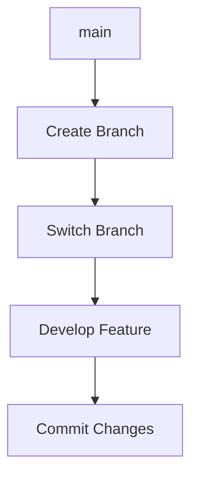

---

# Renaming Branches

---

## Rename Current Branch

```bash
git branch -m new-name
```

Example:

```bash
git branch -m feature-login
```

---

## Rename Another Branch

```bash
git branch -m old-name new-name
```

Example:

```bash
git branch -m login-feature feature-login
```

---

# Deleting Branches

---

# Delete Merged Branch

```bash
git branch -d branch-name
```

Example:

```bash
git branch -d feature-login
```

---

## Safe Delete

Git prevents deletion if changes are unmerged.

---

# Force Delete

```bash
git branch -D branch-name
```

Example:

```bash
git branch -D experiment
```

---

## Warning

This may permanently remove work.

---

# Branch Lifecycle

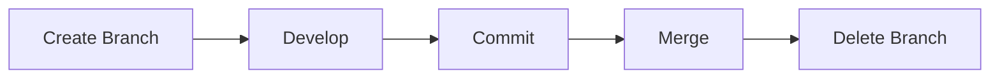

---

# Branch Naming Conventions

Consistent naming improves readability.

---

# Feature Branches

```text
feature/login
feature/payment-gateway
feature/user-profile
feature/shopping-cart
```

---

# Bug Fixes

```text
bugfix/login-validation
bugfix/payment-timeout
bugfix/crash-on-startup
```

---

# Hotfixes

```text
hotfix/security-patch
hotfix/production-error
```

---

# Releases

```text
release/v1.0
release/v2.0
release/v3.0
```

---

# Chore and Maintenance

```text
chore/update-dependencies
chore/cleanup-tests
```

---

# Recommended Format

```text
type/short-description
```

Example:

```text
feature/user-authentication
```

---

# Poor Naming Examples

Avoid:

```text
test

new

branch1

work

temp
```

These names provide no context.

---

# Long-Lived Branches

Long-lived branches exist for extended periods.

---

## Examples

```text
main
develop
release
```

---

## Characteristics

| Characteristic | Description        |
| -------------- | ------------------ |
| Persistent     | Long-term          |
| Shared         | Team-wide          |
| Stable         | Usually protected  |
| Important      | Production-related |

---

## Example

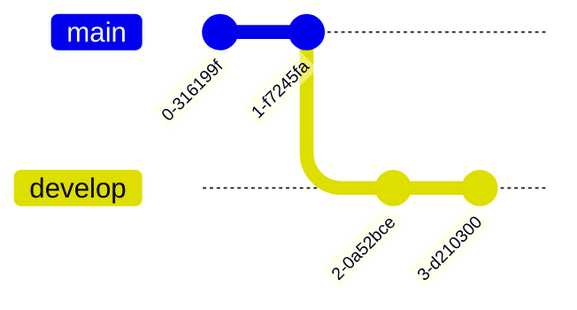

---

# Main Branch

Usually:

```text
main
```

Contains:

```text
Production-ready code
```

---

# Develop Branch

Common in Git Flow.

Contains:

```text
Integration work
```

before release.

---

# Short-Lived Branches

Short-lived branches exist temporarily.

---

## Examples

```text
feature/login
feature/cart
bugfix/payment
```

---

## Characteristics

| Characteristic | Description         |
| -------------- | ------------------- |
| Temporary      | Short duration      |
| Focused        | Single task         |
| Disposable     | Deleted after merge |
| Lightweight    | Easy to create      |

---

## Lifecycle

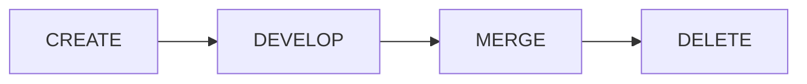

---

# Feature Branches

Feature branches are the most common branch type.

---

## Purpose

Develop a specific feature independently.

---

## Example

Feature:

```text
User Authentication
```

Branch:

```text
feature/user-authentication
```

---

## Workflow

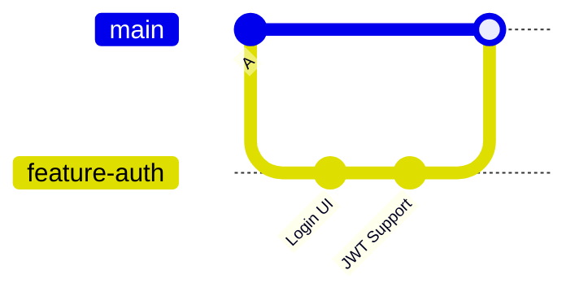

---

# Professional Feature Branch Workflow

---

## Step 1

Update main:

```bash
git checkout main
git pull
```

---

## Step 2

Create feature branch:

```bash
git checkout -b feature/user-authentication
```

---

## Step 3

Develop feature.

---

## Step 4

Commit changes:

```bash
git commit -m "Add JWT authentication"
```

---

## Step 5

Push:

```bash
git push origin feature/user-authentication
```

---

## Step 6

Open Pull Request.

---

## Step 7

Review and merge.

---

## Step 8

Delete branch.

```bash
git branch -d feature/user-authentication
```

---

# Team Branch Workflow Example

Imagine four developers.

---

## Branch Structure

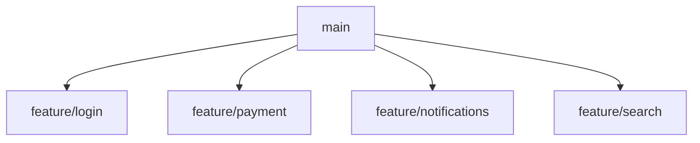

---

## Advantages

* Parallel development
* Isolated work
* Easier reviews
* Reduced risk

---

# Common Branch Commands

| Command                | Purpose           |
| ---------------------- | ----------------- |
| `git branch`           | List branches     |
| `git branch name`      | Create branch     |
| `git checkout name`    | Switch branch     |
| `git switch name`      | Switch branch     |
| `git checkout -b name` | Create and switch |
| `git switch -c name`   | Create and switch |
| `git branch -d name`   | Delete branch     |
| `git branch -D name`   | Force delete      |
| `git branch -m name`   | Rename branch     |

---

# Best Practices

---

## Use Feature Branches

Good:

```text
feature/user-authentication
```

Avoid direct development on:

```text
main
```

---

## Keep Branches Small

Good:

```text
One feature per branch
```

Bad:

```text
Authentication + Payments + Notifications
```

in one branch.

---

## Delete Merged Branches

After merging:

```bash
git branch -d feature/login
```

This keeps repositories clean.

---

## Use Meaningful Names

Good:

```text
feature/payment-gateway
```

Bad:

```text
work
```

---

## Update Branches Frequently

Regularly pull changes from the base branch.

---

## Open Small Pull Requests

Smaller PRs:

* Easier reviews
* Faster approvals
* Fewer conflicts

---

# Common Mistakes

| Mistake                       | Consequence        |
| ----------------------------- | ------------------ |
| Working on main               | Higher risk        |
| Huge feature branches         | Difficult merges   |
| Forgetting to delete branches | Repository clutter |
| Poor branch names             | Team confusion     |
| Long-running branches         | Merge conflicts    |
| Force deleting branches       | Lost work          |

---

# Troubleshooting

---

# Problem: Cannot Switch Branches

Error:

```text
Your local changes would be overwritten
```

---

## Cause

Uncommitted changes.

---

## Fix

Commit changes:

```bash
git add .
git commit -m "Save work"
```

or stash them.

---

# Problem: Branch Already Exists

Error:

```text
fatal: branch already exists
```

---

## Check Existing Branches

```bash
git branch
```

Choose another name.

---

# Problem: Cannot Delete Branch

Error:

```text
branch is not fully merged
```

---

## Fix

Merge first:

```bash
git merge feature-login
```

or force delete:

```bash
git branch -D feature-login
```

---

# Problem: Lost Track of Current Branch

Check:

```bash
git status
```

or:

```bash
git branch
```

Current branch:

```text
*
```

---

# Problem: Branch Not Updated

Fetch latest changes:

```bash
git fetch
```

Then merge or rebase as appropriate.

---

# Interview Questions and Answers

---

## Q1: What is a Git branch?

### Answer

A branch is a movable pointer to a commit that represents an independent line of development.

---

## Q2: Does Git copy files when creating a branch?

### Answer

No. Git creates a lightweight reference pointing to a commit.

---

## Q3: What is HEAD?

### Answer

HEAD is a pointer to the currently checked-out branch or commit.

---

## Q4: How do you create a branch?

### Answer

```bash
git branch feature-login
```

or

```bash
git checkout -b feature-login
```

---

## Q5: How do you switch branches?

### Answer

```bash
git switch feature-login
```

or

```bash
git checkout feature-login
```

---

## Q6: What is the difference between long-lived and short-lived branches?

### Answer

Long-lived branches exist permanently (e.g., `main`, `develop`), while short-lived branches are temporary and typically deleted after merging.

---

## Q7: Why are feature branches important?

### Answer

They isolate development work, reduce risk, and simplify code reviews.

---

## Q8: How do you delete a branch?

### Answer

```bash
git branch -d branch-name
```

---

## Q9: What does `git branch -D` do?

### Answer

It force deletes a branch even if it contains unmerged commits.

---

## Q10: Why should developers avoid working directly on `main`?

### Answer

Because it increases the risk of introducing unstable code into the primary production branch.

---

# Chapter Summary

In this chapter, you learned:

* A Git branch is a lightweight pointer to a commit.
* Branches allow isolated development and safe experimentation.
* Git branches are inexpensive because they are references, not copies.
* HEAD identifies the currently active branch.
* Branches can be created, switched, renamed, and deleted easily.
* Professional teams use descriptive branch naming conventions.
* Long-lived branches typically include `main`, `develop`, and release branches.
* Short-lived branches are commonly used for features, bug fixes, and hotfixes.
* Feature branches are the foundation of modern Git collaboration workflows.
* Proper branch management leads to cleaner repositories, easier reviews, and safer deployments.

Mastering branching is essential because nearly every advanced Git operation—merging, rebasing, pull requests, release management, and continuous integration—depends on a solid understanding of branches and branch workflows.
