# GitHub Collaboration Workflow

---

# Learning Objectives

By the end of this chapter, you will understand:

* How collaboration works on GitHub
* The difference between repositories, forks, and clones
* How the Fork & Pull Request workflow operates
* How to clone repositories
* What upstream remotes are
* How to synchronize forks
* Common GitHub collaboration models
* Team workflows used in industry
* Open-source contribution workflows
* Best practices for collaboration
* Common problems and troubleshooting techniques

---

# Introduction

Modern software development is collaborative.

Whether working in:

* Open-source projects
* Startups
* Enterprises
* Freelance teams
* University projects

developers must work together efficiently.

Git provides version control.

GitHub provides collaboration tools built on top of Git.

Together, they enable:

* Code sharing
* Code reviews
* Pull requests
* Issue tracking
* Project management
* Team collaboration

---

# Understanding GitHub Collaboration

At a high level, collaboration follows this pattern:

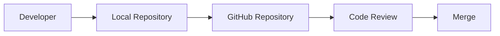

---

# Core Collaboration Concepts

Before discussing workflows, let's define some important concepts.

---

## Repository

A repository contains:

* Source code
* Commit history
* Branches
* Tags
* Documentation

Example:

```text
awesome-project
```

---

## Clone

A clone is a local copy of a repository.

Command:

```bash
git clone https://github.com/owner/project.git
```

---

## Fork

A fork is a personal copy of someone else's repository on GitHub.

Example:

```text
Original Repository
        ↓
     Fork
        ↓
Your GitHub Account
```

---

## Pull Request

A Pull Request (PR) is a request to merge changes into another branch.

Example:

```text
feature/login
        ↓
Pull Request
        ↓
main
```

---

# Collaboration Models

There are two major GitHub collaboration models.

---

# Shared Repository Model

Used primarily in:

* Small teams
* Private company projects
* Internal repositories

---

## Workflow

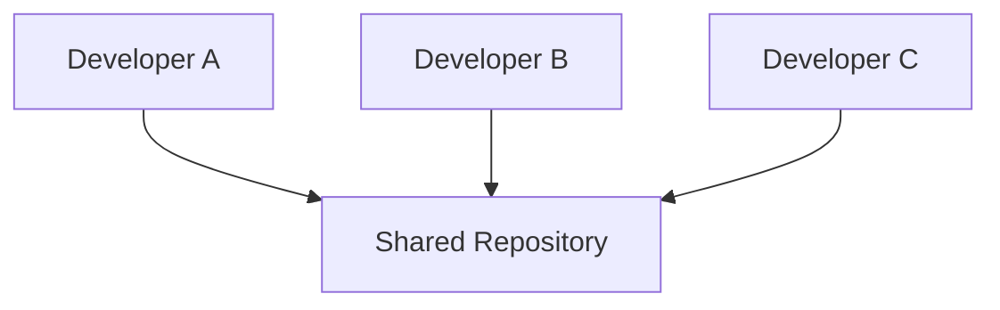

All developers have write access.

---

## Process

1. Clone repository
2. Create branch
3. Make changes
4. Push branch
5. Open Pull Request
6. Review
7. Merge

---

## Advantages

| Advantage | Description      |
| --------- | ---------------- |
| Simple    | Easy setup       |
| Fast      | Minimal overhead |
| Efficient | Good for teams   |

---

## Disadvantages

| Disadvantage            | Description                        |
| ----------------------- | ---------------------------------- |
| Requires access control | Everyone has write permissions     |
| Riskier                 | Mistakes affect central repository |

---

# Fork and Pull Request Model

Common in open-source projects.

---

## Workflow

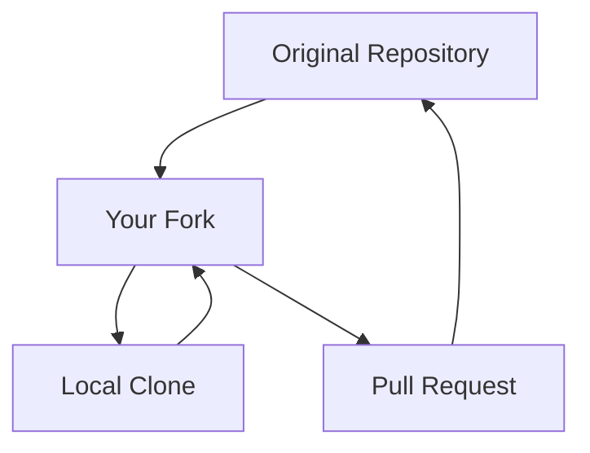

---

## Why Fork?

Most open-source projects do not grant write access to everyone.

Forking allows contributors to:

* Work independently
* Experiment safely
* Submit changes for review

---

# Understanding Forking

---

## What Is a Fork?

A fork is a server-side copy of a repository.

Example:

```text
github.com/project/repository
```

Forked into:

```text
github.com/yourname/repository
```

---

## Visual Representation

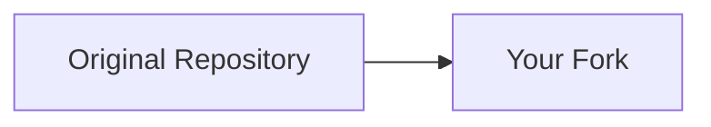

---

## Important

A fork:

* Contains full history
* Contains all branches
* Is independent

---

# Fork Workflow

---

## Step 1: Fork Repository

On GitHub:

```text
Click Fork
```

Result:

```text
Original Repository
       ↓
Your Fork
```

---

## Step 2: Clone Fork

```bash
git clone https://github.com/yourname/project.git
```

---

## Step 3: Create Branch

```bash
git checkout -b feature/new-feature
```

---

## Step 4: Develop

Make changes.

---

## Step 5: Commit

```bash
git commit -m "Add new feature"
```

---

## Step 6: Push

```bash
git push origin feature/new-feature
```

---

## Step 7: Open Pull Request

Create PR:

```text
Your Fork
       ↓
Original Repository
```

---

# Cloning Repositories

---

# Purpose

Creates a local copy.

---

## Syntax

```bash
git clone <repository-url>
```

---

## Example

```bash
git clone https://github.com/octocat/project.git
```

---

## Result

```text
project/
├── .git/
├── src/
└── README.md
```

---

# Clone Workflow

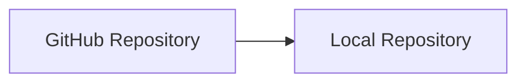

---

# Understanding Remotes

A remote is a reference to another repository.

---

## View Remotes

```bash
git remote -v
```

Example:

```text
origin https://github.com/user/project.git
```

---

# Origin Remote

When cloning:

```bash
git clone repository-url
```

Git automatically creates:

```text
origin
```

---

## Example

```bash
git remote -v
```

Output:

```text
origin https://github.com/user/project.git
```

---

# Upstream Remote

---

# What Is Upstream?

Upstream refers to the original repository from which a fork was created.

---

## Example

Original:

```text
github.com/company/project
```

Fork:

```text
github.com/alice/project
```

---

## Remotes

```text
origin   → Alice Fork
upstream → Company Repository
```

---

## Visualization

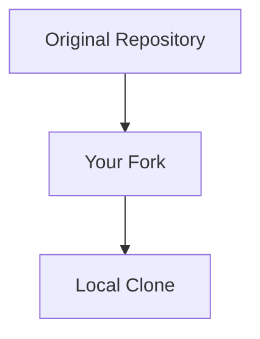

---

# Adding Upstream

After cloning your fork:

```bash
git remote add upstream https://github.com/company/project.git
```

---

## Verify

```bash
git remote -v
```

Example:

```text
origin    https://github.com/alice/project.git
upstream  https://github.com/company/project.git
```

---

# Why Upstream Matters

Open-source projects continue evolving.

Without synchronization:

```text
Fork becomes outdated.
```

---

# Synchronizing Forks

---

# Step 1: Fetch Upstream

```bash
git fetch upstream
```

Downloads latest changes.

---

# Step 2: Switch to Main

```bash
git checkout main
```

---

# Step 3: Merge Upstream

```bash
git merge upstream/main
```

---

# Alternative: Rebase

```bash
git rebase upstream/main
```

---

# Sync Workflow

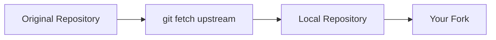

---

# Updating Fork on GitHub

After synchronizing locally:

```bash
git push origin main
```

Updates:

```text
Your Fork
```

---

# Complete Open Source Workflow

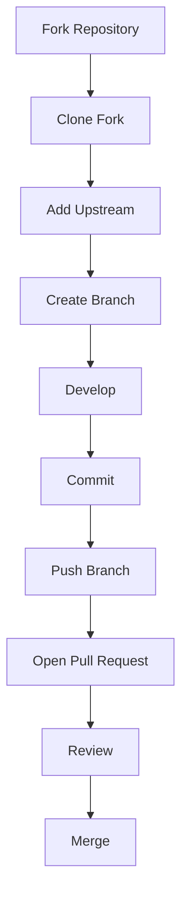

---

# Team Collaboration Workflow

Most companies use a shared repository model.

---

## Team Workflow

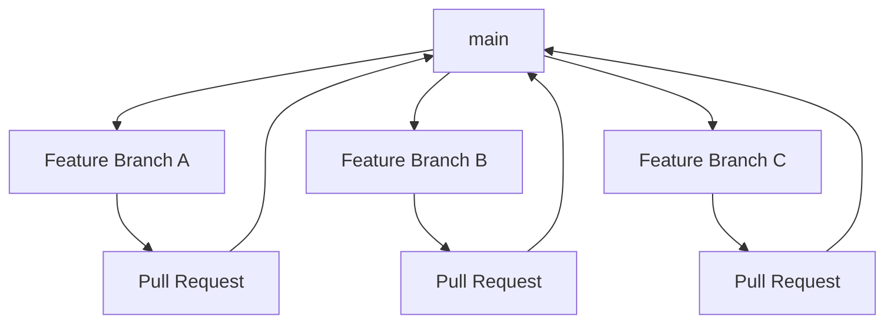

---

# Example Team Workflow

---

## Start Day

Update repository:

```bash
git pull origin main
```

---

## Create Branch

```bash
git checkout -b feature/payment-api
```

---

## Develop

Modify:

```text
payment.py
tests/
README.md
```

---

## Commit

```bash
git commit -m "Add payment API"
```

---

## Push

```bash
git push origin feature/payment-api
```

---

## Open Pull Request

Target:

```text
main
```

---

## Review

Team reviews:

* Code quality
* Tests
* Architecture

---

## Merge

After approval:

```text
Merge Pull Request
```

---

# Pull Requests

---

# What Is a Pull Request?

A Pull Request proposes changes for review before merging.

---

## Purpose

* Code review
* Testing
* Discussion
* Documentation review

---

## Workflow

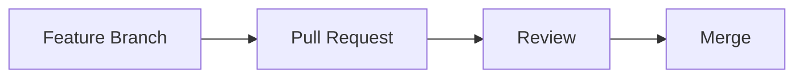

---

# Pull Request Components

Typically includes:

* Title
* Description
* Commits
* Files changed
* Comments
* Review approvals

---

## Example

Title:

```text
Add JWT Authentication
```

Description:

```text
Implemented:

- Login endpoint
- JWT generation
- Token validation
- Unit tests
```

---

# Code Reviews

Code reviews improve:

* Code quality
* Security
* Maintainability
* Knowledge sharing

---

## Review Workflow

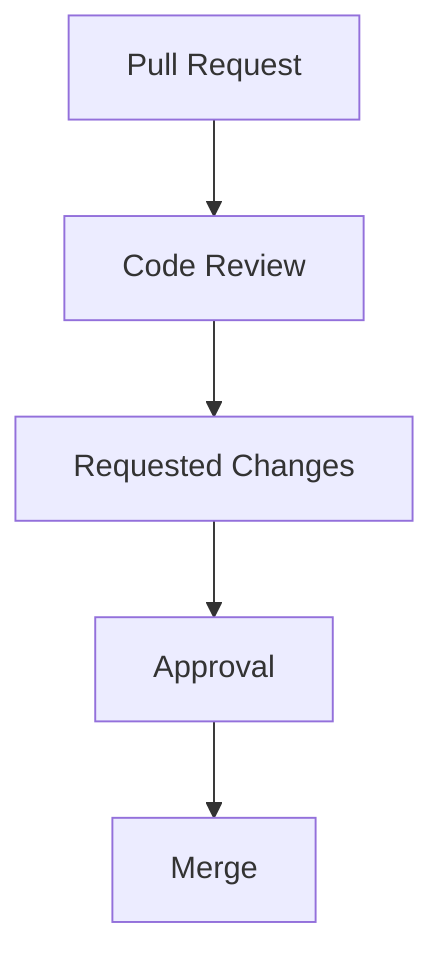

---

# Professional Collaboration Practices

---

# Small Pull Requests

Good:

```text
200–400 lines
```

Bad:

```text
5,000+ lines
```

---

# One Feature Per Branch

Good:

```text
feature/payment-api
```

Bad:

```text
payment-api
notifications
authentication
```

all in one branch.

---

# Frequent Synchronization

Regularly update from:

```text
main
```

or:

```text
upstream
```

---

# Clear Commit Messages

Good:

```text
Add JWT authentication support
```

Bad:

```text
update
```

---

# Write Useful PR Descriptions

Explain:

* What changed
* Why it changed
* How it was tested

---

# Common GitHub Workflow Patterns

---

# GitHub Flow

Simple workflow.

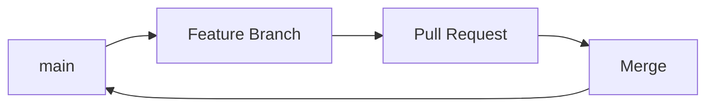

Suitable for:

* Startups
* SaaS products
* Continuous deployment

---

# Feature Branch Workflow

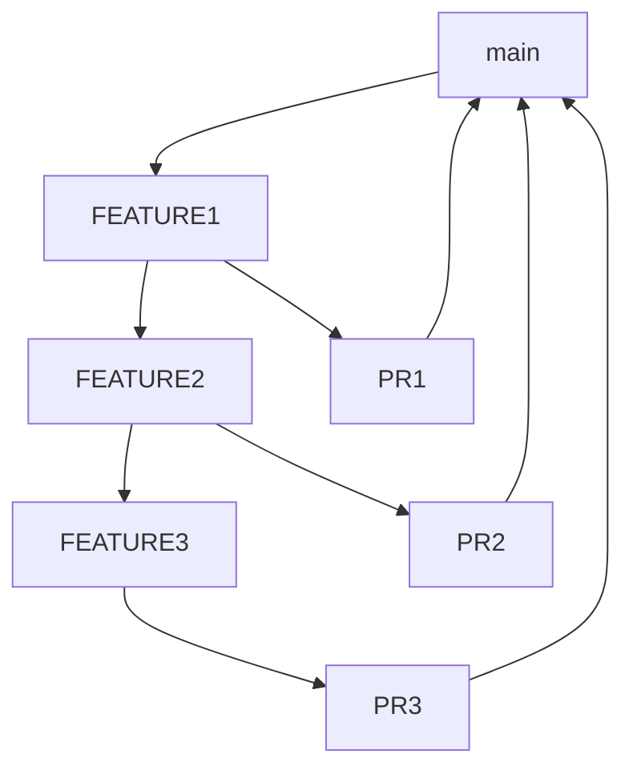

Suitable for:

* Most software teams

---

# Fork Workflow

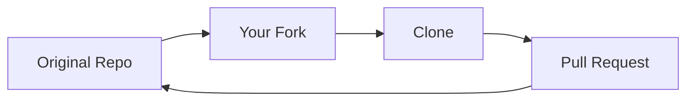

Suitable for:

* Open source

---

# Best Practices

---

## Keep Forks Updated

Regularly synchronize:

```bash
git fetch upstream
```

---

## Create Branches for Every Change

Avoid:

```text
Direct commits to main
```

---

## Pull Before Starting Work

```bash
git pull
```

---

## Open Small Pull Requests

Smaller reviews are:

* Faster
* Safer
* Easier

---

## Respond to Reviews Professionally

Treat review comments as collaboration, not criticism.

---

## Protect Main Branch

Require:

* Reviews
* Tests
* CI checks

before merging.

---

# Common Mistakes

| Mistake                       | Consequence        |
| ----------------------------- | ------------------ |
| Working directly on main      | Higher risk        |
| Not syncing fork              | Outdated branch    |
| Large pull requests           | Difficult review   |
| Ignoring code review          | Lower quality      |
| Force pushing shared branches | Team disruption    |
| Poor PR descriptions          | Reviewer confusion |

---

# Troubleshooting

---

# Problem: Fork Is Outdated

Solution:

```bash
git fetch upstream
git checkout main
git merge upstream/main
```

Push:

```bash
git push origin main
```

---

# Problem: Pull Request Shows Too Many Changes

Cause:

```text
Branch created from outdated base.
```

Fix:

```bash
git rebase main
```

or recreate branch.

---

# Problem: Cannot Push

Error:

```text
non-fast-forward
```

Fix:

```bash
git pull
git push
```

---

# Problem: Wrong Remote

Check:

```bash
git remote -v
```

Expected:

```text
origin
upstream
```

---

# Problem: PR Has Merge Conflicts

Update branch:

```bash
git fetch upstream
git merge upstream/main
```

Resolve conflicts.

Push again.

---

# Essential Commands Cheat Sheet

| Command                       | Purpose                   |
| ----------------------------- | ------------------------- |
| `git clone URL`               | Clone repository          |
| `git remote -v`               | View remotes              |
| `git remote add upstream URL` | Add upstream              |
| `git fetch upstream`          | Download upstream changes |
| `git merge upstream/main`     | Sync fork                 |
| `git push origin branch`      | Push branch               |
| `git pull`                    | Update local repository   |
| `git checkout -b branch`      | Create branch             |
| `git rebase main`             | Rebase branch             |

---

# Interview Questions and Answers

---

## Q1: What is a GitHub fork?

### Answer

A fork is a personal server-side copy of another repository that allows independent development.

---

## Q2: What is the difference between a fork and a clone?

### Answer

A fork exists on GitHub, while a clone is a local copy on a developer's machine.

---

## Q3: What is an upstream remote?

### Answer

The original repository from which a fork was created.

---

## Q4: Why is synchronization important?

### Answer

It keeps forks and feature branches updated with the latest project changes.

---

## Q5: What is a Pull Request?

### Answer

A request to merge changes into another branch after review and validation.

---

## Q6: What is the purpose of code reviews?

### Answer

To improve quality, maintainability, security, and team collaboration.

---

## Q7: How do you add an upstream remote?

### Answer

```bash
git remote add upstream <repository-url>
```

---

## Q8: What is the most common workflow in open source?

### Answer

The Fork and Pull Request workflow.

---

## Q9: What is the difference between `origin` and `upstream`?

### Answer

`origin` usually refers to your fork, while `upstream` refers to the original repository.

---

## Q10: Why should developers avoid committing directly to `main`?

### Answer

Because feature branches and pull requests provide safer development, review, and testing workflows.

---

# Chapter Summary

In this chapter, you learned:

* GitHub enables collaborative development on top of Git.
* A clone is a local copy, while a fork is a server-side copy on GitHub.
* The Fork and Pull Request workflow is the standard model for open-source contributions.
* Shared repository workflows are common in company environments.
* Remotes connect local repositories to GitHub repositories.
* `origin` typically points to your repository, while `upstream` points to the original source repository.
* Synchronization keeps forks and branches up to date.
* Pull Requests enable review, discussion, testing, and controlled merging.
* Small branches, small PRs, and regular synchronization lead to healthier projects.
* Professional collaboration depends on disciplined branching, code reviews, and communication.

Mastering GitHub collaboration workflows prepares you for open-source contributions, professional software engineering teams, large-scale code reviews, and modern DevOps development practices.
