# Git Merging and Conflict Resolution

---

# Learning Objectives

By the end of this chapter, you will understand:

* What Git merging is
* Why merging is necessary
* How Git combines branches
* Fast-forward merges
* Three-way merges
* Merge commits
* Merge conflicts
* Conflict markers
* Conflict resolution workflows
* Merge strategies
* Squash merges
* Best practices for safe merging
* Common merge-related problems and solutions

---

# Introduction

Branching allows developers to work independently.

Eventually, those changes must be combined.

This process is called:

> **Merging**

Git merging is the mechanism used to integrate changes from one branch into another.

For example:

```text id="5v1xzb"
feature/login
```

must eventually become part of:

```text id="b7z0u7"
main
```

Understanding merging is essential because it is one of the most frequently used Git operations in professional software development.

---

# What Is a Merge?

A merge combines the histories of two branches.

---

## Example

Before merge:

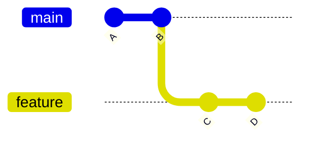

Branches contain different commits.

A merge integrates them into a single history.

---

# Why Merging Exists

Without merging:

```text
Developer A → Login Feature

Developer B → Payment Feature

Developer C → Notifications
```

Each developer's work would remain isolated forever.

Merging allows all changes to become part of the same project.

---

# Merge Terminology

| Term            | Meaning                                  |
| --------------- | ---------------------------------------- |
| Source Branch   | Branch being merged                      |
| Target Branch   | Branch receiving changes                 |
| Merge Commit    | Commit created during merge              |
| Conflict        | Git cannot automatically combine changes |
| Ancestor        | Common parent commit                     |
| Fast-Forward    | Simple branch pointer movement           |
| Three-Way Merge | Merge requiring a merge commit           |

---

# How Git Merging Works

Suppose:

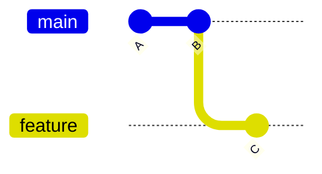

Current state:

```text
main    → B
feature → C
```

Git analyzes:

* Common ancestor
* Changes on each branch
* Potential conflicts

Then combines histories.

---

# Types of Git Merges

Git commonly performs:

1. Fast-Forward Merge
2. Three-Way Merge

---

# Fast-Forward Merge

---

# What Is a Fast-Forward Merge?

A fast-forward merge occurs when the target branch has not moved since the feature branch was created.

---

## Example


State:

```text
main → B
feature → D
```

---

## Merge Command

```bash
git checkout main
git merge feature
```

---

## Result

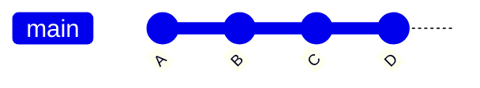

Git simply moves:

```text
main → D
```

No merge commit is created.

---

## Why Fast-Forward Happens

Because:

```text
main
```

has no unique commits after branching.

Git only needs to advance the pointer.

---

## Advantages

| Advantage     | Description            |
| ------------- | ---------------------- |
| Clean history | No extra merge commits |
| Simple        | Easy to understand     |
| Fast          | Minimal work required  |

---

## Disadvantages

| Disadvantage                  | Description                      |
| ----------------------------- | -------------------------------- |
| Feature history may disappear | Less explicit integration record |

---

# Fast-Forward Visualization

Before:

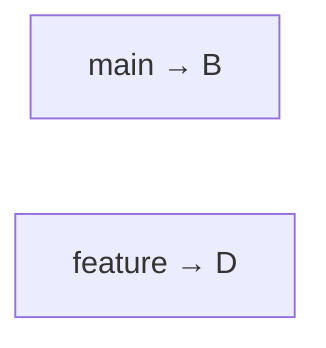

After:

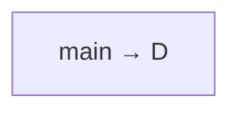

---

# Three-Way Merge

---

# What Is a Three-Way Merge?

A three-way merge occurs when both branches have progressed independently.

---

## Example

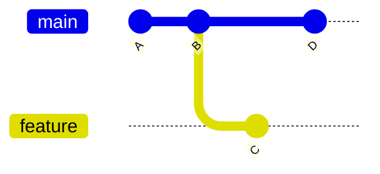

State:

```text
main → D
feature → C
```

Both branches contain unique commits.

---

## Merge Command

```bash
git checkout main
git merge feature
```

---

## Result

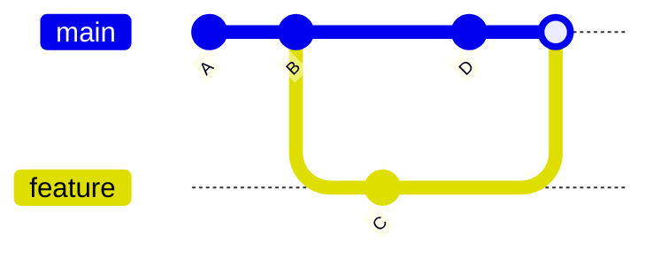

Git creates:

```text
Merge Commit M
```

---

# Why "Three-Way"?

Git compares:

1. Common ancestor
2. Main branch
3. Feature branch

Example:

```text
Ancestor: B

Main: D

Feature: C
```

Three versions are analyzed simultaneously.

---

## Three-Way Merge Diagram

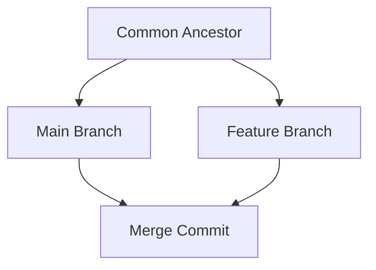

---

# Merge Commit

A merge commit has multiple parents.

Normal commit:

```text
Commit
└── Parent
```

Merge commit:

```text
Merge Commit
├── Parent 1
└── Parent 2
```

---

## Visualization

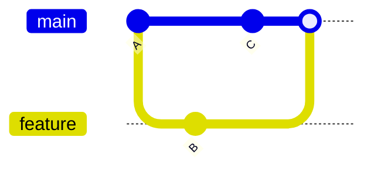

---

# Viewing Merge History

```bash
git log --graph --oneline
```

Example:

```text
*   Merge branch 'feature'
|\
| * Add login API
* | Update README
|/
* Initial commit
```

---

# Understanding Merge Conflicts

---

# What Is a Merge Conflict?

A conflict occurs when Git cannot automatically determine how to combine changes.

---

## Example

Original:

```python
username = "guest"
```

---

### Developer A

```python
username = "admin"
```

---

### Developer B

```python
username = "root"
```

---

Git cannot decide:

```text
admin
or
root
```

Human intervention is required.

---

# Conflict Workflow

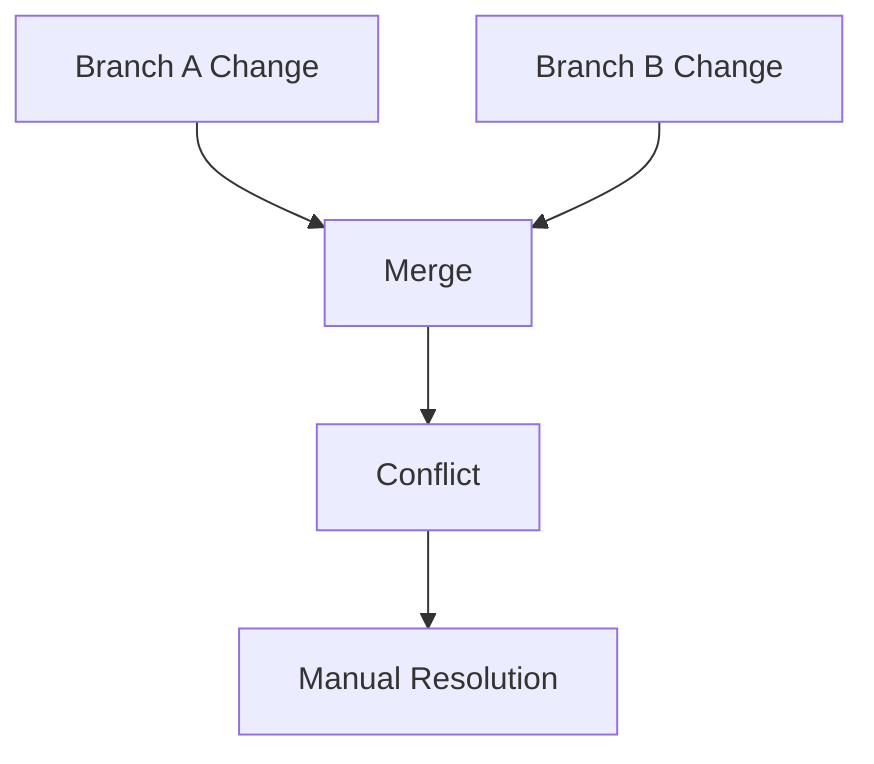

---

# Example Conflict

Suppose Git encounters:

```python
<<<<<<< HEAD
username = "admin"
=======
username = "root"
>>>>>>> feature
```

---

# Understanding Conflict Markers

---

## Current Branch

```python
<<<<<<< HEAD
username = "admin"
```

Represents:

```text
Current branch version
```

---

## Separator

```python
=======
```

Separates competing changes.

---

## Incoming Branch

```python
>>>>>>> feature
username = "root"
```

Represents:

```text
Incoming branch version
```

---

# Conflict Resolution Process

---

## Step 1: Open File

Git inserts markers.

Example:

```python
<<<<<<< HEAD
username = "admin"
=======
username = "root"
>>>>>>> feature
```

---

## Step 2: Choose Correct Content

Example:

```python
username = "admin"
```

or

```python
username = "root"
```

or

```python
username = "admin_root"
```

---

## Step 3: Remove Markers

Final version:

```python
username = "admin"
```

---

## Step 4: Stage File

```bash
git add app.py
```

---

## Step 5: Complete Merge

```bash
git commit
```

Git creates the merge commit.

---

# Complete Conflict Resolution Workflow

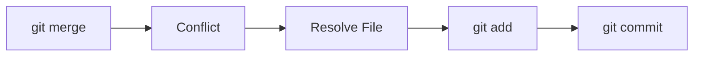

---

# Checking Conflict Status

```bash
git status
```

Example:

```text
both modified: app.py
```

---

# Aborting a Merge

Sometimes resolution becomes difficult.

Cancel the merge:

```bash
git merge --abort
```

Result:

```text
Repository returns to pre-merge state.
```

---

# Merge Strategies

Git supports several merge strategies.

---

# Recursive Strategy

Default strategy for most merges.

```bash
git merge feature
```

Git automatically selects the best merge result.

---

# Ours Strategy

Keep current branch version.

```bash
git merge -s ours feature
```

Result:

```text
Current branch wins.
```

---

# Theirs Strategy

Prefer incoming changes during conflict resolution.

Example:

```bash
git checkout --theirs file.txt
```

---

# Octopus Strategy

Merge multiple branches simultaneously.

```bash
git merge feature1 feature2 feature3
```

Useful for integrating multiple independent branches.

---

# Squash Merge

---

# What Is a Squash Merge?

A squash merge combines multiple commits into a single commit.

---

## Example Branch

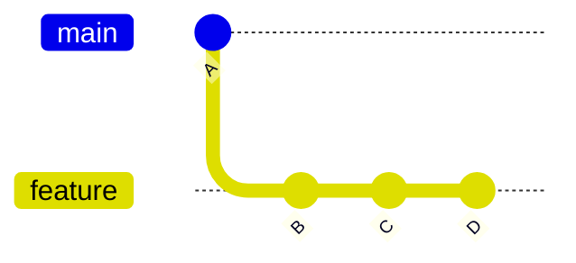

Feature branch contains:

```text
B
C
D
```

---

## Squash Merge Command

```bash
git merge --squash feature
```

---

## Result

Instead of:

```text
B
C
D
```

Git creates:

```text
Single Commit E
```

---

## Visualization

Before:


After:

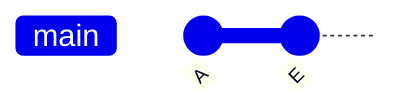

---

# Advantages of Squash Merges

| Advantage       | Description                  |
| --------------- | ---------------------------- |
| Cleaner history | One commit per feature       |
| Easier review   | Simplified commit graph      |
| Reduced noise   | Removes intermediate commits |

---

# Disadvantages

| Disadvantage                 | Description                    |
| ---------------------------- | ------------------------------ |
| Original commit history lost | Less detailed history          |
| Harder debugging             | Fine-grained commits disappear |

---

# Professional Merge Workflow

---

## Step 1

Update main:

```bash
git checkout main
git pull
```

---

## Step 2

Create feature branch:

```bash
git checkout -b feature/auth
```

---

## Step 3

Develop feature.

---

## Step 4

Commit regularly:

```bash
git commit -m "Add login endpoint"
```

---

## Step 5

Push branch:

```bash
git push origin feature/auth
```

---

## Step 6

Open Pull Request.

---

## Step 7

Review changes.

---

## Step 8

Merge into main.

---

## Step 9

Delete feature branch.

```bash
git branch -d feature/auth
```

---

# Team Merge Workflow

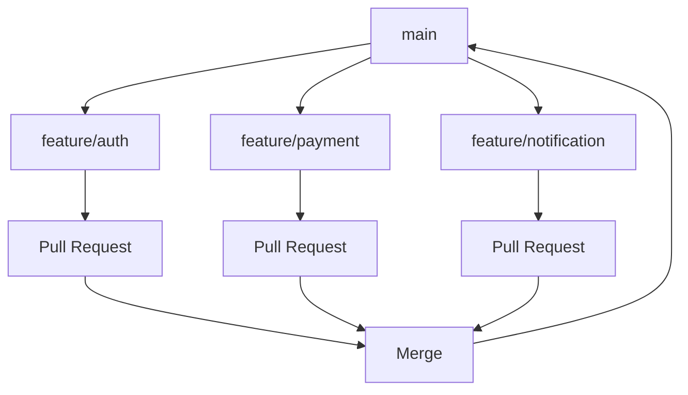

---

# Merge Command Reference

| Command                     | Purpose             |
| --------------------------- | ------------------- |
| `git merge branch`          | Merge branch        |
| `git merge --no-ff branch`  | Force merge commit  |
| `git merge --squash branch` | Squash merge        |
| `git merge --abort`         | Cancel merge        |
| `git log --graph`           | View merge history  |
| `git status`                | View conflict state |

---

# Best Practices

---

## Merge Frequently

Avoid long-running branches.

Good:

```text
Small frequent merges
```

Bad:

```text
Three-month feature branch
```

---

## Pull Before Merging

```bash
git pull
```

Reduces conflicts.

---

## Keep Branches Small

Smaller branches:

* Easier review
* Fewer conflicts
* Faster integration

---

## Review Before Merging

Use:

```bash
git diff
```

and Pull Requests.

---

## Use Meaningful Commit Messages

Example:

```text
Merge authentication feature
```

instead of:

```text
merge stuff
```

---

## Resolve Conflicts Carefully

Never blindly choose:

```text
ours
```

or

```text
theirs
```

without understanding changes.

---

# Common Mistakes

| Mistake                       | Consequence        |
| ----------------------------- | ------------------ |
| Long-lived branches           | More conflicts     |
| Ignoring pull requests        | Lower code quality |
| Force merging unresolved code | Broken application |
| Large feature branches        | Difficult reviews  |
| Blind conflict resolution     | Lost functionality |
| Deleting branches too early   | Lost work          |

---

# Troubleshooting

---

# Problem: Merge Conflict

Error:

```text
CONFLICT (content)
```

---

## Fix

```bash
git status
```

Resolve files manually.

Then:

```bash
git add .
git commit
```

---

# Problem: Cannot Merge

Error:

```text
Your local changes would be overwritten
```

---

## Fix

Commit changes:

```bash
git add .
git commit -m "Save work"
```

or stash them.

---

# Problem: Merge Went Wrong

Cancel:

```bash
git merge --abort
```

---

# Problem: Lost Merge History

Use:

```bash
git log --graph --oneline
```

to inspect branch history.

---

# Problem: Accidental Squash Merge

Review history:

```bash
git reflog
```

Recover commits if necessary.

---

# Interview Questions and Answers

---

## Q1: What is Git merging?

### Answer

Git merging combines changes from one branch into another.

---

## Q2: What is a fast-forward merge?

### Answer

A merge where Git only moves the branch pointer forward because no divergent history exists.

---

## Q3: What is a three-way merge?

### Answer

A merge that compares the common ancestor, source branch, and target branch to create a merge commit.

---

## Q4: What is a merge commit?

### Answer

A commit with multiple parents that records the integration of two histories.

---

## Q5: What causes merge conflicts?

### Answer

Conflicts occur when Git cannot automatically determine how competing changes should be combined.

---

## Q6: How do you resolve a merge conflict?

### Answer

Edit conflicted files, remove conflict markers, stage changes, and complete the merge commit.

---

## Q7: What does `git merge --abort` do?

### Answer

It cancels an in-progress merge and restores the repository to its pre-merge state.

---

## Q8: What is a squash merge?

### Answer

A squash merge combines multiple commits into a single commit before merging.

---

## Q9: What are the advantages of squash merges?

### Answer

Cleaner history, fewer commits, and easier review of completed features.

---

## Q10: Why should teams merge frequently?

### Answer

Frequent merges reduce conflicts, simplify integration, and keep branches synchronized.

---

# Chapter Summary

In this chapter, you learned:

* Merging combines the histories of multiple branches.
* Fast-forward merges occur when no divergent history exists.
* Three-way merges create merge commits when both branches contain unique changes.
* Merge commits record the integration of separate development histories.
* Merge conflicts occur when Git cannot automatically combine competing changes.
* Conflict markers identify areas requiring manual resolution.
* Conflict resolution involves editing files, staging changes, and completing the merge.
* Git supports multiple merge strategies, including recursive, ours, theirs, and octopus.
* Squash merges combine multiple commits into a single commit for cleaner history.
* Small branches, frequent integration, and code reviews significantly reduce merge-related problems.

A strong understanding of merging and conflict resolution is essential because nearly every collaborative Git workflow depends on safely integrating changes from multiple developers into a shared codebase.
