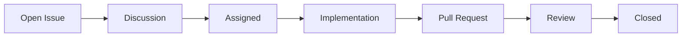
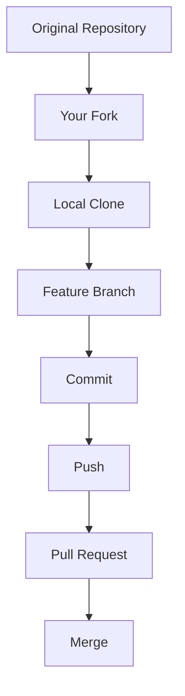
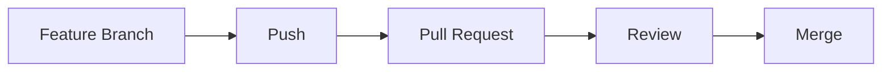
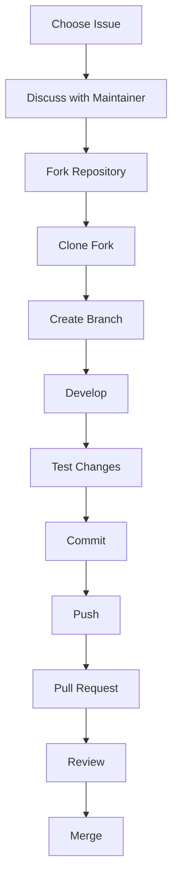

# Contributing to Open Source Projects

---

# Learning Objectives

By the end of this chapter, you will understand:

* What open source software is
* Why contributing to open source matters
* How open source communities operate
* How to find beginner-friendly projects
* How to evaluate a project's health
* The complete fork-and-pull-request workflow
* How issue tracking works
* How to communicate with maintainers
* Open source etiquette and professionalism
* Best practices for successful contributions
* Common mistakes new contributors make
* How open source contributions help your career

---

# Introduction

Open source software powers much of the modern world.

Examples include:

* Linux
* Git
* Kubernetes
* Docker
* PostgreSQL
* Python
* Node.js
* React

These projects are built and maintained by communities of contributors around the world.

Open source contribution is one of the best ways to:

* Improve technical skills
* Learn real-world development practices
* Build a public portfolio
* Collaborate with experienced developers
* Gain visibility in the software industry

---

# What Is Open Source?

Open source software is software whose source code is publicly available and can be:

* Viewed
* Studied
* Modified
* Shared

according to the project's license.

---

## Core Principles

Open source encourages:

* Transparency
* Collaboration
* Community involvement
* Knowledge sharing

---

## Typical Project Structure

```text id="os1"
project/
│
├── src/
├── docs/
├── tests/
├── README.md
├── LICENSE
├── CONTRIBUTING.md
└── CODE_OF_CONDUCT.md
```

---

# Why Contribute to Open Source?

---

## Learning

You work with:

* Real codebases
* Real users
* Real problems

---

## Portfolio Building

Recruiters often value:

```text id="os2"
Public GitHub Contributions
```

more than tutorial projects.

---

## Networking

Contributions expose you to:

* Maintainers
* Senior engineers
* Community members

---

## Career Growth

Many developers receive:

* Referrals
* Internship opportunities
* Job offers

through open source involvement.

---

# Types of Contributions

Open source is not only about coding.

---

## Code Contributions

Examples:

```text id="os3"
New features
Bug fixes
Performance improvements
```

---

## Documentation

Examples:

```text id="os4"
README updates
Tutorials
Examples
API documentation
```

---

## Testing

Examples:

```text id="os5"
Writing test cases
Reporting bugs
Improving coverage
```

---

## Design

Examples:

```text id="os6"
Icons
UI improvements
UX suggestions
```

---

## Community Support

Examples:

```text id="os7"
Answering questions
Reviewing issues
Helping newcomers
```

---

# Finding Open Source Projects

---

# Start with Technology You Use

A simple strategy:

```text id="os8"
Use It
↓
Understand It
↓
Improve It
```

---

## Examples

If you use:

```text id="os9"
React
```

contribute to React-related projects.

If you use:

```text id="os10"
Linux Mint
```

consider Mint ecosystem projects.

If you use:

```text id="os11"
Docker
```

look for Docker tools and plugins.

---

# Characteristics of Beginner-Friendly Projects

Look for:

* Active maintainers
* Clear documentation
* Friendly community
* Recent commits
* Open issues

---

## Good Signs

```text id="os12"
CONTRIBUTING.md exists
Issues are active
PRs receive reviews
Documentation is updated
```

---

# Issue Labels for Beginners

Common labels:

```text id="os13"
good first issue
beginner friendly
help wanted
easy
documentation
```

These issues are specifically intended for new contributors.

---

# Evaluating Project Health

---

## Healthy Project Indicators

| Indicator       | Good Sign           |
| --------------- | ------------------- |
| Recent commits  | Active development  |
| Open PR reviews | Maintainers engaged |
| Documentation   | Easy onboarding     |
| Issue responses | Community support   |
| Releases        | Ongoing maintenance |

---

## Warning Signs

| Indicator             | Concern                 |
| --------------------- | ----------------------- |
| No commits for years  | Abandoned project       |
| Hundreds of stale PRs | Low maintainer activity |
| No documentation      | Difficult onboarding    |
| Unanswered issues     | Weak support            |

---

# Understanding Issue Tracking

Issues are the primary method for discussing work.

---

# What Is an Issue?

An issue represents:

* Bug report
* Feature request
* Documentation improvement
* Discussion topic

---

## Example

```text id="os14"
Title:
Login page crashes when password is empty
```

Description:

```text id="os15"
Steps to reproduce:

1. Open login page
2. Leave password empty
3. Click login

Expected:
Validation message

Actual:
Application crashes
```

---

# Issue Lifecycle



---

# Before Working on an Issue

Always:

1. Read the issue completely
2. Check comments
3. Verify nobody else is working on it

---

## Good Practice

Comment:

```text id="os17"
I'd like to work on this issue.
```

This informs maintainers and avoids duplicated effort.

---

# Understanding the Forking Workflow

Most open source projects use:

> Fork and Pull Request Workflow

---

# Overview



---

# Step 1: Fork Repository

On GitHub:

```text id="os19"
Click Fork
```

Result:

```text id="os20"
Original Repository
        ↓
     Your Fork
```

---

# Step 2: Clone Your Fork

```bash id="os21"
git clone https://github.com/yourname/project.git
```

---

# Step 3: Add Upstream Remote

```bash id="os22"
git remote add upstream https://github.com/original/project.git
```

---

## Verify

```bash id="os23"
git remote -v
```

Example:

```text id="os24"
origin    your-fork
upstream  original-project
```

---

# Step 4: Create Branch

```bash id="os25"
git checkout -b fix/login-validation
```

---

# Branch Naming Examples

```text id="os26"
fix/login-validation
feature/user-profile
docs/readme-update
refactor/auth-service
```

---

# Step 5: Make Changes

Examples:

```text id="os27"
Fix bug
Add tests
Update documentation
```

---

# Step 6: Commit Changes

```bash id="os28"
git commit -m "Fix login validation bug"
```

---

# Step 7: Push Branch

```bash id="os29"
git push origin fix/login-validation
```

---

# Step 8: Open Pull Request

Target:

```text id="os30"
Original Repository
```

not:

```text id="os31"
Your Fork
```

---

# Pull Request Workflow



---

# Writing Good Pull Requests

---

# Good PR Title

```text id="os33"
Fix login validation crash
```

---

# Bad PR Title

```text id="os34"
update
```

---

# Good PR Description

```markdown id="os35"
## Summary

Fixes login crash when password is empty.

## Changes

- Added input validation
- Added unit tests

## Related Issue

Fixes #42
```

---

# Communicating with Maintainers

---

# Why Communication Matters

Maintainers manage:

* Issues
* Pull requests
* Releases
* Community discussions

Clear communication saves everyone's time.

---

# Before Starting Work

Good:

```text id="os36"
I'd like to work on this issue.
```

---

# During Development

Good:

```text id="os37"
I'm currently working on a fix.
Expect a PR within a few days.
```

---

# When Blocked

Good:

```text id="os38"
I'm unsure about the intended behavior.
Could you clarify?
```

---

# After Submitting PR

Good:

```text id="os39"
Implemented the requested changes.
Feedback is welcome.
```

---

# Responding to Reviews

---

## Good Response

```text id="os40"
Thanks for the suggestion.
I've updated the implementation.
```

---

## Another Good Response

```text id="os41"
I considered that approach but chose this
implementation because...
```

---

## Poor Response

```text id="os42"
My code is fine.
```

---

# Understanding Open Source Etiquette

---

# Be Respectful

Remember:

```text id="os43"
Most maintainers are volunteers.
```

---

# Read Documentation First

Before asking questions:

Read:

```text id="os44"
README.md
CONTRIBUTING.md
Documentation
```

---

# Follow Contribution Guidelines

Many projects include:

```text id="os45"
CONTRIBUTING.md
```

Read it carefully.

---

# Respect Coding Standards

Use:

* Existing style
* Existing architecture
* Existing naming conventions

---

# Avoid Drive-By Contributions

Bad:

```text id="os46"
Random unrelated changes
```

Good:

```text id="os47"
Focused improvements
```

---

# Accept Feedback Professionally

Code reviews improve software.

They are not personal criticism.

---

# Professional Open Source Workflow



---

# Common Beginner Mistakes

| Mistake                     | Consequence             |
| --------------------------- | ----------------------- |
| Not reading CONTRIBUTING.md | Rejected PR             |
| Working without discussion  | Duplicate effort        |
| Huge PRs                    | Difficult reviews       |
| No tests                    | Lower acceptance chance |
| Poor communication          | Slow feedback           |
| Ignoring review comments    | Delayed merge           |
| Outdated fork               | Merge conflicts         |

---

# Synchronizing Your Fork

Open source projects evolve quickly.

---

## Fetch Upstream Changes

```bash id="os49"
git fetch upstream
```

---

## Merge Upstream

```bash id="os50"
git checkout main
git merge upstream/main
```

---

## Push Updated Fork

```bash id="os51"
git push origin main
```

---

# Troubleshooting

---

# Problem: Pull Request Has Merge Conflicts

---

## Cause

Your branch is outdated.

---

## Fix

```bash id="os52"
git fetch upstream
git merge upstream/main
```

Resolve conflicts.

Push again.

---

# Problem: Maintainer Requests Changes

---

## Solution

Update code:

```bash id="os53"
git commit -m "Address review feedback"
git push
```

PR updates automatically.

---

# Problem: Fork Is Behind

Check:

```bash id="os54"
git fetch upstream
```

Update:

```bash id="os55"
git merge upstream/main
```

---

# Problem: CI Fails

Review:

```text id="os56"
Test output
Build logs
Lint reports
```

Fix issues.

Push updates.

---

# Problem: No Response from Maintainers

Possible reasons:

* Maintainers busy
* Time zone differences
* Volunteer project

Wait respectfully before following up.

---

# Open Source Contribution Checklist

Before Submitting a PR:

```text id="os57"
☐ Read CONTRIBUTING.md
☐ Read issue completely
☐ Discuss issue if necessary
☐ Create feature branch
☐ Follow coding standards
☐ Add tests
☐ Run tests locally
☐ Write meaningful commits
☐ Update documentation
☐ Write clear PR description
```

---

# Career Benefits of Open Source

Open source contributions demonstrate:

* Collaboration skills
* Communication skills
* Git proficiency
* Code review experience
* Real-world development experience

Employers often value these contributions highly.

---

# Interview Questions and Answers

---

## Q1: What is open source software?

### Answer

Software whose source code is publicly available and can be studied, modified, and distributed according to its license.

---

## Q2: What is the most common contribution workflow in open source?

### Answer

The Fork and Pull Request workflow.

---

## Q3: Why should contributors read `CONTRIBUTING.md`?

### Answer

It contains project-specific contribution rules, workflows, coding standards, and expectations.

---

## Q4: What is an upstream remote?

### Answer

The original repository from which a fork was created.

---

## Q5: Why should contributors comment on issues before starting work?

### Answer

To avoid duplicate effort and coordinate with maintainers.

---

## Q6: What makes a good Pull Request?

### Answer

A small, focused, tested, well-documented change with a clear description.

---

## Q7: How should contributors respond to code review feedback?

### Answer

Professionally, respectfully, and with clear explanations or updates.

---

## Q8: Why are tests important in open source contributions?

### Answer

They help verify correctness and increase confidence in proposed changes.

---

## Q9: What should you do if your fork is behind the original repository?

### Answer

Fetch and merge changes from the upstream repository.

---

## Q10: Why do employers value open source contributions?

### Answer

Because they demonstrate practical experience, collaboration skills, Git proficiency, and the ability to work in real-world codebases.

---

# Chapter Summary

In this chapter, you learned:

* Open source software is built through public collaboration.
* Contributions can include code, documentation, testing, design, and community support.
* Healthy projects have active maintainers, documentation, and responsive communities.
* Issues are the primary mechanism for tracking bugs, features, and discussions.
* Most open source projects use the Fork and Pull Request workflow.
* Contributors should communicate with maintainers before and during development.
* Open source etiquette includes professionalism, respect, patience, and adherence to project guidelines.
* Well-written Pull Requests and constructive communication significantly increase contribution success.
* Synchronizing forks and keeping branches up to date prevents integration issues.
* Open source contributions provide valuable learning opportunities and strengthen professional portfolios.

Contributing to open source is one of the most effective ways to gain real-world development experience, improve Git and GitHub skills, collaborate with global communities, and grow as a professional software engineer.
