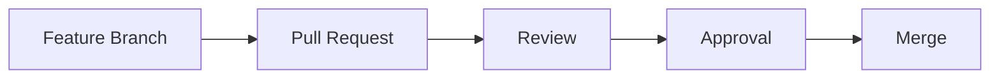
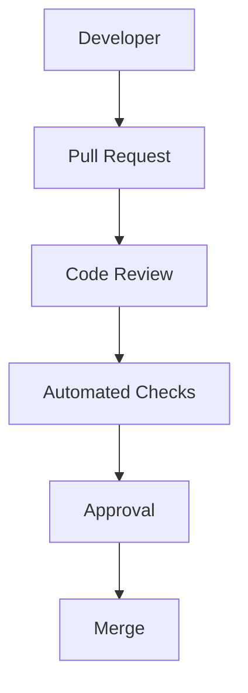
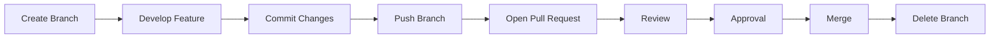
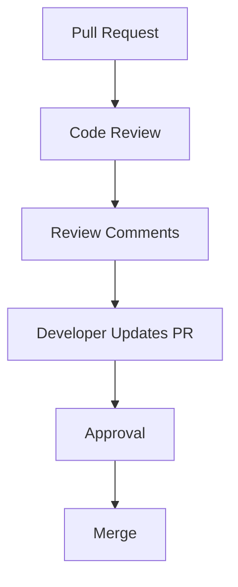
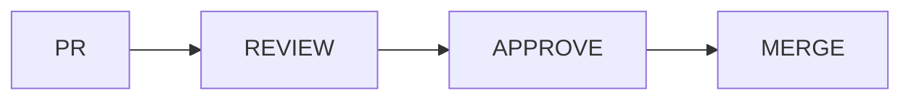
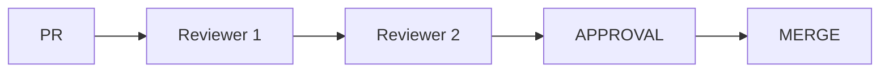
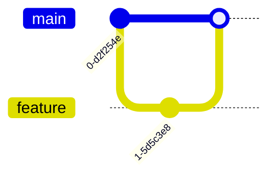
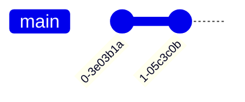
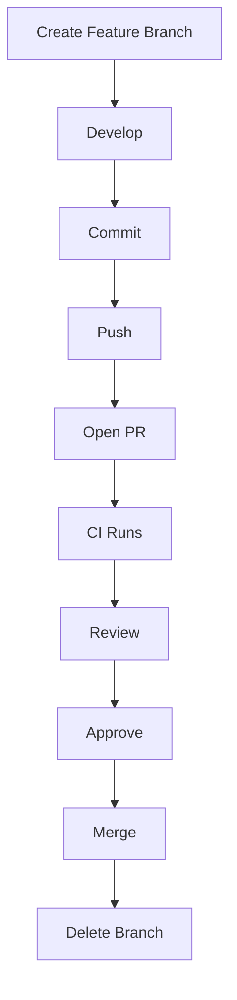

# Pull Requests and Code Reviews

---

# Learning Objectives

By the end of this chapter, you will understand:

* What Pull Requests (PRs) are
* Why Pull Requests are important
* The complete PR lifecycle
* How to create effective Pull Requests
* How to review Pull Requests professionally
* Approval workflows
* Review comments and feedback practices
* Merge policies
* Code review etiquette
* Common review workflows used in industry
* Troubleshooting common PR issues
* Best practices for successful collaboration

---

# Introduction

Modern software development is rarely a solo activity.

Even highly experienced developers benefit from:

* Peer review
* Knowledge sharing
* Quality assurance
* Design discussions
* Automated testing

The primary mechanism for achieving this in Git-based workflows is the:

> **Pull Request (PR)**

A Pull Request allows developers to propose changes, discuss implementation details, run automated checks, and obtain approval before code is merged into a shared branch.

---

# What Is a Pull Request?

A Pull Request is a request to merge changes from one branch into another.

Example:

```text id="3t9r4z"
feature/user-authentication
            ↓
      Pull Request
            ↓
           main
```

---

## Purpose of a Pull Request

A Pull Request exists to:

* Review code
* Detect bugs
* Improve maintainability
* Discuss architecture
* Validate tests
* Ensure coding standards

---

## Simple Workflow



---

# Why Pull Requests Matter

Without Pull Requests:

```text id="z3x8sa"
Developer
     ↓
Direct Merge
     ↓
Production
```

Potential issues:

* Bugs
* Security vulnerabilities
* Poor architecture
* Missing tests

---

## With Pull Requests



This significantly improves software quality.

---

# Pull Request Lifecycle

---

# Overview

A Pull Request typically follows this lifecycle:



---

# Step 1: Create Feature Branch

Example:

```bash id="8a1t4m"
git checkout -b feature/user-authentication
```

---

# Step 2: Develop Feature

Example:

```text id="9j2klh"
Add login endpoint
Add JWT support
Write tests
Update documentation
```

---

# Step 3: Commit Changes

```bash id="6y5qpb"
git commit -m "Add JWT authentication"
```

---

# Step 4: Push Branch

```bash id="kn8j8w"
git push origin feature/user-authentication
```

---

# Step 5: Open Pull Request

GitHub typically displays:

```text id="7ozs6y"
Compare & Pull Request
```

after pushing a branch.

---

# Step 6: Code Review

Reviewers inspect:

* Code quality
* Tests
* Architecture
* Security
* Performance

---

# Step 7: Approval

Reviewers approve changes.

Example:

```text id="6r8jke"
Approved
```

---

# Step 8: Merge

Changes become part of:

```text id="4z7vpo"
main
```

---

# Step 9: Delete Branch

Example:

```bash id="4z6wbw"
git branch -d feature/user-authentication
```

---

# Creating Effective Pull Requests

---

# Characteristics of a Good PR

A good Pull Request is:

* Small
* Focused
* Easy to review
* Well documented
* Tested

---

## Good Example

```text id="8uw4k8"
Feature: Add JWT Authentication
```

Contains:

* Authentication logic
* Tests
* Documentation

---

## Bad Example

```text id="4v4tly"
Authentication
Payments
Notifications
Database Refactor
UI Changes
```

all in one Pull Request.

---

# PR Size Guidelines

| PR Size       | Recommendation     |
| ------------- | ------------------ |
| <100 lines    | Excellent          |
| 100-400 lines | Good               |
| 400-800 lines | Review carefully   |
| 800+ lines    | Consider splitting |

---

# Pull Request Components

A professional PR usually includes:

* Title
* Description
* Screenshots (if applicable)
* Test results
* Related issue references

---

# Example Pull Request

Title:

```text id="bkhz8u"
Add JWT Authentication
```

Description:

```text id="rj6b4j"
## Summary

Implemented JWT-based authentication.

## Changes

- Added login endpoint
- Added token validation
- Added refresh tokens
- Added unit tests

## Testing

- Unit tests passed
- Integration tests passed

## Related Issue

Fixes #42
```

---

# Pull Request Template

Many teams use templates.

---

## Example Template

```markdown id="0v7u6l"
## Summary

Describe the purpose of this change.

---

## Changes Made

- Change 1
- Change 2
- Change 3

---

## Testing

- [ ] Unit tests
- [ ] Integration tests
- [ ] Manual testing

---

## Screenshots

Attach screenshots if applicable.

---

## Related Issues

Fixes #
```

---

# Reviewing Pull Requests

---

# Purpose of Code Reviews

Code reviews help:

* Find defects
* Improve code quality
* Spread knowledge
* Enforce standards
* Improve maintainability

---

# Review Workflow



---

# What Reviewers Should Check

---

## Correctness

Questions:

```text id="l2p6v1"
Does the code work?
Does it solve the problem?
```

---

## Readability

Questions:

```text id="dcv4yx"
Is the code understandable?
```

---

## Maintainability

Questions:

```text id="4q7k9o"
Can future developers maintain it?
```

---

## Security

Questions:

```text id="w1d6j3"
Are there vulnerabilities?
```

---

## Performance

Questions:

```text id="m8t5vu"
Will this scale?
```

---

## Testing

Questions:

```text id="4n8sfg"
Are tests included?
```

---

# Code Review Checklist

| Item           | Verify                     |
| -------------- | -------------------------- |
| Functionality  | Works correctly            |
| Tests          | Included and passing       |
| Security       | No obvious vulnerabilities |
| Readability    | Easy to understand         |
| Documentation  | Updated                    |
| Performance    | Reasonable                 |
| Error Handling | Present                    |
| Logging        | Appropriate                |

---

# Review Comments

---

# Constructive Feedback

Good reviews focus on:

```text id="v1h4ep"
Code
```

not:

```text id="2x6mjs"
People
```

---

## Good Comment

```text id="l9d1xb"
Could we extract this logic into a helper function
to improve readability?
```

---

## Bad Comment

```text id="4o7rhc"
This code is bad.
```

---

# Types of Review Comments

---

## Suggestion

```text id="w5n8eo"
Consider using a dictionary lookup instead of
multiple if statements.
```

---

## Question

```text id="v7f4jx"
Why was this approach chosen over caching?
```

---

## Nitpick

```text id="i5j2nd"
Minor naming suggestion.
```

---

## Required Change

```text id="j8n3vz"
Input validation is missing.
Please address before merging.
```

---

# Approval Workflows

---

# Single Approval

Common in small teams.



---

# Multiple Approvals

Common in larger organizations.



---

# Senior Engineer Approval

Some teams require:

```text id="8h9wkt"
At least one senior reviewer
```

before merging.

---

# Security Approval

Sensitive systems may require:

```text id="h7f2mn"
Security Team Approval
```

before deployment.

---

# Review States

GitHub commonly supports:

---

## Comment

```text id="8w3f7r"
General feedback
```

---

## Approve

```text id="x1k8sy"
Looks good to merge
```

---

## Request Changes

```text id="o6m4pj"
Changes required before approval
```

---

# Handling Review Feedback

---

## Step 1

Read comments carefully.

---

## Step 2

Update code.

---

## Step 3

Commit fixes.

```bash id="2u7ywb"
git commit -m "Address review comments"
```

---

## Step 4

Push updates.

```bash id="w8j4dp"
git push
```

---

## Step 5

Respond professionally.

Example:

```text id="t9k5vz"
Thanks for the feedback.
I've updated the validation logic.
```

---

# Merge Policies

---

# What Are Merge Policies?

Rules controlling how Pull Requests are merged.

---

# Common Policies

| Policy              | Purpose                    |
| ------------------- | -------------------------- |
| Review Required     | Prevent unreviewed merges  |
| Passing CI Required | Ensure tests pass          |
| Branch Protection   | Protect important branches |
| Multiple Approvals  | Increase quality           |
| Linear History      | Enforce clean history      |

---

# Branch Protection

Protects:

```text id="6n8d2t"
main
develop
release
```

from unsafe changes.

---

## Common Rules

Require:

* Pull Requests
* Reviews
* Passing tests
* No force pushes

---

# Merge Methods

GitHub supports multiple merge methods.

---

# Merge Commit

Preserves branch structure.



---

# Squash Merge

Combines all commits.



Creates cleaner history.

---

# Rebase Merge

Replays commits onto target branch.

Produces:

```text id="9k3c1g"
Linear History
```

without a merge commit.

---

# Professional Pull Request Workflow



---

# Common Pull Request Mistakes

| Mistake                  | Consequence           |
| ------------------------ | --------------------- |
| Huge PRs                 | Difficult reviews     |
| No description           | Reviewer confusion    |
| Missing tests            | Lower quality         |
| Mixing multiple features | Hard to understand    |
| Ignoring feedback        | Slower approvals      |
| Poor commit history      | Difficult maintenance |

---

# Troubleshooting

---

# Problem: Merge Conflicts

PR cannot merge.

---

## Fix

Update branch:

```bash id="9m8r4s"
git checkout feature
git pull origin main
```

Resolve conflicts.

Push again.

---

# Problem: CI Checks Failing

Review:

```text id="4u9zkw"
Build logs
Test output
Lint results
```

Fix issues.

Push updates.

---

# Problem: Reviewer Requests Changes

Read comments carefully.

Update code.

Push fixes.

Do not open a new PR.

---

# Problem: PR Includes Unrelated Changes

Cause:

```text id="6s4qpd"
Branch created incorrectly
```

Solution:

Create a clean branch from the correct base.

---

# Problem: Too Many Commits

Clean history:

```bash id="2q5fws"
git rebase -i
```

Squash unnecessary commits.

---

# Best Practices

---

## Keep Pull Requests Small

Smaller PRs:

* Faster reviews
* Better quality
* Fewer conflicts

---

## Write Clear Descriptions

Always explain:

* What changed
* Why it changed
* How it was tested

---

## Include Tests

Every meaningful feature should include:

```text id="7x3c2v"
Automated tests
```

when appropriate.

---

## Review Promptly

Do not leave Pull Requests waiting for days.

---

## Be Respectful

Reviews are collaborative.

Focus on improving code.

---

## Respond to Every Significant Comment

Avoid silent updates.

Communicate changes clearly.

---

## Use Draft PRs

For work in progress:

```text id="5m8q1x"
Draft Pull Request
```

prevents accidental merges.

---

# Pull Request Checklist

Before Opening a PR:

```text id="1b7n8f"
☐ Code compiles
☐ Tests pass
☐ Documentation updated
☐ Commit messages cleaned
☐ Branch up to date
☐ No debug code
☐ No secrets committed
☐ PR description completed
```

---

# Interview Questions and Answers

---

## Q1: What is a Pull Request?

### Answer

A Pull Request is a request to merge changes from one branch into another after review and validation.

---

## Q2: Why are Pull Requests important?

### Answer

They improve code quality through review, testing, discussion, and controlled merging.

---

## Q3: What should a reviewer look for?

### Answer

Correctness, readability, maintainability, security, performance, and testing coverage.

---

## Q4: What is branch protection?

### Answer

A set of rules preventing unsafe changes to important branches such as `main`.

---

## Q5: What is the difference between Approve and Request Changes?

### Answer

Approve indicates readiness to merge, while Request Changes requires modifications before approval.

---

## Q6: Why should Pull Requests be small?

### Answer

Small Pull Requests are easier to understand, review, test, and merge.

---

## Q7: What are common merge methods?

### Answer

Merge Commit, Squash Merge, and Rebase Merge.

---

## Q8: What should a Pull Request description include?

### Answer

Summary, changes made, testing information, and related issues.

---

## Q9: What is a Draft Pull Request?

### Answer

A Pull Request marked as work in progress and not ready for final review or merging.

---

## Q10: How should developers respond to review feedback?

### Answer

Professionally, respectfully, and with clear explanations of changes made.

---

# Chapter Summary

In this chapter, you learned:

* Pull Requests are the foundation of modern Git collaboration workflows.
* A Pull Request moves through a lifecycle of creation, review, approval, merging, and cleanup.
* Effective Pull Requests are small, focused, tested, and well documented.
* Code reviews improve quality, maintainability, security, and team knowledge sharing.
* Review comments should be constructive, specific, and professional.
* Approval workflows vary from simple single-review models to multi-stage enterprise review processes.
* Branch protection and merge policies help maintain repository integrity.
* GitHub supports Merge Commit, Squash Merge, and Rebase Merge strategies.
* Good communication and respectful collaboration are essential for successful reviews.
* Small Pull Requests, clear descriptions, passing tests, and timely reviews significantly improve development velocity and code quality.

Mastering Pull Requests and code reviews is one of the most important skills for professional software engineering because it sits at the intersection of collaboration, quality assurance, knowledge sharing, and modern development workflows.
