# Git Rebasing and History Rewriting

---

# Learning Objectives

By the end of this chapter, you will understand:

* What Git rebasing is
* Why rebasing exists
* How rebasing works internally
* The difference between rebasing and merging
* Linear vs non-linear history
* Interactive rebasing
* Squashing commits
* Reordering commits
* Editing commit messages
* Dropping commits
* Rewriting Git history safely
* When rebasing is appropriate
* When rebasing should be avoided
* Common rebase problems and solutions
* Professional rebasing workflows

---

# Introduction

Git provides two primary ways to integrate changes between branches:

1. **Merge**
2. **Rebase**

Both achieve the same goal:

> Combine work from multiple branches.

However, they do so in very different ways.

Merging preserves branch history.

Rebasing rewrites branch history.

Understanding this distinction is critical because rebasing is one of Git's most powerful—and potentially dangerous—features.

---

# What Is Rebasing?

Rebasing is the process of moving or replaying commits onto a new base commit.

In simple terms:

> Git takes your commits, temporarily removes them, moves the branch, and reapplies the commits on top of a different location.

---

## Conceptual Example

Suppose:

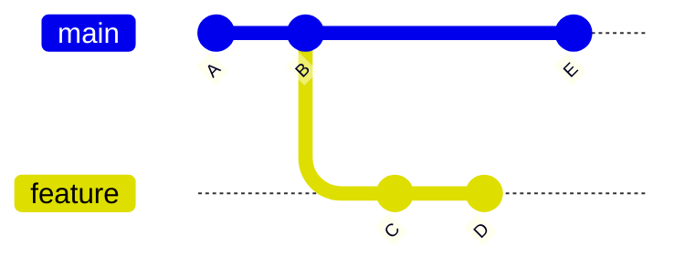

Current state:

```text
main    → E
feature → D
```

The feature branch started from:

```text
B
```

but `main` has advanced to:

```text
E
```

---

## Goal

Move:

```text
C
D
```

onto:

```text
E
```

instead of:

```text
B
```

---

# What Happens During Rebase?

Command:

```bash
git checkout feature
git rebase main
```

Git:

1. Finds common ancestor
2. Temporarily removes commits
3. Moves branch to new base
4. Reapplies commits one by one

---

## Before Rebase


---

## After Rebase

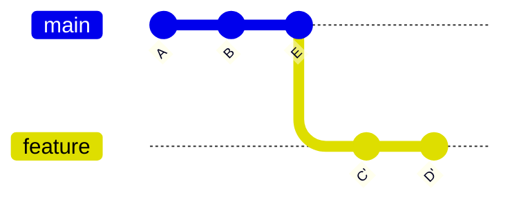

Notice:

```text
C' and D'
```

are new commits.

Git recreated them.

---

# Why Rebasing Exists

Rebasing helps create:

```text
Clean
Linear
Readable
History
```

Instead of preserving branch divergence.

---

## Example Problem

After months of development:

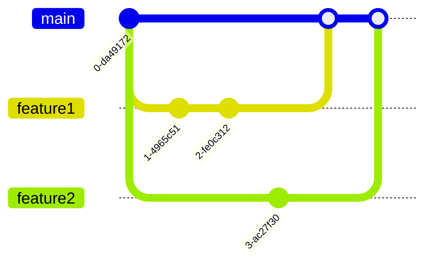

History becomes complex.

---

## Rebase Solution

Rebase creates:

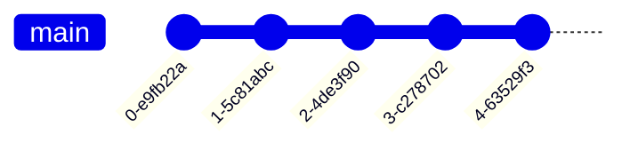

A simpler linear history.

---

# Merge vs Rebase

---

# Overview

| Feature                  | Merge    | Rebase        |
| ------------------------ | -------- | ------------- |
| Rewrites history         | No       | Yes           |
| Preserves branch history | Yes      | No            |
| Creates merge commits    | Usually  | No            |
| Linear history           | No       | Yes           |
| Safer for teams          | Yes      | Requires care |
| Cleaner history          | Moderate | Excellent     |

---

# Merge Workflow

---

## Example

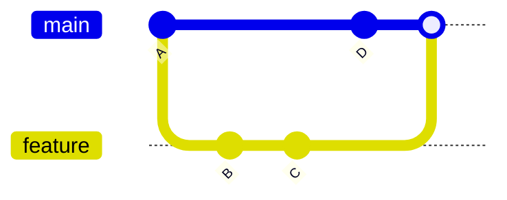

Produces:

```text
Merge Commit
```

History preserves branching structure.

---

# Rebase Workflow

---

## Example

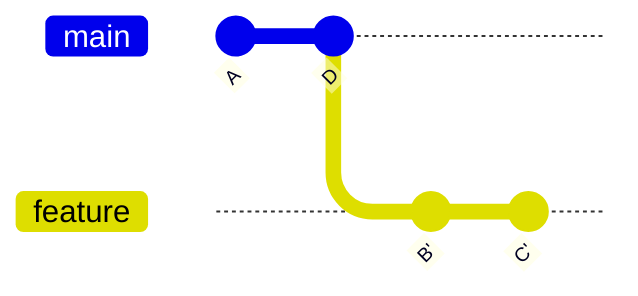

Produces:

```text
Linear History
```

No merge commit.

---

# Visual Comparison

---

## Merge

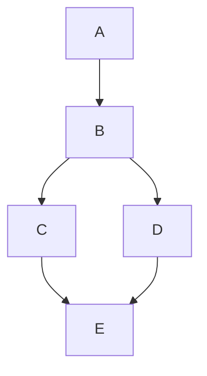

---

## Rebase

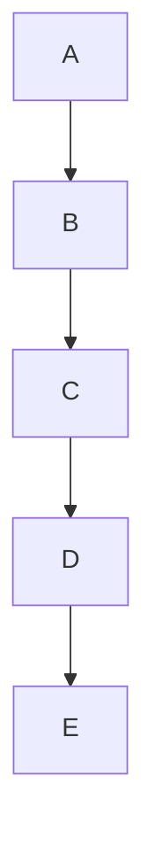

---

# Basic Rebase Workflow

---

## Step 1

Update main:

```bash
git checkout main
git pull
```

---

## Step 2

Switch to feature:

```bash
git checkout feature
```

---

## Step 3

Rebase:

```bash
git rebase main
```

---

## Step 4

Resolve conflicts if necessary.

---

## Step 5

Continue:

```bash
git rebase --continue
```

---

# Example: Feature Branch Rebase

---

## Initial State

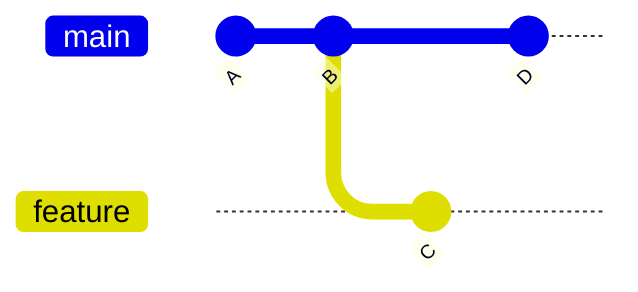

---

## Rebase Command

```bash
git checkout feature
git rebase main
```

---

## Result

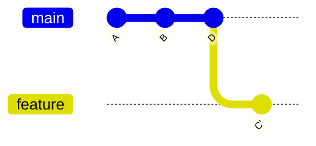

---

# Interactive Rebase

---

# What Is Interactive Rebase?

Interactive rebase allows you to:

* Reorder commits
* Squash commits
* Edit commits
* Rename commit messages
* Remove commits
* Split commits

It is one of Git's most powerful tools.

---

## Start Interactive Rebase

Last 3 commits:

```bash
git rebase -i HEAD~3
```

---

## Example Editor Window

```text
pick a1b2c3 Add login page
pick d4e5f6 Fix typo
pick g7h8i9 Update tests
```

Git pauses and waits for instructions.

---

# Interactive Rebase Commands

| Command | Meaning                     |
| ------- | --------------------------- |
| pick    | Keep commit                 |
| reword  | Change message              |
| edit    | Modify commit               |
| squash  | Combine commits             |
| fixup   | Combine and discard message |
| drop    | Remove commit               |

---

# Reordering Commits

---

## Original

```text
pick A Add login
pick B Fix bug
pick C Add tests
```

---

## Reordered

```text
pick A Add login
pick C Add tests
pick B Fix bug
```

Git rebuilds history in the new order.

---

# Editing Commit Messages

---

## Original

```text
pick A update
```

Replace:

```text
reword A update
```

Git opens an editor.

New message:

```text
Add authentication endpoint
```

---

# Squashing Commits

---

# What Is Squashing?

Squashing combines multiple commits into one.

---

## Before


History:

```text
Add login page
Fix typo
Fix CSS
Update tests
```

---

## Interactive Rebase

```bash
git rebase -i HEAD~4
```

---

## Editor

```text
pick A Add login page
squash B Fix typo
squash C Fix CSS
squash D Update tests
```

---

## Result

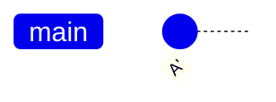

Single clean commit.

---

# Why Squash Commits?

Feature development often produces:

```text
Fix typo
Oops
Forgot file
Another fix
Final fix
```

Instead of preserving all of them:

```text
One clean commit
```

is easier to review.

---

# Fixup Commits

---

## Example

```text
pick A Add login
fixup B Fix typo
```

Result:

```text
Single Commit
```

The second commit message is discarded automatically.

---

# Dropping Commits

---

## Remove a Commit

Interactive rebase:

```text
pick A Add login
drop B Debug code
pick C Add tests
```

Commit B disappears.

---

# Editing Commits

---

## Example

```text
edit A Add login
```

Git pauses.

You modify files.

Then:

```bash
git add .
git commit --amend
git rebase --continue
```

---

# Rewriting History

---

# What Is History Rewriting?

Any operation that changes existing commit identities.

Examples:

* Rebase
* Squash
* Amend
* Filter operations
* Interactive rebase

---

## Why Commits Change

Each commit contains:

* Parent reference
* Message
* Tree
* Metadata

Changing any of these changes:

```text
Commit SHA
```

---

## Example

Original:

```text
A → B → C
```

After rebase:

```text
A → B' → C'
```

New commits created.

---

# Commit Identity Example

Before:

```text
abc123
```

After message edit:

```text
xyz789
```

Completely new commit.

---

# Safe Rebasing Practices

---

# Golden Rule

> Never rebase shared public history.

---

## Safe

```text
Your local feature branch
```

---

## Dangerous

```text
Shared team branch
main
develop
```

---

# Why?

Suppose:

Developer A:

```text
Commit A
Commit B
```

Pushes branch.

Developer B pulls it.

Developer A rebases.

History becomes:

```text
Commit A'
Commit B'
```

Now Developer B's history is incompatible.

---

# Safe Workflow


Only rebase before others depend on the branch.

---

# Force Push After Rebase

After rebasing a pushed branch:

```bash
git push --force-with-lease
```

---

## Why Not Plain Force Push?

Avoid:

```bash
git push --force
```

Safer:

```bash
git push --force-with-lease
```

because it checks for remote updates first.

---

# Rebase Conflict Resolution

---

# Why Conflicts Occur

Git replays commits one at a time.

Any replay can conflict.

---

## Example

```python
username = "admin"
```

Main branch:

```python
username = "root"
```

Feature branch:

```python
username = "administrator"
```

Conflict occurs.

---

# Rebase Conflict Workflow

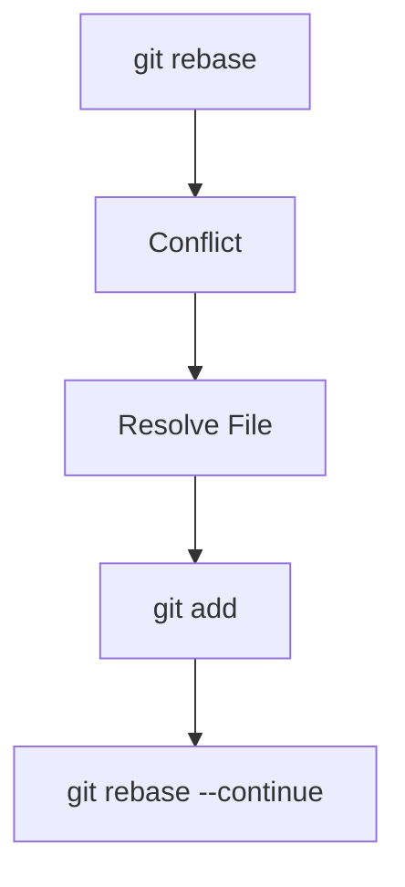

---

# Continue Rebase

After fixing conflicts:

```bash
git add .
git rebase --continue
```

---

# Skip Commit

Ignore problematic commit:

```bash
git rebase --skip
```

---

# Abort Rebase

Cancel everything:

```bash
git rebase --abort
```

Return to original state.

---

# Common Rebase Commands

| Command                 | Purpose                 |
| ----------------------- | ----------------------- |
| `git rebase main`       | Rebase onto main        |
| `git rebase -i HEAD~3`  | Interactive rebase      |
| `git rebase --continue` | Continue after conflict |
| `git rebase --abort`    | Cancel rebase           |
| `git rebase --skip`     | Skip commit             |
| `git commit --amend`    | Modify latest commit    |

---

# Professional Rebase Workflow

---

## Step 1

Update main:

```bash
git checkout main
git pull
```

---

## Step 2

Switch branch:

```bash
git checkout feature/auth
```

---

## Step 3

Rebase:

```bash
git rebase main
```

---

## Step 4

Resolve conflicts.

---

## Step 5

Run tests.

---

## Step 6

Push:

```bash
git push --force-with-lease
```

---

## Step 7

Open Pull Request.

---

# When to Use Rebase

Use rebase for:

* Cleaning feature branches
* Updating feature branches
* Squashing commits
* Preparing Pull Requests
* Maintaining linear history

---

# When NOT to Use Rebase

Avoid rebasing:

* Shared branches
* Public branches
* Released history
* Production branches
* Branches used by other developers

---

# Best Practices

---

## Rebase Small Branches Frequently

Good:

```text
Daily rebasing
```

Bad:

```text
Rebasing after three months
```

---

## Use Interactive Rebase Before PRs

Clean:

```text
1–5 meaningful commits
```

instead of:

```text
25 noisy commits
```

---

## Prefer Force-With-Lease

```bash
git push --force-with-lease
```

---

## Never Rebase Main

Avoid:

```bash
git rebase main
```

while currently on:

```text
main
```

unless you fully understand the consequences.

---

## Run Tests After Rebase

Always verify:

```text
Code still works
```

because commits were replayed.

---

# Common Mistakes

| Mistake                      | Consequence              |
| ---------------------------- | ------------------------ |
| Rebasing shared branches     | Team disruption          |
| Force pushing carelessly     | Lost commits             |
| Ignoring conflicts           | Broken code              |
| Large rebases                | Difficult resolution     |
| Not testing after rebase     | Hidden bugs              |
| Rewriting production history | Severe repository issues |

---

# Troubleshooting

---

# Problem: Rebase Conflict

Error:

```text
CONFLICT (content)
```

---

## Fix

Resolve files.

Then:

```bash
git add .
git rebase --continue
```

---

# Problem: Rebase Taking Too Long

Cause:

```text
Too many commits
```

Solution:

Rebase smaller branches more frequently.

---

# Problem: Accidentally Rebasing Wrong Branch

Check:

```bash
git status
```

Current branch:

```text
On branch feature-auth
```

Abort:

```bash
git rebase --abort
```

---

# Problem: Lost Commit After Rebase

Use:

```bash
git reflog
```

Find old commit SHA.

Restore:

```bash
git checkout <sha>
```

---

# Problem: Push Rejected After Rebase

Expected behavior.

Use:

```bash
git push --force-with-lease
```

---

# Rebase vs Merge Summary

| Aspect         | Merge          | Rebase          |
| -------------- | -------------- | --------------- |
| History        | Preserved      | Rewritten       |
| Merge Commit   | Usually        | No              |
| Linear History | No             | Yes             |
| Complexity     | Lower          | Higher          |
| Team Safety    | Higher         | Lower           |
| Clean History  | Moderate       | Excellent       |
| Preferred For  | Shared history | Feature cleanup |

---

# Interview Questions and Answers

---

## Q1: What is Git rebase?

### Answer

Git rebase moves or reapplies commits onto a new base commit, creating a linear history.

---

## Q2: What is the difference between merge and rebase?

### Answer

Merge preserves branch history and creates merge commits, while rebase rewrites history by replaying commits onto a new base.

---

## Q3: Does rebasing create new commits?

### Answer

Yes. Rebasing recreates commits with new SHA identifiers.

---

## Q4: What is interactive rebase?

### Answer

A mode that allows editing, reordering, squashing, dropping, and modifying commits before rebuilding history.

---

## Q5: What does `git rebase -i HEAD~3` do?

### Answer

It starts an interactive rebase for the last three commits.

---

## Q6: What is commit squashing?

### Answer

Combining multiple commits into a single commit.

---

## Q7: Why is rebasing considered history rewriting?

### Answer

Because commit identities change and new commits replace old ones.

---

## Q8: Why should developers avoid rebasing shared branches?

### Answer

Because rewritten history can break synchronization with other developers' repositories.

---

## Q9: What does `git rebase --abort` do?

### Answer

It cancels the rebase and restores the repository to its original state.

---

## Q10: Why is `--force-with-lease` preferred over `--force`?

### Answer

Because it protects against accidentally overwriting commits pushed by other developers.

---

# Chapter Summary

In this chapter, you learned:

* Rebasing replays commits onto a new base commit.
* Rebase creates a clean, linear project history.
* Unlike merging, rebasing rewrites commit history.
* Interactive rebase allows reordering, editing, squashing, dropping, and renaming commits.
* Squashing combines multiple commits into a single logical commit.
* Rewriting history changes commit SHA identifiers.
* Rebasing is safest on local feature branches.
* Public and shared branches should generally not be rebased.
* Conflicts during rebase are resolved similarly to merge conflicts.
* `git rebase --continue`, `--skip`, and `--abort` are essential recovery commands.
* Professional teams often use rebasing to prepare clean pull requests while preserving a readable project history.

A solid understanding of rebasing and history rewriting enables developers to maintain clean repositories, produce high-quality commit histories, and collaborate effectively in modern Git-based development workflows.
