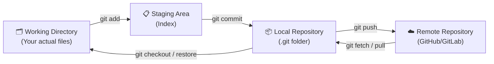
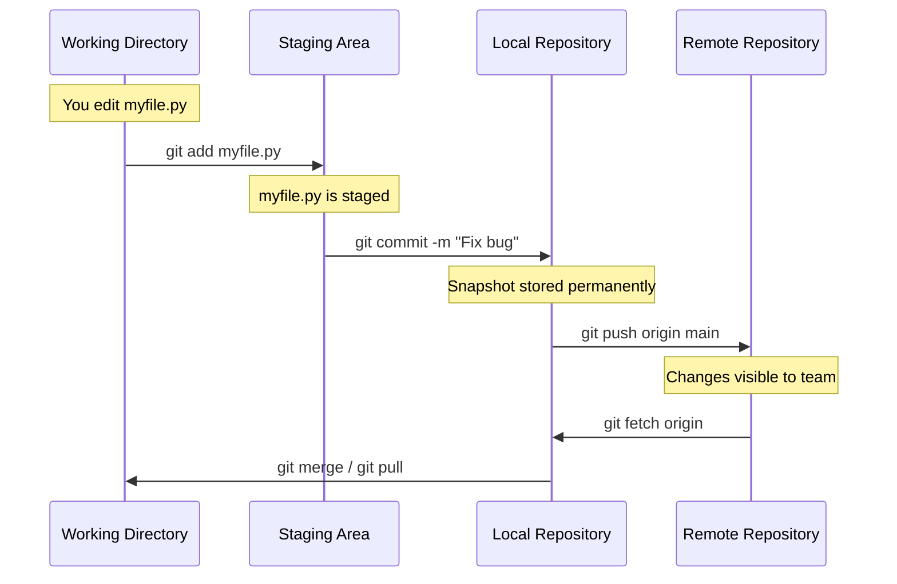
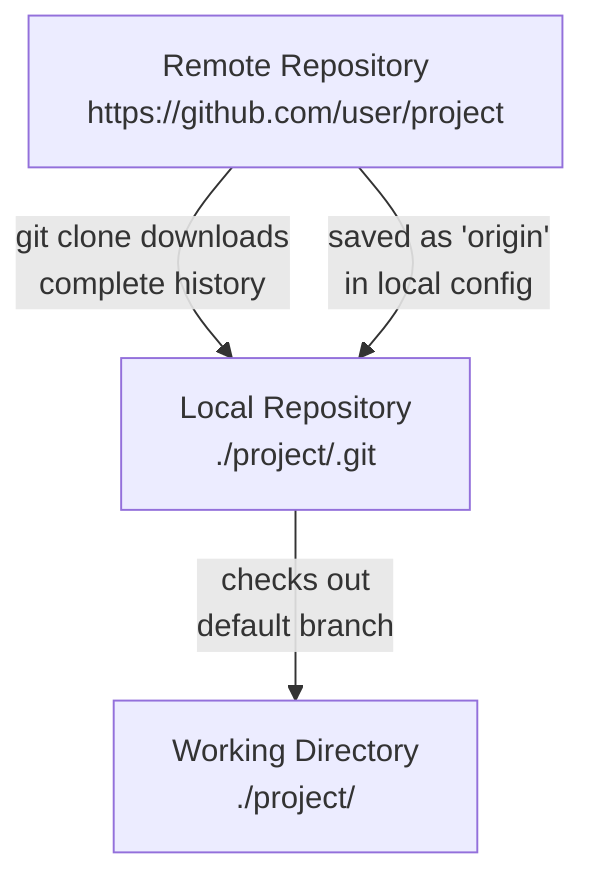
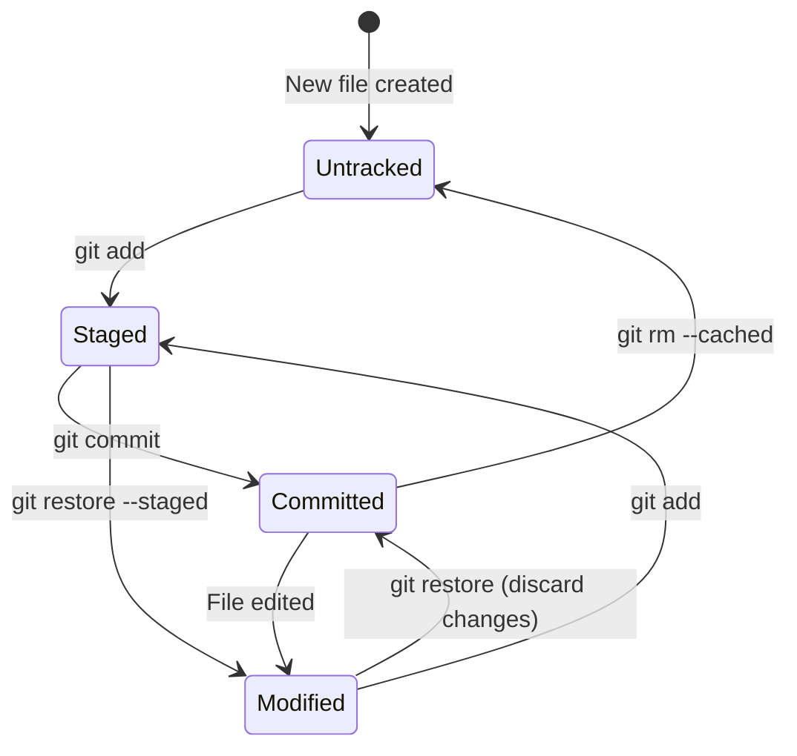
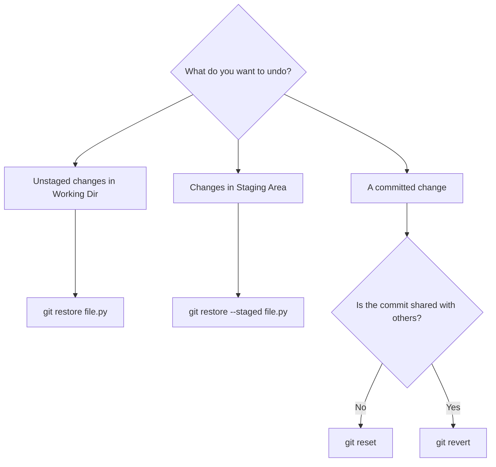
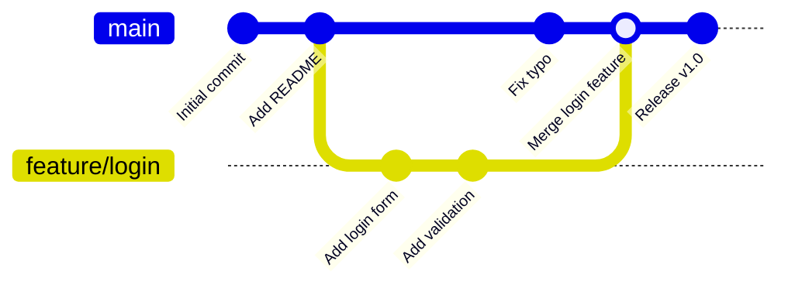

# Git Fundamentals: Beginner to Intermediate

> **A comprehensive handbook for software engineers, open-source contributors, and professional developers.**

---

## Table of Contents

1. [Introduction to Version Control](#part-1-introduction-to-version-control)
2. [Git Architecture](#part-2-git-architecture)
3. [Installing Git](#part-3-installing-git)
4. [Initial Configuration](#part-4-initial-configuration)
5. [Creating Repositories](#part-5-creating-repositories)
6. [Git File Lifecycle](#part-6-git-file-lifecycle)
7. [Core Commands](#part-7-core-commands)
8. [Ignoring Files](#part-8-ignoring-files)
9. [Viewing History](#part-9-viewing-history)
10. [Undoing Changes](#part-10-undoing-changes)
11. [Daily Git Workflow](#part-11-daily-git-workflow)
12. [Beginner Mistakes](#part-12-beginner-mistakes)
13. [Cheat Sheet](#part-13-cheat-sheet)

---

## Part 1: Introduction to Version Control

### What Is Version Control?

Imagine you are writing a novel. Every day you make changes — you rewrite chapters, delete scenes, rearrange paragraphs. Now imagine that three months in, you realize the version from six weeks ago was better. Without any system in place, that version is gone forever.

Version control solves this problem for software. A **Version Control System (VCS)** is a tool that records every change made to a set of files over time, so you can recall any specific version later. It is essentially a time machine for your code.

More formally, a VCS:
- Records a complete history of every change made to your project.
- Lets you revert any file (or the entire project) to a previous state.
- Lets you compare changes over time.
- Shows who made which change and when.
- Lets multiple people collaborate on the same files without overwriting each other's work.

### Why Version Control Exists

Before version control, developers used primitive strategies:

- Saving files like `project_final.py`, `project_final_v2.py`, `project_final_ACTUALLY_FINAL.py`.
- Emailing zip archives of code back and forth between collaborators.
- Using shared network drives where anyone could accidentally delete or overwrite files.

These approaches led to constant problems: lost work, conflicting changes, no accountability, and extreme difficulty figuring out what changed and why.

Version control was invented to solve all of these problems systematically.

### Local vs. Centralized vs. Distributed Version Control

There are three generations of version control systems.

#### Local Version Control

The earliest systems kept a simple database on a single machine that tracked changes to files using a technique called patch sets (the differences between file versions).

**Problem:** Everything lives on one machine. If your hard drive fails, you lose everything. If you want to collaborate with someone, there is no good mechanism.

```
Your Computer
┌─────────────────────┐
│  Version Database   │
│  ┌───────────────┐  │
│  │ Version 3     │  │
│  │ Version 2     │  │
│  │ Version 1     │  │
│  └───────────────┘  │
│  Working Files      │
└─────────────────────┘
```

#### Centralized Version Control (CVCS)

Systems like CVS and Subversion (SVN) introduced a single central server that holds all versioned files. Clients check out files from that central place.

**Advantages over local:** Teams can collaborate. Administrators can control who can do what.

**Problems:**
- Single point of failure. If the server goes down, nobody can commit or collaborate.
- If the central server's hard drive is corrupted without a backup, the entire history is lost.
- Requires a network connection to commit changes.

```
              Central Server
              ┌─────────────┐
              │  Version DB  │
              └──────┬──────┘
         ┌───────────┼───────────┐
         ↓           ↓           ↓
   Developer A  Developer B  Developer C
```

#### Distributed Version Control (DVCS)

Systems like Git and Mercurial take a fundamentally different approach. Every client has a **full copy** of the entire repository, including its complete history. Every clone is a full backup.

**Advantages:**
- No single point of failure. Every developer has the full history.
- Most operations are local and extremely fast (no network required).
- Many different workflows are possible (centralized, fork-based, peer-to-peer, etc.).
- You can work offline and sync later.

```
        Remote Repository (GitHub/GitLab/etc.)
              ┌─────────────┐
              │  Full Repo  │
              └──────┬──────┘
         ┌───────────┼───────────┐
         ↓           ↓           ↓
  ┌────────────┐ ┌────────────┐ ┌────────────┐
  │ Full Repo  │ │ Full Repo  │ │ Full Repo  │
  │ Dev A      │ │ Dev B      │ │ Dev C      │
  └────────────┘ └────────────┘ └────────────┘
```

### Why Git Became the Industry Standard

Git was created by **Linus Torvalds** in 2005 to manage the development of the Linux kernel — one of the largest open-source projects in the world, with thousands of contributors.

Git won out over competitors for several reasons:

| Feature | Git's Advantage |
|---|---|
| **Speed** | Nearly all operations are local. No network round-trips for history, diffs, or commits. |
| **Data Integrity** | Every object in Git is checksummed with SHA-1. Corruption is detectable. |
| **Branching** | Git branches are incredibly lightweight. Creating a branch takes milliseconds. |
| **Distributed** | Every clone is a full backup with complete history. |
| **Open Source** | Free to use, with massive community and tooling support. |
| **Ecosystem** | GitHub, GitLab, Bitbucket built around it, making collaboration ubiquitous. |

Today, Git is used by virtually every software company in the world. According to the Stack Overflow Developer Survey, over 95% of professional developers use Git.

### Real-World Use Cases

**Software Development:** Tracking every line of code change, enabling team collaboration, facilitating code reviews via pull requests.

**Open-Source Contributions:** Forking a project, making improvements, and submitting a pull request for the maintainer to review and merge.

**DevOps & CI/CD:** Triggering automated build and deployment pipelines whenever code is pushed to specific branches.

**Documentation:** Technical writers use Git to version control docs just like code.

**Data Science:** Versioning Jupyter notebooks, datasets, and model configurations.

**Game Development:** Tracking changes to game scripts, configurations, and assets.

---

## Part 2: Git Architecture

Understanding Git's internal architecture is not optional — it is the key to using Git confidently. Most Git confusion comes from not understanding where data lives at each stage.

Git has four distinct zones where your data can live.

### The Four Zones



### Working Directory

The **Working Directory** (also called the Working Tree) is the directory on your computer where your project files live. It is what you see when you open your file manager or run `ls` in your terminal.

This is where you actually edit files. Any text editor, IDE, or tool you use to write code is operating on the Working Directory.

Files in the Working Directory can be in one of two states:
- **Tracked**: Git knows about this file (it was in the last snapshot).
- **Untracked**: Git has never seen this file before.

### Staging Area (Index)

The **Staging Area** (also called the Index) is a unique Git concept that most other VCS tools don't have.

Think of it as a loading dock between your Working Directory and the repository. Before you commit changes, you place exactly the changes you want into the staging area. This gives you precise control over what goes into each commit.

For example, you might have edited 10 files but only want to commit changes to 3 of them. You stage just those 3 files, commit them as one logical unit, then stage and commit the other 7 separately.

The staging area is physically stored in the `.git/index` file.

### Local Repository

The **Local Repository** is the `.git` directory at the root of your project. This hidden folder is where Git stores all of its data: the complete history of every commit, all branches, all tags, and all configuration.

When you run `git commit`, Git takes everything in the Staging Area, creates a snapshot, and permanently stores it in the Local Repository.

The Local Repository is entirely self-contained on your machine. You do not need internet access to commit, view history, create branches, or do most Git operations.

### Remote Repository

A **Remote Repository** is a version of your project hosted on a server, typically a service like GitHub, GitLab, or Bitbucket. It serves as the central point for collaboration.

You push your local commits to the remote so others can see your work, and you fetch or pull changes others have pushed.

A remote is just a Git repository. It follows all the same rules. The only difference is where it lives (on a server instead of your machine).

### Data Flow Summary



### Git Objects Under the Hood

Git stores everything as **objects** in the `.git/objects` directory. There are four types:

| Object Type | Description |
|---|---|
| **Blob** | The content of a single file |
| **Tree** | A directory listing, referencing blobs and other trees |
| **Commit** | A snapshot with a pointer to a tree, author info, timestamp, and parent commits |
| **Tag** | A named reference to a specific commit |

Every object is identified by the SHA-1 hash of its content. This is why Git can detect corruption: if the content changes, the hash changes.

---

## Part 3: Installing Git

### Linux

#### Ubuntu and Debian

Ubuntu and Debian use the `apt` package manager.

```bash
# Update package lists first
sudo apt update

# Install Git
sudo apt install git -y

# Verify installation
git --version
```

#### Linux Mint

Linux Mint is based on Ubuntu, so the same commands apply:

```bash
sudo apt update
sudo apt install git -y
git --version
```

#### Fedora

Fedora uses `dnf`:

```bash
sudo dnf install git -y
git --version
```

For older Fedora versions that use `yum`:

```bash
sudo yum install git -y
```

#### Arch Linux

Arch Linux uses `pacman`:

```bash
sudo pacman -S git
git --version
```

### macOS

#### Option 1: Xcode Command Line Tools (Recommended for Beginners)

Simply running any Git command for the first time triggers an installation prompt:

```bash
git --version
# A dialog will appear prompting you to install Command Line Developer Tools
# Click "Install" and follow the prompts
```

Or explicitly trigger it:

```bash
xcode-select --install
```

#### Option 2: Homebrew (Recommended for Developers)

Homebrew gives you the latest version of Git and makes updates easier:

```bash
# Install Homebrew first (if not already installed)
/bin/bash -c "$(curl -fsSL https://raw.githubusercontent.com/Homebrew/install/HEAD/install.sh)"

# Install Git
brew install git

git --version
```

#### Option 3: Official Installer

Download the official macOS Git installer from [https://git-scm.com/download/mac](https://git-scm.com/download/mac) and follow the graphical installer.

### Windows

#### Option 1: Git for Windows (Official — Recommended)

1. Go to [https://git-scm.com/download/win](https://git-scm.com/download/win)
2. Download the installer (it auto-detects 32/64-bit)
3. Run the installer, accepting the defaults (the defaults are sensible)
4. Key options to note during installation:
   - **Default editor**: Choose your preferred editor (VS Code is a good choice)
   - **PATH environment**: Choose "Git from the command line and also from 3rd-party software"
   - **Line ending conversions**: Choose "Checkout Windows-style, commit Unix-style line endings"

After installation, you will have **Git Bash** (a Unix-style terminal) and Git available in Command Prompt and PowerShell.

#### Option 2: Windows Package Manager (winget)

```powershell
winget install --id Git.Git -e --source winget
```

#### Option 3: Chocolatey

```powershell
choco install git
```

### Verifying the Installation

On any operating system, after installation, open a terminal (Terminal on Linux/macOS, Git Bash or PowerShell on Windows) and run:

```bash
git --version
# Expected output (version numbers will vary):
# git version 2.45.0
```

Also verify Git can be found:

```bash
which git        # Linux / macOS
# /usr/bin/git   or   /usr/local/bin/git

where git        # Windows (Command Prompt)
# C:\Program Files\Git\cmd\git.exe
```

---

## Part 4: Initial Configuration

Before you use Git for the first time, you must configure your identity. Git records your name and email with every commit you make, so this information becomes part of the permanent history.

### Understanding `git config`

Git stores configuration at three levels, each overriding the one before it:

| Level | Scope | Location (Linux/macOS) | Location (Windows) |
|---|---|---|---|
| `--system` | All users on this machine | `/etc/gitconfig` | `C:\Program Files\Git\etc\gitconfig` |
| `--global` | Your user account | `~/.gitconfig` | `C:\Users\YourName\.gitconfig` |
| `--local` | Current repository only | `.git/config` | `.git/config` |

For most configuration, you will use `--global`.

### Setting Your Username and Email

These are required. Git will not let you commit without them.

```bash
# Linux / macOS / Windows (Git Bash or PowerShell)
git config --global user.name "Jane Smith"
git config --global user.email "jane.smith@example.com"
```

> **Important:** Use the same email address associated with your GitHub, GitLab, or other hosting account. This is how contributions get linked to your profile.

### Setting the Default Branch Name

Historically Git named the default branch `master`. The industry has largely moved to `main`. Set your preference:

```bash
git config --global init.defaultBranch main
```

### Setting the Default Editor

Git opens a text editor when you need to write commit messages or resolve merge conflicts. Set your preferred editor:

```bash
# VS Code
git config --global core.editor "code --wait"

# Vim
git config --global core.editor "vim"

# Nano (easier for beginners)
git config --global core.editor "nano"

# Notepad++ (Windows)
git config --global core.editor "'C:/Program Files/Notepad++/notepad++.exe' -multiInst -notabbar -nosession -noPlugin"

# Sublime Text
git config --global core.editor "subl -n -w"
```

### Useful Aliases

Git aliases let you create shortcuts for commands you run frequently:

```bash
# Short status
git config --global alias.st status

# Short log with graph
git config --global alias.lg "log --oneline --graph --decorate --all"

# Undo last commit (keep changes staged)
git config --global alias.undo "reset --soft HEAD~1"

# Show all aliases
git config --global alias.aliases "config --get-regexp alias"
```

After setting these, you can run `git st` instead of `git status`, and `git lg` to see a beautiful commit graph.

### Viewing Your Configuration

```bash
# Show all configuration and where each setting comes from
git config --list --show-origin

# Show a specific value
git config user.name
git config user.email

# Edit global config in your default editor
git config --global --edit
```

### Example `~/.gitconfig`

After all the above, your `~/.gitconfig` file will look something like this:

```ini
[user]
    name = Jane Smith
    email = jane.smith@example.com
[core]
    editor = code --wait
[init]
    defaultBranch = main
[alias]
    st = status
    lg = log --oneline --graph --decorate --all
    undo = reset --soft HEAD~1
```

---

## Part 5: Creating Repositories

There are two ways to get a Git repository: initialize one from scratch, or clone an existing one.

### `git init` — Initialize a New Repository

`git init` creates a brand-new Git repository in the current directory. It creates the hidden `.git` folder that contains all of Git's data.

**Syntax:**
```bash
git init [directory]
```

**Examples:**

```bash
# Initialize in the current directory
cd my-project
git init

# Initialize a new directory (creates and initializes)
git init my-new-project
cd my-new-project
```

**What it creates:**

```
my-project/
└── .git/
    ├── HEAD          # Points to the current branch
    ├── config        # Repository-level configuration
    ├── description   # Used by GitWeb (can ignore)
    ├── hooks/        # Scripts triggered by Git events
    ├── info/
    ├── objects/      # Where all Git objects are stored
    └── refs/         # Branch and tag pointers
```

**Complete workflow for a new project:**

```bash
# 1. Create and enter your project directory
mkdir my-website
cd my-website

# 2. Initialize Git
git init

# 3. Create your first file
echo "# My Website" > README.md

# 4. Stage the file
git add README.md

# 5. Make your first commit
git commit -m "Initial commit: add README"

# 6. Connect to a remote (optional, e.g., GitHub)
git remote add origin https://github.com/yourusername/my-website.git

# 7. Push to remote
git push -u origin main
```

### `git clone` — Copy an Existing Repository

`git clone` downloads a complete copy of an existing repository, including its entire history.

**Syntax:**
```bash
git clone <url> [directory]
```

**Examples:**

```bash
# Clone from GitHub (HTTPS)
git clone https://github.com/torvalds/linux.git

# Clone from GitHub (SSH — requires SSH key setup)
git clone git@github.com:torvalds/linux.git

# Clone into a specific directory name
git clone https://github.com/user/project.git my-local-name

# Clone only the latest commit (shallow clone — faster for large repos)
git clone --depth 1 https://github.com/user/huge-project.git
```

**What happens when you clone:**



**HTTPS vs SSH:**

| Method | When to Use |
|---|---|
| HTTPS | Easier setup; prompts for username/password or token. Use if you are new. |
| SSH | No password needed after setup; uses cryptographic keys. Preferred for daily use. |

---

## Part 6: Git File Lifecycle

Every file in your Working Directory is in one of several states at any given time. Understanding this lifecycle is crucial.

### The States



### Untracked

A file that exists in your Working Directory but has never been added to Git. Git knows the file is there, but it is not tracking changes to it.

```bash
# Create a new file
touch newfile.py

# Git sees it but doesn't track it
git status
# On branch main
# Untracked files:
#   (use "git add <file>..." to include in what will be committed)
#         newfile.py
```

### Staged (Index)

A file (or specific changes to a file) that has been marked to be included in the next commit. This is done with `git add`.

```bash
git add newfile.py

git status
# On branch main
# Changes to be committed:
#   (use "git restore --staged <file>..." to unstage)
#         new file:   newfile.py
```

### Committed

The file has been permanently stored in the local repository as part of a commit snapshot.

```bash
git commit -m "Add newfile.py"

git status
# On branch main
# nothing to commit, working tree clean
```

### Modified

A tracked file that has been changed in the Working Directory since the last commit, but whose changes have not yet been staged.

```bash
# Edit the committed file
echo "print('hello')" >> newfile.py

git status
# On branch main
# Changes not staged for commit:
#   (use "git add <file>..." to update what will be committed)
#   (use "git restore <file>..." to discard changes in working directory)
#         modified:   newfile.py
```

### Visualizing It All Together

```
File State        Command
─────────         ──────────────────────────
Untracked  ──── git add ────────────────▶  Staged
Modified   ──── git add ────────────────▶  Staged
Staged     ──── git commit ─────────────▶  Committed (Unmodified)
Committed  ──── (edit file) ────────────▶  Modified
Staged     ──── git restore --staged ──▶  Modified (unstaged)
Modified   ──── git restore ────────────▶  Committed (changes discarded)
```

---

## Part 7: Core Commands

### `git status` — Check the State of Your Repository

`git status` shows the state of the Working Directory and Staging Area. It is the command you will run most often.

**Syntax:**
```bash
git status [options]
```

**Key Options:**

| Option | Description |
|---|---|
| `-s` or `--short` | Show output in short format |
| `-b` or `--branch` | Show branch information in short format |
| `-u` | Show untracked files (default: `normal`) |

**Examples:**

```bash
# Full status
git status

# Short format (two-character codes show file state)
git status -s
# M  modified.py     (M in second column = modified, not staged)
# MM both_staged.py  (M in first = staged, M in second = also modified after staging)
# A  new.py          (A = new file staged)
# ?? untracked.py    (? = untracked)
```

**Common Mistake:** Running `git status` only at the start or end of a session. You should run it constantly — before adding, before committing, and whenever you are unsure what state your repo is in. It is your compass.

---

### `git add` — Stage Changes

`git add` moves changes from the Working Directory to the Staging Area.

**Syntax:**
```bash
git add <pathspec>
```

**Key Options:**

| Option | Description |
|---|---|
| `git add <file>` | Stage a specific file |
| `git add <directory>` | Stage all changes in a directory |
| `git add .` | Stage all changes in the current directory (recursive) |
| `git add -A` | Stage all changes in the entire repo (additions, modifications, deletions) |
| `git add -p` | Interactively choose which chunks (hunks) of changes to stage |
| `git add -u` | Stage modifications and deletions but NOT new files |

**Examples:**

```bash
# Stage a single file
git add README.md

# Stage multiple files
git add app.py utils.py

# Stage all Python files
git add *.py

# Stage everything
git add .

# Interactively stage parts of a file (very useful for clean commits)
git add -p app.py
```

**`git add -p` in Action:**

The `-p` (patch) flag lets you stage individual "hunks" (chunks of changes) within a file. For each hunk, Git asks:
- `y` — Yes, stage this hunk
- `n` — No, skip this hunk
- `s` — Split this hunk into smaller hunks
- `e` — Edit the hunk manually
- `q` — Quit, don't stage any more

This is how professional developers make clean, focused commits even when they have made several unrelated changes to the same file.

**Common Mistake:** Using `git add .` blindly without knowing what you are staging. Always run `git status` first.

---

### `git commit` — Save a Snapshot

`git commit` takes everything in the Staging Area and permanently saves it as a snapshot (commit) in the Local Repository.

**Syntax:**
```bash
git commit [options] [-m <message>]
```

**Key Options:**

| Option | Description |
|---|---|
| `-m "message"` | Provide the commit message inline |
| `-a` | Automatically stage all modified and deleted tracked files before committing (skips `git add` for tracked files only) |
| `--amend` | Modify the most recent commit (message or content) |
| `-v` | Show the diff of staged changes in the editor when writing message |
| `--no-edit` | Amend without changing the message |

**Examples:**

```bash
# Basic commit with inline message
git commit -m "Add login form validation"

# Open editor for a multi-line message
git commit

# Stage and commit in one step (tracked files only)
git commit -am "Fix typo in README"

# Fix the last commit message
git commit --amend -m "Fix typo in header, not README"

# Add a forgotten file to the last commit
git add forgotten.py
git commit --amend --no-edit
```

**Writing Good Commit Messages:**

A commit message has two parts: the subject line (required) and the body (optional).

```
feat: add user authentication endpoint

Implement JWT-based authentication with refresh tokens.
The login endpoint accepts email and password, validates
credentials against the database, and returns an access
token valid for 1 hour.

Closes #42
```

**Rules for great commit messages:**
- Limit the subject line to 50 characters.
- Use the imperative mood: "Add feature" not "Added feature" or "Adding feature."
- Separate the subject from body with a blank line.
- Wrap the body at 72 characters.
- Explain *what* and *why*, not *how* (the code shows how).

**Common Commit Conventions:**

Many teams use a prefix system called **Conventional Commits**:

| Prefix | Meaning |
|---|---|
| `feat:` | A new feature |
| `fix:` | A bug fix |
| `docs:` | Documentation changes only |
| `style:` | Formatting, missing semicolons, etc. (no code change) |
| `refactor:` | Code restructuring without feature or bug change |
| `test:` | Adding or fixing tests |
| `chore:` | Build system, dependency updates, etc. |

---

### `git log` — View Commit History

`git log` displays the commit history of the repository.

**Syntax:**
```bash
git log [options]
```

**Key Options:**

| Option | Description |
|---|---|
| `--oneline` | One line per commit (hash + message) |
| `--graph` | Show ASCII art branch/merge graph |
| `--decorate` | Show branch and tag names |
| `--all` | Show all branches, not just the current one |
| `-n <number>` | Show only the last N commits |
| `--since="2 weeks ago"` | Show commits since a date |
| `--author="Jane"` | Filter by author |
| `--grep="keyword"` | Filter commits whose message contains keyword |
| `-p` | Show the patch (diff) for each commit |
| `--stat` | Show summary of files changed |
| `--follow <file>` | Follow a file's history through renames |

**Examples:**

```bash
# Default — full details, most recent first
git log

# Clean one-liner view
git log --oneline

# Beautiful graph view
git log --oneline --graph --decorate --all

# Show last 5 commits
git log -5

# Show commits by a specific author in the last month
git log --author="Jane Smith" --since="1 month ago"

# Show what changed in each commit (verbose)
git log -p

# Show commits that changed a specific file
git log --follow README.md

# Search commit messages
git log --grep="authentication"
```

**Sample output of `git log --oneline --graph --decorate`:**
```
* a3f2d1c (HEAD -> main) feat: add dark mode toggle
* b8e4120 fix: correct email validation regex
* c91f3ab (origin/main) docs: update installation guide
| * d4a78de (feature/login) feat: implement login page
|/
* e5b29c1 Initial commit
```

---

### `git diff` — Show Changes

`git diff` shows the differences between various states of your repository.

**Syntax:**
```bash
git diff [options] [commit] [-- path]
```

**Key Variants:**

| Command | Shows differences between |
|---|---|
| `git diff` | Working Directory vs Staging Area (unstaged changes) |
| `git diff --staged` | Staging Area vs Last Commit (staged changes) |
| `git diff HEAD` | Working Directory vs Last Commit (all changes) |
| `git diff commit1 commit2` | Two specific commits |
| `git diff branch1..branch2` | Two branches |

**Examples:**

```bash
# See what you have changed but not yet staged
git diff

# See what is staged and ready to commit
git diff --staged

# Compare with a specific commit
git diff a3f2d1c

# See differences for a specific file only
git diff -- README.md

# Show a statistical summary of changes
git diff --stat HEAD

# Word-level diff (great for prose/documentation)
git diff --word-diff
```

**Reading a diff:**
```diff
diff --git a/app.py b/app.py
index 8a3b2c1..f4d9e2a 100644
--- a/app.py       # "before" version
+++ b/app.py       # "after" version
@@ -10,7 +10,8 @@  # line numbers: -before +after
 def login():
-    return "Login page"          # removed line (red)
+    return render_template("login.html")   # added line (green)
+    # TODO: add CSRF protection
```

---

### `git show` — Inspect a Commit

`git show` displays detailed information about a specific Git object (usually a commit).

**Syntax:**
```bash
git show [object]
```

**Examples:**

```bash
# Show the most recent commit
git show

# Show a specific commit
git show a3f2d1c

# Show only the files changed in a commit
git show --stat a3f2d1c

# Show a specific file at a specific commit
git show a3f2d1c:path/to/file.py

# Show the most recent commit, names only
git show --name-only HEAD
```

---

### `git rm` — Remove Files

`git rm` removes files from both the Working Directory and the Staging Area (marks them for deletion in the next commit). Using regular `rm` (on Linux/macOS) or `del` (on Windows) only deletes the file from the Working Directory — Git still sees the file as "deleted but not staged."

**Syntax:**
```bash
git rm [options] <file>
```

**Key Options:**

| Option | Description |
|---|---|
| `--cached` | Remove from Staging Area only; keep in Working Directory |
| `-r` | Recursively remove a directory |
| `-f` | Force removal of files with staged changes |

**Examples:**

```bash
# Remove a file from repo and disk
git rm old-file.txt

# Remove from tracking but keep on disk (e.g., accidentally committed a secret file)
git rm --cached config/secrets.yml

# Remove a directory
git rm -r old-directory/

# After git rm, commit the deletion
git commit -m "Remove deprecated legacy files"
```

**Common scenario:** You accidentally committed a file that should be in `.gitignore`:

```bash
# Remove from Git tracking but keep the file locally
git rm --cached .env
# Add to .gitignore
echo ".env" >> .gitignore
git add .gitignore
git commit -m "Stop tracking .env file"
```

---

### `git mv` — Move or Rename Files

`git mv` moves or renames a file and stages the change. It is equivalent to:
```bash
mv old.py new.py
git add new.py
git rm old.py
```

**Syntax:**
```bash
git mv <source> <destination>
```

**Examples:**

```bash
# Rename a file
git mv README.txt README.md

# Move a file to a subdirectory
git mv utils.py src/utils.py

# After moving, commit
git commit -m "Rename README.txt to README.md"
```

Git is smart about detecting renamed files even when you use `mv` directly, but using `git mv` makes the intent explicit and keeps your history cleaner.

---

## Part 8: Ignoring Files

Not every file in your project should be tracked by Git. Build artifacts, dependency directories, editor settings, and sensitive files should be excluded.

### The `.gitignore` File

A `.gitignore` file tells Git which files and directories to intentionally leave untracked. It lives at the root of your repository (though you can have `.gitignore` files in subdirectories too).

**Create one:**
```bash
touch .gitignore
```

**Add it to version control:**
```bash
git add .gitignore
git commit -m "Add .gitignore"
```

### Patterns and Wildcards

| Pattern | Matches |
|---|---|
| `*.log` | All files ending in `.log` |
| `build/` | The `build` directory and all its contents |
| `!important.log` | Do NOT ignore this file (exception to a previous rule) |
| `**/*.tmp` | All `.tmp` files in any subdirectory |
| `doc/*.txt` | All `.txt` files in the `doc/` directory (not subdirs) |
| `doc/**/*.txt` | All `.txt` files in `doc/` and all its subdirectories |
| `#comment` | Lines starting with `#` are comments |
| `\#literal` | Literal `#` character (escaped) |

### Example `.gitignore` Files

**Python project:**
```gitignore
# Byte-compiled files
__pycache__/
*.py[cod]
*.pyo

# Virtual environment
.venv/
venv/
env/

# Distribution / packaging
dist/
build/
*.egg-info/

# Test and coverage reports
.coverage
htmlcov/
.pytest_cache/

# Environment variables
.env
.env.local

# IDE files
.idea/
.vscode/
*.swp
```

**Node.js project:**
```gitignore
# Dependencies
node_modules/

# Build output
dist/
build/
.next/

# Environment files
.env
.env.local
.env.production

# Logs
*.log
npm-debug.log*

# OS files
.DS_Store
Thumbs.db
```

**General rules (add to any project):**
```gitignore
# OS-generated files
.DS_Store          # macOS
Thumbs.db          # Windows
Desktop.ini        # Windows

# Editor files
.vscode/
.idea/
*.swp              # Vim swap files
*~                 # Emacs backup files
```

### Global `.gitignore`

You can create a global `.gitignore` that applies to all repositories on your machine — great for editor files and OS files:

```bash
# Create global gitignore file
touch ~/.gitignore_global

# Tell Git to use it
git config --global core.excludesFile ~/.gitignore_global

# Add OS/editor patterns
echo ".DS_Store" >> ~/.gitignore_global
echo ".idea/" >> ~/.gitignore_global
echo "*.swp" >> ~/.gitignore_global
```

### Already-Tracked Files

`.gitignore` only affects **untracked** files. If a file is already being tracked, adding it to `.gitignore` will not stop Git from tracking changes to it. You must remove it from tracking first:

```bash
git rm --cached <file>
```

### Useful Resource

[gitignore.io](https://www.toptal.com/developers/gitignore) generates `.gitignore` files for any language, framework, or IDE automatically.

---

## Part 9: Viewing History

### `git log` (Advanced)

We covered `git log` in Part 7. Here are more powerful options:

```bash
# Custom pretty format
git log --pretty=format:"%h - %an, %ar : %s"
# a3f2d1c - Jane Smith, 2 hours ago : Add dark mode

# Show commits in a date range
git log --since="2024-01-01" --until="2024-06-30"

# Show commits affecting a specific function (requires some regex)
git log -S "function_name"     # commits that added or removed this string
git log -G "regex_pattern"     # commits whose diff matches this regex

# Show all branches in a compact graph
git log --all --oneline --graph --decorate
```

### `git blame` — Who Changed This Line?

`git blame` annotates every line of a file with the commit hash, author, and timestamp of the last modification. Essential for understanding *why* code is the way it is.

**Syntax:**
```bash
git blame [options] <file>
```

**Examples:**

```bash
# Show who last modified each line
git blame app.py

# Show blame for lines 10 to 20 only
git blame -L 10,20 app.py

# Ignore whitespace-only changes
git blame -w app.py

# Show blame at a specific commit
git blame a3f2d1c app.py
```

**Sample output:**
```
a3f2d1c (Jane Smith  2024-03-15 10:22:01 +0000 1) def login():
b8e41209 (Bob Jones   2024-03-10 14:05:44 +0000 2)     username = request.form['username']
a3f2d1c (Jane Smith  2024-03-15 10:22:01 +0000 3)     password = request.form['password']
```

> **Note:** `git blame` is for understanding code, not blaming people. The person who last modified a line may have just reformatted it — use `git log -S` to find who introduced a specific piece of logic.

### `git shortlog` — Summarize Contributions

`git shortlog` groups commits by author, great for generating changelogs or understanding who contributed what.

```bash
# Group commits by author, count
git shortlog -sn

# Include all branches
git shortlog -sn --all

# Show commits in a date range
git shortlog --since="1 month ago"
```

**Sample output:**
```
    47  Jane Smith
    23  Bob Jones
    15  Alice Wang
     8  Tom Brown
```

### `git show` (Advanced)

```bash
# Show a tag
git show v1.0.0

# Show a tree (directory listing at a commit)
git show HEAD:src/

# Show a specific file at HEAD
git show HEAD:src/app.py
```

---

## Part 10: Undoing Changes

Undoing changes is one of the most important — and most misunderstood — areas of Git. There are three main tools, each for a different situation.

### Overview



### `git restore` — Discard Working Directory Changes

`git restore` is the modern command (introduced in Git 2.23) for discarding changes. It replaces the old `git checkout -- <file>` syntax.

**Syntax:**
```bash
git restore [options] <file>
```

**Key Options:**

| Command | Effect |
|---|---|
| `git restore <file>` | Discard unstaged changes in Working Directory (CANNOT be undone) |
| `git restore --staged <file>` | Unstage a file (move from Staging Area back to Working Directory) |
| `git restore --source=<commit> <file>` | Restore a file to its state at a specific commit |

**Examples:**

```bash
# Discard all unstaged changes to app.py (PERMANENT — no undo)
git restore app.py

# Discard all unstaged changes in entire working directory
git restore .

# Unstage a file (keep the changes, just remove from staging)
git restore --staged app.py

# Restore app.py to how it was 3 commits ago
git restore --source=HEAD~3 app.py

# Restore a file that was deleted
git restore deleted-file.py
```

> **Warning:** `git restore <file>` (without `--staged`) permanently discards your local changes. There is no undo. Always `git status` first to make sure you know what you are discarding.

### `git reset` — Move HEAD (Rewrite History)

`git reset` moves the current branch pointer (`HEAD`) to a specified commit. This is a more powerful and potentially dangerous command.

**The three modes:**

| Mode | Staging Area | Working Directory | Use When |
|---|---|---|---|
| `--soft` | Keeps staged | Keeps changes | You want to recommit differently |
| `--mixed` (default) | Unstages | Keeps changes | You want to redo staging and committing |
| `--hard` | Clears | Discards changes | You want to completely abandon commits |

```mermaid
flowchart LR
    C1[Commit A] --> C2[Commit B] --> C3[Commit C] --> HEAD

    subgraph After: git reset --soft HEAD~1
    C4[Commit A] --> C5[Commit B] --> HEAD2[HEAD]
    note1["Commit C changes\nstill staged"]
    end
```

**Examples:**

```bash
# Undo the last commit, keep changes staged
git reset --soft HEAD~1

# Undo the last commit, keep changes unstaged (most common)
git reset HEAD~1
# or explicitly:
git reset --mixed HEAD~1

# Undo the last commit and discard all changes (DESTRUCTIVE)
git reset --hard HEAD~1

# Unstage a specific file (equivalent to git restore --staged)
git reset HEAD app.py

# Reset to a specific commit
git reset --hard a3f2d1c
```

> **Critical Warning:** Never use `git reset` on commits that have already been pushed to a shared remote repository. It rewrites history and will cause serious problems for your collaborators. Use `git revert` instead.

### `git revert` — Safely Undo Committed Changes

`git revert` creates a new commit that undoes the changes from a previous commit. It does NOT rewrite history — it adds to it. This makes it safe to use on shared/public branches.

**Syntax:**
```bash
git revert <commit>
```

**Examples:**

```bash
# Revert the most recent commit (opens editor for commit message)
git revert HEAD

# Revert a specific commit
git revert a3f2d1c

# Revert without opening editor
git revert HEAD --no-edit

# Revert multiple commits (reverts each individually)
git revert HEAD~3..HEAD
```

**How it works:**

```
Before revert:
A → B → C → D (HEAD)

After: git revert C
A → B → C → D → C' (HEAD)
                 ^ New commit that undoes C's changes
```

C' (revert of C) is a new commit. The history is preserved. Safe for shared branches.

### Comparison Table

| Scenario | Command | Safe on Shared Branch? |
|---|---|---|
| Discard unstaged file changes | `git restore <file>` | Yes (local only) |
| Unstage a file | `git restore --staged <file>` | Yes (local only) |
| Undo last commit, keep changes | `git reset --soft HEAD~1` | **No** |
| Undo last commit, unstage changes | `git reset HEAD~1` | **No** |
| Undo last commit, discard changes | `git reset --hard HEAD~1` | **No** |
| Undo a pushed commit safely | `git revert <commit>` | **Yes** |
| Fix last commit message | `git commit --amend` | **No** (if pushed) |

---

## Part 11: Daily Git Workflow

This section walks through a complete, realistic Git workflow — the kind you will use every single working day.

### Scenario: Adding a Feature to a Project

Let's say you are building a task management application and you need to add a "priority" field to tasks.

**Step 1: Check current state**

Always start by knowing where you are:

```bash
git status
# On branch main
# nothing to commit, working tree clean

git log --oneline -5
# a3f2d1c feat: add task completion status
# b8e4120 fix: correct date formatting
# c91f3ab Initial commit
```

**Step 2: Create a new branch** (covered in depth in intermediate sections, but important to mention)

```bash
git checkout -b feature/task-priority
# Switched to a new branch 'feature/task-priority'
```

**Step 3: Create and edit files**

```bash
# Create a new file
cat > task_priority.py << 'EOF'
class Priority:
    LOW = 1
    MEDIUM = 2
    HIGH = 3

    @staticmethod
    def from_string(s):
        return {"low": 1, "medium": 2, "high": 3}.get(s.lower(), 2)
EOF
```

Also edit an existing file:

```bash
# Pretend we edit task.py to use the new Priority class
# (using your actual editor in practice)
echo "from task_priority import Priority" >> task.py
```

**Step 4: Review what changed**

```bash
git status
# On branch feature/task-priority
# Changes not staged for commit:
#         modified:   task.py
# Untracked files:
#         task_priority.py

git diff task.py
# Shows the changes made to task.py
```

**Step 5: Stage the changes**

```bash
# Stage the new file
git add task_priority.py

# Stage the modified file
git add task.py

# Verify staging
git status
# Changes to be committed:
#         new file:   task_priority.py
#         modified:   task.py

# Review what will be committed
git diff --staged
```

**Step 6: Commit with a good message**

```bash
git commit -m "feat: add Priority class for task prioritization

Add a Priority class with LOW/MEDIUM/HIGH levels and a
from_string() helper. Update task.py to import Priority.

Closes #17"
```

**Step 7: Make more changes, stage selectively, commit**

```bash
# Edit task.py further (add validation)
# Edit README.md (document the new feature)

# Stage and commit separately for clean history
git add task.py
git commit -m "feat: add priority field to Task model"

git add README.md
git commit -m "docs: document task priority feature"
```

**Step 8: Review your work**

```bash
git log --oneline
# e7a91cd docs: document task priority feature
# d2f3a58 feat: add priority field to Task model
# f1c4b29 feat: add Priority class for task prioritization
# a3f2d1c feat: add task completion status
# ...

# See what changed in your commits vs main
git diff main..feature/task-priority --stat
```

**Step 9: Push to remote**

```bash
git push origin feature/task-priority
```

**Step 10: Open a Pull Request** (done in the GitHub/GitLab web interface)

A teammate reviews your code, leaves comments, and eventually approves and merges it into `main`.

### Quick Reference for Daily Use

```bash
# Morning routine: get the latest changes
git pull origin main

# Check what's happening
git status

# Make changes, then stage
git add -p             # interactive staging (recommended)

# Commit
git commit -m "type: short description"

# End of day: push your work
git push origin your-branch

# Review your day's commits
git log --oneline --since="today"
```

---

## Part 12: Beginner Mistakes

### The Top 25 Git Mistakes and How to Avoid Them

**1. Not configuring user.name and user.email before first commit**

Your commits will have wrong or missing author information. Fix: always run the config commands from Part 4 first.

**2. Committing directly to `main`**

For team projects, `main` should be protected. Always work on feature branches.
```bash
# Right way
git checkout -b feature/my-feature
# Do your work, then submit a Pull Request
```

**3. Writing vague commit messages**

Messages like "fix", "update", "changes", or "asdf" are useless. Future you — and your teammates — will be furious. Always write descriptive messages explaining *what* and *why*.

**4. Making enormous "kitchen sink" commits**

Committing 47 changed files in one commit makes code review impossible and makes it very hard to revert a specific change. Commit early, commit often, commit logically.

**5. Committing sensitive data (API keys, passwords, secrets)**

Once committed, a secret is in the history forever — even if you delete the file in the next commit. Use `.gitignore` and tools like `git-secrets` or environment variables.
```bash
# If you accidentally committed a secret:
# 1. Invalidate the secret IMMEDIATELY (rotate the key)
# 2. Use git filter-repo to remove it from history
# 3. Force push (with permission)
```

**6. Not using `.gitignore` from the start**

Starting a project without a `.gitignore` leads to accidentally committing `node_modules/`, `.env`, `__pycache__`, IDE files, build artifacts, etc.

**7. Using `git add .` without checking `git status` first**

You may stage files you did not intend to include. Use `git status` first, or use `git add -p` for precision.

**8. Confusing `git fetch` and `git pull`**

- `git fetch` downloads remote changes but does NOT apply them to your working directory. Safe, non-destructive.
- `git pull` = `git fetch` + `git merge`. It applies remote changes immediately.

Always `git fetch` to see what's incoming before `git pull` in critical situations.

**9. Using `git reset --hard` on pushed commits**

This rewrites history. Anyone who pulled your branch will now have a different history than you, causing conflicts and confusion. Use `git revert` instead.

**10. Forgetting that `git restore <file>` is permanent**

Unlike staged changes (which you can unstage), discarding Working Directory changes with `git restore <file>` cannot be undone. Always check what you are about to discard.

**11. Not reading error messages**

Git error messages are remarkably clear and usually tell you exactly what to do. Read them carefully instead of panicking.

**12. Abandoning a repository and starting fresh when things go wrong**

If your Git repository is in a confusing state, there is almost always a way out without starting over. Ask for help or use `git status` to understand the state, then fix it step by step.

**13. Forgetting to commit before switching branches**

If you have uncommitted changes and switch branches, those changes may conflict with the new branch. Use `git stash` to temporarily shelve changes before switching.
```bash
git stash           # Save changes temporarily
git checkout main
# Do something on main
git checkout feature/my-feature
git stash pop       # Restore your changes
```

**14. Confusing `HEAD`, `HEAD~1`, and `HEAD^`**

- `HEAD`: The current commit
- `HEAD~1` or `HEAD^`: One commit before HEAD
- `HEAD~2`: Two commits before HEAD

**15. Not understanding that branches are just pointers**

A Git branch is simply a lightweight pointer to a commit. Creating a branch is instant and cheap. This is why you should create branches freely for every new task or experiment.

**16. Making changes to the wrong branch**

You start making changes, then realize you are on `main` instead of your feature branch. If you haven't committed yet:
```bash
git stash
git checkout feature/my-branch
git stash pop
```

**17. Not keeping your fork/branch up to date**

If you work on a branch for a week while other commits land in `main`, your branch diverges. Merge or rebase `main` into your branch regularly to avoid painful merge conflicts later.

**18. Panic-deleting the `.git` directory**

The `.git` directory IS your repository. Deleting it deletes your entire history. Never delete it.

**19. Treating `git commit --amend` as safe on pushed commits**

Amending rewrites the most recent commit (new hash). If you have pushed, you would need to force push, which causes the same problems as `reset --hard` on pushed commits.

**20. Not knowing what a "detached HEAD" is**

When you checkout a specific commit (not a branch), you enter "detached HEAD" state. Any commits you make are not on any branch and can be lost. Always create a branch to save your work:
```bash
git checkout -b rescue-branch
```

**21. Ignoring merge conflicts instead of resolving them properly**

During a conflict, Git marks the conflicting sections. You must manually edit the file to choose what the final content should be, then stage the file. Simply leaving conflict markers (`<<<<<<<`, `=======`, `>>>>>>>`) in the code and committing will break the project.

**22. Using the wrong remote URL**

HTTPS vs. SSH URL matters. If you set up SSH keys, use the SSH URL. If you use HTTPS, you will be prompted for credentials each time.
```bash
# Check current remote URL
git remote -v

# Change it
git remote set-url origin git@github.com:user/repo.git
```

**23. Committing generated files or binary files that change every build**

Binary files (compiled executables, image exports, PDFs generated by build tools) should not be in Git. They are large, change frequently, and Git cannot diff them meaningfully.

**24. Using `git push --force` carelessly**

Force-pushing overwrites the remote with your local history. If anyone else has pulled, their history is now incompatible. Use `--force-with-lease` instead, which fails if someone else has pushed since you last fetched.
```bash
# Safer force push
git push --force-with-lease origin my-branch
```

**25. Never reading the documentation**

`git help <command>` or `man git-<command>` shows comprehensive documentation for any command. The official Pro Git book (free at git-scm.com/book) is the single best resource for learning Git deeply.

---

## Part 13: Cheat Sheet

### Quick Reference: Essential Git Commands

---

#### Setup

```bash
git config --global user.name "Your Name"
git config --global user.email "you@example.com"
git config --global init.defaultBranch main
git config --global core.editor "code --wait"
git config --list
```

---

#### Starting a Repository

```bash
git init                        # Initialize new repo in current directory
git init <directory>            # Initialize in new directory
git clone <url>                 # Clone a remote repository
git clone <url> <directory>     # Clone into a specific folder
```

---

#### Staging and Committing

```bash
git status                      # Show working tree status
git status -s                   # Short status

git add <file>                  # Stage a file
git add .                       # Stage all changes
git add -p                      # Interactively stage hunks

git commit -m "message"         # Commit with message
git commit -am "message"        # Stage tracked files & commit
git commit --amend              # Modify last commit

git diff                        # Unstaged changes
git diff --staged               # Staged changes (pre-commit)
git diff HEAD                   # All changes since last commit
```

---

#### Viewing History

```bash
git log                         # Full commit history
git log --oneline               # One line per commit
git log --oneline --graph       # With ASCII branch graph
git log -n 10                   # Last 10 commits
git log --since="1 week ago"    # By date
git log --author="Name"         # By author
git log -- <file>               # Commits affecting a file

git show HEAD                   # Show latest commit details
git show <hash>                 # Show specific commit
git blame <file>                # Who changed each line
git shortlog -sn                # Commits by author count
```

---

#### Undoing Changes

```bash
# Discard unstaged changes (IRREVERSIBLE)
git restore <file>
git restore .

# Unstage a file
git restore --staged <file>

# Restore file to a specific commit's version
git restore --source=HEAD~2 <file>

# Undo last commit, keep changes staged
git reset --soft HEAD~1

# Undo last commit, keep changes unstaged (default)
git reset HEAD~1

# Undo last commit, discard all changes (IRREVERSIBLE)
git reset --hard HEAD~1

# Safely undo a commit (creates new revert commit)
git revert HEAD
git revert <hash>
```

---

#### File Operations

```bash
git rm <file>                   # Remove file from repo and disk
git rm --cached <file>          # Remove from tracking, keep on disk
git mv <old> <new>              # Rename/move a file
```

---

#### Remote Repositories

```bash
git remote -v                   # List remotes
git remote add origin <url>     # Add a remote
git remote set-url origin <url> # Change remote URL

git fetch origin                # Download remote changes (don't apply)
git pull origin main            # Fetch + merge remote changes
git push origin main            # Push to remote
git push -u origin main         # Push and set tracking
git push --force-with-lease     # Safer force push
```

---

#### Branching

```bash
git branch                      # List local branches
git branch -a                   # List all branches (inc. remote)
git branch <name>               # Create branch
git checkout <name>             # Switch to branch
git checkout -b <name>          # Create and switch in one step
git switch <name>               # Switch branch (modern syntax)
git switch -c <name>            # Create and switch (modern syntax)
git branch -d <name>            # Delete branch (safe)
git branch -D <name>            # Delete branch (force)
git merge <branch>              # Merge branch into current
```

---

#### Stashing

```bash
git stash                       # Stash current changes
git stash push -m "message"     # Stash with a description
git stash list                  # List all stashes
git stash pop                   # Apply most recent stash and remove it
git stash apply stash@{2}       # Apply specific stash, keep it
git stash drop stash@{0}        # Delete a specific stash
git stash clear                 # Delete all stashes
```

---

#### Useful Shortcuts

```bash
# See everything changed in the last commit
git show --stat HEAD

# Find who introduced a specific string
git log -S "suspicious_function"

# Search commit messages
git log --grep="bug fix"

# Show all commits today
git log --since="midnight"

# Clean up: remove untracked files (dry run first)
git clean -n
git clean -fd

# See which branches contain a specific commit
git branch --contains <hash>
```

---

#### Common Git Aliases to Add

```bash
git config --global alias.st "status"
git config --global alias.co "checkout"
git config --global alias.br "branch"
git config --global alias.lg "log --oneline --graph --decorate --all"
git config --global alias.unstage "restore --staged"
git config --global alias.undo "reset --soft HEAD~1"
git config --global alias.aliases "config --get-regexp alias"
```

---

#### Troubleshooting Quick Guide

| Problem | Solution |
|---|---|
| Accidentally staged a file | `git restore --staged <file>` |
| Accidentally committed wrong file | `git reset --soft HEAD~1` (if not pushed) |
| Accidentally committed to `main` | `git reset --soft HEAD~1`, create branch, commit there |
| Need to undo a pushed commit | `git revert <hash>` |
| Detached HEAD state | `git checkout -b rescue-branch` |
| Merge conflict | Edit conflicted files, `git add`, `git commit` |
| Forgot to pull before pushing | `git pull --rebase origin main` |
| Wrong remote URL | `git remote set-url origin <correct-url>` |
| Accidentally deleted a file | `git restore <file>` |
| Want to see old version of file | `git show <hash>:<path/to/file>` |

---

## Part 14: Git Internals — What Really Happens

Understanding what Git actually stores helps demystify commands and makes you dramatically more confident when things go wrong.

### SHA-1 Hashes as Object IDs

Every object Git stores is identified by the SHA-1 hash of its content. A SHA-1 hash is a 40-character hexadecimal string, like `a3f2d1c8b4e790f16d239e45782a3bc01f4d1e90`.

This has an important consequence: **the same content always produces the same hash**. If you create an identical file in two different repositories, they will have the same blob hash. Git is content-addressed.

You can compute the hash Git would assign to any content:
```bash
echo "Hello, Git!" | git hash-object --stdin
# 8ab686eafeb1f44702738c8b0f24f2567c36da6d
```

### What a Commit Object Looks Like

```bash
# See the raw commit object
git cat-file -p HEAD
# tree f4d9e2a8b1c3d4e5f6a7b8c9d0e1f2a3b4c5d6e7
# parent b8e412094c3f5a1d2e3f4a5b6c7d8e9f0a1b2c3
# author Jane Smith <jane@example.com> 1710501721 +0000
# committer Jane Smith <jane@example.com> 1710501721 +0000
#
# feat: add login form validation
```

Each commit stores:
- A pointer to the **tree** (the root directory snapshot)
- A pointer to its **parent** commit(s)
- Author and committer information with timestamps
- The commit message

### What a Tree Object Looks Like

```bash
git cat-file -p HEAD^{tree}
# 100644 blob a3f2d1c8...  README.md
# 100644 blob b8e41209...  app.py
# 040000 tree c91f3ab4...  src/
```

A tree is just a directory listing. Each entry has a mode (file type and permissions), object type (blob or tree), hash, and name.

### The Directed Acyclic Graph (DAG)

Git's commit history forms a **directed acyclic graph (DAG)**. Each commit points to its parent(s). Branches are simply named pointers to commits in this graph.



This graph structure is why Git is so powerful. Every operation (branch, merge, revert, reset) is just manipulation of pointers in this graph.

### How `HEAD` Works

`HEAD` is a special pointer that indicates where you currently are in the repository. It is stored in `.git/HEAD`.

```bash
cat .git/HEAD
# ref: refs/heads/main
```

Most of the time, HEAD points to a branch (like `main`). That branch then points to a commit. When you make a new commit, the branch pointer moves forward — HEAD automatically follows.

```
HEAD → main → commit C
                       ↑
              (new commit here moves main forward)
```

When you checkout a specific commit instead of a branch, HEAD points directly to that commit — this is the "detached HEAD" state.

```bash
git checkout a3f2d1c
# HEAD is now at a3f2d1c feat: add dark mode toggle
# → In detached HEAD state

cat .git/HEAD
# a3f2d1c8b4e790f16d239e45782a3bc01f4d1e90
```

---

## Part 15: Collaboration Concepts

### Remote Tracking Branches

When you clone a repository, Git creates **remote-tracking branches** — local read-only pointers to the state of branches on the remote. They look like `origin/main`, `origin/feature-x`.

```bash
# See all branches including remote-tracking
git branch -a
# * main
#   remotes/origin/HEAD -> origin/main
#   remotes/origin/main
#   remotes/origin/feature/login

# Remote-tracking branches update when you fetch
git fetch origin
```

These are not branches you work on directly. They are snapshots of what the remote looked like the last time you communicated with it.

### `git fetch` vs `git pull`

Understanding the difference is fundamental:

| Command | What it does | Safe? |
|---|---|---|
| `git fetch` | Downloads remote changes into remote-tracking branches. Does NOT touch your working directory. | Always safe |
| `git pull` | `git fetch` + `git merge`. Downloads AND merges remote changes into your current branch. | Can cause merge conflicts |

**Best practice:** Use `git fetch` regularly to stay updated on what others are doing, and `git pull` when you are ready to integrate their changes.

```bash
# Fetch and inspect before merging
git fetch origin
git log main..origin/main --oneline   # See what's new on remote
git diff main origin/main              # See what changed
git merge origin/main                  # Now merge when ready
```

### Pull Requests / Merge Requests

A **Pull Request** (GitHub/Bitbucket) or **Merge Request** (GitLab) is not a Git concept — it is a web-based workflow layer on top of Git.

The process:
1. You push your feature branch to the remote.
2. You open a PR/MR through the web interface, requesting your branch be merged into `main`.
3. Reviewers examine your commits, leave comments, request changes.
4. You push additional commits to address feedback.
5. When approved, the branch is merged.
6. The feature branch is typically deleted after merging.

This workflow enables:
- Code review before code enters the main branch
- Automated testing (CI) running on every push
- Documentation of why changes were made (PR description)
- A clear record of who approved what

### Forking Workflow

Used in open-source projects where you don't have write access to the main repository:

1. **Fork** the repository on GitHub — creates your own copy.
2. **Clone** your fork locally.
3. Add the **upstream** remote (original repo):
   ```bash
   git remote add upstream https://github.com/original-owner/project.git
   ```
4. Create a branch, make changes, push to your fork.
5. Open a Pull Request from your fork to the original repo.
6. Keep your fork in sync:
   ```bash
   git fetch upstream
   git checkout main
   git merge upstream/main
   git push origin main
   ```

---

## Part 16: Practical Troubleshooting

### "Your branch is behind 'origin/main'"

This means the remote has new commits you don't have locally.

```bash
# Get the remote changes
git pull origin main
# or
git fetch origin
git merge origin/main
```

### "Your branch is ahead of 'origin/main'"

You have local commits not yet on the remote.

```bash
git push origin main
```

### "Your branch and 'origin/main' have diverged"

Both you and the remote have new commits that the other doesn't have. A merge is needed.

```bash
# Option 1: Merge (creates a merge commit)
git pull origin main

# Option 2: Rebase (cleaner history, replays your commits on top)
git pull --rebase origin main
```

### Resolving a Merge Conflict

When two people edit the same part of the same file, Git cannot automatically decide which version to keep. It marks the file with conflict markers:

```
<<<<<<< HEAD
    return "Hello from main"
=======
    return "Hello from feature branch"
>>>>>>> feature/greeting-change
```

To resolve:
1. Open the file in your editor.
2. Delete the conflict markers and choose (or combine) the correct content.
3. The resolved file should look exactly as you want it, with no `<<<<<<<`, `=======`, or `>>>>>>>` markers.
4. Stage the resolved file: `git add <file>`
5. Complete the merge: `git commit`

Many editors (VS Code, IntelliJ, etc.) have visual merge conflict resolution tools that show the two versions side by side.

### "fatal: not a git repository"

You are not inside a Git repository. Either navigate to your project directory, or run `git init` to create one.

```bash
cd /path/to/your/project
git status
```

### Lost Commits After `git reset --hard`

Git has a safety net called the **reflog**. Every time HEAD moves, Git records it. Even commits "deleted" by reset are often still accessible:

```bash
# See the reflog — a history of where HEAD has been
git reflog
# a3f2d1c HEAD@{0}: reset: moving to HEAD~2
# e7a91cd HEAD@{1}: commit: feat: add priority (this was "deleted")
# d2f3a58 HEAD@{2}: commit: feat: update task model

# Recover the "lost" commit
git reset --hard e7a91cd
# or create a branch at it
git checkout -b recovery-branch e7a91cd
```

Reflog entries expire after 90 days by default, so act quickly.

### Accidentally Committed to the Wrong Branch

```bash
# Save the commit hash
git log --oneline -1
# e7a91cd feat: my important change

# Undo the commit on the wrong branch
git reset --soft HEAD~1

# Switch to the right branch
git checkout correct-branch

# Commit your staged changes here
git commit -m "feat: my important change"
```

Or if you want to copy a commit from one branch to another:

```bash
# Cherry-pick the commit onto the right branch
git checkout correct-branch
git cherry-pick e7a91cd
```

---

## Appendix: Further Learning

### Official Resources

- **Pro Git** (free): [git-scm.com/book](https://git-scm.com/book) — The definitive Git reference, free online.
- **Git Reference Manual**: `git help <command>` in your terminal.
- **GitHub Learning Lab**: [skills.github.com](https://skills.github.com) — Hands-on interactive courses.

### Practice

- **Learn Git Branching**: [learngitbranching.js.org](https://learngitbranching.js.org) — Interactive visual exercises.
- **Oh Shit, Git!**: [ohshitgit.com](https://ohshitgit.com) — Plain-English guides for when things go wrong.

### Next Steps After This Handbook

Once comfortable with the fundamentals covered here, explore:

1. **Branching strategies**: Git Flow, GitHub Flow, Trunk-Based Development
2. **Rebasing**: `git rebase` for cleaner history
3. **Cherry-picking**: `git cherry-pick` to apply specific commits
4. **Tagging**: `git tag` for versioning releases
5. **Submodules**: Managing dependencies with `git submodule`
6. **Git hooks**: Automating checks with pre-commit and pre-push hooks
7. **GitHub/GitLab workflows**: Pull requests, code reviews, CI/CD pipelines
8. **SSH key setup**: Passwordless authentication with remotes

---

*Git Fundamentals: Beginner to Intermediate — Version 1.0*  
*Created as a comprehensive reference for software engineers at all levels.*