# Professional Git and GitHub

> **A comprehensive handbook for developers contributing to open-source projects and working in professional teams.**

---

## Table of Contents

1. [Branching](#part-1-branching)
2. [Merging](#part-2-merging)
3. [Merge Conflicts](#part-3-merge-conflicts)
4. [Rebasing](#part-4-rebasing)
5. [Stashing](#part-5-stashing)
6. [Tags and Releases](#part-6-tags-and-releases)
7. [Remote Repositories](#part-7-remote-repositories)
8. [GitHub Workflow](#part-8-github-workflow)
9. [GitHub Repository Management](#part-9-github-repository-management)
10. [Semantic Versioning](#part-10-semantic-versioning)
11. [GitHub Actions Introduction](#part-11-github-actions-introduction)
12. [Open Source Contribution Workflow](#part-12-open-source-contribution-workflow)
13. [Professional Team Workflows](#part-13-professional-team-workflows)
14. [Troubleshooting](#part-14-troubleshooting)
15. [Best Practices](#part-15-best-practices)

---

## Part 1: Branching

### Why Branches Exist

Imagine a river that splits into multiple streams, each flowing independently, then reconverges downstream. That is what Git branching does for your code.

Without branches, every developer working on a project would be writing changes to the same shared codebase simultaneously. Feature A would be half-finished next to Feature B's experimental code, next to a bug fix that breaks something else. Releasing would be terrifying because you could never be certain what was stable and what was in-progress.

**Branches solve this by giving you isolation.** Each branch is an independent line of development. You can experiment on a branch, break things, iterate, and when you are done, merge your finished work back into the main line. If the experiment fails, you simply delete the branch. Nothing else was affected.

In Git, a branch is remarkably simple at the technical level: it is just a lightweight, movable pointer to a commit. Creating a branch does not copy any files. It just creates a new 40-byte file containing a commit hash. This is why Git branching is nearly instantaneous, regardless of how large your codebase is.

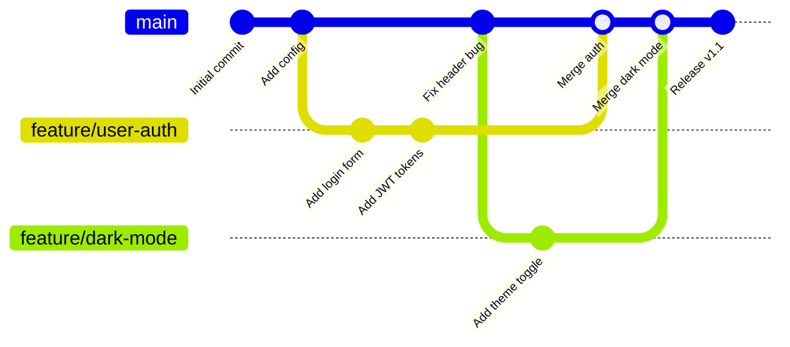

### The Main Branch

The **main** branch (historically called `master`, but the industry default is now `main`) represents the official, canonical history of your project. It should always be in a deployable state. In professional environments, direct commits to `main` are almost always prohibited — changes arrive only through reviewed and approved pull requests.

Think of `main` as the production line. It is what customers see, what gets deployed to production servers, what tags and releases are cut from. Its integrity is paramount.

**Protecting the main branch on GitHub:**
```
Repository → Settings → Branches → Branch protection rules → Add rule
  Branch name pattern: main
  ✅ Require a pull request before merging
  ✅ Require approvals: 1 (or 2 for critical projects)
  ✅ Require status checks to pass before merging
  ✅ Require branches to be up to date before merging
  ✅ Include administrators
```

### Feature Branches

A **feature branch** is a short-lived branch created to develop a single feature, fix a single bug, or make one coherent set of changes. It is the primary unit of work in modern Git workflows.

Naming conventions vary by team, but a common pattern is:

| Branch Type | Pattern | Example |
|---|---|---|
| Feature | `feature/<short-description>` | `feature/user-authentication` |
| Bug Fix | `fix/<issue-or-description>` | `fix/login-redirect-loop` |
| Documentation | `docs/<description>` | `docs/update-api-reference` |
| Refactor | `refactor/<description>` | `refactor/extract-auth-service` |
| Chore | `chore/<description>` | `chore/upgrade-dependencies` |

Using a consistent, descriptive naming convention helps everyone on the team understand at a glance what a branch contains.

**Feature branch lifecycle:**
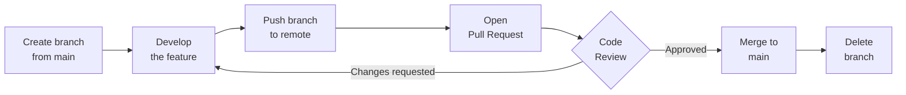

### Release Branches

A **release branch** is created when a set of features is ready to be packaged as a new release. The purpose is to give QA and release managers a stable snapshot to test and polish without blocking ongoing feature development in `main`.

```
main ──────●────────────────────────────────────────●──────
           │                                         ↑
           └─── release/1.2 ───●───●───●─────────────┘
                               (bug fixes, docs only)
```

While `release/1.2` is being tested, developers continue working on `feature/x` and `feature/y` on `main`. Only bug fixes, documentation updates, and release preparation go into the release branch. When it ships, the release branch is merged back into both `main` and the long-running development branch (if using Git Flow).

### Hotfix Branches

A **hotfix branch** is created directly from `main` (or the production tag) to fix a critical bug in production as quickly as possible. Unlike feature branches (which come from `main` and go back to `main`), a hotfix needs to also be applied to any active release branches.

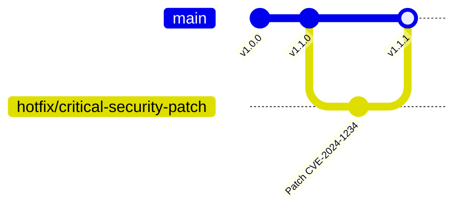

### Branch Commands

#### `git branch`

The `git branch` command manages branches.

```bash
# List all local branches (* marks current branch)
git branch
# * main
#   feature/user-auth
#   fix/login-bug

# List all branches including remote-tracking
git branch -a
# * main
#   feature/user-auth
#   remotes/origin/main
#   remotes/origin/feature/dark-mode

# List with last commit and tracking info
git branch -vv
# * main  a3f2d1c [origin/main] feat: add dark mode
#   fix/x b8e4120 [origin/fix/x: ahead 1] fix login

# Create a branch (without switching to it)
git branch feature/new-feature

# Delete a merged branch (safe delete)
git branch -d feature/user-auth

# Delete a branch even if not merged (force delete — use with care)
git branch -D experiment/failed-idea

# Rename current branch
git branch -m new-name

# Set upstream tracking
git branch --set-upstream-to=origin/main main
```

#### `git switch` (Modern, Recommended)

`git switch` was introduced in Git 2.23 specifically for switching branches, making the intent clearer than the overloaded `git checkout`.

```bash
# Switch to an existing branch
git switch main

# Create a new branch and switch to it
git switch -c feature/payment-integration

# Switch to previous branch (like cd -)
git switch -

# Create branch tracking a remote
git switch -c feature/x origin/feature/x
```

#### `git checkout` (Traditional)

`git checkout` is older and does more than branch switching (it also restores files), which can be confusing. It still works perfectly and you will see it everywhere.

```bash
# Switch to an existing branch
git checkout main

# Create and switch
git checkout -b feature/payment-integration

# Switch to a specific commit (detached HEAD)
git checkout a3f2d1c

# Restore a file to HEAD (different purpose entirely)
git checkout -- config.py
```

**`git switch` vs `git checkout` for branches:**

| Task | Modern (`git switch`) | Traditional (`git checkout`) |
|---|---|---|
| Switch branch | `git switch main` | `git checkout main` |
| Create + switch | `git switch -c feature/x` | `git checkout -b feature/x` |
| Switch to previous | `git switch -` | `git checkout -` |
| Track remote branch | `git switch -c x origin/x` | `git checkout -b x origin/x` |

For new codebases and scripts, prefer `git switch`. You will encounter `git checkout` constantly in documentation, Stack Overflow answers, and legacy scripts — both are valid.

---

## Part 2: Merging

When you finish work on a branch and want to integrate it into another branch, you use `git merge`. Understanding the two types of merges Git performs is essential for maintaining a clean and readable project history.

### Fast-Forward Merge

A **fast-forward merge** happens when the branch you are merging in is directly ahead of the branch you are merging into — there is a straight, uninterrupted line of commits between them. In this case, Git does not need to create a merge commit; it simply moves the branch pointer forward.

**Visual:**

```
Before fast-forward merge:
                    main
                     ↓
A ── B ── C ── D ── E
               ↑
            feature/login

After: git merge feature/login (on main)

A ── B ── C ── D ── E
                     ↑
                   main (moved forward)
```

```bash
git checkout main
git merge feature/login
# Updating c3d4e5f..a1b2c3d
# Fast-forward
#  login.py | 47 ++++++++++++++++++++++++++++++++++++++++++++++++
#  1 file changed, 47 insertions(+)
```

Fast-forward merges produce a linear history with no merge commits. This is clean and easy to read. However, they erase the fact that a branch ever existed.

**Forcing a merge commit even when fast-forward is possible:**

Some teams want every merge to be explicitly recorded as a merge event:

```bash
git merge --no-ff feature/login
```

This creates a merge commit regardless, preserving the branch topology in history.

### Three-Way Merge

A **three-way merge** occurs when both branches have diverged — the branch you are merging into has commits that the branch you are merging in does not have. Git cannot simply move a pointer forward; it must combine the two lines of history.

Git performs a three-way merge by looking at three commits:
1. The **common ancestor** — the commit where the two branches last shared history
2. The **tip of the current branch** (where you are merging into)
3. The **tip of the incoming branch** (what you are merging in)

Using these three snapshots, Git computes what changed in each branch since the divergence point and combines those changes into a new **merge commit**.

**Visual:**

```
Before three-way merge:

A ── B ── C ── F        ← main (has commit F not in feature)
          │
          └── D ── E    ← feature/payment (has D and E not in main)

After: git merge feature/payment (on main)

A ── B ── C ── F ── M   ← main
          │         ↑
          └── D ── E    (M is the merge commit with two parents)
```

```bash
git checkout main
git merge feature/payment
# Merge made by the 'ort' strategy.
#  payment.py | 83 ++++++++++++++++++++++++++++++++++++++++++++++++++
#  1 file changed, 83 insertions(+)
```

The resulting merge commit `M` has two parents: `F` and `E`. This is what makes a merge commit special — it records the exact moment two lines of history were reunited.

**Comparison: Fast-Forward vs Three-Way**

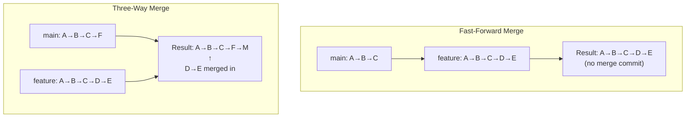

| Property | Fast-Forward | Three-Way |
|---|---|---|
| Merge commit created | No | Yes |
| Branch history preserved | No (linear) | Yes (topology preserved) |
| When it happens | No divergence | Both branches have unique commits |
| History readability | Very clean, linear | Shows when branches were merged |
| Use `--no-ff` to force | Yes | N/A |

---

## Part 3: Merge Conflicts

### What Causes a Merge Conflict

A merge conflict occurs when Git cannot automatically combine changes from two branches because both branches modified the same part of the same file in different ways. Git can merge non-overlapping changes automatically, but overlapping edits require human judgment.

**Scenarios that cause conflicts:**

1. **Two people edit the same line(s)** — the most common case. Both branches changed line 42 of `app.py`, but to different content.
2. **One branch deletes a file, the other modifies it** — Git does not know whether to keep the deletion or the modification.
3. **One branch renames a file, the other edits it** — depending on the case, Git may or may not detect this correctly.
4. **Conflicting changes to binary files** — Git cannot diff binary files, so any binary file changed in both branches is a conflict.

### Anatomy of a Conflict Marker

When a conflict occurs, Git marks the conflicted sections directly in the file:

```python
def calculate_discount(price, user):
<<<<<<< HEAD
    # Current branch (main): percentage-based discount
    if user.is_premium:
        return price * 0.85
    return price
=======
    # Incoming branch (feature/discount): flat discount
    if user.is_premium:
        return price - 20.00
    return price
>>>>>>> feature/discount-redesign
```

The conflict has three sections:
- `<<<<<<< HEAD` to `=======`: Your current branch's version
- `=======` to `>>>>>>> branch-name`: The incoming branch's version

### Resolving Conflicts Step by Step

**Step 1: Understand what happened**

```bash
# When a merge fails
git merge feature/discount-redesign
# Auto-merging pricing.py
# CONFLICT (content): Merge conflict in pricing.py
# Automatic merge failed; fix conflicts and then commit the result.

# See which files have conflicts
git status
# On branch main
# You have unmerged paths.
#   (fix conflicts and run "git commit")
#   (use "git merge --abort" to abort the merge)
#
# Unmerged paths:
#   (use "git add <file>..." to mark resolution)
#         both modified:   pricing.py
```

**Step 2: Decide to resolve or abort**

```bash
# If you need to abort and come back later
git merge --abort

# If you are ready to resolve
# Open the conflicted file(s) in your editor
code pricing.py
```

**Step 3: Edit the file to the desired final state**

Delete the conflict markers and write the code as you want it to be. This might mean choosing one side, the other side, or a combination:

```python
def calculate_discount(price, user):
    # Combined approach: percentage discount for premium, flat for regular
    if user.is_premium:
        return price * 0.85  # 15% off for premium users
    elif user.has_coupon:
        return price - 20.00  # Flat $20 off with coupon
    return price
```

**Step 4: Stage the resolved files**

```bash
git add pricing.py
```

**Step 5: Complete the merge**

```bash
git commit
# Git opens an editor with a pre-filled merge commit message
# You can add notes about how conflicts were resolved
```

### Using a Visual Merge Tool

Command-line conflict resolution is powerful but dense. Visual tools show the two versions side by side with the merged result:

```bash
# Launch the configured merge tool
git mergetool

# Configure VS Code as your merge tool
git config --global merge.tool vscode
git config --global mergetool.vscode.cmd 'code --wait $MERGED'
```

Popular merge tools: VS Code (built-in), IntelliJ IDEA, Kaleidoscope (macOS), vimdiff, meld (Linux).

### Preventing Conflicts

Prevention is far better than cure. Professional practices to minimize conflicts:

**1. Keep branches short-lived.** The longer a branch lives, the more it diverges. Aim to merge feature branches within days, not weeks.

**2. Communicate with your team.** A quick message ("I'm refactoring the auth module") prevents two people from independently rewriting the same file.

**3. Make smaller, more focused commits and PRs.** A PR changing 50 lines in 3 files is much less likely to conflict than one changing 500 lines in 30 files.

**4. Regularly sync your feature branch with `main`:**

```bash
# While on your feature branch
git fetch origin
git merge origin/main
# Or with rebase (cleaner):
git rebase origin/main
```

**5. Use clear module boundaries.** When different parts of the codebase are clearly separated into modules, two people can work simultaneously with minimal chance of editing the same files.

**6. Run `git pull` at the start of every working session.** Starting with the latest `main` reduces divergence.

---

## Part 4: Rebasing

### What Rebase Actually Does

Rebasing is one of the most powerful — and most misunderstood — Git operations. To understand it, you first need to understand what it is solving.

When you create a feature branch and your teammates keep pushing to `main`, your branch's history diverges. A three-way merge would record this divergence with a merge commit. Rebasing is an alternative: it **replays your branch's commits on top of the target branch**, producing a linear history as if you had started your work after all of `main`'s recent commits.

**Before rebase:**

```
main:    A ── B ── C ── F ── G
                   │
feature:           └── D ── E
```

**After `git rebase main` (on feature branch):**

```
main:    A ── B ── C ── F ── G
                             │
feature:                     └── D' ── E'
```

`D'` and `E'` are **new commits** with new hashes. They contain the same changes as `D` and `E`, but they now have `G` as their ancestor instead of `C`. The original `D` and `E` are abandoned (though recoverable via reflog).

```bash
# Rebase feature branch onto main
git checkout feature/payment
git rebase main

# Or equivalently:
git rebase main feature/payment
```

After rebasing, merging the feature branch into main will be a clean **fast-forward** — no merge commit needed.

### Rebase vs. Merge: The Fundamental Trade-off

This debate is real and ongoing in the Git community. Both are correct. The choice depends on your team's values.

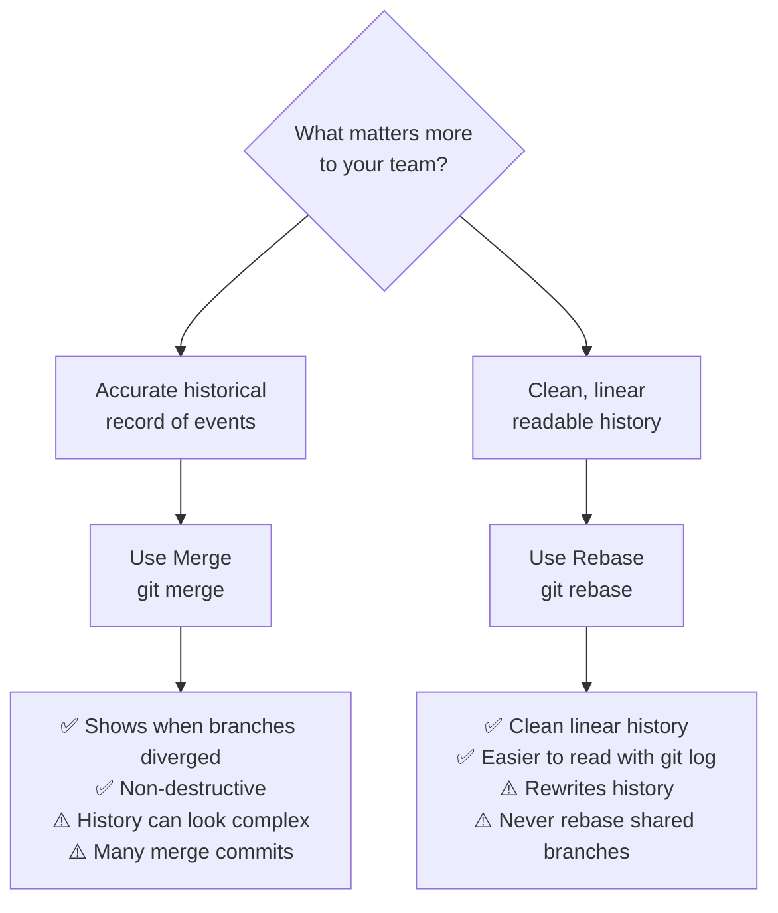

| Aspect | Merge | Rebase |
|---|---|---|
| History | Preserves exact branch history | Rewrites history to appear linear |
| Merge commits | Creates merge commits | No merge commits |
| Safety | Non-destructive; can always be undone | Rewrites commit hashes (dangerous on shared branches) |
| Debugging | `git bisect` works with both | Linear history is easier to `bisect` |
| Golden rule | Always safe | **Never rebase public/shared branches** |
| Best for | Preserving context of when merges happened | Keeping `main` history clean before merging |

### The Golden Rule of Rebasing

> **Never rebase commits that exist outside your local repository — i.e., commits that others may have based their work on.**

When you rebase, you create new commits with new SHA-1 hashes. If you then force-push those rewritten commits to a shared branch, anyone who pulled the old commits now has a divergent history. This causes enormous confusion and is very difficult to recover from.

**Safe to rebase:** Your local feature branch that no one else has pulled.

**Never rebase:** `main`, `develop`, or any branch others are actively working on or have checked out.

### Interactive Rebase: Rewriting History

Interactive rebase (`git rebase -i`) is one of Git's most powerful features. It lets you modify, reorder, squash, split, and edit commits before they become part of the shared history.

```bash
# Interactively rebase the last 4 commits
git rebase -i HEAD~4
```

This opens an editor with a list of commits:

```
pick a3f2d1c feat: add payment form
pick b8e4120 fix typo in payment form
pick c91f3ab add payment validation
pick d4a78de WIP: payment processing

# Commands:
# p, pick = use commit
# r, reword = use commit, but edit the commit message
# e, edit = use commit, but stop for amending
# s, squash = use commit, meld into previous commit
# f, fixup = like squash, but discard this commit's log message
# x, exec = run command (the rest of the line) using shell
# d, drop = remove commit
```

**Common interactive rebase tasks:**

**Squash multiple commits into one (cleaning up "WIP" commits before PR):**
```
pick a3f2d1c feat: add payment form
squash b8e4120 fix typo in payment form   ← merged into previous
squash c91f3ab add payment validation      ← merged into previous
drop d4a78de WIP: payment processing      ← removed entirely
```

**Reorder commits:**
Simply move the lines up or down.

**Edit a commit message:**
Change `pick` to `reword` (or `r`). Git will stop at that commit and let you edit the message.

**Split a commit:**
Change `pick` to `edit`. When Git stops, use `git reset HEAD~1` to unstage, then make multiple smaller commits, then `git rebase --continue`.

### Practical Rebase Workflow

```bash
# 1. You are on feature/payment, main has moved forward
git checkout feature/payment
git fetch origin

# 2. See how far behind you are
git log --oneline HEAD..origin/main

# 3. Rebase your work onto the latest main
git rebase origin/main

# If conflicts arise during rebase:
# 4a. Resolve the conflict in the file
# 4b. Stage the resolved file
git add pricing.py
# 4c. Continue the rebase
git rebase --continue

# If you want to abort the entire rebase and return to pre-rebase state
git rebase --abort

# 5. After a successful rebase, push your branch
# (force required because history was rewritten)
git push --force-with-lease origin feature/payment
```

> **Always use `--force-with-lease` instead of `--force` when pushing rebased branches.** `--force` will overwrite any changes others pushed since you last fetched. `--force-with-lease` fails if the remote branch was updated since your last fetch, protecting you from accidentally overwriting teammates' work.

---

## Part 5: Stashing

### What Is a Stash?

The stash is Git's clipboard for work-in-progress. It temporarily saves your uncommitted changes (both staged and unstaged) and returns your working directory to a clean state, letting you switch context without committing half-finished work.

**The classic scenario:** You are in the middle of building a feature when your manager says "Drop everything — there's a critical bug in production." You are not ready to commit your feature work. Enter `git stash`.

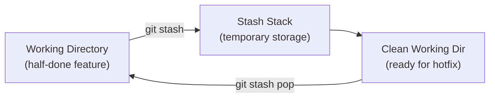

### `git stash` — Save Changes to the Stash

```bash
# Stash all tracked changes (staged and unstaged)
git stash

# Stash with a descriptive message (highly recommended)
git stash push -m "WIP: payment form validation logic"

# Also stash untracked files (new files not yet git add-ed)
git stash push -u -m "Feature work including new files"

# Also stash ignored files (rare, but sometimes needed)
git stash push -a -m "Everything including ignored files"

# Stash only specific files (patch mode)
git stash push -p -m "Only stash payment.py changes"
```

### Managing Multiple Stashes

The stash is a **stack** — last in, first out. You can have multiple stashes.

```bash
# List all stashes
git stash list
# stash@{0}: On feature/payment: WIP: payment form validation
# stash@{1}: On main: hotfix prep work
# stash@{2}: WIP on feature/auth: half-done login flow

# See what is in a stash without applying it
git stash show stash@{0}
git stash show -p stash@{0}    # Full diff
```

### `git stash pop` vs `git stash apply`

```bash
# Apply the most recent stash AND remove it from the stash list
git stash pop

# Apply a specific stash AND remove it
git stash pop stash@{2}

# Apply the most recent stash but KEEP it in the stash list
git stash apply

# Apply a specific stash and keep it
git stash apply stash@{1}
```

**`pop` vs `apply`:**

| Command | Applies stash? | Removes from stash list? |
|---|---|---|
| `git stash pop` | Yes | Yes |
| `git stash apply` | Yes | No |

Use `apply` when you want to apply the same stash to multiple branches (rare). Use `pop` in all normal cases.

### Stash Cleanup

```bash
# Delete a specific stash
git stash drop stash@{0}

# Delete ALL stashes (use carefully)
git stash clear
```

### Creating a Branch from a Stash

If your stashed changes conflict with the current state of the branch (because `main` has moved on), you can create a new branch from the point where you stashed:

```bash
git stash branch feature/rescued-work stash@{0}
# Creates a new branch at the commit where stash was made
# Applies the stash to it
# Drops the stash if successful
```

---

## Part 6: Tags and Releases

### What Are Tags?

Tags are permanent, named pointers to specific commits. Unlike branches, tags do not move — they mark a specific point in history forever. Tags are used primarily to mark version releases (`v1.0.0`, `v2.3.1`) and important milestones.

### Lightweight Tags

A **lightweight tag** is just a name pointing to a commit. It has no additional metadata.

```bash
# Create a lightweight tag at current commit
git tag v1.0.0

# Create a lightweight tag at a specific commit
git tag v0.9.5 a3f2d1c

# List all tags
git tag
git tag -l "v1.*"    # Filter with a pattern

# See what commit a tag points to
git rev-parse v1.0.0
```

### Annotated Tags

An **annotated tag** is a full Git object stored in the database. It includes the tagger's name and email, the date, a tagging message, and can be signed with GPG. Annotated tags are the standard for release tags.

```bash
# Create an annotated tag (opens editor for message)
git tag -a v1.0.0

# Create an annotated tag with inline message
git tag -a v1.0.0 -m "Release version 1.0.0

First stable release featuring:
- User authentication
- Payment processing
- Dark mode support"

# Create a signed tag (requires GPG key)
git tag -s v1.0.0 -m "Release v1.0.0"

# Show full tag information
git show v1.0.0

# Verify a signed tag
git tag -v v1.0.0
```

### Pushing Tags to Remote

Tags are not pushed automatically with `git push`. You must push them explicitly.

```bash
# Push a specific tag
git push origin v1.0.0

# Push all tags
git push origin --tags

# Push all annotated tags only (recommended)
git push origin --follow-tags
```

### Deleting Tags

```bash
# Delete a local tag
git tag -d v1.0.0-beta

# Delete a remote tag
git push origin --delete v1.0.0-beta
# or
git push origin :refs/tags/v1.0.0-beta
```

### GitHub Releases

GitHub Releases build on top of Git tags to provide a full release page with:
- Release notes (markdown formatted)
- Downloadable artifacts (compiled binaries, zip archives, etc.)
- Automatic source code archives
- Pre-release markers for betas and release candidates

**Creating a release via GitHub UI:**
```
Repository → Releases → Draft a new release
  → Choose a tag (or create new, e.g., v1.2.0)
  → Target: main
  → Release title: "v1.2.0 — Dark Mode and Payment Overhaul"
  → Description: (paste changelog content)
  → Attach binaries: (drag and drop build artifacts)
  → ✅ Set as a pre-release (for betas)
  → Publish release
```

**Creating a release via GitHub CLI:**
```bash
gh release create v1.2.0 \
  --title "v1.2.0 — Dark Mode and Payment Overhaul" \
  --notes-file CHANGELOG.md \
  ./dist/app-linux-amd64 \
  ./dist/app-darwin-amd64 \
  ./dist/app-windows-amd64.exe
```

---

## Part 7: Remote Repositories

### Understanding `origin` and `upstream`

When you work with Git, remote repositories have names. These names are just convenient aliases for URLs.

**`origin`** is the conventional name for your primary remote — the repository you cloned from or the one you own. When you clone a repository, Git automatically names the source remote `origin`.

```bash
git clone https://github.com/yourusername/my-project.git
# origin = https://github.com/yourusername/my-project.git
```

**`upstream`** is the conventional name for the original repository when you are working on a fork. If you fork `facebook/react` and clone your fork, `origin` points to `yourusername/react` and `upstream` points to `facebook/react`.

```bash
git remote add upstream https://github.com/facebook/react.git
```

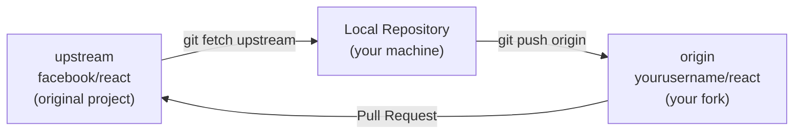

### `git remote` — Manage Remote Connections

```bash
# List all remotes
git remote
# origin
# upstream

# List remotes with URLs
git remote -v
# origin    https://github.com/you/project.git (fetch)
# origin    https://github.com/you/project.git (push)
# upstream  https://github.com/original/project.git (fetch)
# upstream  https://github.com/original/project.git (push)

# Add a remote
git remote add upstream https://github.com/original/project.git

# Remove a remote
git remote remove old-remote

# Rename a remote
git remote rename origin github

# Change a remote's URL (e.g., switching from HTTPS to SSH)
git remote set-url origin git@github.com:you/project.git

# Show detailed info about a remote
git remote show origin
```

### `git fetch` — Download Without Applying

`git fetch` contacts the remote, downloads any new objects (commits, branches, tags), and updates your remote-tracking branches. It never touches your working directory or current branch. It is always safe.

```bash
# Fetch all remotes
git fetch

# Fetch a specific remote
git fetch origin

# Fetch a specific branch
git fetch origin feature/new-api

# Fetch and prune remote-tracking branches that no longer exist on remote
git fetch --prune origin
# Equivalent shorthand:
git fetch -p origin

# Fetch all remotes with pruning
git fetch --all --prune
```

**After fetching, inspect what came in:**

```bash
# See new commits on origin/main that you don't have locally
git log HEAD..origin/main --oneline

# See a diff of what's new
git diff HEAD origin/main
```

### `git pull` — Fetch and Merge

`git pull` is shorthand for `git fetch` followed by `git merge` (or `git rebase`).

```bash
# Pull (fetch + merge) from tracking branch
git pull

# Pull from a specific remote and branch
git pull origin main

# Pull with rebase instead of merge (keeps history linear)
git pull --rebase origin main

# Set rebase as default pull behavior
git config --global pull.rebase true
```

**Best practice recommendation:** Many experienced developers prefer `git fetch` followed by manual inspection and then `git merge` or `git rebase`. This gives you visibility into what is coming before applying it. `git pull` is convenient but removes that visibility.

### `git push` — Upload to Remote

```bash
# Push current branch to its tracking remote branch
git push

# Push a specific branch to a remote
git push origin feature/payment

# Push and set up tracking relationship (first push of a new branch)
git push -u origin feature/payment
# After this, plain `git push` works for this branch

# Push all branches
git push --all origin

# Push all tags
git push --tags

# Delete a remote branch
git push origin --delete feature/old-branch
# or
git push origin :feature/old-branch

# Force push with safety check (use instead of --force)
git push --force-with-lease origin feature/rebased-branch
```

---

## Part 8: GitHub Workflow

### Forking

Forking creates a complete copy of a repository under your own GitHub account. This is the entry point for contributing to any project you do not have write access to.

**Why forks instead of branches?**
In open-source projects, strangers cannot push branches directly to the main repository — that would be a security nightmare. Instead, you fork (get your own copy), make changes there, then request that your changes be pulled into the original.

**Forking on GitHub:**
```
1. Visit the repository page (e.g., github.com/django/django)
2. Click the "Fork" button in the top-right
3. Choose your account as the destination
4. GitHub creates github.com/yourusername/django
5. Clone your fork locally:
   git clone git@github.com:yourusername/django.git
```

### Pull Requests

A **Pull Request** (PR) is a GitHub-level concept (not a core Git feature) that wraps a proposed merge in a collaboration interface. It lets maintainers and reviewers:

- See a diff of all changes
- Leave line-by-line comments
- Request changes or approve
- See CI/CD status checks
- Discuss design decisions
- Maintain a historical record of why decisions were made

**Anatomy of a great Pull Request:**

```markdown
## Summary
Implement rate limiting for the API authentication endpoint to prevent
brute force attacks. Closes #234.

## Changes Made
- Add `RateLimiter` middleware class in `middleware/rate_limiter.py`
- Configure limits: 5 attempts per minute per IP address
- Add Redis backend for distributed rate limit tracking
- Add tests in `tests/test_rate_limiter.py`

## Testing
1. Run `pytest tests/test_rate_limiter.py`
2. Manually test: try >5 login attempts in 60 seconds, expect 429 response

## Screenshots
(Include UI screenshots if relevant)

## Notes for Reviewers
The Redis connection is optional — if Redis is unavailable, the
middleware falls back to in-memory rate limiting (not suitable for
multi-server deployments but prevents startup failures).
```

**PR size best practice:** Pull Requests should be as small as possible while still representing a complete, shippable unit of work. Large PRs (1000+ lines changed) are very difficult to review thoroughly and tend to receive shallow reviews that miss bugs.

### Code Reviews

Code review is one of the most valuable practices in professional software development. A good review is not about finding fault — it is about collectively ensuring code quality, sharing knowledge, and catching bugs before they reach production.

**As a reviewer, look for:**

1. **Correctness**: Does the code do what it claims to? Are edge cases handled?
2. **Tests**: Are there sufficient tests? Do they test the right things?
3. **Design**: Is the approach reasonable? Does it fit the codebase's patterns?
4. **Security**: Are there injection vulnerabilities, insecure defaults, or exposed secrets?
5. **Performance**: Are there obvious performance issues (N+1 queries, inefficient loops)?
6. **Readability**: Can you understand what the code does? Are names meaningful?

**Tone in code review:** Be kind. Remember there is a human on the other side who spent time building this. Phrase feedback as suggestions or questions, not commands.

```
❌ "This is wrong. You should use a set instead of a list."
✅ "Could we use a set here? Lookup would be O(1) instead of O(n), 
   which matters when this list gets large."

❌ "Why didn't you add tests?"
✅ "It looks like test coverage is missing for the error case on 
   line 47. Could we add a test for when the API returns 500?"
```

**GitHub review types:**
- **Comment**: General feedback without blocking the merge
- **Approve**: Code looks good, ready to merge
- **Request changes**: Must be addressed before merging (blocks merge when protection rules are enabled)

### Open Source Contributions

Contributing to open source follows a well-established pattern:

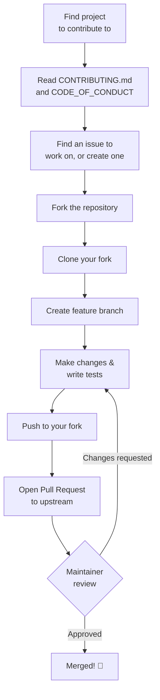

---

## Part 9: GitHub Repository Management

A professional GitHub repository is more than just code. It is documentation, a contribution guide, a license, and a changelog — all working together to make the project understandable and welcoming.

### README.md

The `README.md` is the front page of your repository. It appears automatically on the GitHub repository homepage. A great README includes:

```markdown
# Project Name

One-sentence description of what the project does and who it is for.

[](link)
[](LICENSE)
[](https://pypi.org/project/project/)

## Features
- Feature 1
- Feature 2

## Quick Start

```bash
pip install project-name
project-name --help
```

## Installation
(Detailed instructions for multiple platforms)

## Usage
(Code examples showing the most important use cases)

## Configuration
(Configuration options and environment variables)

## Contributing
See [CONTRIBUTING.md](CONTRIBUTING.md)

## License
[MIT](LICENSE)
```

### LICENSE

Every open-source project needs a license. Without one, the default copyright law applies — meaning no one can legally use, copy, distribute, or modify your code. Always choose and include a license.

| License | Use Case | Key Points |
|---|---|---|
| **MIT** | Most permissive, most popular | Can use commercially; just include copyright notice |
| **Apache 2.0** | Like MIT but with patent protection | Grants patent rights; compatible with most licenses |
| **GPL v3** | Copyleft | Derivative works must also be GPL (protective) |
| **BSD 2-Clause** | Very permissive, minimal requirements | Similar to MIT |
| **AGPL v3** | SaaS copyleft | GPL + network use triggers copyleft |
| **CC0** | Public domain dedication | No rights reserved |

GitHub offers a license chooser at [choosealicense.com](https://choosealicense.com).

### CONTRIBUTING.md

The `CONTRIBUTING.md` file explains how to contribute to the project. GitHub automatically links to it when users open new issues or pull requests.

A good `CONTRIBUTING.md` includes:
- How to set up the development environment
- How to run the tests
- Code style guidelines (or link to a linter config)
- The branch naming convention
- Commit message format
- Pull request process
- Where to ask for help (Discord, mailing list, etc.)
- Code of conduct reference

### CHANGELOG.md

A `CHANGELOG.md` records notable changes for each release, making it easy for users to see what changed between versions. The [Keep a Changelog](https://keepachangelog.com) format is widely used:

```markdown
# Changelog

All notable changes to this project will be documented in this file.

## [Unreleased]

## [1.2.0] - 2024-03-15
### Added
- Dark mode support
- Export to CSV feature

### Changed
- Improved performance of search by 40%

### Deprecated
- The `/api/v1/users` endpoint (use `/api/v2/users`)

### Fixed
- Fixed crash when username contained special characters (#342)

### Security
- Updated dependency `requests` to fix CVE-2024-1234

## [1.1.0] - 2024-01-08
...

[Unreleased]: https://github.com/user/project/compare/v1.2.0...HEAD
[1.2.0]: https://github.com/user/project/compare/v1.1.0...v1.2.0
```

---

## Part 10: Semantic Versioning

Semantic Versioning (SemVer) is a versioning standard widely adopted in the software industry. A version number takes the form `MAJOR.MINOR.PATCH`, and each part has a precise meaning based on what kind of changes are included.

### The Three Parts

```
    2   .   4   .   1
    │       │       └── PATCH: Backwards-compatible bug fixes
    │       └────────── MINOR: New features, backwards-compatible
    └────────────────── MAJOR: Breaking changes
```

**PATCH** (`2.4.0` → `2.4.1`): A bug was fixed. The API is unchanged. Users can safely upgrade without reading the changelog.

**MINOR** (`2.4.1` → `2.5.0`): New functionality was added in a backwards-compatible way. Existing code continues to work. Users can upgrade and optionally use the new features.

**MAJOR** (`2.5.0` → `3.0.0`): Backwards-incompatible changes were made. Existing code may break on upgrade. Users must read the migration guide before upgrading.

### Pre-release Versions

```
1.0.0-alpha.1      → Early alpha, may be incomplete
1.0.0-beta.1       → Feature complete, may have bugs
1.0.0-rc.1         → Release candidate, almost ready
1.0.0              → Stable release
```

### Versioning Rules in Practice

```bash
# Starting a new project
v0.1.0    → Initial development release (major=0 means unstable API)

# Adding features during development
v0.2.0    → New features (still unstable)
v0.3.0    → More features

# First stable release
v1.0.0    → Stable, committed API

# Bug fix
v1.0.1    → Fixed login bug

# New feature
v1.1.0    → Added dark mode (backwards compatible)

# More features + bug fixes
v1.2.3    → Third patch in the 1.2.x line

# Breaking change (renamed API method, removed parameter)
v2.0.0    → Major version bump
```

### SemVer and Git Tags

```bash
# Tag the release
git tag -a v1.2.0 -m "Release v1.2.0

Added dark mode and improved search performance.
See CHANGELOG.md for full details."

git push origin v1.2.0
```

### Conventional Commits and Automated Versioning

When combined with the Conventional Commits specification, SemVer can be automated:

| Commit prefix | Version bump |
|---|---|
| `fix:` | PATCH |
| `feat:` | MINOR |
| `feat!:` or `BREAKING CHANGE:` in footer | MAJOR |
| `docs:`, `style:`, `chore:` | No version bump |

Tools like `semantic-release`, `release-please`, and `standard-version` can automatically determine the next version number, update the changelog, create the tag, and publish releases based on your commit history.

---

## Part 11: GitHub Actions Introduction

### What Is CI/CD?

**Continuous Integration (CI)** is the practice of automatically building and testing your code every time a change is pushed. The goal is to catch bugs immediately when they are introduced, not days or weeks later.

**Continuous Deployment (CD)** extends CI by automatically deploying code to staging or production environments after tests pass.

Together, CI/CD means the gap between writing code and that code being live for users is minimized — often minutes, not days.

### GitHub Actions Overview

GitHub Actions is GitHub's built-in CI/CD platform. Workflows are defined in YAML files stored in `.github/workflows/`. They are triggered by GitHub events (push, pull request, schedule, release, etc.) and run in virtual machines (or containers) provided by GitHub.

**Key concepts:**

| Concept | Description |
|---|---|
| **Workflow** | An automated process defined in a `.yml` file |
| **Event** | What triggers the workflow (push, PR open, schedule) |
| **Job** | A set of steps that run on the same runner |
| **Step** | An individual task (run a command, use an action) |
| **Action** | A reusable unit (like a third-party plugin) |
| **Runner** | The virtual machine that executes jobs |

### Workflow File Structure

```yaml
# .github/workflows/ci.yml
name: CI                        # Workflow name (shown in GitHub UI)

on:                             # Events that trigger the workflow
  push:
    branches: [ main, develop ]
  pull_request:
    branches: [ main ]

jobs:                           # One or more jobs
  test:                         # Job ID
    runs-on: ubuntu-latest      # Runner OS

    steps:
      - name: Checkout code
        uses: actions/checkout@v4       # Use a pre-built action

      - name: Set up Python
        uses: actions/setup-python@v5
        with:
          python-version: '3.12'

      - name: Install dependencies
        run: |
          python -m pip install --upgrade pip
          pip install -r requirements.txt

      - name: Run tests
        run: pytest --cov=src tests/

      - name: Upload coverage report
        uses: codecov/codecov-action@v4
```

### Real-World Example: Full CI/CD Pipeline

```yaml
# .github/workflows/pipeline.yml
name: Build, Test, and Deploy

on:
  push:
    branches: [ main ]
  pull_request:
    branches: [ main ]

jobs:
  # ── Job 1: Lint ──────────────────────────────────────
  lint:
    runs-on: ubuntu-latest
    steps:
      - uses: actions/checkout@v4
      - uses: actions/setup-python@v5
        with:
          python-version: '3.12'
      - run: pip install ruff
      - run: ruff check .

  # ── Job 2: Test (matrix across Python versions) ──────
  test:
    needs: lint                 # Only run if lint passes
    runs-on: ubuntu-latest
    strategy:
      matrix:
        python-version: ['3.10', '3.11', '3.12']
    steps:
      - uses: actions/checkout@v4
      - uses: actions/setup-python@v5
        with:
          python-version: ${{ matrix.python-version }}
      - run: pip install -r requirements.txt
      - run: pytest

  # ── Job 3: Deploy (only on push to main) ─────────────
  deploy:
    needs: test
    runs-on: ubuntu-latest
    if: github.ref == 'refs/heads/main' && github.event_name == 'push'
    steps:
      - uses: actions/checkout@v4
      - name: Deploy to production
        env:
          DEPLOY_KEY: ${{ secrets.DEPLOY_KEY }}
        run: ./scripts/deploy.sh production
```

### Common GitHub Actions Patterns

**Run on a schedule (nightly build):**
```yaml
on:
  schedule:
    - cron: '0 2 * * *'    # Every day at 2 AM UTC
```

**Using secrets securely:**
```yaml
- name: Publish to PyPI
  env:
    TWINE_PASSWORD: ${{ secrets.PYPI_TOKEN }}
  run: twine upload dist/*
```

**Caching dependencies for faster builds:**
```yaml
- uses: actions/cache@v4
  with:
    path: ~/.cache/pip
    key: ${{ runner.os }}-pip-${{ hashFiles('requirements.txt') }}
```

**Automatic release on tag push:**
```yaml
on:
  push:
    tags:
      - 'v*'
jobs:
  release:
    runs-on: ubuntu-latest
    steps:
      - uses: actions/checkout@v4
      - name: Create GitHub Release
        uses: softprops/action-gh-release@v1
        with:
          files: dist/*
          generate_release_notes: true
```

---

## Part 12: Open Source Contribution Workflow

### Complete Step-by-Step Workflow

This is the exact workflow used by millions of open-source contributors every day.

#### Phase 1: Find and Claim Your Work

```bash
# 1. Browse issues on the project's GitHub Issues tab
# Look for labels like "good first issue", "help wanted", "bug"

# 2. Read the issue thoroughly. Ask clarifying questions if needed.

# 3. Comment on the issue to claim it:
#    "I'd like to work on this. I'll start with approach X — does that 
#    seem reasonable to the maintainers?"
```

#### Phase 2: Fork and Clone

```bash
# 4. Fork the repository on GitHub (click the Fork button)

# 5. Clone YOUR fork (not the original)
git clone git@github.com:yourusername/project.git
cd project

# 6. Add the original as "upstream"
git remote add upstream git@github.com:original-owner/project.git

# Verify your remotes
git remote -v
# origin    git@github.com:yourusername/project.git (fetch)
# origin    git@github.com:yourusername/project.git (push)
# upstream  git@github.com:original-owner/project.git (fetch)
# upstream  git@github.com:original-owner/project.git (push)
```

#### Phase 3: Set Up and Branch

```bash
# 7. Read CONTRIBUTING.md thoroughly
cat CONTRIBUTING.md

# 8. Set up the development environment as documented
python -m venv .venv
source .venv/bin/activate    # Linux/macOS
# .venv\Scripts\activate     # Windows
pip install -e ".[dev]"

# 9. Run existing tests to make sure everything works before you start
pytest
# All tests should pass. If they don't, check the issue tracker.

# 10. Make sure your fork is up to date with upstream
git fetch upstream
git checkout main
git merge upstream/main
git push origin main    # Keep your fork's main in sync

# 11. Create a feature branch from main
git switch -c fix/issue-234-login-crash
```

#### Phase 4: Make Changes

```bash
# 12. Make your changes
# Edit files, write code

# 13. Write or update tests
# Most projects require tests for bug fixes (to prevent regression)
# and new features

# 14. Run the tests frequently as you work
pytest tests/test_auth.py -v

# 15. Check the code style (linting)
ruff check .
black --check .

# 16. Commit logically, with good messages
git add src/auth.py tests/test_auth.py
git commit -m "fix: prevent crash when username contains unicode characters

The login endpoint was calling .upper() on the username before
comparison, which failed for certain unicode characters. Replaced
with .casefold() which handles unicode correctly.

Fixes #234"
```

#### Phase 5: Push and Open PR

```bash
# 17. Push your branch to your fork
git push -u origin fix/issue-234-login-crash

# 18. GitHub will display a banner offering to open a PR
# Click "Compare & pull request"

# OR open a PR via GitHub CLI
gh pr create \
  --title "fix: prevent crash when username contains unicode characters" \
  --body "Fixes #234. See PR description for details." \
  --base main
```

**Writing the PR description:**
- Reference the issue: "Fixes #234" (GitHub auto-closes the issue on merge)
- Explain what the root cause was
- Explain what you changed and why you chose that approach
- Describe how to test the change
- Note any trade-offs or decisions the reviewer should know about

#### Phase 6: Respond to Review

```bash
# 19. Reviewer leaves comments. Address each one.
# For code changes, push new commits to the same branch:
git add src/auth.py
git commit -m "refactor: use re.UNICODE flag as suggested in review"
git push origin fix/issue-234-login-crash

# The PR automatically updates.

# 20. For minor fixes, amend and force-push (if PR is small and clean):
git add src/auth.py
git commit --amend --no-edit
git push --force-with-lease origin fix/issue-234-login-crash
```

#### Phase 7: After Merge

```bash
# 21. After your PR is merged, sync your fork
git fetch upstream
git checkout main
git merge upstream/main
git push origin main

# 22. Delete the feature branch (it is no longer needed)
git branch -d fix/issue-234-login-crash
git push origin --delete fix/issue-234-login-crash
```

---

## Part 13: Professional Team Workflows

There is no single "correct" Git workflow. Different teams have different needs, different release cadences, and different levels of Git maturity. Understanding the major established workflows lets you evaluate which fits your team's situation.

### GitHub Flow

GitHub Flow is a simple, lightweight workflow optimized for teams that deploy continuously.

**Core principle:** `main` is always deployable. Every change comes in through a short-lived feature branch and a pull request.

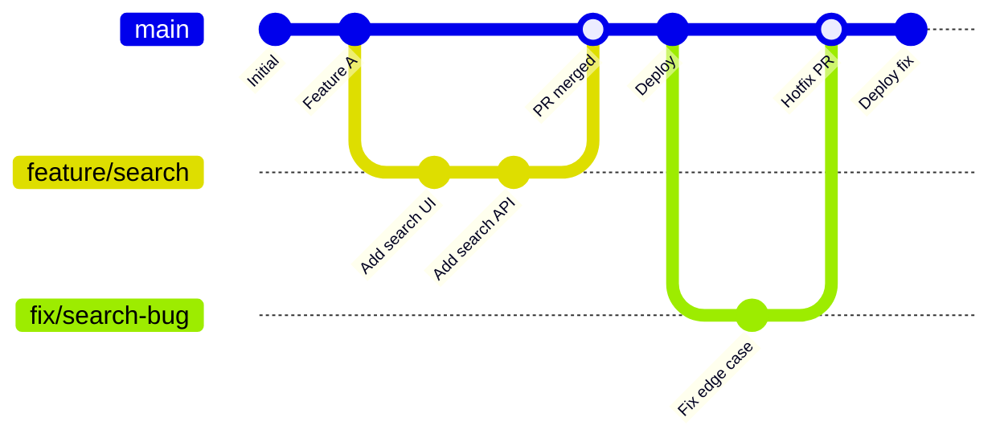

**The rules:**
1. `main` is always deployable
2. Create branches with descriptive names for new work
3. Push to your branch constantly (backup + visibility)
4. Open a PR as early as possible (even as a draft)
5. Merge only after review and CI passes
6. Deploy immediately after merging

**Best for:** Teams with continuous deployment, SaaS products, small to medium teams, teams new to branching workflows.

**Not ideal for:** Projects with multiple supported versions, long QA cycles, or infrequent releases.

---

### Git Flow

Git Flow (by Vincent Driessen) is a more structured workflow designed for projects with scheduled releases, multiple maintained versions, or strict QA processes.

**Permanent branches:**
- `main`: Production releases only (tagged)
- `develop`: Integration branch for completed features

**Supporting branches:**
- `feature/*`: New features, branch from `develop`, merge back to `develop`
- `release/*`: Release preparation, branch from `develop`, merge to both `main` and `develop`
- `hotfix/*`: Production bug fixes, branch from `main`, merge to both `main` and `develop`

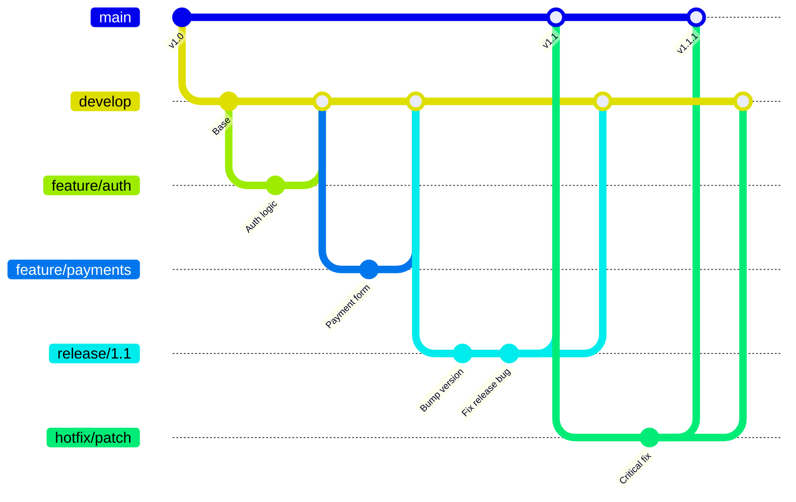

**Best for:** Open-source libraries with versioned releases, mobile apps (release cycles tied to app store reviews), enterprise software with long QA cycles, teams maintaining multiple versions simultaneously.

**Challenges:** More complex. Easy to make mistakes with merge directions. Can create long-lived branches with difficult merges.

---

### Trunk-Based Development (TBD)

Trunk-Based Development is the workflow favored by high-performing engineering teams (as found by the DORA research program). The "trunk" is `main` (or `master`).

**Core principle:** Developers commit directly to `main` (or through very short-lived branches of 1–2 days at most). Feature flags control whether features are visible to users. Continuous integration runs on every commit.

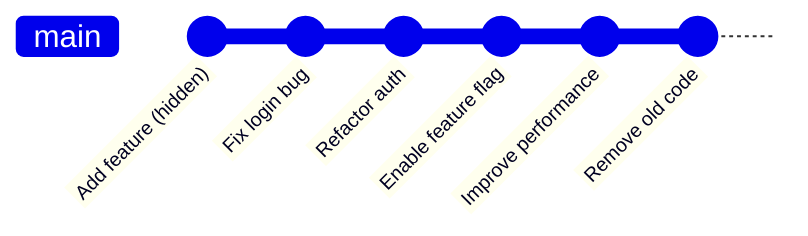

**Key practices:**
- **Feature flags**: New code is deployed but not enabled. Flags control who sees it.
- **Branch by abstraction**: For large changes, introduce an abstraction layer first, then replace the implementation.
- **Small, frequent commits**: Every commit must keep `main` green.
- **Comprehensive automated tests**: Trust in CI is essential when everyone is pushing to trunk.

**Best for:** Highly disciplined, experienced teams. Companies with strong CI/CD investment. Teams doing multiple deployments per day. Teams with very high test coverage.

**Challenges:** Requires mature CI/CD. Feature flags add complexity. Requires strong team discipline. Not beginner-friendly.

### Comparison

| Property | GitHub Flow | Git Flow | Trunk-Based Dev |
|---|---|---|---|
| Complexity | Low | High | Medium |
| Release cadence | Continuous | Scheduled | Continuous |
| Branch lifetime | Days | Weeks | Hours to days |
| Production stability | Very high (small PRs) | High (release branch) | Very high (feature flags) |
| Learning curve | Easy | Moderate | Requires discipline |
| Merge conflicts | Low | Higher | Very low |
| Good for beginners | ✅ Yes | ⚠️ Careful | ❌ Not yet |
| Used by | GitHub, Netlify | many OSS projects | Google, Facebook |

**Recommendation:** Start with **GitHub Flow**. It is simple, effective, and teaches the habits (feature branches, PR reviews, CI) that carry into more advanced workflows. Graduate to **Trunk-Based Development** as your team's CI/CD matures and discipline grows.

---

## Part 14: Troubleshooting

### Rejected Push

**Symptom:**
```
! [rejected] main -> main (non-fast-forward)
error: failed to push some refs to 'origin'
hint: Updates were rejected because the remote contains work that you do
hint: not have locally.
```

**Cause:** Someone else pushed to the branch since you last pulled. The remote has commits your local branch doesn't.

**Solution:**

```bash
# Fetch and merge (creates a merge commit)
git pull origin main

# OR fetch and rebase (cleaner — no merge commit)
git pull --rebase origin main

# Then push
git push origin main
```

**Never** use `git push --force` on a shared branch to resolve this. You would overwrite your colleague's work.

### Detached HEAD

**Symptom:**
```
HEAD detached at a3f2d1c
```

**Cause:** You checked out a specific commit, tag, or remote branch directly instead of a local branch. Commits made in detached HEAD state are not attached to any branch and can be lost when you switch away.

**Solution:**

```bash
# Option 1: If you don't want to keep any changes, return to a branch
git checkout main

# Option 2: If you made commits you want to keep, create a branch
git checkout -b rescue-branch-name
# Now your commits are safe on rescue-branch-name

# Option 3: Cherry-pick the commits onto an existing branch
git log --oneline    # note the hashes of your commits
git checkout main
git cherry-pick a3f2d1c b8e4120
```

### Accidental Commit to Wrong Branch

**Scenario:** You committed to `main` when you meant to commit to `feature/payment`.

```bash
# Step 1: Note the commit hash you want to move
git log --oneline -3
# a3f2d1c Implement payment processing  ← this one
# b8e4120 Update README

# Step 2: Create the feature branch at current position
git branch feature/payment

# Step 3: Remove the commit from main (reset to before it)
git reset --hard HEAD~1
# main is now back to before your accidental commit

# Step 4: Switch to your feature branch (which has the commit)
git switch feature/payment

# Verify: the commit is on feature/payment, not main
git log --oneline -3
# a3f2d1c Implement payment processing  ✅
```

### Accidentally Committed a Secret/Credential

This is serious. Act immediately.

```bash
# Step 1: IMMEDIATELY invalidate the secret (rotate API keys, change passwords)
# This is the most important step. Git history can be fixed; leaked credentials cannot.

# Step 2: Remove the secret from history using git filter-repo
# Install: pip install git-filter-repo

git filter-repo --path secrets.env --invert-paths
# This rewrites ALL history, removing secrets.env from every commit

# Step 3: Force push the rewritten history
git push --force --all
git push --force --tags

# Step 4: All collaborators must re-clone (their local histories are now invalid)
# Notify your team immediately

# Step 5: Add the file to .gitignore to prevent recurrence
echo "secrets.env" >> .gitignore
git add .gitignore
git commit -m "chore: ignore secrets.env"
```

> **Important:** Even after rewriting history and force-pushing, the credentials may still be cached by GitHub, other clones, or CI/CD systems. Always rotate the credentials regardless.

### Recovering Lost Commits with Reflog

`git reflog` records every movement of HEAD — even across resets and rebases. It is Git's safety net.

```bash
# See the reflog (history of HEAD positions)
git reflog
# a3f2d1c HEAD@{0}: reset: moving to HEAD~2
# e7a91cd HEAD@{1}: commit: feat: add payment gateway  ← "lost" commit
# d2f3a58 HEAD@{2}: commit: feat: payment form UI
# c91f3ab HEAD@{3}: checkout: moving from feature to main

# Recover the lost commit
git checkout -b recovery e7a91cd

# Or reset main to before the accidental reset
git reset --hard e7a91cd
```

Reflog entries are kept for 90 days (by default) before being garbage-collected.

### Undo a Merged Pull Request

```bash
# On GitHub: "Revert" button on the PR creates a new PR that reverses it

# Via command line: find the merge commit hash
git log --oneline --merges main | head -5
# a3f2d1c Merge pull request #87 from feature/bad-feature

# Revert the merge commit (-m 1 specifies the mainline parent)
git revert -m 1 a3f2d1c

# Push the revert commit
git push origin main
```

---

## Part 15: Best Practices

### Top 50 Git and GitHub Best Practices

#### Commits and Messages

**1. Write commit messages in the imperative mood.** "Add login validation" not "Added login validation." This matches Git's own conventions (`Merge branch`, `Revert "..."`) and reads as an instruction.

**2. Limit the subject line to 50 characters.** This is what appears in `git log --oneline` and GitHub's commit list. Truncation at 72 characters is applied by many tools.

**3. Separate subject from body with a blank line.** Many Git tools (including `git log --oneline` and GitHub) use this blank line to distinguish the summary from the detailed description.

**4. Wrap the commit body at 72 characters.** This keeps the body readable in terminals and tools without horizontal scrolling.

**5. Explain the "why", not the "what".** The diff shows what changed. The commit message should explain why the change was necessary.

**6. Use Conventional Commits format.** Prefixes like `feat:`, `fix:`, `docs:`, `chore:` make the history scannable and enable automated tooling.

**7. Reference issues and tickets.** Include `Fixes #234` or `Closes #12` in commits or PR descriptions to automatically close issues on merge.

**8. Make atomic commits.** One commit = one logical change. If you need "and" to describe a commit, consider splitting it.

**9. Never commit with `git commit -m "."` or `git commit -m "wip"` on shared branches.** These are useless noise in the project history.

**10. Use `git commit --amend` for small corrections to the last commit**, but only before pushing.

#### Branching

**11. Never commit directly to `main`.** Always work on a branch and merge via PR, even for solo projects. The habit protects you.

**12. Use descriptive branch names.** `fix/login-crash-on-unicode` is infinitely better than `fix2` or `johns-branch`.

**13. Delete merged branches promptly.** Stale branches are confusing. GitHub can auto-delete branches when PRs merge (Settings → General → Automatically delete head branches).

**14. Keep feature branches short-lived.** Aim to merge within 1–3 days. The longer a branch lives, the worse the eventual merge.

**15. Create a new branch for every distinct piece of work.** One branch per bug fix, one per feature, one per refactor. Don't mix unrelated work.

**16. Regularly sync your feature branch with `main`** to reduce merge conflicts:
```bash
git fetch origin && git rebase origin/main
```

**17. Protect `main` with branch protection rules.** Require PR reviews and status checks before merging.

**18. Name release branches with the version.** `release/1.2.0` is clear and self-documenting.

#### Pull Requests and Code Review

**19. Keep PRs small and focused.** Reviewers can thoroughly review 200 lines. They skim 2000 lines. Smaller PRs get better reviews and merge faster.

**20. Open a draft PR early.** A draft PR gives teammates visibility into what you are working on and invites early feedback before you are done.

**21. Write a thorough PR description.** Include: what problem this solves, what approach you took, how to test it, any decisions or trade-offs.

**22. Self-review your own PR before requesting review.** Read your diff as if you were the reviewer. Catch obvious issues yourself first.

**23. Respond to every review comment.** Even if you disagree, acknowledge the comment and explain your reasoning. Never silently dismiss feedback.

**24. Don't take code review personally.** The reviewer is commenting on the code, not on you as a person.

**25. Approve PRs promptly.** Stalled PRs lose context and become harder to merge. Review within 24 business hours when possible.

**26. Use review tools.** GitHub's "Viewed" checkbox helps reviewers track large PRs. The "Files changed" view groups changes logically.

#### `.gitignore` and Repository Hygiene

**27. Add `.gitignore` before your first commit.** Generate one at [gitignore.io](https://www.toptal.com/developers/gitignore) for your language/framework/IDE.

**28. Never commit secrets, credentials, or API keys.** Use environment variables or secret management tools. Add `.env` to `.gitignore` globally.

**29. Never commit generated files.** `node_modules/`, `__pycache__/`, `dist/`, `build/`, compiled binaries — these belong in `.gitignore`.

**30. Never commit large binary files to Git.** Use Git LFS for images, videos, datasets, or large assets. Git is not designed for binary files and its performance degrades significantly.

**31. Keep your repository focused.** One repository should generally contain one logical project. Avoid massive monorepo setups until you have clear tooling for it.

#### Tagging and Releases

**32. Use annotated tags for releases.** `git tag -a v1.0.0 -m "message"` stores tagger identity and date, unlike lightweight tags.

**33. Follow Semantic Versioning.** Communicate the impact of every release clearly through the version number.

**34. Write release notes for every release.** Users need to know what changed. Maintain a `CHANGELOG.md`.

**35. Never delete or move release tags.** Tags are permanent markers. Changing them after publishing breaks reproducibility for anyone who pinned to that tag.

#### Rebasing and History

**36. Never rebase shared branches.** The golden rule of rebasing: once commits are public and others may have based work on them, do not rebase.

**37. Use interactive rebase to clean up local history before pushing.** Squash "fix typo" and "WIP" commits. Reorder for logical clarity. But only before the branch is shared.

**38. Prefer `--force-with-lease` over `--force`** when force-pushing is necessary. It adds a safety check.

**39. Understand what you are doing before any destructive command.** `git reset --hard`, `git rebase`, `git push --force` can cause data loss. Read the man page, then proceed deliberately.

#### Remote and Collaboration

**40. Set up SSH keys for GitHub authentication.** SSH is more secure and more convenient than typing passwords or tokens repeatedly.

**41. Use `git fetch --prune` regularly.** Clean up remote-tracking branches for branches that have been deleted on the remote.

**42. Configure `pull.rebase = true` globally** for cleaner integration of remote changes:
```bash
git config --global pull.rebase true
```

**43. Keep your fork in sync with upstream.** A weekly sync prevents painful divergence in long-running forks.

#### Repository Documentation

**44. Write a great README.** Include what the project does, how to install it, a quick start example, and a link to full documentation.

**45. Include a `CONTRIBUTING.md` in every collaborative project.** It dramatically lowers the barrier for new contributors.

**46. Choose and include a `LICENSE`.** Without one, your project is legally ambiguous and most serious users will avoid it.

**47. Use GitHub Issues templates.** Templates ensure bug reports and feature requests include the information you need:
```
Repository → Settings → Features → Issues → Set up templates
```

#### CI/CD and Automation

**48. Run CI on every pull request.** No PR should be mergeable if tests are failing or linting has errors. Automate enforcement.

**49. Cache dependencies in CI.** Caching `node_modules`, pip caches, and cargo registries can cut CI run times by 50–80%.

**50. Treat your CI configuration as production code.** Review workflow changes carefully. A misconfigured CI pipeline can expose secrets, skip tests, or break deployments.

---

### Quick-Reference: Command Safety Matrix

| Command | Safe on Shared Branches? | Reversible? | Risk Level |
|---|---|---|---|
| `git add` | ✅ Yes | ✅ Yes | None |
| `git commit` | ✅ Yes | ✅ Yes (amend/revert) | Very low |
| `git push` | ✅ Yes | ⚠️ Via revert | Low |
| `git fetch` | ✅ Yes | ✅ Yes | None |
| `git pull` | ✅ Yes | ✅ Yes (merge revert) | Low |
| `git restore <file>` | ✅ Yes | ❌ No | Medium |
| `git reset --soft` | ❌ No (if pushed) | ✅ Yes (reflog) | Medium |
| `git reset --hard` | ❌ No | ⚠️ Via reflog | High |
| `git rebase` | ❌ No (if pushed) | ✅ Via reflog | High |
| `git push --force` | ❌ Never | ❌ Overwrites remote | Very High |
| `git push --force-with-lease` | ❌ Use carefully | ⚠️ Partial | High |
| `git filter-repo` | ❌ Nuclear option | ❌ No | Extreme |

---

## Part 16: Advanced GitHub Features

### GitHub Issues — Project Management

GitHub Issues are more than a bug tracker. Used well, they are the entire project management system for many open-source and small-team projects.

**Issue Templates** standardize how contributors report bugs and request features. Create them at `.github/ISSUE_TEMPLATE/`:

```markdown
<!-- .github/ISSUE_TEMPLATE/bug_report.md -->
---
name: Bug Report
about: Report a bug to help us improve
labels: bug, needs-triage
assignees: ''
---

## Description
A clear description of the bug.

## Steps to Reproduce
1. Go to '...'
2. Click on '...'
3. Observe '...'

## Expected Behavior
What you expected to happen.

## Actual Behavior
What actually happened.

## Environment
- OS: [e.g. Ubuntu 22.04]
- Version: [e.g. 1.2.0]
- Python version: [e.g. 3.11]

## Additional Context
Logs, screenshots, or other relevant information.
```

**Labels** help categorize and filter issues. Create a consistent label scheme:

| Label | Color | Meaning |
|---|---|---|
| `bug` | Red | Something isn't working |
| `enhancement` | Blue | New feature or request |
| `good first issue` | Green | Good for newcomers |
| `help wanted` | Yellow | Extra attention needed |
| `documentation` | Purple | Documentation-only change |
| `breaking change` | Orange | Will break existing API |
| `needs-triage` | Grey | Not yet reviewed |

**Milestones** group issues for a release. Set a milestone for `v1.2.0` and assign relevant issues to it. Track progress toward the release.

**GitHub Projects** (the kanban boards) link to issues and PRs for a visual workflow: Backlog → In Progress → In Review → Done.

### GitHub Actions: Advanced Patterns

#### Reusable Workflows

Avoid duplicating workflow code across repositories with reusable workflows:

```yaml
# .github/workflows/reusable-test.yml
on:
  workflow_call:               # Makes this workflow reusable
    inputs:
      python-version:
        required: true
        type: string
    secrets:
      CODECOV_TOKEN:
        required: false

jobs:
  test:
    runs-on: ubuntu-latest
    steps:
      - uses: actions/checkout@v4
      - uses: actions/setup-python@v5
        with:
          python-version: ${{ inputs.python-version }}
      - run: pip install -r requirements.txt && pytest
```

```yaml
# .github/workflows/ci.yml (in another repository or same repo)
jobs:
  run-tests:
    uses: ./.github/workflows/reusable-test.yml
    with:
      python-version: '3.12'
    secrets: inherit
```

#### Environment-Based Deployments

```yaml
jobs:
  deploy-staging:
    environment: staging       # References GitHub Environment (Settings → Environments)
    runs-on: ubuntu-latest
    steps:
      - uses: actions/checkout@v4
      - name: Deploy
        env:
          API_KEY: ${{ secrets.STAGING_API_KEY }}
        run: ./deploy.sh staging

  deploy-production:
    needs: deploy-staging
    environment: production    # Can require manual approval in GitHub UI
    runs-on: ubuntu-latest
    steps:
      - uses: actions/checkout@v4
      - name: Deploy
        env:
          API_KEY: ${{ secrets.PRODUCTION_API_KEY }}
        run: ./deploy.sh production
```

#### Dependabot for Automated Dependency Updates

Add `.github/dependabot.yml` to automatically get PRs when dependencies have updates:

```yaml
version: 2
updates:
  # Python dependencies
  - package-ecosystem: "pip"
    directory: "/"
    schedule:
      interval: "weekly"
    open-pull-requests-limit: 5
    labels:
      - "dependencies"
      - "automated"

  # GitHub Actions
  - package-ecosystem: "github-actions"
    directory: "/"
    schedule:
      interval: "monthly"
```

Dependabot will open PRs updating each dependency. CI runs automatically on these PRs. If tests pass, you can merge with confidence.

### GitHub Security Features

#### Secret Scanning

GitHub automatically scans repositories for leaked credentials (AWS keys, GitHub tokens, Stripe keys, etc.) and alerts you. Enable it at:
```
Repository → Settings → Security & analysis → Secret scanning → Enable
```

#### Code Scanning with CodeQL

```yaml
# .github/workflows/codeql.yml
name: CodeQL Analysis

on:
  push:
    branches: [ main ]
  pull_request:
    branches: [ main ]
  schedule:
    - cron: '0 8 * * 1'    # Weekly

jobs:
  analyze:
    runs-on: ubuntu-latest
    permissions:
      security-events: write

    steps:
      - uses: actions/checkout@v4

      - name: Initialize CodeQL
        uses: github/codeql-action/init@v3
        with:
          languages: python     # or javascript, java, go, cpp, etc.

      - name: Perform CodeQL Analysis
        uses: github/codeql-action/analyze@v3
```

CodeQL performs static analysis to find security vulnerabilities (SQL injection, XSS, path traversal, etc.) and alerts you before they reach production.

#### Signed Commits with GPG

Signing commits cryptographically proves that commits were made by the person who owns the private key — important for high-security projects.

```bash
# Generate a GPG key
gpg --full-generate-key
# Choose: RSA and RSA, 4096 bits, expires in 1 year, enter your GitHub email

# List your keys
gpg --list-secret-keys --keyid-format=long

# Export public key to add to GitHub
gpg --armor --export YOUR_KEY_ID

# Tell Git to sign all commits
git config --global user.signingkey YOUR_KEY_ID
git config --global commit.gpgsign true

# Verify a signed commit
git verify-commit HEAD
git log --show-signature
```

On GitHub: Profile → Settings → SSH and GPG keys → New GPG key → paste your public key.

---

## Part 17: Git Configuration Deep Dive

### The `.gitconfig` File

Your global Git configuration at `~/.gitconfig` is more powerful than most developers realize. Here is a professional configuration:

```ini
[user]
    name = Jane Smith
    email = jane@company.com
    signingkey = ABC123DEF456

[core]
    editor = code --wait
    autocrlf = input           # On macOS/Linux: normalize line endings on commit
    # autocrlf = true          # On Windows: convert LF to CRLF on checkout
    whitespace = trailing-space,space-before-tab
    pager = delta              # Use delta for beautiful diffs (install separately)

[init]
    defaultBranch = main

[commit]
    gpgsign = true             # Sign all commits
    verbose = true             # Show diff in editor when writing commit message

[pull]
    rebase = true              # Default: pull --rebase instead of pull --merge

[push]
    default = current          # Push current branch to same-named remote branch
    followTags = true          # Push tags along with commits

[fetch]
    prune = true               # Auto-prune deleted remote branches

[merge]
    conflictstyle = zdiff3     # Better conflict markers (requires Git 2.35+)
    tool = vscode

[mergetool "vscode"]
    cmd = code --wait $MERGED

[diff]
    tool = vscode
    colorMoved = default       # Color moved lines differently from added/removed

[difftool "vscode"]
    cmd = code --wait --diff $LOCAL $REMOTE

[rebase]
    autosquash = true          # Auto-apply fixup! and squash! commits
    autostash = true           # Auto-stash before rebase if working dir is dirty

[alias]
    # Logging
    lg    = log --oneline --graph --decorate --all
    ll    = log --pretty=format:"%C(yellow)%h%Creset %s %C(cyan)(%cr)%Creset %C(blue)<%an>%Creset" --all
    last  = log -1 HEAD --stat

    # Status and diff
    st    = status -sb
    d     = diff
    dc    = diff --cached

    # Branching
    co    = checkout
    sw    = switch
    br    = branch -vv

    # Committing
    ca    = commit --amend
    can   = commit --amend --no-edit

    # Undoing
    undo  = reset --soft HEAD~1
    unstage = restore --staged

    # Stashing
    sl    = stash list
    sp    = stash pop
    ss    = stash push -u -m

    # Utility
    aliases = config --get-regexp alias
    whoami  = config user.email

    # Find branches/tags/commits/files
    fb    = "!f() { git branch -a --contains $1; }; f"
    ft    = "!f() { git describe --always --contains $1; }; f"
    fc    = "!f() { git log --pretty=format:'%C(yellow)%h  %Cblue%ad  %Creset%s%Cgreen  [%cn] %Cred%d' --decorate --date=short -S$1; }; f"
    fl    = "!f() { git log --pretty=format:'%C(yellow)%h  %Cblue%ad  %Creset%s%Cgreen  [%cn] %Cred%d' --decorate --date=short -- $1; }; f"

[color]
    ui = auto

[help]
    autocorrect = 10           # Auto-correct typos after 1 second
```

### Per-Repository Configuration

Some settings should differ per project. Use local config (stored in `.git/config`):

```bash
# In a work repository: use work email
git config user.email "jane.smith@company.com"

# In a personal repository: use personal email
git config user.email "jane@personal.com"
```

### Conditional Includes

Git 2.13+ supports conditional config inclusion — automatically use different config based on the directory:

```ini
# ~/.gitconfig
[includeIf "gitdir:~/work/"]
    path = ~/.gitconfig-work

[includeIf "gitdir:~/personal/"]
    path = ~/.gitconfig-personal
```

```ini
# ~/.gitconfig-work
[user]
    email = jane.smith@company.com
    signingkey = WORK_KEY_ID
```

Now any repository under `~/work/` automatically uses your work email.

---

## Part 18: Git Hooks for Automation

Git hooks are scripts that run automatically at specific points in the Git workflow. They live in `.git/hooks/` and can enforce standards, run tests, or automate tasks.

### Client-Side Hooks

| Hook | When it fires | Use cases |
|---|---|---|
| `pre-commit` | Before a commit is created | Linting, formatting, running fast tests |
| `commit-msg` | After commit message is written | Enforce message format |
| `pre-push` | Before pushing to remote | Run full test suite |
| `post-commit` | After commit is created | Desktop notifications |
| `post-checkout` | After switching branches | Install dependencies |

### Example: `pre-commit` Hook

```bash
#!/bin/sh
# .git/hooks/pre-commit
# Runs linting before every commit

echo "Running pre-commit checks..."

# Check Python formatting with black
if command -v black &> /dev/null; then
    black --check .
    if [ $? -ne 0 ]; then
        echo "❌ Black formatting check failed. Run 'black .' to fix."
        exit 1
    fi
fi

# Run fast unit tests
python -m pytest tests/unit/ -q --tb=short
if [ $? -ne 0 ]; then
    echo "❌ Unit tests failed. Fix tests before committing."
    exit 1
fi

echo "✅ All pre-commit checks passed."
exit 0
```

Make it executable:
```bash
chmod +x .git/hooks/pre-commit
```

### Example: `commit-msg` Hook

Enforce Conventional Commits format:

```bash
#!/bin/sh
# .git/hooks/commit-msg

commit_regex='^(feat|fix|docs|style|refactor|test|chore|perf|ci)(\(.+\))?: .{1,50}'

if ! grep -qE "$commit_regex" "$1"; then
    echo "❌ Commit message format is invalid."
    echo "   Expected: type(scope): description"
    echo "   Example:  feat(auth): add OAuth2 login"
    echo "   Types: feat, fix, docs, style, refactor, test, chore, perf, ci"
    exit 1
fi
```

### Using `pre-commit` Framework (Recommended)

Managing hooks manually is tedious. The `pre-commit` framework lets you configure hooks in a `.pre-commit-config.yaml` file that is committed to the repository and shared with all contributors.

```bash
# Install
pip install pre-commit

# Or with homebrew
brew install pre-commit
```

```yaml
# .pre-commit-config.yaml
repos:
  - repo: https://github.com/pre-commit/pre-commit-hooks
    rev: v4.6.0
    hooks:
      - id: trailing-whitespace
      - id: end-of-file-fixer
      - id: check-yaml
      - id: check-added-large-files
        args: ['--maxkb=500']
      - id: detect-private-key

  - repo: https://github.com/psf/black
    rev: 24.3.0
    hooks:
      - id: black

  - repo: https://github.com/astral-sh/ruff-pre-commit
    rev: v0.3.7
    hooks:
      - id: ruff
        args: [--fix]

  - repo: https://github.com/commitizen-tools/commitizen
    rev: v3.21.3
    hooks:
      - id: commitizen
        stages: [commit-msg]
```

```bash
# Install hooks into .git/hooks/
pre-commit install
pre-commit install --hook-type commit-msg

# Run manually against all files
pre-commit run --all-files
```

Now every developer who runs `pre-commit install` gets the same hooks. Commit to the repo — it is part of the project.

---

## Part 19: Git for Teams — Real-World Patterns

### The PR Review Checklist

High-performing teams use checklists to ensure consistent, thorough reviews. Store this as `.github/pull_request_template.md`:

```markdown
## Description
Brief description of what this PR does and why.

Closes # (issue)

## Type of Change
- [ ] Bug fix (non-breaking change that fixes an issue)
- [ ] New feature (non-breaking change that adds functionality)
- [ ] Breaking change (fix or feature that causes existing functionality to break)
- [ ] Documentation update

## Testing
- [ ] Added unit tests for new functionality
- [ ] All existing tests pass (`pytest`)
- [ ] Manually tested the happy path
- [ ] Manually tested error/edge cases

## Checklist
- [ ] My code follows the project's style guidelines
- [ ] I have performed a self-review of my code
- [ ] I have commented complex logic
- [ ] I have updated documentation where necessary
- [ ] My changes generate no new warnings
- [ ] New and existing unit tests pass locally
```

### Effective Use of `git bisect`

`git bisect` performs a binary search through your commit history to find the commit that introduced a bug. Invaluable when you know "this worked in version 1.1 but is broken in 1.3" and need to find the exact breaking commit.

```bash
# Start bisect session
git bisect start

# Mark current commit as bad (has the bug)
git bisect bad

# Mark a known-good commit (before the bug was introduced)
git bisect good v1.1.0

# Git checks out a commit in the middle
# Test the code, then tell Git whether this commit is good or bad
git bisect good      # if the bug is NOT present here
git bisect bad       # if the bug IS present here

# Git continues bisecting until it finds the first bad commit
# When done:
git bisect reset     # Return to original HEAD
```

**Automating bisect with a script:**

```bash
# Create a test script: exits 0 if good, 1 if bad
cat > test_bug.sh << 'EOF'
#!/bin/sh
pytest tests/test_auth.py::test_unicode_username -q
EOF
chmod +x test_bug.sh

# Run fully automated bisect
git bisect start
git bisect bad HEAD
git bisect good v1.1.0
git bisect run ./test_bug.sh
# Git will find the exact bad commit automatically
git bisect reset
```

### Handling Long-Running Feature Work

For features that take weeks and cannot be merged quickly, two strategies exist:

**Strategy 1: Feature flags (preferred)**

Merge incomplete code behind a disabled feature flag. The code is in `main` but invisible to users.

```python
# config.py
FEATURES = {
    'new_payment_flow': os.getenv('FEATURE_NEW_PAYMENT', 'false') == 'true',
    'dark_mode': True,  # Enabled for all users
}

# In your code
if FEATURES['new_payment_flow']:
    return new_payment_handler(request)
else:
    return legacy_payment_handler(request)
```

**Strategy 2: Branch by abstraction**

Introduce an abstraction layer, implement both old and new versions behind the interface, then switch when ready.

```python
# Step 1: Introduce abstraction (merge this)
class PaymentProcessor:
    def process(self, order):
        return LegacyProcessor().process(order)  # Currently points to old

# Step 2: Implement new processor (can be merged incrementally)
class NewPaymentProcessor:
    def process(self, order):
        ...

# Step 3: Switch (merge this when ready)
class PaymentProcessor:
    def process(self, order):
        return NewPaymentProcessor().process(order)
```

### Managing a Busy `main` Branch

In active teams, `main` moves fast. Here is how to keep your feature branch current efficiently:

```bash
# Morning sync routine
git fetch origin --prune          # Download latest, prune dead branches
git log HEAD..origin/main --oneline  # See what landed overnight

# Rebase your feature branch
git switch feature/my-feature
git rebase origin/main

# If conflicts arise, resolve them then:
git add .
git rebase --continue

# Push (force-with-lease because history was rewritten)
git push --force-with-lease origin feature/my-feature
```

### Code Ownership with `CODEOWNERS`

GitHub's `CODEOWNERS` file (in `.github/CODEOWNERS`, `CODEOWNERS`, or `docs/CODEOWNERS`) automatically requests reviews from designated owners when their files are changed:

```
# Global default owners
*                   @org/engineering-team

# Frontend code requires frontend team review
/src/frontend/      @org/frontend-team
*.css               @jane-smith @org/design-team

# Infrastructure files require DevOps review
/infra/             @org/devops
/.github/workflows/ @org/devops

# Database migrations need careful review
/migrations/        @alice-db @bob-db

# Security-sensitive files require security team
/src/auth/          @org/security-team
/src/crypto/        @org/security-team
```

With branch protection enabled, PRs modifying `CODEOWNERS`-protected paths require approval from the designated owner before merging.

---

## Appendix: Essential Resources

### Documentation

- **Official Git Documentation**: [git-scm.com/doc](https://git-scm.com/doc)
- **Pro Git Book** (free): [git-scm.com/book](https://git-scm.com/book)
- **GitHub Docs**: [docs.github.com](https://docs.github.com)
- **GitHub CLI**: [cli.github.com](https://cli.github.com)

### Learning Tools

- **Learn Git Branching** (interactive): [learngitbranching.js.org](https://learngitbranching.js.org)
- **Oh Shit, Git!** (emergency guide): [ohshitgit.com](https://ohshitgit.com)
- **Conventional Commits specification**: [conventionalcommits.org](https://www.conventionalcommits.org)
- **Semantic Versioning specification**: [semver.org](https://semver.org)
- **Choose a License**: [choosealicense.com](https://choosealicense.com)
- **Keep a Changelog**: [keepachangelog.com](https://keepachangelog.com)

### Tools

| Tool | Purpose |
|---|---|
| **GitHub CLI (`gh`)** | Manage PRs, issues, and releases from terminal |
| **git-filter-repo** | Safely rewrite history (remove secrets) |
| **husky** | Git hooks for JavaScript projects |
| **pre-commit** | Git hooks framework for any language |
| **semantic-release** | Automated versioning and changelog |
| **gitignore.io** | Generate `.gitignore` files |
| **lazygit** | Terminal UI for Git |
| **GitLens (VS Code)** | Git superpowers inside VS Code |

---

*Professional Git and GitHub — Version 1.0*  
*A comprehensive handbook for software engineers contributing to open-source and professional projects.*